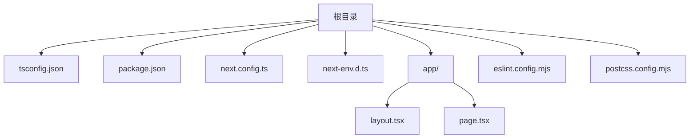
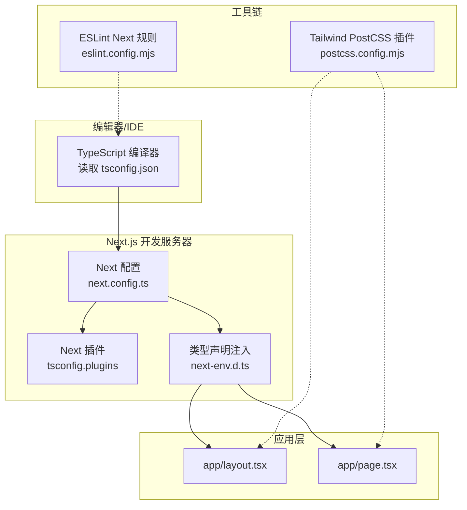
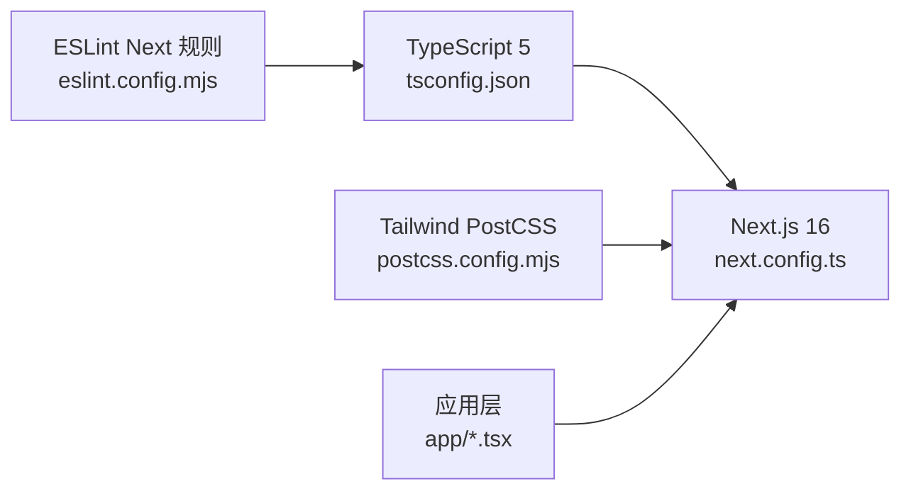

# TypeScript 配置

<cite>
**本文引用的文件**
- [tsconfig.json](file://tsconfig.json)
- [package.json](file://package.json)
- [next.config.ts](file://next.config.ts)
- [next-env.d.ts](file://next-env.d.ts)
- [app/layout.tsx](file://app/layout.tsx)
- [app/page.tsx](file://app/page.tsx)
- [eslint.config.mjs](file://eslint.config.mjs)
- [postcss.config.mjs](file://postcss.config.mjs)
</cite>

## 目录
1. [简介](#简介)
2. [项目结构](#项目结构)
3. [核心组件](#核心组件)
4. [架构总览](#架构总览)
5. [详细组件分析](#详细组件分析)
6. [依赖关系分析](#依赖关系分析)
7. [性能考量](#性能考量)
8. [故障排查指南](#故障排查指南)
9. [结论](#结论)
10. [附录](#附录)

## 简介
本文件面向 blod 项目，系统性梳理基于 TypeScript 5 的配置与最佳实践，重点覆盖：
- 编译选项与路径映射（paths）的作用与影响
- 类型安全开发环境的搭建与维护
- 与 Next.js 的集成配置与注意事项
- 自定义类型与类型定义的添加方法
- 常见问题与排错建议

本项目采用 Next.js App Router（app 目录），使用 bundler 模块解析与增量编译，严格模式下运行，配合 ESLint Next 配置与 Tailwind PostCSS 插件，形成完整的类型安全前端工程化体系。

## 项目结构
- 根目录包含 TypeScript 配置、包管理与构建脚本等关键文件
- app 目录为 Next.js App Router 的入口与页面组织位置
- next-env.d.ts 由 Next.js 自动生成，用于注入框架类型声明
- eslint.config.mjs 与 postcss.config.mjs 分别负责代码质量与样式工具链

图表来源
- [tsconfig.json:1-35](file://tsconfig.json#L1-L35)
- [package.json:1-31](file://package.json#L1-L31)
- [next.config.ts:1-8](file://next.config.ts#L1-L8)
- [next-env.d.ts:1-8](file://next-env.d.ts#L1-L8)
- [app/layout.tsx:1-34](file://app/layout.tsx#L1-L34)
- [app/page.tsx:1-72](file://app/page.tsx#L1-L72)
- [eslint.config.mjs:1-19](file://eslint.config.mjs#L1-L19)
- [postcss.config.mjs:1-8](file://postcss.config.mjs#L1-L8)

章节来源
- [tsconfig.json:1-35](file://tsconfig.json#L1-L35)
- [package.json:1-31](file://package.json#L1-L31)
- [next.config.ts:1-8](file://next.config.ts#L1-L8)
- [next-env.d.ts:1-8](file://next-env.d.ts#L1-L8)
- [app/layout.tsx:1-34](file://app/layout.tsx#L1-L34)
- [app/page.tsx:1-72](file://app/page.tsx#L1-L72)
- [eslint.config.mjs:1-19](file://eslint.config.mjs#L1-L19)
- [postcss.config.mjs:1-8](file://postcss.config.mjs#L1-L8)

## 核心组件
- TypeScript 编译器配置：通过 tsconfig.json 统一约束编译目标、模块系统、路径映射、严格性与插件等
- Next.js 集成：通过 plugins 引入 Next 插件，结合 next-env.d.ts 注入框架类型
- 开发工具链：ESLint Next 规则与 Tailwind PostCSS 插件协同工作
- 包管理与版本：使用 TypeScript 5 与 Next.js 16，启用 ES Modules

章节来源
- [tsconfig.json:1-35](file://tsconfig.json#L1-L35)
- [package.json:15-30](file://package.json#L15-L30)
- [next-env.d.ts:1-8](file://next-env.d.ts#L1-L8)
- [eslint.config.mjs:1-19](file://eslint.config.mjs#L1-L19)
- [postcss.config.mjs:1-8](file://postcss.config.mjs#L1-L8)

## 架构总览
下图展示从编辑器到浏览器的类型安全流程：编辑器读取 tsconfig.json 进行类型检查；Next.js 在开发时利用 bundler 解析与增量编译；ESLint 与 Tailwind PostCSS 作为辅助工具保障代码质量与样式一致性。

图表来源
- [tsconfig.json:16-20](file://tsconfig.json#L16-L20)
- [next.config.ts:1-8](file://next.config.ts#L1-L8)
- [next-env.d.ts:1-8](file://next-env.d.ts#L1-L8)
- [app/layout.tsx:1-34](file://app/layout.tsx#L1-L34)
- [app/page.tsx:1-72](file://app/page.tsx#L1-L72)
- [eslint.config.mjs:1-19](file://eslint.config.mjs#L1-L19)
- [postcss.config.mjs:1-8](file://postcss.config.mjs#L1-L8)

## 详细组件分析

### TypeScript 编译选项详解
以下逐项说明 tsconfig.json 中的关键 compilerOptions 及其对类型安全与构建行为的影响，并给出实践建议与注意事项。

- target
  - 影响：控制输出的 JavaScript 目标语法版本
  - 作用：确保生成代码在目标运行时兼容
  - 建议：与项目部署环境一致，避免过度超前导致兼容性问题
  - 章节来源
    - [tsconfig.json:3](file://tsconfig.json#L3)

- lib
  - 影响：指定可用的内置库集合（如 DOM、ESNext）
  - 作用：为浏览器 API 或新语言特性提供类型支持
  - 建议：按需启用，避免引入不必要的 polyfill
  - 章节来源
    - [tsconfig.json:4](file://tsconfig.json#L4)

- allowJs / skipLibCheck
  - 影响：允许混合 JS/TS 并跳过第三方库的类型检查
  - 作用：加速类型检查，便于渐进式迁移
  - 建议：仅在必要时开启，长期应逐步消除 JS 以提升类型安全
  - 章节来源
    - [tsconfig.json:5](file://tsconfig.json#L5)
    - [tsconfig.json:6](file://tsconfig.json#L6)

- strict
  - 影响：启用所有严格类型检查选项
  - 作用：显著提升类型安全，减少隐式类型错误
  - 建议：保持开启，遇到报错优先完善类型而非放宽规则
  - 章节来源
    - [tsconfig.json:7](file://tsconfig.json#L7)

- noEmit
  - 影响：不输出编译产物，仅进行类型检查
  - 作用：与 Next.js 开发服务器配合，由框架负责打包与运行
  - 建议：开发阶段保持开启，生产构建使用 Next 的构建流程
  - 章节来源
    - [tsconfig.json:8](file://tsconfig.json#L8)

- esModuleInterop / module / moduleResolution
  - 影响：统一模块互操作、选择模块系统与解析策略
  - 作用：保证 CommonJS 与 ES Modules 的混用与现代打包器（bundler）解析一致
  - 建议：bundler 解析适合现代打包链，避免切换回 node 解析
  - 章节来源
    - [tsconfig.json:9](file://tsconfig.json#L9)
    - [tsconfig.json:10](file://tsconfig.json#L10)
    - [tsconfig.json:11](file://tsconfig.json#L11)

- resolveJsonModule
  - 影响：允许导入 JSON 模块
  - 作用：在 TS 中直接消费 JSON 资源（如静态数据）
  - 建议：谨慎使用，优先考虑类型化的接口或资源替代方案
  - 章节来源
    - [tsconfig.json:12](file://tsconfig.json#L12)

- isolatedModules
  - 影响：单文件编译模式
  - 作用：与某些工具链（如 Babel、TSC 单文件转换）兼容
  - 建议：与 bundler 解析搭配良好，无需额外改动
  - 章节来源
    - [tsconfig.json:13](file://tsconfig.json#L13)

- jsx
  - 影响：JSX 渲染策略
  - 作用：与 React JSX 转换配合，确保类型正确
  - 建议：保持 react-jsx，避免切换至 preserve 导致运行时问题
  - 章节来源
    - [tsconfig.json:14](file://tsconfig.json#L14)

- incremental
  - 影响：启用增量编译
  - 作用：提升大型项目开发时的类型检查速度
  - 建议：默认开启，可结合 tsbuildinfo 存储优化
  - 章节来源
    - [tsconfig.json:15](file://tsconfig.json#L15)

- plugins
  - 影响：注入 Next 插件以增强 TS 对 Next 特性的支持
  - 作用：提供 App Router、路由类型等增强能力
  - 建议：与 Next 版本匹配，避免插件冲突
  - 章节来源
    - [tsconfig.json:16-20](file://tsconfig.json#L16-L20)

- paths
  - 影响：配置路径映射，简化导入路径
  - 作用：将 @/* 映射到项目根目录，提升可读性与可维护性
  - 建议：与 IDE 路径映射保持一致，避免相对路径与绝对路径混用
  - 章节来源
    - [tsconfig.json:21-23](file://tsconfig.json#L21-L23)

- include / exclude
  - 影响：控制类型检查范围
  - 作用：包含 next-env.d.ts、所有 TS/TSX、Next 生成的类型文件，排除 node_modules
  - 建议：确保 Next 生成的类型文件被纳入，避免类型缺失
  - 章节来源
    - [tsconfig.json:25-34](file://tsconfig.json#L25-L34)

章节来源
- [tsconfig.json:1-35](file://tsconfig.json#L1-L35)

### 路径映射与模块解析
- 路径映射（paths）
  - 作用：通过 @/* 将相对路径统一为绝对路径，降低层级变化带来的导入风险
  - 实践：与 IDE 设置保持一致，避免路径解析差异导致的类型错误
  - 章节来源
    - [tsconfig.json:21-23](file://tsconfig.json#L21-L23)

- 模块解析（moduleResolution: bundler）
  - 作用：与现代打包器（如 Next/bundler）解析策略一致，避免 Node 解析差异
  - 实践：与 esModuleInterop 配合，确保跨模块互操作稳定
  - 章节来源
    - [tsconfig.json:10](file://tsconfig.json#L10)
    - [tsconfig.json:11](file://tsconfig.json#L11)

- include/exclude
  - 作用：限定类型检查范围，避免无关文件干扰
  - 实践：确保 next-env.d.ts 与 Next 生成类型文件被包含
  - 章节来源
    - [tsconfig.json:25-34](file://tsconfig.json#L25-L34)

章节来源
- [tsconfig.json:10-23](file://tsconfig.json#L10-L23)
- [tsconfig.json:25-34](file://tsconfig.json#L25-L34)

### 与 Next.js 的集成配置
- Next 插件（plugins）
  - 作用：为 TS 提供 Next 特性支持（App Router、路由类型等）
  - 实践：与 Next 版本匹配，避免插件冲突
  - 章节来源
    - [tsconfig.json:16-20](file://tsconfig.json#L16-L20)

- 类型声明注入（next-env.d.ts）
  - 作用：注入 Next 内置类型与路由类型，使框架 API 具备完整类型
  - 实践：不要手动修改该文件，遵循 Next 官方说明
  - 章节来源
    - [next-env.d.ts:1-8](file://next-env.d.ts#L1-L8)

- Next 配置（next.config.ts）
  - 作用：扩展 Next 行为，与 TS 配置协同
  - 实践：当前为空配置，后续如需自定义可在此处添加
  - 章节来源
    - [next.config.ts:1-8](file://next.config.ts#L1-L8)

章节来源
- [tsconfig.json:16-20](file://tsconfig.json#L16-L20)
- [next-env.d.ts:1-8](file://next-env.d.ts#L1-L8)
- [next.config.ts:1-8](file://next.config.ts#L1-L8)

### 类型安全开发环境设置与最佳实践
- 严格模式（strict）
  - 建议：保持开启，遇到报错优先完善类型定义
  - 章节来源
    - [tsconfig.json:7](file://tsconfig.json#L7)

- 无输出（noEmit）
  - 建议：开发阶段保持开启，由 Next 负责打包
  - 章节来源
    - [tsconfig.json:8](file://tsconfig.json#L8)

- 增量编译（incremental）
  - 建议：开启以提升大型项目开发体验
  - 章节来源
    - [tsconfig.json:15](file://tsconfig.json#L15)

- ESLint Next 规则
  - 作用：与 TS 配置联动，统一代码风格与类型相关规则
  - 章节来源
    - [eslint.config.mjs:1-19](file://eslint.config.mjs#L1-L19)

- Tailwind PostCSS
  - 作用：样式工具链与类型安全的补充，避免样式类名拼写错误
  - 章节来源
    - [postcss.config.mjs:1-8](file://postcss.config.mjs#L1-L8)

章节来源
- [tsconfig.json:7-15](file://tsconfig.json#L7-L15)
- [eslint.config.mjs:1-19](file://eslint.config.mjs#L1-L19)
- [postcss.config.mjs:1-8](file://postcss.config.mjs#L1-L8)

### 类型定义的添加方法与自定义类型使用示例
- 添加类型定义
  - 方法：在项目根目录新增 .d.ts 文件，或在现有文件中声明命名空间与类型
  - 注意：确保 tsconfig.json 的 include 能覆盖到新增文件
  - 章节来源
    - [tsconfig.json:25-34](file://tsconfig.json#L25-L34)

- 自定义类型使用示例
  - 示例场景：在页面组件中使用只读属性、函数参数与返回值的明确类型
  - 参考文件：app/layout.tsx 与 app/page.tsx 展示了类型注解与只读包装的使用
  - 章节来源
    - [app/layout.tsx:1-34](file://app/layout.tsx#L1-L34)
    - [app/page.tsx:1-72](file://app/page.tsx#L1-L72)

章节来源
- [tsconfig.json:25-34](file://tsconfig.json#L25-L34)
- [app/layout.tsx:1-34](file://app/layout.tsx#L1-L34)
- [app/page.tsx:1-72](file://app/page.tsx#L1-L72)

### 与 Next.js 集成的特殊配置与注意事项
- App Router 与类型注入
  - next-env.d.ts 自动注入 Next 类型，确保路由与框架 API 的类型完备
  - 章节来源
    - [next-env.d.ts:1-8](file://next-env.d.ts#L1-L8)

- 路由类型与插件
  - tsconfig.json 中的 Next 插件为 App Router 提供类型增强
  - 章节来源
    - [tsconfig.json:16-20](file://tsconfig.json#L16-L20)

- 构建与运行
  - package.json 中的 scripts 使用 Next 的 dev/build/start，与 TS 配置协同
  - 章节来源
    - [package.json:9-14](file://package.json#L9-L14)

章节来源
- [next-env.d.ts:1-8](file://next-env.d.ts#L1-L8)
- [tsconfig.json:16-20](file://tsconfig.json#L16-L20)
- [package.json:9-14](file://package.json#L9-L14)

## 依赖关系分析
- TypeScript 与 Next.js
  - package.json 指定 TypeScript 5 与 Next.js 16，确保类型与框架版本兼容
  - 章节来源
    - [package.json:18-28](file://package.json#L18-L28)

- 工具链依赖
  - ESLint Next 规则与 Tailwind PostCSS 插件共同保障代码质量与样式一致性
  - 章节来源
    - [eslint.config.mjs:1-19](file://eslint.config.mjs#L1-L19)
    - [postcss.config.mjs:1-8](file://postcss.config.mjs#L1-L8)

图表来源
- [package.json:18-28](file://package.json#L18-L28)
- [tsconfig.json:1-35](file://tsconfig.json#L1-L35)
- [next.config.ts:1-8](file://next.config.ts#L1-L8)
- [eslint.config.mjs:1-19](file://eslint.config.mjs#L1-L19)
- [postcss.config.mjs:1-8](file://postcss.config.mjs#L1-L8)
- [app/layout.tsx:1-34](file://app/layout.tsx#L1-L34)
- [app/page.tsx:1-72](file://app/page.tsx#L1-L72)

章节来源
- [package.json:18-28](file://package.json#L18-L28)
- [tsconfig.json:1-35](file://tsconfig.json#L1-L35)
- [next.config.ts:1-8](file://next.config.ts#L1-L8)
- [eslint.config.mjs:1-19](file://eslint.config.mjs#L1-L19)
- [postcss.config.mjs:1-8](file://postcss.config.mjs#L1-L8)
- [app/layout.tsx:1-34](file://app/layout.tsx#L1-L34)
- [app/page.tsx:1-72](file://app/page.tsx#L1-L72)

## 性能考量
- 增量编译（incremental）：提升大型项目开发时的类型检查速度
- 跳过库检查（skipLibCheck）：在混合 JS/TS 场景下加速类型检查
- 严格模式（strict）：早期暴露潜在类型问题，减少后期修复成本
- bundler 模块解析：与现代打包器一致，避免解析差异导致的性能与稳定性问题

章节来源
- [tsconfig.json:15](file://tsconfig.json#L15)
- [tsconfig.json:6](file://tsconfig.json#L6)
- [tsconfig.json:7](file://tsconfig.json#L7)
- [tsconfig.json:11](file://tsconfig.json#L11)

## 故障排查指南
- 类型缺失或未生效
  - 检查 next-env.d.ts 是否存在且未被修改
  - 确认 include 覆盖到新增的类型文件
  - 章节来源
    - [next-env.d.ts:1-8](file://next-env.d.ts#L1-L8)
    - [tsconfig.json:25-34](file://tsconfig.json#L25-L34)

- 路径映射不生效
  - 确认 tsconfig.json 的 paths 与 IDE 设置一致
  - 检查模块解析是否为 bundler
  - 章节来源
    - [tsconfig.json:21-23](file://tsconfig.json#L21-L23)
    - [tsconfig.json:11](file://tsconfig.json#L11)

- ESLint 报错与 TS 不一致
  - 确认 eslint.config.mjs 启用了 Next 的 TS 规则
  - 章节来源
    - [eslint.config.mjs:1-19](file://eslint.config.mjs#L1-L19)

- 构建失败或运行异常
  - 检查 package.json 的 scripts 与 Next 版本匹配
  - 章节来源
    - [package.json:9-14](file://package.json#L9-L14)

章节来源
- [next-env.d.ts:1-8](file://next-env.d.ts#L1-L8)
- [tsconfig.json:21-34](file://tsconfig.json#L21-L34)
- [eslint.config.mjs:1-19](file://eslint.config.mjs#L1-L19)
- [package.json:9-14](file://package.json#L9-L14)

## 结论
本项目的 TypeScript 配置围绕 Next.js App Router 与现代打包器展开，通过严格模式、增量编译、路径映射与 Next 插件，构建出高效且稳定的类型安全开发环境。建议持续保持严格模式与增量编译，合理使用路径映射与 bundler 解析，配合 ESLint 与 Tailwind PostCSS，确保代码质量与开发体验。

## 附录
- 关键文件清单
  - tsconfig.json：编译选项与路径映射
  - next-env.d.ts：Next 类型注入
  - next.config.ts：Next 配置扩展点
  - eslint.config.mjs：ESLint Next 规则
  - postcss.config.mjs：Tailwind PostCSS 插件
  - package.json：依赖与脚本

章节来源
- [tsconfig.json:1-35](file://tsconfig.json#L1-L35)
- [next-env.d.ts:1-8](file://next-env.d.ts#L1-L8)
- [next.config.ts:1-8](file://next.config.ts#L1-L8)
- [eslint.config.mjs:1-19](file://eslint.config.mjs#L1-L19)
- [postcss.config.mjs:1-8](file://postcss.config.mjs#L1-L8)
- [package.json:1-31](file://package.json#L1-L31)