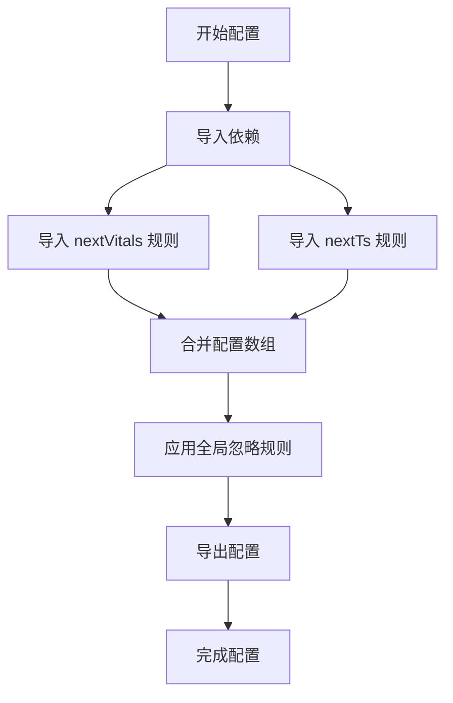
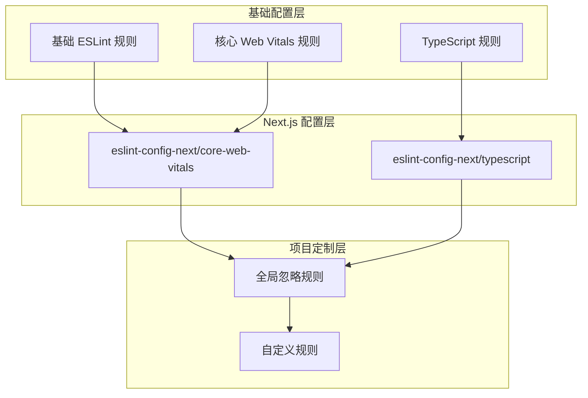
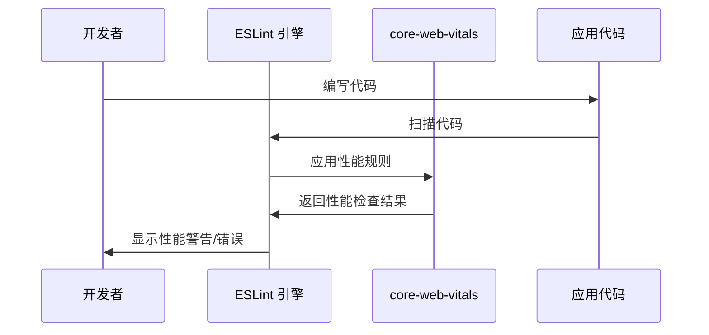
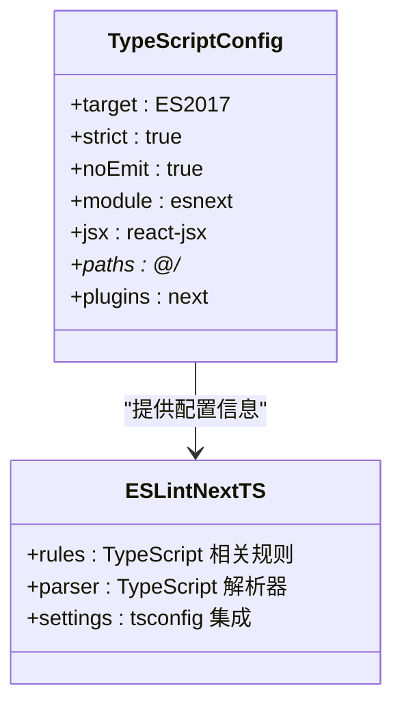
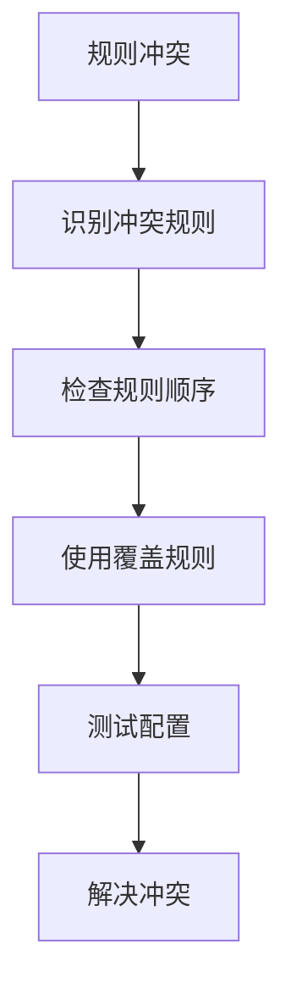
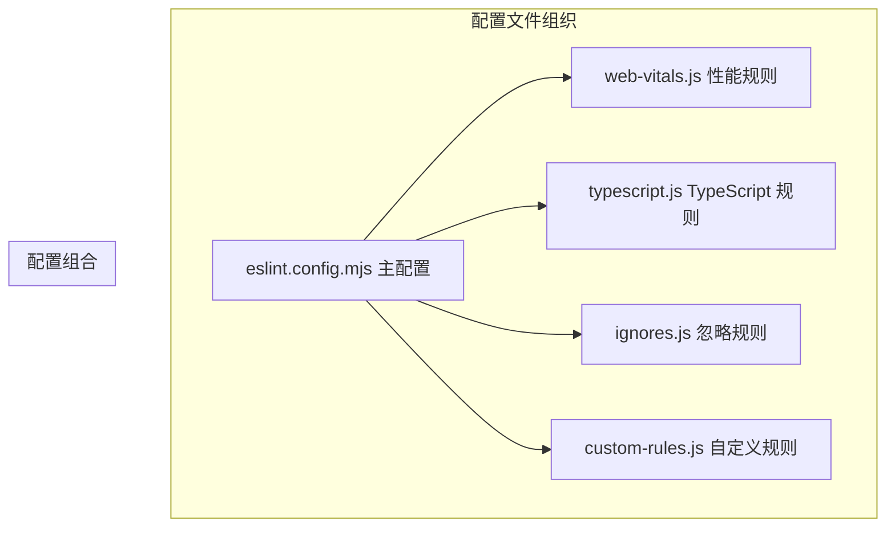

# ESLint 配置

<cite>
**本文档引用的文件**
- [eslint.config.mjs](file://eslint.config.mjs)
- [package.json](file://package.json)
- [next.config.ts](file://next.config.ts)
- [tsconfig.json](file://tsconfig.json)
- [app/layout.tsx](file://app/layout.tsx)
- [app/page.tsx](file://app/page.tsx)
- [app/globals.css](file://app/globals.css)
- [README.md](file://README.md)
</cite>

## 目录
1. [简介](#简介)
2. [项目结构](#项目结构)
3. [核心组件](#核心组件)
4. [架构概览](#架构概览)
5. [详细组件分析](#详细组件分析)
6. [依赖关系分析](#依赖关系分析)
7. [性能考虑](#性能考虑)
8. [故障排除指南](#故障排除指南)
9. [结论](#结论)
10. [附录](#附录)

## 简介

本项目使用 ESLint 9 进行代码质量检查，采用现代化的配置文件结构和模块化设计。项目基于 Next.js 框架构建，集成了 TypeScript 支持和核心 Web Vitals 性能优化规则。

ESLint 9 引入了新的配置格式，从传统的 JSON/JS 配置迁移到基于 JavaScript 的模块化配置系统。这种新格式提供了更好的类型支持、动态配置能力和更清晰的配置继承机制。

## 项目结构

该项目采用标准的 Next.js 应用程序结构，重点关注 ESLint 配置的实现：

```mermaid
graph TB
subgraph "项目根目录"
ESM[eslint.config.mjs]
PKG[package.json]
TS[tsconfig.json]
NEXT[next.config.ts]
end
subgraph "应用目录"
APP[app/]
LAYOUT[layout.tsx]
PAGE[page.tsx]
CSS[globals.css]
end
subgraph "开发依赖"
ESLINT[eslint@^9]
NEXTCFG[eslint-config-next@16.2.6]
TYPESCRIPT[typescript@^5]
end
ESM --> ESLINT
ESM --> NEXTCFG
ESM --> TYPESCRIPT
APP --> LAYOUT
APP --> PAGE
APP --> CSS
```

**图表来源**
- [eslint.config.mjs:1-19](file://eslint.config.mjs#L1-L19)
- [package.json:15-29](file://package.json#L15-L29)

**章节来源**
- [eslint.config.mjs:1-19](file://eslint.config.mjs#L1-L19)
- [package.json:1-31](file://package.json#L1-L31)

## 核心组件

### ESLint 9 配置文件

项目的核心配置位于 `eslint.config.mjs` 文件中，这是一个基于模块化设计的配置文件，具有以下特点：

#### 配置结构分析

配置文件采用数组形式的配置数组，允许灵活的规则组合和继承：



**图表来源**
- [eslint.config.mjs:5-18](file://eslint.config.mjs#L5-L18)

#### 关键配置元素

1. **defineConfig 函数**: 提供类型安全的配置定义
2. **globalIgnores 函数**: 自定义默认忽略规则
3. **配置数组模式**: 支持多配置源的合并

**章节来源**
- [eslint.config.mjs:1-19](file://eslint.config.mjs#L1-L19)

### 开发依赖配置

项目使用以下关键依赖来支持 ESLint 9 配置：

| 依赖项 | 版本 | 用途 |
|--------|------|------|
| eslint | ^9 | 核心 ESLint 引擎 |
| eslint-config-next | 16.2.6 | Next.js 官方配置包 |
| typescript | ^5 | TypeScript 类型检查 |

**章节来源**
- [package.json:20-29](file://package.json#L20-L29)

## 架构概览

### 配置继承机制

项目采用分层配置架构，通过继承机制实现规则的组合和定制：



**图表来源**
- [eslint.config.mjs:2-15](file://eslint.config.mjs#L2-L15)

### 规则继承流程

配置文件展示了清晰的规则继承流程：

1. **导入阶段**: 导入两个 Next.js 官方配置包
2. **合并阶段**: 使用扩展运算符合并配置数组
3. **覆盖阶段**: 使用 globalIgnores 函数覆盖默认忽略规则

**章节来源**
- [eslint.config.mjs:5-18](file://eslint.config.mjs#L5-L18)

## 详细组件分析

### eslint-config-next/core-web-vitals 配置

#### 核心 Web Vitals 规则集

`eslint-config-next/core-web-vitals` 配置专注于性能相关的代码质量检查，主要包含以下规则：

| 规则类别 | 主要规则 | 功能描述 |
|----------|----------|----------|
| 性能监控 | `@next/next/no-html-link-for-pages` | 禁止在 Next.js 中使用 HTML 链接 |
| 资源优化 | `@next/next/no-css-tags` | 禁止在页面中直接使用 CSS 标签 |
| 图片优化 | `@next/next/no-img-element` | 推荐使用 Next.js 图片组件 |
| 缓存策略 | `@next/next/no-server-import-in-client-component` | 禁止在客户端组件中导入服务器端代码 |

#### 影响范围

该配置对整个应用程序的性能相关代码产生直接影响：



**图表来源**
- [eslint.config.mjs:2](file://eslint.config.mjs#L2)

### eslint-config-next/typescript 配置

#### TypeScript 集成规则

`eslint-config-next/typescript` 配置专门针对 TypeScript 代码进行检查，主要功能包括：

1. **类型安全检查**: 确保 TypeScript 类型正确性
2. **编译器选项验证**: 检查 tsconfig.json 配置的有效性
3. **导入路径检查**: 验证模块导入的正确性
4. **装饰器支持**: 处理 TypeScript 装饰器语法

#### 与 tsconfig.json 的集成

配置与项目的 TypeScript 配置紧密集成：



**图表来源**
- [tsconfig.json:2-24](file://tsconfig.json#L2-L24)
- [eslint.config.mjs:3](file://eslint.config.mjs#L3)

**章节来源**
- [tsconfig.json:1-35](file://tsconfig.json#L1-L35)
- [eslint.config.mjs:3](file://eslint.config.mjs#L3)

### 全局忽略规则配置

#### 默认忽略列表

项目显式覆盖了 `eslint-config-next` 的默认忽略规则：

| 忽略模式 | 描述 | 用途 |
|----------|------|------|
| `.next/**` | Next.js 构建输出目录 | 避免检查构建产物 |
| `out/**` | 输出目录 | 清理构建结果 |
| `build/**` | 构建目录 | 保持项目整洁 |
| `next-env.d.ts` | 自动生成的环境声明文件 | 不需要手动检查 |

#### 自定义忽略规则

通过 `globalIgnores` 函数，可以轻松添加或修改忽略规则：


**图表来源**
- [eslint.config.mjs:8-15](file://eslint.config.mjs#L8-L15)

**章节来源**
- [eslint.config.mjs:8-15](file://eslint.config.mjs#L8-L15)

## 依赖关系分析

### 模块依赖图

项目中各配置文件之间的依赖关系如下：

```mermaid
graph TB
subgraph "配置文件"
ESLINTCFG[eslint.config.mjs]
PKGJSON[package.json]
NEXTCFG[next.config.ts]
TSCFG[tsconfig.json]
end
subgraph "外部依赖"
ESLINT[eslint@^9]
NEXTCFGPKG[eslint-config-next@16.2.6]
TYPESCRIPT[typescript@^5]
REACT[react@19.2.4]
NEXTJS[next@16.2.6]
end
subgraph "应用代码"
LAYOUT[app/layout.tsx]
PAGE[app/page.tsx]
CSS[app/globals.css]
end
ESLINTCFG --> ESLINT
ESLINTCFG --> NEXTCFGPKG
ESLINTCFG --> TYPESCRIPT
PKGJSON --> ESLINT
PKGJSON --> NEXTCFGPKG
PKGJSON --> TYPESCRIPT
PKGJSON --> REACT
PKGJSON --> NEXTJS
ESLINTCFG --> LAYOUT
ESLINTCFG --> PAGE
ESLINTCFG --> CSS
```

**图表来源**
- [eslint.config.mjs:1-3](file://eslint.config.mjs#L1-L3)
- [package.json:15-29](file://package.json#L15-L29)

### 版本兼容性

项目使用的版本组合确保了最佳的兼容性和稳定性：

| 包名 | 版本 | 用途 | 兼容性 |
|------|------|------|--------|
| next | 16.2.6 | Next.js 框架 | ✅ 完全兼容 |
| eslint | ^9 | ESLint 引擎 | ✅ 完全兼容 |
| eslint-config-next | 16.2.6 | Next.js 配置 | ✅ 完全兼容 |
| typescript | ^5 | TypeScript 支持 | ✅ 完全兼容 |

**章节来源**
- [package.json:15-29](file://package.json#L15-L29)

## 性能考虑

### 配置性能优化

ESLint 9 配置在性能方面具有以下优势：

1. **增量检查**: 利用 TypeScript 的增量编译特性
2. **缓存机制**: 自动缓存检查结果
3. **并行处理**: 支持多文件并行检查
4. **智能忽略**: 有效忽略不需要检查的文件

### 性能监控指标

建议关注以下性能指标：

- **检查时间**: 单次检查的总耗时
- **内存使用**: ESLint 运行时的内存占用
- **文件扫描**: 实际检查的文件数量
- **规则执行**: 规则的执行频率和耗时

## 故障排除指南

### 常见配置问题

#### 1. 规则冲突解决

当自定义规则与官方规则冲突时：



#### 2. 忽略规则不生效

如果发现某些文件仍然被检查：

1. **检查忽略模式**: 确认忽略模式的正确性
2. **验证文件路径**: 确认文件的实际路径
3. **检查配置优先级**: 确认配置的加载顺序

#### 3. TypeScript 类型检查失败

针对 TypeScript 相关问题：

1. **检查 tsconfig.json**: 确认 TypeScript 配置正确
2. **验证类型声明**: 确认所有类型都有声明
3. **检查模块解析**: 确认路径映射配置正确

### 调试技巧

#### 1. 启用详细日志

使用 ESLint 的调试模式来获取更多信息：

```bash
# 启用详细输出
eslint --debug

# 检查特定文件
eslint app/page.tsx --debug
```

#### 2. 逐步排除问题


#### 3. 配置验证

定期验证配置文件的有效性：

```bash
# 验证 ESLint 配置
npx eslint --print-config app/page.tsx

# 检查配置语法
node -c eslint.config.mjs
```

**章节来源**
- [eslint.config.mjs:1-19](file://eslint.config.mjs#L1-L19)

## 结论

本项目的 ESLint 9 配置展现了现代前端开发的最佳实践。通过合理利用 `eslint-config-next` 的官方配置，结合自定义的全局忽略规则，实现了既符合 Next.js 最佳实践又满足项目特定需求的代码质量检查体系。

配置的主要优势包括：

1. **模块化设计**: 清晰的配置分离和继承机制
2. **性能优化**: 针对 Next.js 应用的专用规则集
3. **类型安全**: 与 TypeScript 的深度集成
4. **可维护性**: 易于理解和修改的配置结构

## 附录

### 最佳实践建议

#### 1. 代码质量检查最佳实践

- **定期更新依赖**: 保持 ESLint 和相关插件的最新版本
- **编写测试**: 为复杂规则编写单元测试
- **文档化规则**: 为自定义规则编写使用说明
- **团队培训**: 确保团队成员了解配置要求

#### 2. 自定义规则添加方法

添加自定义规则的基本步骤：

1. **确定规则需求**: 明确需要解决的具体问题
2. **选择合适的规则类型**: 选择适当的 ESLint 规则类型
3. **实现规则逻辑**: 编写规则的检查和修复逻辑
4. **测试规则效果**: 验证规则在各种场景下的表现
5. **集成到配置**: 将规则添加到配置文件中

#### 3. 团队协作配置同步策略

为了确保团队成员使用一致的配置：

1. **版本控制**: 将配置文件纳入版本控制系统
2. **CI/CD 集成**: 在持续集成中运行 ESLint 检查
3. **IDE 配置**: 确保所有开发者的 IDE 使用相同配置
4. **定期审查**: 定期审查和更新配置规则
5. **知识分享**: 分享配置使用经验和最佳实践

#### 4. 配置文件模块化组织

建议的模块化组织方式：



这种组织方式使得配置更加清晰，便于维护和扩展。