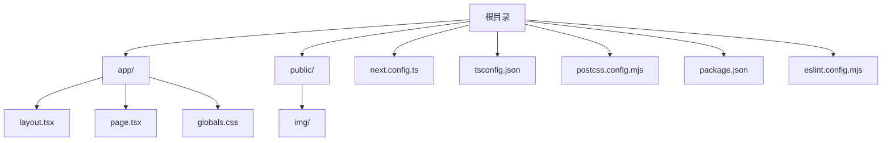
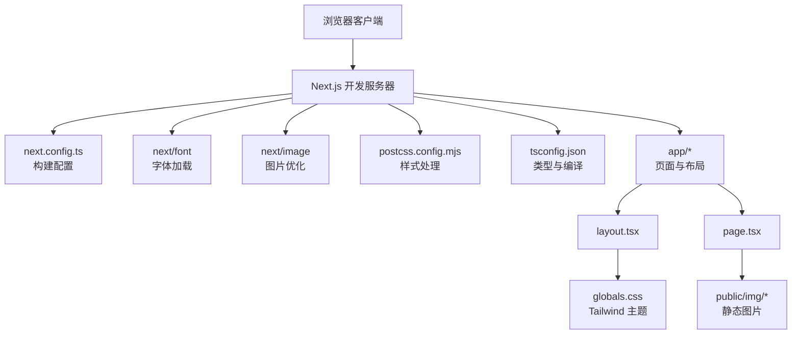
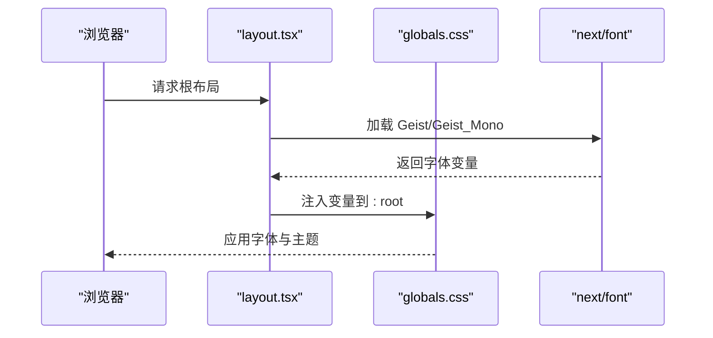
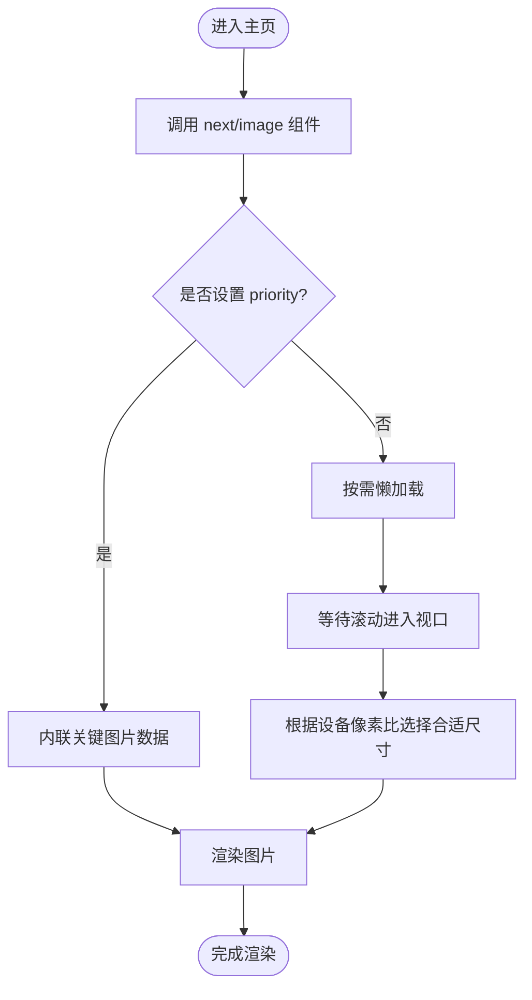
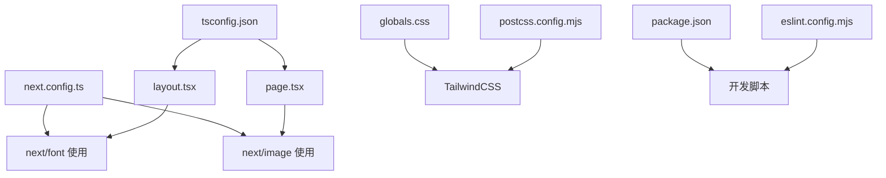

# Next.js 构建配置

<cite>
**本文引用的文件**
- [next.config.ts](file://next.config.ts)
- [package.json](file://package.json)
- [README.md](file://README.md)
- [tsconfig.json](file://tsconfig.json)
- [postcss.config.mjs](file://postcss.config.mjs)
- [app/layout.tsx](file://app/layout.tsx)
- [app/page.tsx](file://app/page.tsx)
- [app/globals.css](file://app/globals.css)
- [eslint.config.mjs](file://eslint.config.mjs)
</cite>

## 目录
1. [简介](#简介)
2. [项目结构](#项目结构)
3. [核心组件](#核心组件)
4. [架构总览](#架构总览)
5. [详细组件分析](#详细组件分析)
6. [依赖关系分析](#依赖关系分析)
7. [性能考虑](#性能考虑)
8. [故障排除指南](#故障排除指南)
9. [结论](#结论)
10. [附录](#附录)

## 简介
本文件面向使用 Next.js 16.2.6 的开发者，系统性梳理与本仓库相关的构建配置与优化策略，重点围绕 next.config.ts 的可配置项、图片优化、字体加载、静态生成、开发服务器与代理、环境变量处理、性能优化与缓存策略、以及部署相关配置进行深入解析，并结合现有代码给出可操作的最佳实践建议。由于当前仓库中的 next.config.ts 仍为空白占位，本文将基于 Next.js 官方配置能力与本仓库实际使用的技术栈（如 next/font、TailwindCSS、Image 组件）进行针对性说明。

## 项目结构
本仓库采用 App Router 结构，核心目录与文件如下：
- app：应用页面与布局，包含根布局与主页
- public：静态资源目录，用于存放图片等公共资源
- 根目录配置：next.config.ts、tsconfig.json、postcss.config.mjs、package.json、eslint.config.mjs 等

图表来源
- [next.config.ts](file://next.config.ts)
- [tsconfig.json](file://tsconfig.json)
- [postcss.config.mjs](file://postcss.config.mjs)
- [package.json](file://package.json)
- [app/layout.tsx](file://app/layout.tsx)
- [app/page.tsx](file://app/page.tsx)
- [app/globals.css](file://app/globals.css)

章节来源
- [package.json:1-31](file://package.json#L1-L31)
- [tsconfig.json:1-35](file://tsconfig.json#L1-L35)
- [postcss.config.mjs:1-8](file://postcss.config.mjs#L1-L8)
- [app/layout.tsx:1-34](file://app/layout.tsx#L1-L34)
- [app/page.tsx:1-72](file://app/page.tsx#L1-L72)
- [app/globals.css:1-27](file://app/globals.css#L1-L27)

## 核心组件
- 构建配置入口：next.config.ts
- 类型与编译：tsconfig.json
- 样式与主题：postcss.config.mjs + TailwindCSS + globals.css
- 字体加载：next/font（在 layout.tsx 中使用）
- 图片优化：next/image（在 page.tsx 中使用）
- 开发脚本与依赖：package.json
- 质量规则：eslint.config.mjs

章节来源
- [next.config.ts:1-8](file://next.config.ts#L1-L8)
- [tsconfig.json:1-35](file://tsconfig.json#L1-L35)
- [postcss.config.mjs:1-8](file://postcss.config.mjs#L1-L8)
- [app/layout.tsx:1-34](file://app/layout.tsx#L1-L34)
- [app/page.tsx:1-72](file://app/page.tsx#L1-L72)
- [package.json:1-31](file://package.json#L1-L31)
- [eslint.config.mjs:1-18](file://eslint.config.mjs#L1-L18)

## 架构总览
下图展示从请求到渲染的关键路径，以及与构建配置相关的模块交互。

图表来源
- [next.config.ts:1-8](file://next.config.ts#L1-L8)
- [postcss.config.mjs:1-8](file://postcss.config.mjs#L1-L8)
- [tsconfig.json:1-35](file://tsconfig.json#L1-L35)
- [app/layout.tsx:1-34](file://app/layout.tsx#L1-L34)
- [app/page.tsx:1-72](file://app/page.tsx#L1-L72)
- [app/globals.css:1-27](file://app/globals.css#L1-L27)

## 详细组件分析

### 构建配置（next.config.ts）
- 当前状态：next.config.ts 为占位文件，未配置任何选项。
- 建议与实践：
  - 图片优化：启用 images.remotePatterns 或 images.minimumCacheTTL 以控制远程图片与缓存行为；若使用本地图片，确保 public 目录路径正确。
  - 字体优化：next/font 已在代码中使用，无需额外配置；如需自定义字体加载策略，可在 next.config.ts 中通过 experimental.fontLoaders 进行扩展。
  - 静态生成：如需预渲染特定页面或调整 ISR 设置，可在 next.config.ts 中配置 rewrites、redirects、headers 等。
  - 开发服务器：可配置 dev直连代理（如 target、rewrite）、host/port、热更新行为等。
  - 缓存策略：通过 headers 配置静态资源缓存头；通过 output: 'export' 可导出静态站点。
  - 环境变量：通过 env 配置注入运行时环境变量；注意仅暴露必要变量，避免泄露敏感信息。
- 性能影响：合理的缓存与重写配置可显著降低首屏时间与带宽消耗；字体与图片优化直接影响 LCP 与 TTFB。

章节来源
- [next.config.ts:1-8](file://next.config.ts#L1-L8)
- [README.md:21-21](file://README.md#L21-L21)

### 字体加载（next/font）
- 使用方式：在根布局中引入 Geist 与 Geist_Mono，并通过变量注入到 html 标签。
- 优化策略：
  - 使用 variable 属性将字体变量注入 CSS 变量，减少 FOIT/FOIC。
  - 指定 subsets 以缩小字体包体积。
  - 在 globals.css 中通过 @theme inline 将字体变量映射为 Tailwind 变量，实现与设计系统的统一。
- 性能影响：自动子集化与内联字体可显著提升首屏渲染速度与可访问性。

图表来源
- [app/layout.tsx:1-34](file://app/layout.tsx#L1-L34)
- [app/globals.css:1-27](file://app/globals.css#L1-L27)

章节来源
- [app/layout.tsx:1-34](file://app/layout.tsx#L1-L34)
- [app/globals.css:1-27](file://app/globals.css#L1-L27)

### 图片优化（next/image）
- 使用方式：在主页中通过 next/image 引用 public/img 下的图片，并设置 fill、className、priority 等属性。
- 优化策略：
  - 使用 fill 实现响应式背景图；配合 object-cover 确保覆盖效果。
  - 优先级：对首屏关键图片设置 priority，缩短首屏等待时间。
  - 资源路径：确保图片位于 public 目录，避免构建时报错。
- 性能影响：自动格式转换、尺寸裁剪与懒加载可显著降低带宽与内存占用。

图表来源
- [app/page.tsx:1-72](file://app/page.tsx#L1-L72)

章节来源
- [app/page.tsx:1-72](file://app/page.tsx#L1-L72)

### 样式与主题（TailwindCSS + PostCSS）
- 使用方式：postcss.config.mjs 启用 @tailwindcss/postcss 插件；globals.css 中通过 @import 和 @theme inline 定义主题变量与字体映射。
- 优化策略：
  - 使用 @theme inline 将字体变量注入到 Tailwind，保证类名与变量一致。
  - 在 :root 中定义深色/浅色模式变量，结合 prefers-color-scheme 自动切换。
- 性能影响：按需生成 CSS，减少冗余样式，提升渲染效率。

章节来源
- [postcss.config.mjs:1-8](file://postcss.config.mjs#L1-L8)
- [app/globals.css:1-27](file://app/globals.css#L1-L27)

### 类型与编译（tsconfig.json）
- 关键点：严格模式、增量编译、路径别名、插件集成等。
- 优化策略：
  - 保持 strict 严格模式，减少潜在运行时错误。
  - 使用 bundler 解析器与 incremental 增量编译，提升开发体验。
  - 通过 paths 配置 @/* 别名，简化导入路径。
- 性能影响：严格的类型检查与增量编译可显著提升开发效率与构建稳定性。

章节来源
- [tsconfig.json:1-35](file://tsconfig.json#L1-L35)

### 开发脚本与质量规则（package.json + eslint.config.mjs）
- 开发脚本：dev/build/start/lint 分别对应开发、构建、生产启动与代码检查。
- 质量规则：eslint.config.mjs 继承 eslint-config-next 的 core-web-vitals 与 TypeScript 规则，并自定义忽略项。
- 性能影响：规范化的代码风格与性能指标检查有助于长期维护与性能优化。

章节来源
- [package.json:1-31](file://package.json#L1-L31)
- [eslint.config.mjs:1-18](file://eslint.config.mjs#L1-L18)

## 依赖关系分析
- next.config.ts 作为构建配置入口，影响图片、字体、静态资源与开发服务器行为。
- app/layout.tsx 与 app/page.tsx 依赖 next/font 与 next/image，受 next.config.ts 的图片与字体策略影响。
- app/globals.css 依赖 TailwindCSS 与 postcss.config.mjs，受 tsconfig.json 的类型与路径配置影响。
- package.json 提供脚本与依赖版本，eslint.config.mjs 提供质量保障。

图表来源
- [next.config.ts:1-8](file://next.config.ts#L1-L8)
- [app/layout.tsx:1-34](file://app/layout.tsx#L1-L34)
- [app/page.tsx:1-72](file://app/page.tsx#L1-L72)
- [app/globals.css:1-27](file://app/globals.css#L1-L27)
- [postcss.config.mjs:1-8](file://postcss.config.mjs#L1-L8)
- [tsconfig.json:1-35](file://tsconfig.json#L1-L35)
- [package.json:1-31](file://package.json#L1-L31)
- [eslint.config.mjs:1-18](file://eslint.config.mjs#L1-L18)

章节来源
- [next.config.ts:1-8](file://next.config.ts#L1-L8)
- [app/layout.tsx:1-34](file://app/layout.tsx#L1-L34)
- [app/page.tsx:1-72](file://app/page.tsx#L1-L72)
- [app/globals.css:1-27](file://app/globals.css#L1-L27)
- [postcss.config.mjs:1-8](file://postcss.config.mjs#L1-L8)
- [tsconfig.json:1-35](file://tsconfig.json#L1-L35)
- [package.json:1-31](file://package.json#L1-L31)
- [eslint.config.mjs:1-18](file://eslint.config.mjs#L1-L18)

## 性能考虑
- 图片优化
  - 使用 next/image 并设置 fill、priority 等属性，确保首屏关键图片快速加载。
  - 对非关键图片采用懒加载，减少初始渲染压力。
  - 控制图片尺寸与格式，避免过大或不合适的格式导致带宽浪费。
- 字体优化
  - 使用 next/font 的 variable 属性与 subsets，减少字体包体积。
  - 在布局中一次性注入字体变量，避免重复请求。
- 缓存策略
  - 通过 headers 配置静态资源缓存头，提升二次访问性能。
  - 对图片与字体设置较长缓存周期，结合内容指纹实现长效缓存。
- 构建与打包
  - 保持 tsconfig.json 的严格模式与增量编译，提升开发效率。
  - 使用 ESLint 规范代码，减少潜在性能问题。
- 部署相关
  - 如需导出静态站点，可通过 output: 'export' 配置；否则保持默认服务端渲染或混合模式。
  - 在生产环境中启用压缩与缓存，确保最佳用户体验。

## 故障排除指南
- 图片无法显示
  - 确认图片位于 public 目录且路径正确。
  - 检查 next.config.ts 是否对 images.remotePatterns 或 minimumCacheTTL 进行了限制。
- 字体加载异常
  - 确认 layout.tsx 中已正确引入 next/font 并注入变量。
  - 检查 globals.css 中 @theme inline 是否生效。
- 开发服务器无法启动
  - 检查 package.json 中的 dev 脚本与 Node 版本要求。
  - 若使用代理，请确认 next.config.ts 中的 devServer 代理配置正确。
- ESLint 报错
  - 检查 eslint.config.mjs 的规则与忽略项，确保符合项目需求。

章节来源
- [app/page.tsx:1-72](file://app/page.tsx#L1-L72)
- [app/layout.tsx:1-34](file://app/layout.tsx#L1-L34)
- [app/globals.css:1-27](file://app/globals.css#L1-L27)
- [package.json:1-31](file://package.json#L1-L31)
- [eslint.config.mjs:1-18](file://eslint.config.mjs#L1-L18)

## 结论
本仓库基于 Next.js 16.2.6 与 App Router 架构，已具备良好的基础配置（字体、图片、样式与类型系统）。建议尽快完善 next.config.ts 的图片、字体与开发服务器配置，结合 headers 与缓存策略进一步优化性能，并通过 ESLint 与严格类型检查保障长期可维护性。对于部署，可根据业务需求选择服务端渲染或静态导出模式，并在生产环境启用合适的缓存与压缩策略。

## 附录
- 常见配置场景与最佳实践
  - 图片优化：优先使用 next/image，关键图片设置 priority；非关键图片懒加载；合理设置 remotePatterns。
  - 字体加载：使用 next/font 的 variable 与 subsets；在布局中注入变量；与 Tailwind 变量统一。
  - 静态生成：根据页面需求选择预渲染或动态渲染；合理设置 ISR 缓存。
  - 开发服务器：配置 devServer 代理与 host/port；开启热更新与错误提示。
  - 环境变量：仅暴露必要变量；在 next.config.ts 中通过 env 注入；避免明文敏感信息。
  - 性能优化：启用 headers 缓存；使用压缩与持久缓存；减少首屏资源体积。
  - 部署：根据业务选择 SSR/SSG；在 CI/CD 中执行 lint 与构建；监控关键性能指标。