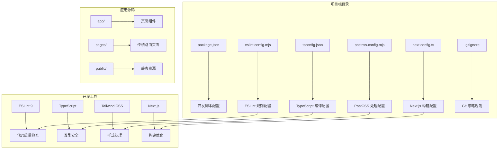
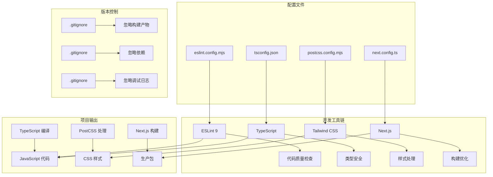
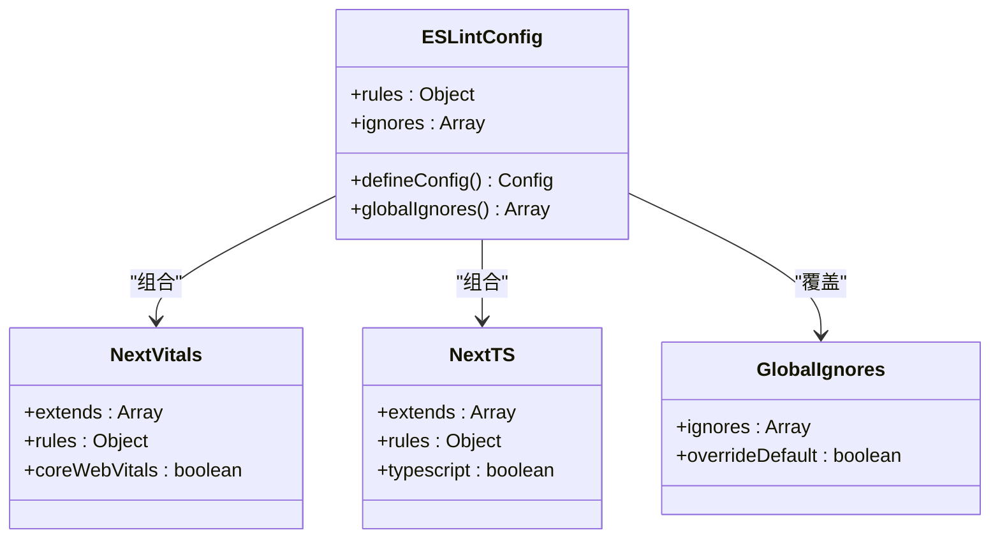
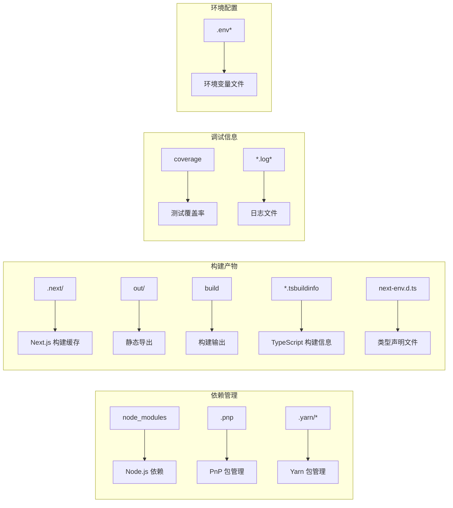

# 开发工具配置

<cite>
**本文档引用的文件**
- [eslint.config.mjs](file://eslint.config.mjs)
- [next.config.ts](file://next.config.ts)
- [package.json](file://package.json)
- [.gitignore](file://.gitignore)
- [tsconfig.json](file://tsconfig.json)
- [postcss.config.mjs](file://postcss.config.mjs)
- [README.md](file://README.md)
</cite>

## 目录
1. [简介](#简介)
2. [项目结构](#项目结构)
3. [核心组件](#核心组件)
4. [架构概览](#架构概览)
5. [详细组件分析](#详细组件分析)
6. [依赖分析](#依赖分析)
7. [性能考虑](#性能考虑)
8. [故障排除指南](#故障排除指南)
9. [结论](#结论)

## 简介

blod 是一个基于 Next.js 16.2.6 构建的现代 Web 应用项目，采用 TypeScript 和 Tailwind CSS 进行开发。本项目专注于开发工具配置的标准化和自动化，通过 ESLint 9、TypeScript 编译器、PostCSS 和 Next.js 配置的协同工作，为团队提供统一的开发体验和代码质量保障机制。

该项目采用了最新的开发工具链配置，包括：
- ESLint 9 的现代化配置系统
- TypeScript 严格模式配置
- Tailwind CSS PostCSS 集成
- Next.js 16 的构建优化配置
- Git 版本控制最佳实践

## 项目结构

项目采用标准的 Next.js 16 应用结构，主要配置文件分布如下：



**图表来源**
- [package.json:1-31](file://package.json#L1-L31)
- [eslint.config.mjs:1-19](file://eslint.config.mjs#L1-L19)
- [next.config.ts:1-8](file://next.config.ts#L1-L8)
- [tsconfig.json:1-35](file://tsconfig.json#L1-L35)
- [postcss.config.mjs:1-8](file://postcss.config.mjs#L1-L8)

**章节来源**
- [package.json:1-31](file://package.json#L1-L31)
- [README.md:1-37](file://README.md#L1-L37)

## 核心组件

### ESLint 9 配置系统

项目使用 ESLint 9 的现代化配置系统，通过 `eslint.config.mjs` 文件实现模块化的规则管理：

#### 核心配置特点
- **模块化配置**: 使用 ES 模块语法进行配置导入和导出
- **组合式规则**: 通过数组展开方式组合多个规则集
- **默认忽略覆盖**: 显式覆盖 `eslint-config-next` 的默认忽略规则
- **现代化语法支持**: 支持最新的 JavaScript 和 TypeScript 语法特性

#### 规则集组合
项目采用以下规则集组合策略：
1. **Core Web Vitals 规则**: 来自 `eslint-config-next/core-web-vitals`
2. **TypeScript 规则**: 来自 `eslint-config-next/typescript`
3. **自定义忽略规则**: 覆盖默认的构建产物忽略规则

**章节来源**
- [eslint.config.mjs:1-19](file://eslint.config.mjs#L1-L19)

### TypeScript 编译配置

TypeScript 配置采用严格模式，确保代码质量和开发体验：

#### 关键编译选项
- **严格模式**: 启用完整的类型检查和约束
- **增量编译**: 提升编译性能
- **路径映射**: 支持 `@/*` 路径别名
- **模块解析**: 使用 Bundler 模式进行模块解析
- **插件支持**: 集成 Next.js 类型插件

#### 包含和排除规则
- **自动包含**: TypeScript 自动发现项目中的类型文件
- **显式包含**: 明确包含 `.next/types` 和 `.next/dev/types` 目录
- **排除节点模块**: 自动排除 `node_modules` 目录

**章节来源**
- [tsconfig.json:1-35](file://tsconfig.json#L1-L35)

### Next.js 构建配置

Next.js 配置保持简洁，默认配置适用于大多数场景：

#### 当前配置状态
- **空配置对象**: 当前配置为默认值
- **扩展空间**: 为未来功能扩展预留配置位置
- **兼容性**: 与 Next.js 16.2.6 版本完全兼容

**章节来源**
- [next.config.ts:1-8](file://next.config.ts#L1-L8)

### PostCSS 配置

PostCSS 配置专注于 Tailwind CSS 集成：

#### 配置特点
- **单一插件**: 仅配置 Tailwind CSS PostCSS 插件
- **模块化导出**: 使用 ES 模块语法导出配置
- **简洁性**: 最小化配置，避免过度复杂化

**章节来源**
- [postcss.config.mjs:1-8](file://postcss.config.mjs#L1-L8)

## 架构概览

开发工具配置的整体架构展示了各个工具之间的协作关系：



**图表来源**
- [eslint.config.mjs:1-19](file://eslint.config.mjs#L1-L19)
- [tsconfig.json:1-35](file://tsconfig.json#L1-L35)
- [postcss.config.mjs:1-8](file://postcss.config.mjs#L1-L8)
- [next.config.ts:1-8](file://next.config.ts#L1-L8)
- [.gitignore:1-42](file://.gitignore#L1-L42)

## 详细组件分析

### ESLint 9 规则配置分析

#### 配置结构设计



**图表来源**
- [eslint.config.mjs:5-16](file://eslint.config.mjs#L5-L16)

#### 规则优先级机制

ESLint 9 采用基于文件匹配的规则优先级系统：

1. **文件匹配优先**: 更具体的文件匹配规则优先于通用规则
2. **数组顺序**: 规则在数组中的顺序决定优先级
3. **覆盖机制**: 后面的规则可以覆盖前面的规则
4. **默认忽略**: 通过 `globalIgnores` 覆盖默认的构建产物忽略

#### 代码质量保证机制

项目通过以下机制确保代码质量：

- **Core Web Vitals 规则**: 确保性能指标符合最佳实践
- **TypeScript 规则**: 提供完整的类型安全检查
- **自定义忽略**: 避免对构建产物进行不必要的检查
- **模块化配置**: 支持团队协作和规则共享

**章节来源**
- [eslint.config.mjs:1-19](file://eslint.config.mjs#L1-L19)

### TypeScript 编译器配置分析

#### 编译选项深度解析

```mermaid
flowchart TD
A[TypeScript 编译配置] --> B[严格模式选项]
A --> C[模块解析配置]
A --> D[路径映射配置]
A --> E[包含排除规则]
B --> F[strict: true]
B --> G[skipLibCheck: true]
B --> H[noEmit: true]
C --> I[module: esnext]
C --> J[moduleResolution: bundler]
C --> K[isolatedModules: true]
D --> L[paths: {"@/*": ["./*"]}]
E --> M[included: ts, tsx, mts]
E --> N[excluded: node_modules]
```

**图表来源**
- [tsconfig.json:2-24](file://tsconfig.json#L2-L24)

#### 性能优化配置

项目采用多项性能优化策略：

- **增量编译**: `incremental: true` 启用增量编译提升开发体验
- **跳过库检查**: `skipLibCheck: true` 减少类型检查时间
- **隔离模块**: `isolatedModules: true` 支持快速编译和热重载
- **严格模式**: 在保证类型安全的同时优化编译性能

**章节来源**
- [tsconfig.json:1-35](file://tsconfig.json#L1-L35)

### Git 忽略规则分析

#### 忽略规则分类



**图表来源**
- [.gitignore:3-42](file://.gitignore#L3-L42)

#### 版本控制最佳实践

项目遵循以下 Git 忽略最佳实践：

- **明确分类**: 将忽略规则按功能分类组织
- **最小化原则**: 只忽略必要的文件和目录
- **可维护性**: 保持规则清晰易懂
- **团队一致性**: 统一的忽略规则确保团队协作效率

**章节来源**
- [.gitignore:1-42](file://.gitignore#L1-L42)

## 依赖分析

### 开发工具依赖关系

```mermaid
graph TB
subgraph "运行时依赖"
A[next] --> B[Next.js 框架]
C[react] --> D[React 核心库]
E[react-dom] --> F[React DOM 绑定]
end
subgraph "开发时依赖"
G[typescript] --> H[TypeScript 编译器]
I[tailwindcss] --> J[Tailwind CSS 框架]
K[@tailwindcss/postcss] --> L[PostCSS 插件]
M[eslint] --> N[ESLint 代码检查]
O[eslint-config-next] --> P[Next.js ESLint 规则]
Q[@types/node] --> R[Node.js 类型定义]
S[@types/react] --> T[React 类型定义]
U[@types/react-dom] --> V[React DOM 类型定义]
end
subgraph "项目配置"
W[package.json] --> X[依赖管理]
Y[eslint.config.mjs] --> Z[ESLint 配置]
AA[tsconfig.json] --> BB[TypeScript 配置]
CC[postcss.config.mjs] --> DD[PostCSS 配置]
EE[next.config.ts] --> FF[Next.js 配置]
end
```

**图表来源**
- [package.json:15-29](file://package.json#L15-L29)

### 依赖版本兼容性

项目依赖采用精确版本控制，确保开发环境的一致性：

- **Next.js 16.2.6**: 主框架版本
- **React 19.2.4**: 用户界面库
- **TypeScript 5**: 类型系统
- **ESLint 9**: 代码质量检查
- **Tailwind CSS 4**: 样式框架

**章节来源**
- [package.json:15-29](file://package.json#L15-L29)

## 性能考虑

### 编译性能优化

项目通过以下配置优化编译性能：

#### TypeScript 编译优化
- **增量编译**: 启用 `incremental: true` 减少重复编译时间
- **跳过库检查**: `skipLibCheck: true` 避免第三方库的类型检查开销
- **隔离模块**: `isolatedModules: true` 支持快速编译和热重载

#### ESLint 性能优化
- **模块化配置**: 使用 ES 模块减少配置加载时间
- **智能忽略**: 通过 `globalIgnores` 避免对构建产物的检查
- **组合规则**: 通过数组展开减少配置复杂度

#### Next.js 构建优化
- **默认配置**: 使用 Next.js 默认优化配置
- **模块解析**: `bundler` 模式支持现代打包工具
- **路径映射**: `@/*` 别名简化模块导入

### 开发体验优化

#### 快速启动
- **增量编译**: TypeScript 增量编译提升开发响应速度
- **热重载**: React Fast Refresh 提供即时反馈
- **智能提示**: 完整的 TypeScript 类型支持

#### 错误检测
- **实时检查**: ESLint 在编辑器中提供实时错误检测
- **类型安全**: TypeScript 在编译时捕获类型错误
- **性能监控**: Core Web Vitals 规则确保性能指标

## 故障排除指南

### 常见问题及解决方案

#### ESLint 配置问题
**问题**: ESLint 无法正确识别 TypeScript 文件
**解决方案**: 
- 确保 `eslint-config-next/typescript` 规则集已正确安装
- 检查 `eslint.config.mjs` 中的规则集导入路径
- 验证 TypeScript 配置文件的正确性

#### TypeScript 编译错误
**问题**: 编译过程中出现类型错误
**解决方案**:
- 检查 `tsconfig.json` 中的严格模式配置
- 确认所有模块都有对应的类型定义
- 验证路径映射配置的正确性

#### Next.js 构建问题
**问题**: 构建过程中出现性能警告
**解决方案**:
- 检查 `next.config.ts` 中的配置项
- 验证 `postcss.config.mjs` 中的插件配置
- 确认 `.gitignore` 中的忽略规则是否正确

#### Git 忽略问题
**问题**: 构建产物被意外提交到版本控制
**解决方案**:
- 检查 `.gitignore` 中的忽略规则
- 确认构建产物目录已被正确忽略
- 验证环境变量文件的提交策略

**章节来源**
- [eslint.config.mjs:1-19](file://eslint.config.mjs#L1-L19)
- [tsconfig.json:1-35](file://tsconfig.json#L1-L35)
- [next.config.ts:1-8](file://next.config.ts#L1-L8)
- [.gitignore:1-42](file://.gitignore#L1-L42)

## 结论

blod 项目的开发工具配置展现了现代前端开发的最佳实践。通过 ESLint 9、TypeScript、Next.js 和 Tailwind CSS 的协同工作，项目建立了完善的代码质量保障体系和开发体验优化机制。

### 核心优势

1. **现代化配置**: 采用最新的开发工具配置标准
2. **性能优化**: 通过多种配置优化提升开发和构建性能
3. **团队协作**: 统一的配置标准确保团队开发一致性
4. **可扩展性**: 留有充足的配置空间支持未来功能扩展

### 推荐实践

- **定期更新**: 跟踪各开发工具的版本更新和最佳实践
- **团队培训**: 确保团队成员了解配置的作用和修改方法
- **持续改进**: 根据项目需求调整配置参数和规则
- **文档维护**: 保持配置文档与实际配置同步

这个配置体系为团队提供了稳定可靠的开发基础，支持从个人开发到大型团队协作的各种场景需求。