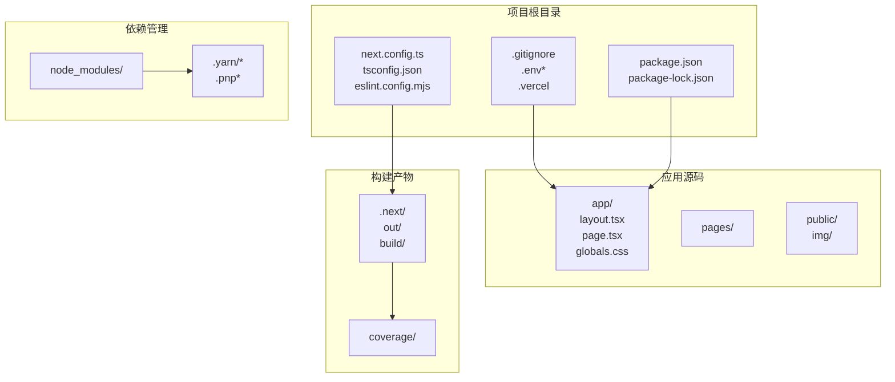
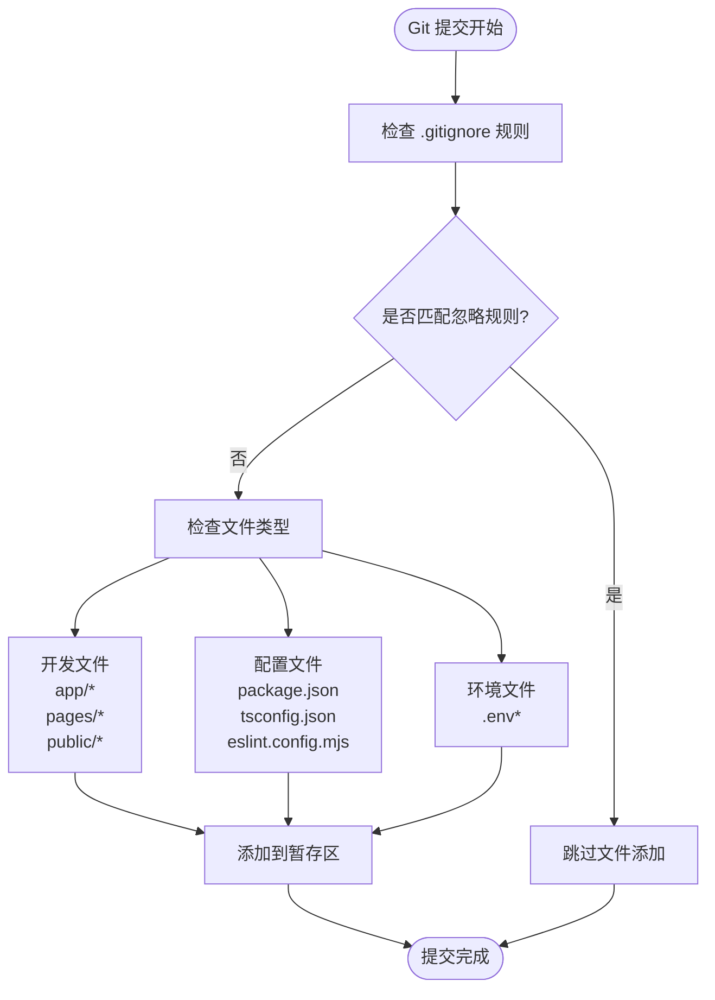
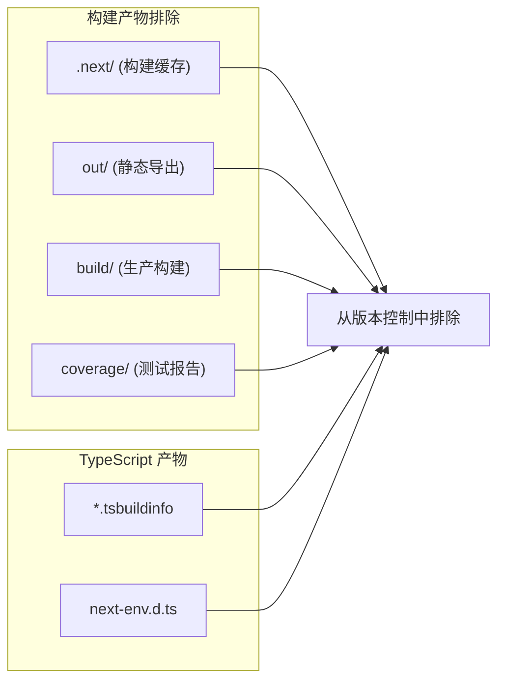
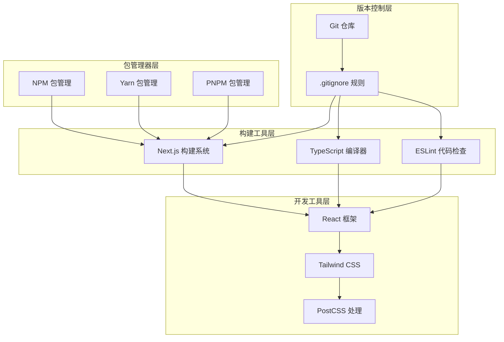

# 版本控制配置

<cite>
**本文档引用的文件**
- [.gitignore](file://.gitignore)
- [README.md](file://README.md)
- [package.json](file://package.json)
- [next.config.ts](file://next.config.ts)
- [tsconfig.json](file://tsconfig.json)
- [eslint.config.mjs](file://eslint.config.mjs)
</cite>

## 目录
1. [简介](#简介)
2. [项目结构概览](#项目结构概览)
3. [核心组件分析](#核心组件分析)
4. [架构总览](#架构总览)
5. [详细组件分析](#详细组件分析)
6. [依赖关系分析](#依赖关系分析)
7. [性能考量](#性能考量)
8. [故障排除指南](#故障排除指南)
9. [结论](#结论)

## 简介

本文件为该 Next.js 项目的 Git 版本控制配置详细文档。文档深入解释了 .gitignore 文件的配置规则和文件过滤策略，详细说明了开发环境、构建产物和敏感信息的排除规则，并阐述了团队协作中的版本控制最佳实践和分支管理策略。同时提供了常见忽略模式的使用场景和自定义忽略规则的添加方法，以及版本控制问题的排查和解决指南。

## 项目结构概览

该项目是一个基于 Next.js 的现代 Web 应用程序，采用 TypeScript 和 Tailwind CSS 构建。项目结构清晰，主要包含以下关键目录和文件：



**图表来源**
- [.gitignore:1-42](file://.gitignore#L1-L42)
- [package.json:1-31](file://package.json#L1-L31)
- [tsconfig.json:1-35](file://tsconfig.json#L1-L35)

**章节来源**
- [README.md:1-37](file://README.md#L1-L37)
- [package.json:1-31](file://package.json#L1-L31)

## 核心组件分析

### .gitignore 配置详解

该 .gitignore 文件采用了分组管理的方式，将不同类型的文件按照功能进行分类排除：

#### 依赖管理分组
- `/node_modules`: 排除所有 npm 依赖包
- `/.pnp`: 排除 Plug'n'Play 模式文件
- `.pnp.*`: 排除 PnP 相关配置文件
- `.yarn/*`: 排除 Yarn 包管理器的所有内容
- `!.yarn/patches`: 允许提交补丁文件
- `!.yarn/plugins`: 允许提交插件文件  
- `!.yarn/releases`: 允许提交发布版本
- `!.yarn/versions`: 允许提交版本信息

#### 测试分组
- `/coverage`: 排除测试覆盖率报告目录

#### Next.js 特定分组
- `/.next/`: 排除 Next.js 构建缓存目录
- `/out/`: 排除静态导出构建产物

#### 生产构建分组
- `/build`: 排除生产环境构建输出

#### 杂项分组
- `.DS_Store`: 排除 macOS 系统文件
- `*.pem`: 排除 PEM 格式的密钥文件
- `*.tsbuildinfo`: 排除 TypeScript 构建信息文件
- `next-env.d.ts`: 排除自动生成的类型声明文件

#### 调试分组
- `npm-debug.log*`: 排除 npm 调试日志
- `yarn-debug.log*`: 排除 Yarn 调试日志
- `yarn-error.log*`: 排除 Yarn 错误日志
- `.pnpm-debug.log*`: 排除 pnpm 调试日志

#### 环境变量分组
- `.env*`: 排除所有环境变量文件（可选择性提交）

#### 平台特定分组
- `.vercel`: 排除 Vercel 平台相关文件

**章节来源**
- [.gitignore:1-42](file://.gitignore#L1-L42)

## 架构总览

该版本控制系统的设计遵循了现代前端开发的最佳实践，通过合理的文件排除策略确保仓库的整洁性和性能：



**图表来源**
- [.gitignore:1-42](file://.gitignore#L1-L42)
- [package.json:1-31](file://package.json#L1-L31)

## 详细组件分析

### 开发环境配置

#### TypeScript 配置集成
项目使用 TypeScript 进行类型安全开发，tsconfig.json 配置确保了正确的编译选项：

- **严格模式**: 启用了严格的类型检查 (`"strict": true`)
- **增量编译**: 启用增量编译提升构建性能 (`"incremental": true`)
- **模块解析**: 使用 bundler 模式支持现代打包工具
- **路径映射**: 配置了 `@/*` 路径别名

#### ESLint 集成
eslint.config.mjs 配置了现代化的代码质量检查：

- **Next.js 集成**: 使用 `eslint-config-next` 提供的规则集
- **核心 Web Vitals**: 包含性能相关的检查规则
- **TypeScript 支持**: 针对 TypeScript 代码的专门规则
- **自定义覆盖**: 明确覆盖默认忽略规则以适应项目需求

**章节来源**
- [tsconfig.json:1-35](file://tsconfig.json#L1-L35)
- [eslint.config.mjs:1-19](file://eslint.config.mjs#L1-L19)

### 构建产物排除策略

#### Next.js 构建系统
项目采用 Next.js 的内置构建系统，.gitignore 中明确排除了以下构建相关目录：



**图表来源**
- [.gitignore:16-22](file://.gitignore#L16-L22)
- [.gitignore:39-41](file://.gitignore#L39-L41)

#### 包管理器兼容性
配置支持多种包管理器，确保团队成员使用不同工具时的一致性：

- **Yarn**: 排除 `.yarn/*` 但允许必要的子目录
- **PNPM**: 排除 `.pnpm-debug.log*` 调试文件
- **NPM**: 排除 `npm-debug.log*` 调试文件

**章节来源**
- [.gitignore:3-11](file://.gitignore#L3-L11)
- [.gitignore:27-31](file://.gitignore#L27-L31)

### 敏感信息保护

#### 环境变量管理
项目对环境变量文件采取了灵活的处理策略：

- **默认排除**: 所有 `.env*` 文件默认被排除
- **可选提交**: 团队可根据需要选择性提交特定环境文件
- **安全实践**: 避免意外提交敏感的生产环境配置

#### 密钥文件保护
通过模式匹配确保各种格式的密钥文件都不会被提交：

- **PEM 格式**: `*.pem` 模式匹配所有 PEM 格式文件
- **其他格式**: 可根据需要扩展匹配模式

**章节来源**
- [.gitignore:23-25](file://.gitignore#L23-L25)
- [.gitignore:33-34](file://.gitignore#L33-L34)

## 依赖关系分析

### 工具链集成



**图表来源**
- [.gitignore:1-42](file://.gitignore#L1-L42)
- [package.json:15-29](file://package.json#L15-L29)

### 依赖排除策略

项目在 .gitignore 中实现了智能的依赖排除策略：

1. **包管理器兼容性**: 支持多种包管理器的文件结构
2. **开发工具集成**: 自动排除各种开发工具产生的临时文件
3. **平台特定文件**: 排除各平台特有的系统文件
4. **调试信息**: 清理各种调试日志文件

**章节来源**
- [.gitignore:3-11](file://.gitignore#L3-L11)
- [.gitignore:23-31](file://.gitignore#L23-L31)

## 性能考量

### 仓库大小优化

通过合理的 .gitignore 配置，项目能够有效控制仓库大小：

- **避免存储大型依赖**: `/node_modules` 默认被排除
- **清理构建产物**: 构建目录不会占用存储空间
- **减少网络传输**: 小型仓库提升克隆和推送速度
- **优化 CI/CD 性能**: 减少构建时间

### 构建缓存策略

Next.js 的构建缓存机制与版本控制策略相得益彰：

- **.next 目录**: 仅用于本地开发缓存，不提交到远程仓库
- **增量编译**: 利用 TypeScript 增量编译提升开发体验
- **热重载**: 结合构建缓存实现快速的开发迭代

## 故障排除指南

### 常见问题诊断

#### 文件意外被跟踪
**症状**: 新增的文件或目录出现在 `git status` 输出中
**解决方案**:
1. 检查对应的 .gitignore 规则是否正确
2. 确认路径前缀使用正确的符号
3. 验证通配符模式是否匹配目标文件

#### 依赖包未被排除
**症状**: `node_modules` 目录仍然被跟踪
**解决方案**:
1. 确认 .gitignore 中存在 `/node_modules` 规则
2. 检查是否有更具体的规则覆盖了该规则
3. 使用 `git check-ignore` 命令诊断具体原因

#### 构建产物冲突
**症状**: 构建目录中的文件状态异常
**解决方案**:
1. 确保构建目录在 .gitignore 中正确定义
2. 清理本地构建缓存
3. 重新执行构建命令

### 调试命令

```bash
# 查看文件被哪个规则忽略
git check-ignore -v <文件路径>

# 查看当前仓库的忽略规则
git config --get core.excludesfile

# 强制重新添加已忽略的文件（不推荐）
git add --force <文件路径>

# 查看文件历史中的忽略状态
git log --follow -- <文件路径>
```

### 最佳实践建议

1. **定期审查 .gitignore**: 随着项目发展定期更新忽略规则
2. **团队一致性**: 确保所有团队成员使用相同的 .gitignore 配置
3. **CI/CD 集成**: 在持续集成环境中验证忽略规则的有效性
4. **文档记录**: 记录重要的忽略规则变更及其原因

**章节来源**
- [.gitignore:1-42](file://.gitignore#L1-L42)

## 结论

该版本控制配置展现了现代前端开发的最佳实践，通过精心设计的 .gitignore 规则实现了：

- **完整的开发环境隔离**: 排除了所有开发工具产生的临时文件
- **构建产物的合理管理**: 既保证了开发效率又避免了不必要的文件跟踪
- **多包管理器兼容性**: 支持团队成员使用不同的包管理工具
- **安全敏感信息保护**: 有效防止敏感数据的意外提交

这套配置为团队协作提供了坚实的基础，建议团队成员严格遵守这些规则，并根据项目发展情况进行适当的调整和优化。