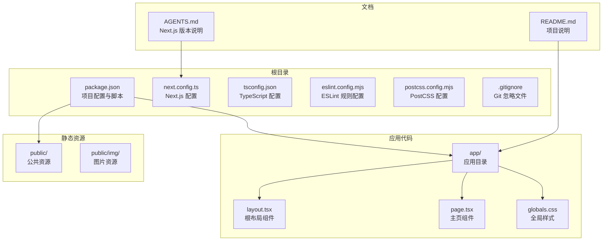
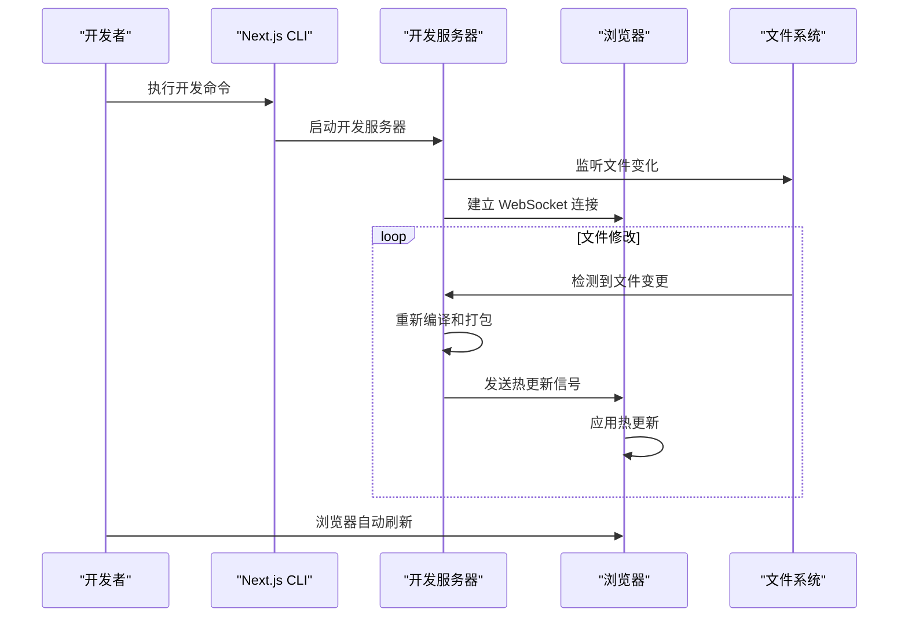
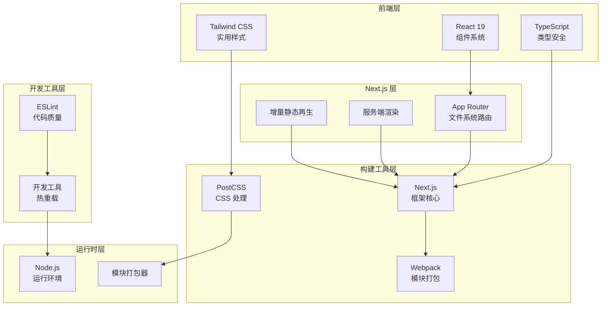
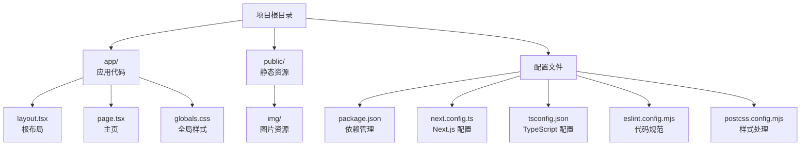

# 快速开始

<cite>
**本文引用的文件**
- [package.json](file://package.json)
- [README.md](file://README.md)
- [next.config.ts](file://next.config.ts)
- [tsconfig.json](file://tsconfig.json)
- [eslint.config.mjs](file://eslint.config.mjs)
- [postcss.config.mjs](file://postcss.config.mjs)
- [app/layout.tsx](file://app/layout.tsx)
- [app/page.tsx](file://app/page.tsx)
- [app/globals.css](file://app/globals.css)
- [AGENTS.md](file://AGENTS.md)
</cite>

## 目录
1. [简介](#简介)
2. [项目结构](#项目结构)
3. [环境要求](#环境要求)
4. [安装步骤](#安装步骤)
5. [开发服务器与热重载](#开发服务器与热重载)
6. [浏览器访问与页面编辑](#浏览器访问与页面编辑)
7. [常用开发命令](#常用开发命令)
8. [多包管理器支持](#多包管理器支持)
9. [架构概览](#架构概览)
10. [故障排除](#故障排除)
11. [结语](#结语)

## 简介

blod 是一个基于 Next.js 的现代化博客项目，采用 React 19 和 TypeScript 构建。该项目提供了完整的开发环境配置，包括 Tailwind CSS 样式系统、TypeScript 类型检查、ESLint 代码规范以及自动字体优化功能。

本项目的核心特性：
- 基于 Next.js App Router 的现代架构
- React 19 组件系统
- TypeScript 类型安全
- Tailwind CSS 实用优先的样式框架
- 自动字体优化和加载
- 开发时热重载支持
- 移动端友好的响应式设计

## 项目结构



**图表来源**
- [package.json:1-31](file://package.json#L1-L31)
- [next.config.ts:1-8](file://next.config.ts#L1-L8)
- [tsconfig.json:1-35](file://tsconfig.json#L1-L35)
- [eslint.config.mjs:1-19](file://eslint.config.mjs#L1-L19)
- [postcss.config.mjs:1-8](file://postcss.config.mjs#L1-L8)

**章节来源**
- [package.json:1-31](file://package.json#L1-L31)
- [next.config.ts:1-8](file://next.config.ts#L1-L8)
- [tsconfig.json:1-35](file://tsconfig.json#L1-L35)

## 环境要求

### Node.js 版本要求

根据项目配置，推荐使用以下 Node.js 版本：
- **最低版本**: Node.js 18.x 或更高版本
- **推荐版本**: Node.js 20.x 或最新 LTS 版本

### 包管理器选择

项目支持多种包管理器，包括：
- **npm** (Node Package Manager)
- **Yarn** (Classic 或 Berry)
- **pnpm** (Performant NPM)
- **bun** (超快的 JavaScript 运行时)

### 开发工具链

- **React**: 19.2.4
- **TypeScript**: 5.x
- **Tailwind CSS**: 4.x
- **Next.js**: 16.2.6

**章节来源**
- [package.json:15-29](file://package.json#L15-L29)
- [tsconfig.json:2-14](file://tsconfig.json#L2-L14)

## 安装步骤

### 步骤 1：克隆项目

```bash
# 使用 Git 克隆项目
git clone <repository-url>
cd blod
```

### 步骤 2：安装依赖

根据你选择的包管理器执行相应的安装命令：

```bash
# 使用 npm
npm install

# 使用 Yarn
yarn install

# 使用 pnpm
pnpm install

# 使用 bun
bun install
```

### 步骤 3：验证安装

确认所有依赖已正确安装：
- 检查 `node_modules` 目录是否存在
- 验证 `package.json` 中的依赖版本
- 确认 TypeScript 编译配置正常

### 步骤 4：初始化开发环境

```bash
# 预构建 Tailwind CSS
npx tailwindcss -i ./app/globals.css -o ./app/globals.css --watch
```

**章节来源**
- [README.md:5-15](file://README.md#L5-L15)
- [package.json:9-14](file://package.json#L9-L14)

## 开发服务器与热重载

### 启动开发服务器

```bash
# 使用 npm
npm run dev

# 使用 Yarn
yarn dev

# 使用 pnpm
pnpm dev

# 使用 bun
bun dev
```

### 开发服务器工作原理



**图表来源**
- [package.json:10](file://package.json#L10)
- [app/layout.tsx:15-18](file://app/layout.tsx#L15-L18)

### 热重载机制详解

1. **文件监听**: 开发服务器监控 `app/` 目录下的所有文件变化
2. **增量编译**: 只重新编译受影响的模块
3. **模块热替换**: 通过 Webpack 的 HMR 功能实现无缝更新
4. **状态保持**: 组件状态在热更新过程中得以保留

### 开发服务器配置

项目使用默认的 Next.js 开发服务器配置，支持以下特性：
- 即时编译错误显示
- 自动页面路由生成
- API 路由热重载
- 静态资源缓存优化

**章节来源**
- [package.json:10](file://package.json#L10)
- [next.config.ts:3-5](file://next.config.ts#L3-L5)

## 浏览器访问与页面编辑

### 访问应用

开发服务器启动后，打开以下地址：
- **主地址**: http://localhost:3000
- **备用地址**: http://127.0.0.1:3000

### 页面编辑指导

#### 修改主页内容

1. 打开 `app/page.tsx` 文件
2. 编辑页面组件的 JSX 结构
3. 保存文件后，浏览器自动刷新
4. 查看实时预览效果

#### 自定义样式

1. 打开 `app/globals.css` 文件
2. 添加或修改 CSS 规则
3. 支持 Tailwind CSS 实用类
4. 浏览器即时反映样式变化

#### 更新布局

1. 打开 `app/layout.tsx` 文件
2. 修改根布局组件
3. 可以添加或删除全局元素
4. 热重载立即生效

### 响应式设计

项目内置响应式设计支持：
- 移动端优先的设计理念
- Flexbox 和 Grid 布局
- Tailwind CSS 断点系统
- 触摸友好的交互元素

**章节来源**
- [README.md:17-19](file://README.md#L17-L19)
- [app/page.tsx:12-71](file://app/page.tsx#L12-L71)
- [app/globals.css:1-27](file://app/globals.css#L1-L27)

## 常用开发命令

### 核心开发命令

| 命令 | 用途 | 说明 |
|------|------|------|
| `npm run dev` | 启动开发服务器 | 启动 Next.js 开发环境 |
| `npm run build` | 构建生产版本 | 生成优化后的静态文件 |
| `npm run start` | 启动生产服务器 | 运行构建后的应用 |
| `npm run lint` | 代码检查 | 运行 ESLint 检查 |

### TypeScript 相关命令

| 命令 | 用途 | 说明 |
|------|------|------|
| `tsc` | TypeScript 编译 | 编译 TypeScript 文件 |
| `tsc -w` | 监听模式 | 监听文件变化并编译 |
| `tsc --noEmit` | 类型检查 | 只进行类型检查 |

### Tailwind CSS 命令

| 命令 | 用途 | 说明 |
|------|------|------|
| `npx tailwindcss -i ./app/globals.css -o ./app/globals.css --watch` | 监听样式变化 | 实时编译 Tailwind CSS |

### ESLint 命令

| 命令 | 用途 | 说明 |
|------|------|------|
| `eslint app/` | 检查整个应用 | 运行代码质量检查 |
| `eslint app/ --fix` | 自动修复 | 尝试自动修复可修复的问题 |

**章节来源**
- [package.json:9-14](file://package.json#L9-L14)
- [eslint.config.mjs:1-19](file://eslint.config.mjs#L1-L19)

## 多包管理器支持

### npm (Node Package Manager)

```bash
# 安装依赖
npm install

# 启动开发服务器
npm run dev

# 构建生产版本
npm run build

# 运行生产服务器
npm start
```

### Yarn

```bash
# 安装依赖
yarn install

# 启动开发服务器
yarn dev

# 构建生产版本
yarn build

# 运行生产服务器
yarn start
```

### pnpm (推荐)

```bash
# 安装依赖
pnpm install

# 启动开发服务器
pnpm dev

# 构建生产版本
pnpm build

# 运行生产服务器
pnpm start
```

### bun

```bash
# 安装依赖
bun install

# 启动开发服务器
bun dev

# 构建生产版本
bun build

# 运行生产服务器
bun start
```

### 包管理器对比

| 特性 | npm | Yarn | pnpm | bun |
|------|-----|------|------|-----|
| 安装速度 | 标准 | 快 | 最快 | 极快 |
| 磁盘空间 | 高 | 中等 | 低 | 极低 |
| 并发性 | 一般 | 高 | 最高 | 最高 |
| 缓存机制 | 基础 | 高级 | 最高级 | 最高级 |
| 生态系统 | 完整 | 完整 | 完整 | 快速发展 |

**章节来源**
- [README.md:7-14](file://README.md#L7-L14)
- [package.json:9-14](file://package.json#L9-L14)

## 架构概览

### 技术栈架构



**图表来源**
- [package.json:15-29](file://package.json#L15-L29)
- [tsconfig.json:2-23](file://tsconfig.json#L2-L23)
- [postcss.config.mjs:1-8](file://postcss.config.mjs#L1-L8)

### 文件组织结构



**图表来源**
- [app/layout.tsx:1-34](file://app/layout.tsx#L1-L34)
- [app/page.tsx:1-72](file://app/page.tsx#L1-L72)
- [app/globals.css:1-27](file://app/globals.css#L1-L27)

## 故障排除

### 常见问题及解决方案

#### 1. 端口被占用

**问题**: 开发服务器无法启动，提示端口已被占用

**解决方案**:
```bash
# 方法1: 更改端口号
npm run dev -- -p 3001

# 方法2: 杀死占用端口的进程
netstat -ano | findstr :3000
taskkill /PID <进程ID> /F
```

#### 2. 依赖安装失败

**问题**: npm install 或 yarn install 失败

**解决方案**:
```bash
# 清理缓存
npm cache clean --force
# 或
yarn cache clean

# 删除 node_modules 和锁定文件
rm -rf node_modules package-lock.json
# 或
rm -rf node_modules yarn.lock

# 重新安装
npm install
```

#### 3. TypeScript 类型错误

**问题**: 编译时报类型相关错误

**解决方案**:
```bash
# 检查类型
tsc --noEmit

# 更新类型定义
npm update @types/react @types/react-dom
```

#### 4. 样式不生效

**问题**: Tailwind CSS 样式未正确应用

**解决方案**:
```bash
# 重新生成样式
npx tailwindcss -i ./app/globals.css -o ./app/globals.css

# 检查配置
cat postcss.config.mjs
```

#### 5. 热重载失效

**问题**: 修改文件后浏览器不自动刷新

**解决方案**:
```bash
# 重启开发服务器
npm run dev

# 检查文件权限
chmod -R 755 app/

# 清理缓存
rm -rf .next/
```

### 性能优化建议

#### 开发性能优化

1. **启用增量编译**: 使用 TypeScript 的增量编译模式
2. **优化依赖**: 只安装必要的依赖包
3. **合理配置**: 调整 Next.js 的开发配置

#### 生产性能优化

1. **代码分割**: 利用 Next.js 的自动代码分割
2. **图片优化**: 使用 Next.js 内置的图片优化功能
3. **缓存策略**: 配置合适的缓存头

**章节来源**
- [AGENTS.md:1-6](file://AGENTS.md#L1-L6)
- [eslint.config.mjs:1-19](file://eslint.config.mjs#L1-L19)

## 结语

通过本快速开始指南，您应该已经成功搭建了 blod 项目的开发环境，并能够：

1. **理解项目架构**: 掌握基于 Next.js App Router 的现代前端架构
2. **配置开发环境**: 成功安装依赖并启动开发服务器
3. **使用热重载**: 实现高效的开发体验
4. **编辑页面内容**: 熟练修改主页和样式
5. **掌握多包管理器**: 选择最适合的包管理器进行开发

### 下一步建议

1. **探索项目功能**: 深入了解现有的博客功能和布局设计
2. **添加新功能**: 基于现有架构添加新的页面和功能
3. **自定义样式**: 利用 Tailwind CSS 创建独特的视觉效果
4. **部署应用**: 学习如何将项目部署到生产环境

### 学习资源

- [Next.js 官方文档](https://nextjs.org/docs)
- [React 19 官方文档](https://react.dev)
- [TypeScript 官方文档](https://www.typescriptlang.org/docs/)
- [Tailwind CSS 官方文档](https://tailwindcss.com/docs)

祝您开发顺利，享受构建现代化博客的乐趣！