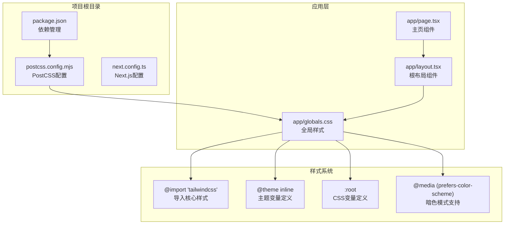
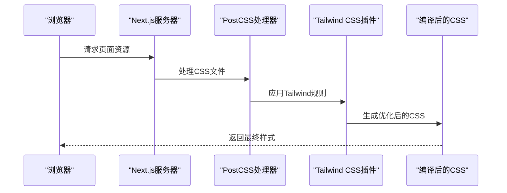
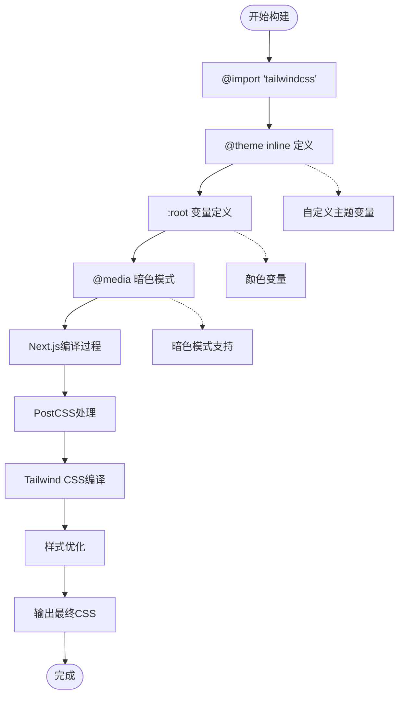
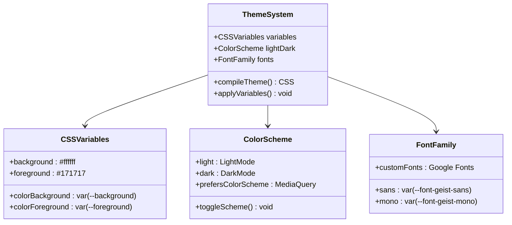
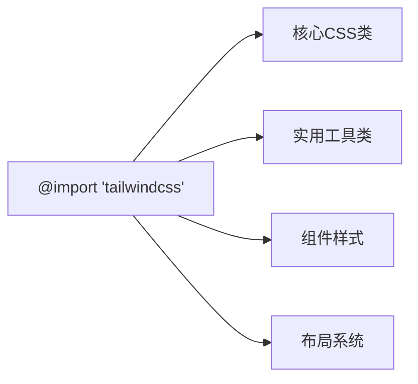
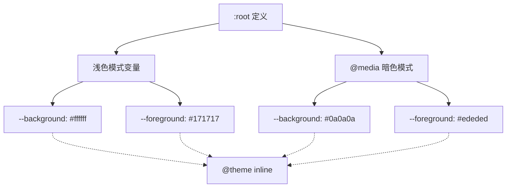
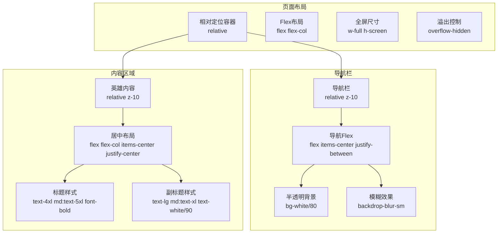
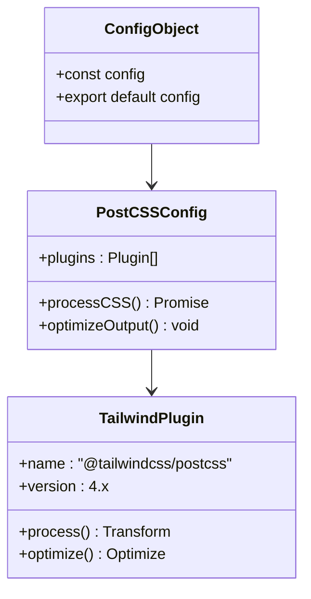
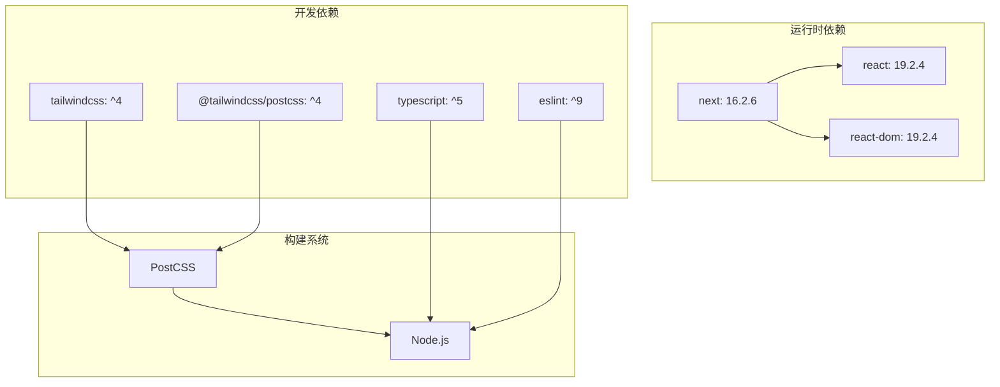
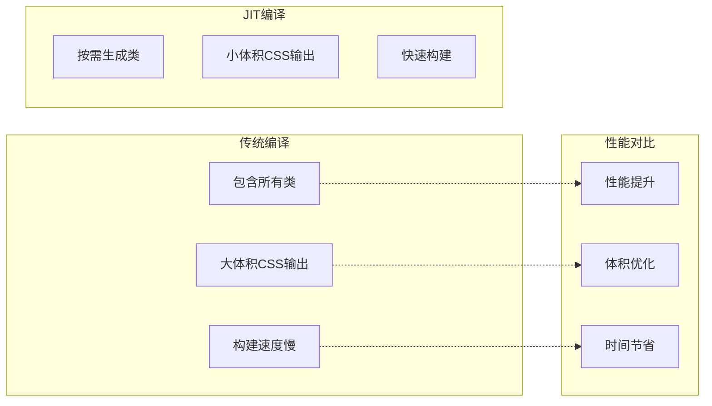

# Tailwind CSS 配置

<cite>
**本文档引用的文件**
- [package.json](file://package.json)
- [postcss.config.mjs](file://postcss.config.mjs)
- [next.config.ts](file://next.config.ts)
- [app/globals.css](file://app/globals.css)
- [app/layout.tsx](file://app/layout.tsx)
- [app/page.tsx](file://app/page.tsx)
- [README.md](file://README.md)
</cite>

## 目录
1. [简介](#简介)
2. [项目结构](#项目结构)
3. [核心组件](#核心组件)
4. [架构概览](#架构概览)
5. [详细组件分析](#详细组件分析)
6. [依赖关系分析](#依赖关系分析)
7. [性能考虑](#性能考虑)
8. [故障排除指南](#故障排除指南)
9. [结论](#结论)

## 简介

本项目采用 Tailwind CSS 4 作为主要的样式框架，通过现代化的 PostCSS 插件系统实现高效的样式编译和优化。Tailwind CSS 在本项目中的集成体现了实用优先的设计理念，通过预设的 CSS 类快速构建响应式用户界面。

项目使用 Next.js 16.2.6 作为基础框架，结合 Tailwind CSS 4 的最新特性，实现了从开发到生产的完整样式工作流程。通过 @import 语句和 @theme inline 指令，项目实现了灵活的主题定制和变量管理。

## 项目结构

本项目采用 Next.js App Router 结构，Tailwind CSS 的配置集中在应用级的全局样式文件中：

**图表来源**
- [package.json:15-29](file://package.json#L15-L29)
- [postcss.config.mjs:1-7](file://postcss.config.mjs#L1-L7)
- [app/globals.css:1-26](file://app/globals.css#L1-L26)

**章节来源**
- [package.json:1-31](file://package.json#L1-L31)
- [postcss.config.mjs:1-8](file://postcss.config.mjs#L1-L8)
- [next.config.ts:1-8](file://next.config.ts#L1-L8)

## 核心组件

### Tailwind CSS 集成架构

项目通过以下三个核心组件实现 Tailwind CSS 的完整集成：

1. **PostCSS 插件系统**：通过 `@tailwindcss/postcss` 插件实现编译时处理
2. **全局样式管理**：使用 `app/globals.css` 统一管理样式导入和主题定义
3. **Next.js 集成**：通过 Next.js 的内置 PostCSS 支持实现无缝集成

### 样式导入机制

项目采用直接的 @import 语法导入 Tailwind CSS 核心样式：

**图表来源**
- [postcss.config.mjs:1-7](file://postcss.config.mjs#L1-L7)
- [app/globals.css:1](file://app/globals.css#L1)

**章节来源**
- [app/globals.css:1-26](file://app/globals.css#L1-L26)

## 架构概览

### Tailwind CSS 工作流程

**图表来源**
- [app/globals.css:1-26](file://app/globals.css#L1-L26)
- [postcss.config.mjs:1-7](file://postcss.config.mjs#L1-L7)

### 主题系统设计

项目实现了多层次的主题系统，支持动态主题切换和自定义变量：

**图表来源**
- [app/globals.css:3-13](file://app/globals.css#L3-L13)
- [app/layout.tsx:5-13](file://app/layout.tsx#L5-L13)

**章节来源**
- [app/globals.css:1-26](file://app/globals.css#L1-L26)
- [app/layout.tsx:1-34](file://app/layout.tsx#L1-L34)

## 详细组件分析

### 全局样式配置

#### @import 语句的使用

项目使用简洁的 @import 语法导入 Tailwind CSS 核心功能：

**图表来源**
- [app/globals.css:1](file://app/globals.css#L1)

#### @theme inline 指令详解

@theme inline 指令提供了强大的主题变量定义能力：

| 变量名 | 值类型 | 默认值 | 用途 |
|--------|--------|--------|------|
| `--color-background` | CSS变量 | `var(--background)` | 页面背景色 |
| `--color-foreground` | CSS变量 | `var(--foreground)` | 文本前景色 |
| `--font-sans` | CSS变量 | `var(--font-geist-sans)` | 无衬线字体 |
| `--font-mono` | CSS变量 | `var(--font-geist-mono)` | 等宽字体 |

**章节来源**
- [app/globals.css:8-13](file://app/globals.css#L8-L13)

### 主题变量系统

#### CSS 变量定义

项目通过 :root 伪类定义基础 CSS 变量：

**图表来源**
- [app/globals.css:3-20](file://app/globals.css#L3-L20)

#### 字体系统集成

项目集成了 Google Fonts 的 Geist 字体系列：

| 字体类型 | 变量名 | 字体族 | 特性 |
|----------|--------|--------|------|
| 无衬线字体 | `--font-geist-sans` | Geist Sans | 现代、易读 |
| 等宽字体 | `--font-geist-mono` | Geist Mono | 代码友好 |

**章节来源**
- [app/layout.tsx:5-13](file://app/layout.tsx#L5-L13)

### 组件样式实现

#### 主页组件的 Tailwind 使用

主页组件展示了多种 Tailwind CSS 类的实际应用：

**图表来源**
- [app/page.tsx:14-54](file://app/page.tsx#L14-L54)

**章节来源**
- [app/page.tsx:1-72](file://app/page.tsx#L1-L72)

### PostCSS 配置系统

#### 插件配置详解

项目使用现代化的 PostCSS 配置方式：

**图表来源**
- [postcss.config.mjs:1-7](file://postcss.config.mjs#L1-L7)

**章节来源**
- [postcss.config.mjs:1-8](file://postcss.config.mjs#L1-L8)

## 依赖关系分析

### 核心依赖关系

**图表来源**
- [package.json:15-29](file://package.json#L15-L29)

### 依赖版本兼容性

项目确保了各组件之间的版本兼容性：

| 组件 | 版本要求 | 兼容性 | 说明 |
|------|----------|--------|------|
| Tailwind CSS | ^4 | ✅ 兼容 | 支持最新 v4 特性 |
| PostCSS 插件 | ^4 | ✅ 兼容 | 与 Tailwind v4 对应 |
| Next.js | 16.2.6 | ✅ 兼容 | 内置 PostCSS 支持 |
| Node.js | >= 20 | ✅ 推荐 | 支持 Oxide 引擎 |

**章节来源**
- [package.json:15-29](file://package.json#L15-L29)

## 性能考虑

### JIT 编译模式

虽然项目当前使用传统的编译模式，但 Tailwind CSS 4 提供了强大的 JIT（Just-In-Time）编译能力：

### 优化策略

1. **按需加载**：只生成实际使用的 CSS 类
2. **缓存机制**：利用浏览器缓存减少重复下载
3. **Tree Shaking**：移除未使用的样式代码
4. **压缩优化**：生产环境自动压缩 CSS 输出

## 故障排除指南

### 常见问题及解决方案

#### 样式不生效问题

**问题描述**：Tailwind 类在组件中不生效

**可能原因**：
1. PostCSS 插件未正确配置
2. 全局样式文件未正确导入
3. CSS 变量定义错误

**解决方案**：
1. 检查 `postcss.config.mjs` 配置
2. 确认 `app/layout.tsx` 中正确导入 `globals.css`
3. 验证 `@theme inline` 语法正确性

#### 主题变量冲突

**问题描述**：自定义变量与 Tailwind 默认变量冲突

**解决步骤**：
1. 使用命名空间前缀避免冲突
2. 检查变量定义顺序
3. 确保变量作用域正确

#### 构建错误

**问题描述**：开发或生产构建失败

**排查要点**：
1. 检查 Node.js 版本要求
2. 验证 Tailwind CSS 版本兼容性
3. 确认 PostCSS 插件版本匹配

**章节来源**
- [app/globals.css:1-26](file://app/globals.css#L1-L26)
- [postcss.config.mjs:1-7](file://postcss.config.mjs#L1-L7)

## 结论

本项目成功实现了 Tailwind CSS 4 在 Next.js 环境中的完整集成，展现了现代前端开发的最佳实践。通过合理的架构设计和配置管理，项目实现了：

1. **高效的主题管理系统**：通过 CSS 变量和 @theme inline 指令实现灵活的主题定制
2. **现代化的构建流程**：利用 PostCSS 插件系统实现高效的样式编译
3. **响应式设计支持**：充分利用 Tailwind 的实用优先理念快速构建界面
4. **性能优化策略**：为未来的 JIT 编译模式做好准备

项目为开发者提供了清晰的参考模板，展示了如何在实际项目中有效使用 Tailwind CSS 4 的各项特性。通过遵循本文档的指导原则，开发者可以轻松地扩展和定制样式系统，满足各种复杂的界面需求。