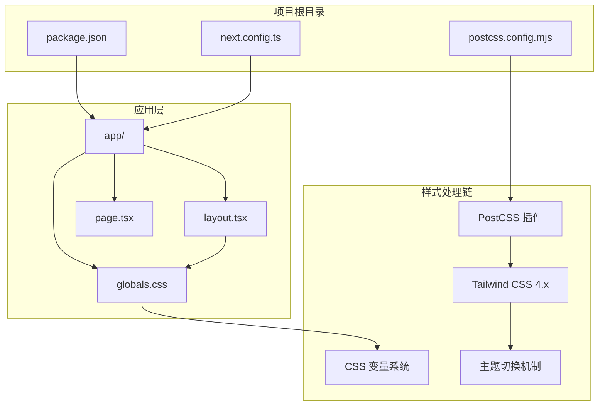
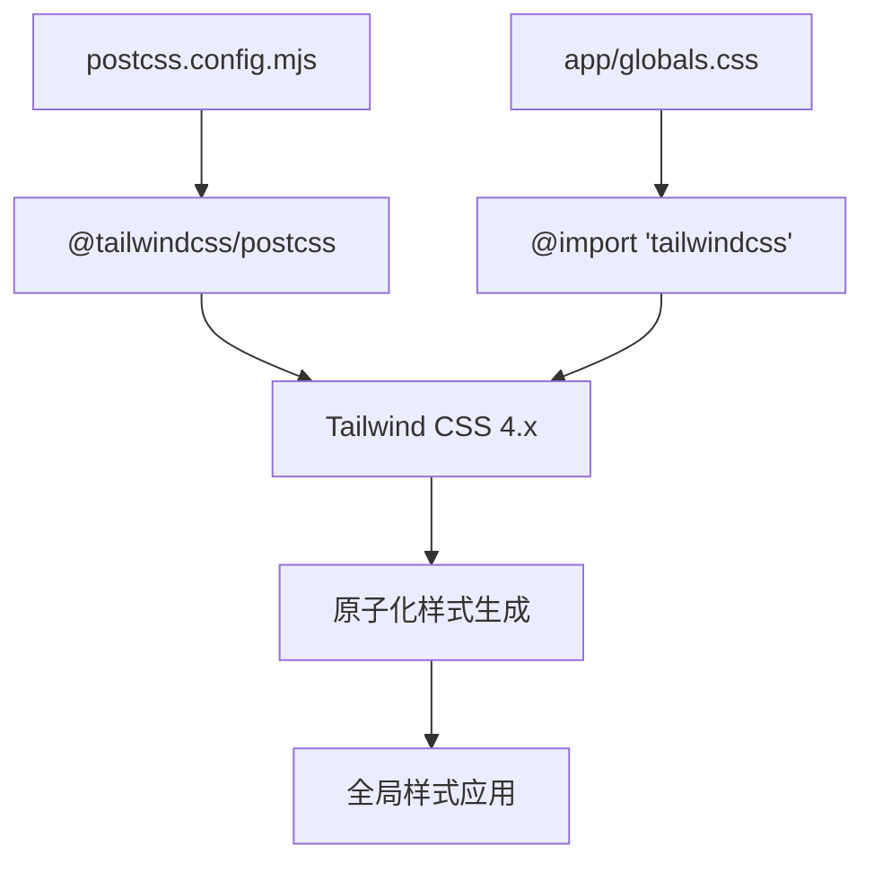
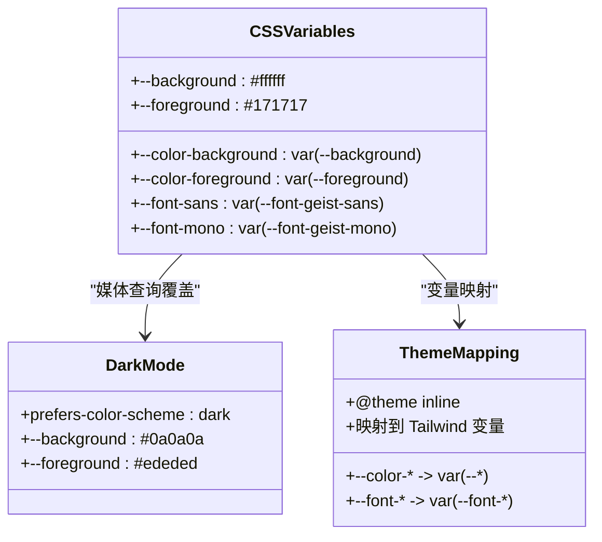
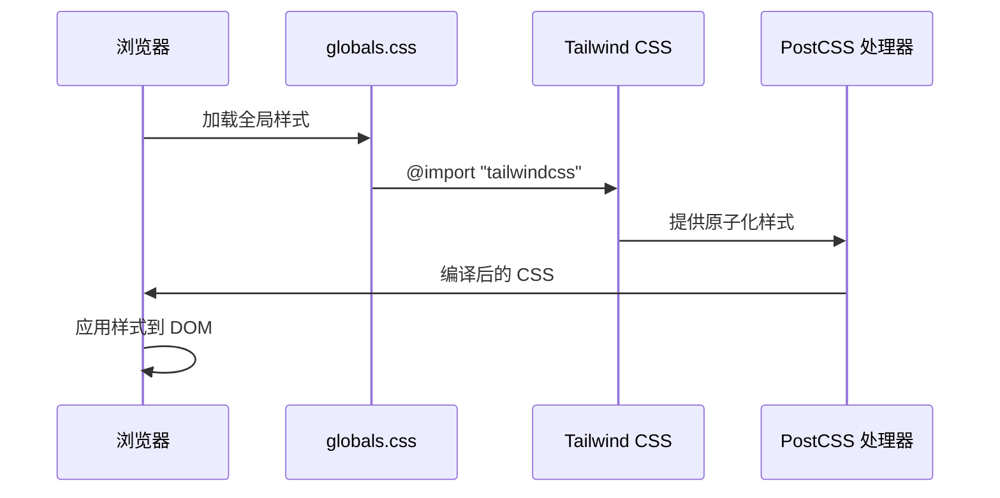
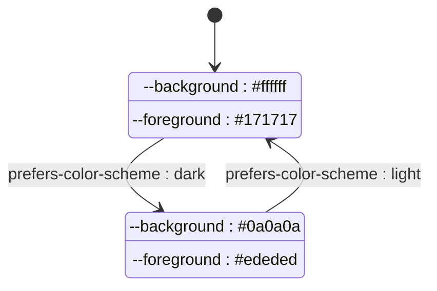
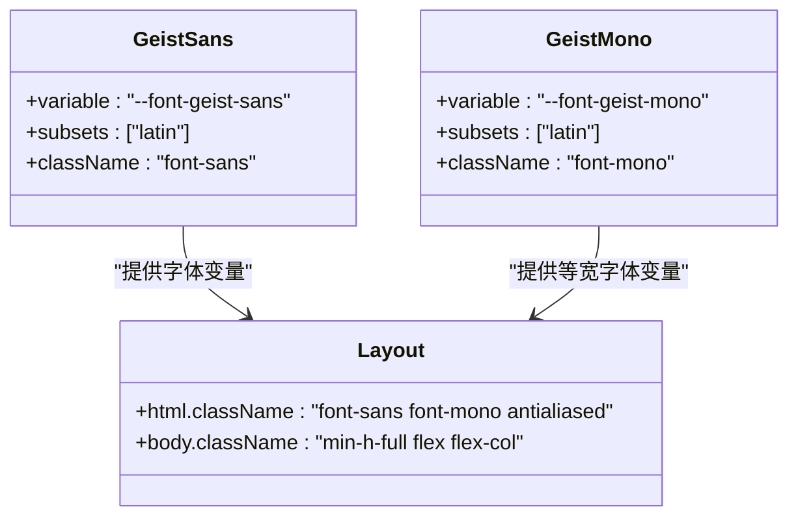
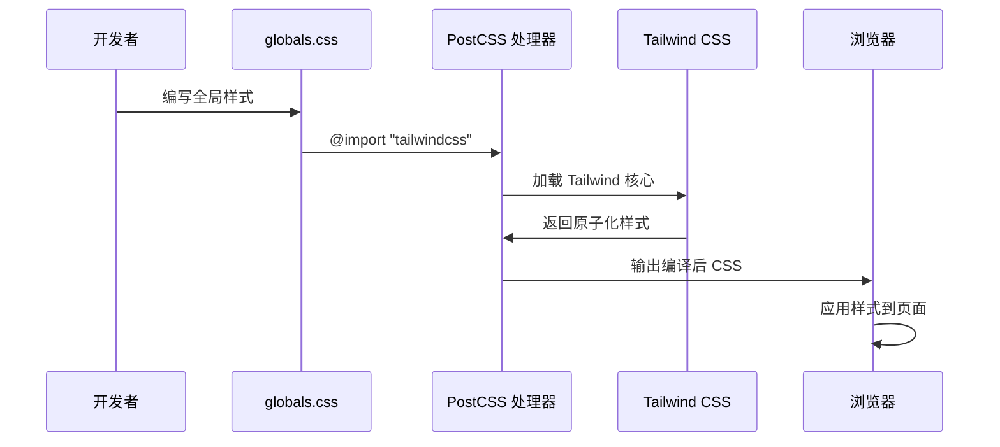

# 全局样式组织

<cite>
**本文档引用的文件**
- [app/globals.css](file://app/globals.css)
- [app/layout.tsx](file://app/layout.tsx)
- [postcss.config.mjs](file://postcss.config.mjs)
- [package.json](file://package.json)
- [next.config.ts](file://next.config.ts)
</cite>

## 目录
1. [简介](#简介)
2. [项目结构](#项目结构)
3. [核心组件](#核心组件)
4. [架构概览](#架构概览)
5. [详细组件分析](#详细组件分析)
6. [依赖关系分析](#依赖关系分析)
7. [性能考量](#性能考量)
8. [故障排除指南](#故障排除指南)
9. [结论](#结论)

## 简介

blod 项目采用现代化的全局样式组织架构，基于 Tailwind CSS 4.x 和 CSS 自定义属性实现响应式主题系统。该项目展示了如何通过合理的文件结构和命名约定来构建可维护的全局样式体系，同时确保良好的性能表现和浏览器兼容性。

## 项目结构

项目采用 Next.js App Router 结构，全局样式集中管理在 `app/globals.css` 文件中，配合 PostCSS 插件系统实现样式编译和优化。



**图表来源**
- [app/globals.css:1-27](file://app/globals.css#L1-L27)
- [postcss.config.mjs:1-8](file://postcss.config.mjs#L1-L8)
- [package.json:15-29](file://package.json#L15-L29)

**章节来源**
- [app/globals.css:1-27](file://app/globals.css#L1-L27)
- [postcss.config.mjs:1-8](file://postcss.config.mjs#L1-L8)
- [package.json:15-29](file://package.json#L15-L29)

## 核心组件

### Tailwind CSS 引入与配置

项目通过 PostCSS 插件系统集成 Tailwind CSS 4.x，实现了现代化的原子化样式系统。



**图表来源**
- [postcss.config.mjs:1-8](file://postcss.config.mjs#L1-L8)
- [app/globals.css:1](file://app/globals.css#L1)

### CSS 变量系统

项目采用 CSS 自定义属性实现主题化设计，支持明暗模式自动切换。



**图表来源**
- [app/globals.css:3-20](file://app/globals.css#L3-L20)

**章节来源**
- [app/globals.css:1-27](file://app/globals.css#L1-L27)

## 架构概览

项目采用分层架构设计，从底层的 CSS 变量系统到上层的主题映射，再到最外层的应用层样式。

```mermaid
graph TB
subgraph "底层基础设施"
A[CSS 自定义属性]
B[媒体查询]
C[PostCSS 处理]
end
subgraph "中间层主题系统"
D[@theme inline 指令]
E[变量映射规则]
F[颜色系统]
G[字体系统]
end
subgraph "应用层样式"
H[全局样式]
I[基础排版]
J[交互状态]
end
subgraph "运行时环境"
K[Next.js App Router]
L[Geist 字体]
M[响应式设计]
end
A --> D
B --> D
C --> E
D --> F
D --> G
E --> H
F --> H
G --> H
H --> I
H --> J
K --> L
L --> M
```

**图表来源**
- [app/globals.css:1-27](file://app/globals.css#L1-L27)
- [app/layout.tsx:1-34](file://app/layout.tsx#L1-L34)

## 详细组件分析

### 全局样式文件分析

#### @import 语句使用

项目使用标准的 CSS @import 语句引入 Tailwind CSS 核心样式：



**图表来源**
- [app/globals.css:1](file://app/globals.css#L1)
- [postcss.config.mjs:1-8](file://postcss.config.mjs#L1-L8)

#### :root 伪类选择器

`:root` 伪类用于定义全局 CSS 变量，是整个主题系统的基石：

| 变量名 | 默认值 | 用途 |
|--------|--------|------|
| `--background` | `#ffffff` | 背景色（明/暗模式） |
| `--foreground` | `#171717` | 前景色（明/暗模式） |

**章节来源**
- [app/globals.css:3-6](file://app/globals.css#L3-L6)

#### @theme inline 指令

`@theme inline` 指令将 CSS 变量映射到 Tailwind CSS 的主题变量：

```mermaid
flowchart LR
A[CSS 变量] --> B[@theme inline]
B --> C[Tailwind 变量]
D[--background] --> E[--color-background]
F[--foreground] --> G[--color-foreground]
H[--font-geist-sans] --> I[--font-sans]
J[--font-geist-mono] --> K[--font-mono]
```

**图表来源**
- [app/globals.css:8-13](file://app/globals.css#L8-L13)

#### 明暗模式支持

项目通过媒体查询实现自动明暗模式切换：



**图表来源**
- [app/globals.css:15-20](file://app/globals.css#L15-L20)

**章节来源**
- [app/globals.css:15-20](file://app/globals.css#L15-L20)

### 字体系统集成

#### Geist 字体配置

项目集成了 Geist Sans 和 Geist Mono 字体，通过 Next.js Font Google 实现优化加载：



**图表来源**
- [app/layout.tsx:5-13](file://app/layout.tsx#L5-L13)
- [app/layout.tsx:26-32](file://app/layout.tsx#L26-L32)

**章节来源**
- [app/layout.tsx:5-13](file://app/layout.tsx#L5-L13)
- [app/layout.tsx:26-32](file://app/layout.tsx#L26-L32)

### PostCSS 配置分析

#### 插件配置

项目使用 Tailwind CSS PostCSS 插件进行样式处理：

| 配置项 | 值 | 说明 |
|--------|-----|------|
| 插件名称 | `@tailwindcss/postcss` | Tailwind CSS PostCSS 处理器 |
| 版本范围 | `^4` | 兼容 Tailwind CSS 4.x |

**章节来源**
- [postcss.config.mjs:1-8](file://postcss.config.mjs#L1-L8)
- [package.json:21](file://package.json#L21)

## 依赖关系分析

### 样式处理流程



**图表来源**
- [app/globals.css:1](file://app/globals.css#L1)
- [postcss.config.mjs:1-8](file://postcss.config.mjs#L1-L8)

### 依赖版本关系

| 依赖包 | 版本 | 用途 |
|--------|------|------|
| `tailwindcss` | `^4` | 主样式框架 |
| `@tailwindcss/postcss` | `^4` | PostCSS 处理器 |
| `next` | `16.2.6` | 应用框架 |
| `react` | `19.2.4` | UI 库 |

**章节来源**
- [package.json:15-29](file://package.json#L15-L29)

## 性能考量

### 样式优化策略

1. **原子化样式**: 使用 Tailwind CSS 的原子化方法减少重复样式定义
2. **按需加载**: 通过 PostCSS 插件只输出使用的样式
3. **CSS 变量缓存**: 利用 CSS 变量实现主题切换的高性能渲染
4. **字体优化**: 使用 Next.js Font Google 实现字体资源的智能加载

### 浏览器兼容性

项目支持现代浏览器特性，包括：
- CSS 自定义属性（变量）
- 媒体查询（prefers-color-scheme）
- Flexbox 布局
- PostCSS 转换

## 故障排除指南

### 常见问题及解决方案

#### 样式未生效

**可能原因**:
- PostCSS 插件未正确配置
- Tailwind CSS 未正确导入
- 样式文件路径错误

**解决步骤**:
1. 检查 `postcss.config.mjs` 中的插件配置
2. 确认 `globals.css` 中的 @import 语句
3. 验证文件路径是否正确

#### 主题切换不工作

**可能原因**:
- 媒体查询语法错误
- CSS 变量未正确定义
- 浏览器不支持相关特性

**解决步骤**:
1. 检查 `@media (prefers-color-scheme: dark)` 语法
2. 验证 CSS 变量定义的完整性
3. 测试不同浏览器的兼容性

**章节来源**
- [app/globals.css:15-20](file://app/globals.css#L15-L20)
- [postcss.config.mjs:1-8](file://postcss.config.mjs#L1-L8)

## 结论

blod 项目的全局样式组织展现了现代前端开发的最佳实践：

1. **清晰的层次结构**: 从底层 CSS 变量到上层主题映射的分层设计
2. **高效的样式处理**: 利用 Tailwind CSS 和 PostCSS 实现原子化样式
3. **优秀的用户体验**: 支持明暗模式自动切换和字体优化
4. **良好的可维护性**: 合理的文件组织和命名约定

该架构为其他 Next.js 项目提供了优秀的参考模板，特别是在全局样式管理和主题系统实现方面。