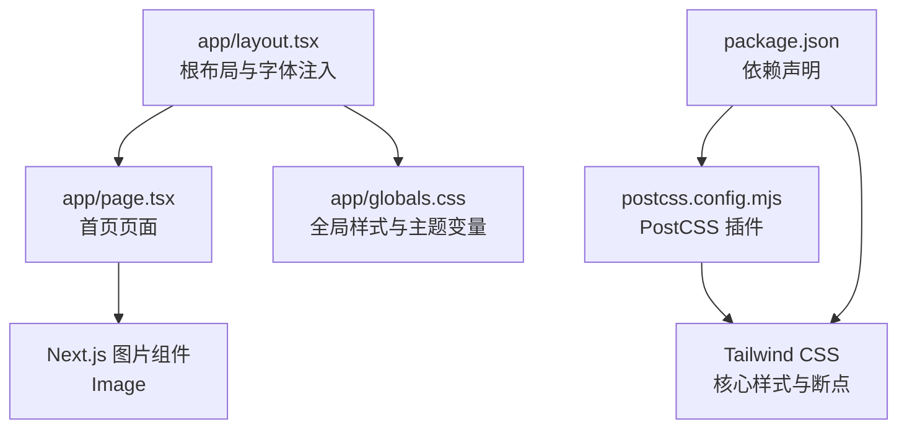
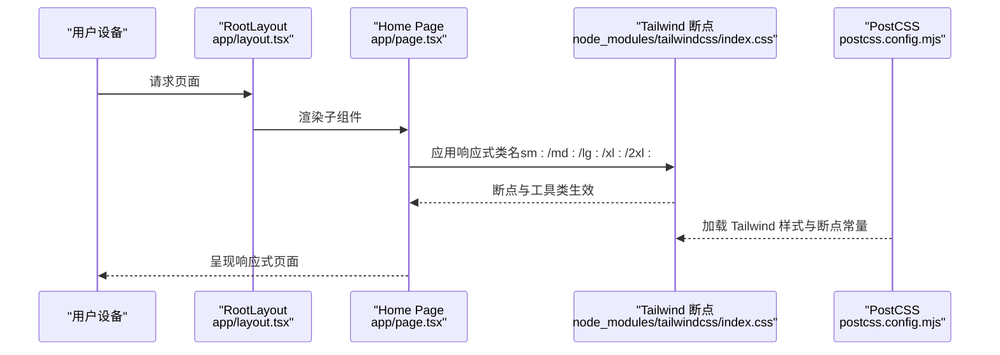
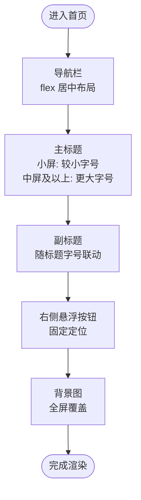
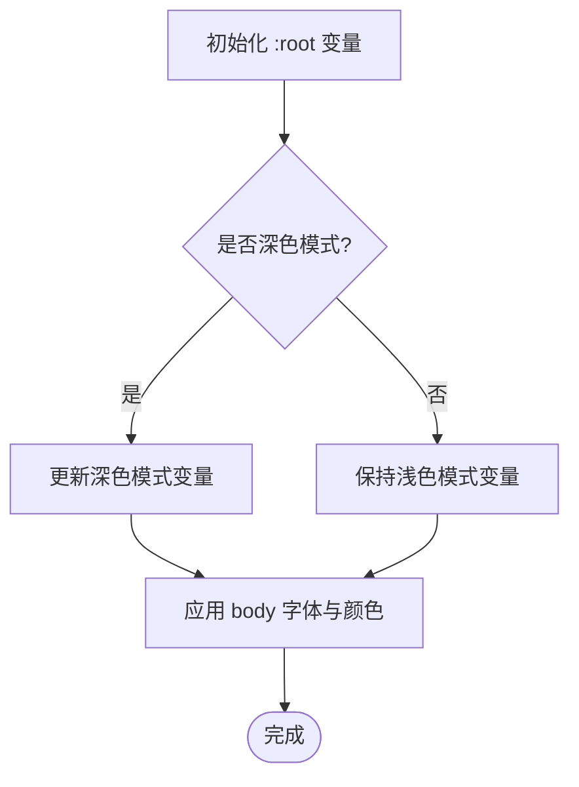
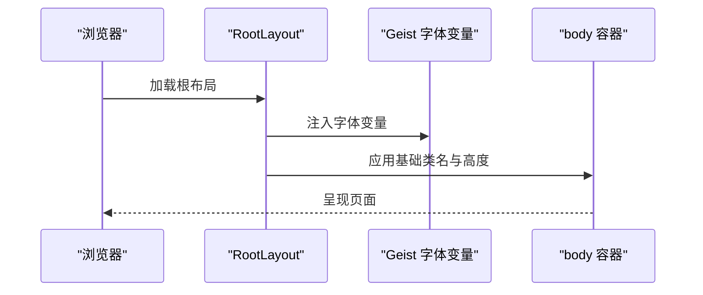
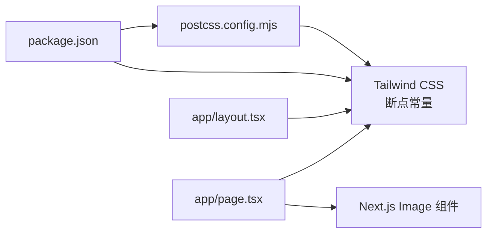

# 响应式设计策略

<cite>
**本文引用的文件**
- [app/globals.css](file://app/globals.css)
- [app/layout.tsx](file://app/layout.tsx)
- [app/page.tsx](file://app/page.tsx)
- [next.config.ts](file://next.config.ts)
- [package.json](file://package.json)
- [postcss.config.mjs](file://postcss.config.mjs)
- [node_modules/tailwindcss/index.css](file://node_modules/tailwindcss/index.css)
</cite>

## 目录
1. [简介](#简介)
2. [项目结构](#项目结构)
3. [核心组件](#核心组件)
4. [架构总览](#架构总览)
5. [详细组件分析](#详细组件分析)
6. [依赖关系分析](#依赖关系分析)
7. [性能考量](#性能考量)
8. [故障排查指南](#故障排查指南)
9. [结论](#结论)
10. [附录](#附录)

## 简介
本文件系统化梳理 blod 项目的响应式设计策略，重点覆盖以下方面：
- 移动端优先的设计原则与断点策略
- 使用 Tailwind 响应式前缀（sm:/md:/lg:/xl:/2xl:）在组件中的应用
- 全局样式在字体、间距、布局上的移动端优化
- 常见响应式组件的实现思路（卡片布局、导航栏折叠、图片适配）
- 视口配置与缩放控制的最佳实践
- 调试技巧与性能优化建议（含图片懒加载与 CSS 优化）

## 项目结构
blod 项目基于 Next.js App Router 架构，采用 Tailwind CSS 进行样式管理。关键结构如下：
- app/globals.css：全局样式与主题变量定义，包含深色模式媒体查询与基础排版
- app/layout.tsx：根布局与字体注入，设置页面容器与基础类名
- app/page.tsx：首页页面，包含背景图、导航栏、主标题与右侧悬浮按钮等组件
- next.config.ts：Next.js 配置入口（当前为空配置）
- package.json：依赖声明，包含 Tailwind 与 PostCSS 相关包
- postcss.config.mjs：PostCSS 插件配置，启用 Tailwind 插件
- node_modules/tailwindcss/index.css：Tailwind 核心样式与断点常量定义

图表来源
- [app/layout.tsx:1-34](file://app/layout.tsx#L1-L34)
- [app/page.tsx:1-72](file://app/page.tsx#L1-L72)
- [app/globals.css:1-27](file://app/globals.css#L1-L27)
- [postcss.config.mjs:1-8](file://postcss.config.mjs#L1-L8)
- [package.json:1-31](file://package.json#L1-L31)
- [node_modules/tailwindcss/index.css:329-369](file://node_modules/tailwindcss/index.css#L329-L369)

章节来源
- [app/layout.tsx:1-34](file://app/layout.tsx#L1-L34)
- [app/page.tsx:1-72](file://app/page.tsx#L1-L72)
- [app/globals.css:1-27](file://app/globals.css#L1-L27)
- [postcss.config.mjs:1-8](file://postcss.config.mjs#L1-L8)
- [package.json:1-31](file://package.json#L1-L31)
- [node_modules/tailwindcss/index.css:329-369](file://node_modules/tailwindcss/index.css#L329-L369)

## 核心组件
- 根布局与字体注入：通过根布局注入字体变量与基础类名，确保全局排版一致性与抗锯齿渲染
- 全局样式与主题变量：定义颜色变量与深色模式切换逻辑，统一背景与前景色
- 页面组件：首页页面包含背景图、导航栏、主标题与右侧悬浮按钮，演示响应式前缀的使用

章节来源
- [app/layout.tsx:15-34](file://app/layout.tsx#L15-L34)
- [app/globals.css:3-26](file://app/globals.css#L3-L26)
- [app/page.tsx:12-71](file://app/page.tsx#L12-L71)

## 架构总览
下图展示了从页面到样式系统的响应式数据流与依赖关系：

图表来源
- [app/layout.tsx:20-33](file://app/layout.tsx#L20-L33)
- [app/page.tsx:47-68](file://app/page.tsx#L47-L68)
- [node_modules/tailwindcss/index.css:329-369](file://node_modules/tailwindcss/index.css#L329-L369)
- [postcss.config.mjs:1-8](file://postcss.config.mjs#L1-L8)

## 详细组件分析

### 组件一：首页页面（响应式排版与布局）
- 导航栏：使用 flex 布局与固定内边距，在桌面端展示横向列表
- 主标题与副标题：在小屏上使用较小字号，中屏及以上使用更大字号
- 右侧悬浮按钮：固定定位，保证在滚动时可见
- 背景图：使用 Next.js 图片组件，全屏覆盖并保持比例

图表来源
- [app/page.tsx:26-68](file://app/page.tsx#L26-L68)

章节来源
- [app/page.tsx:26-68](file://app/page.tsx#L26-L68)

### 组件二：全局样式与深色模式
- 定义颜色变量与深色模式媒体查询，自动切换背景与前景色
- 在 body 上应用字体族与基础排版，确保跨设备一致体验

图表来源
- [app/globals.css:3-26](file://app/globals.css#L3-L26)

章节来源
- [app/globals.css:3-26](file://app/globals.css#L3-L26)

### 组件三：根布局与字体注入
- 注入 Geist 字体变量，确保全局字体一致
- 设置 html 类名以启用抗锯齿与变量字体

图表来源
- [app/layout.tsx:5-13](file://app/layout.tsx#L5-L13)
- [app/layout.tsx:26-30](file://app/layout.tsx#L26-L30)

章节来源
- [app/layout.tsx:5-13](file://app/layout.tsx#L5-L13)
- [app/layout.tsx:26-30](file://app/layout.tsx#L26-L30)

## 依赖关系分析
- Tailwind 断点常量：项目使用 Tailwind 默认断点（sm: 40rem、md: 48rem、lg: 64rem、xl: 80rem、2xl: 96rem），用于 sm:/md:/lg:/xl:/2xl: 前缀的响应式控制
- PostCSS 插件链：通过 postcss.config.mjs 启用 Tailwind 插件，构建阶段生成响应式样式
- Next.js 图片组件：在页面中使用 Image 组件进行图片优化与自适应

图表来源
- [postcss.config.mjs:1-8](file://postcss.config.mjs#L1-L8)
- [package.json:20-28](file://package.json#L20-L28)
- [node_modules/tailwindcss/index.css:329-369](file://node_modules/tailwindcss/index.css#L329-L369)
- [app/layout.tsx:26-30](file://app/layout.tsx#L26-L30)
- [app/page.tsx:17-23](file://app/page.tsx#L17-L23)

章节来源
- [postcss.config.mjs:1-8](file://postcss.config.mjs#L1-L8)
- [package.json:20-28](file://package.json#L20-L28)
- [node_modules/tailwindcss/index.css:329-369](file://node_modules/tailwindcss/index.css#L329-L369)
- [app/layout.tsx:26-30](file://app/layout.tsx#L26-L30)
- [app/page.tsx:17-23](file://app/page.tsx#L17-L23)

## 性能考量
- 图片优化：使用 Next.js 图片组件，结合 fill 与 object-cover 实现全屏背景图的自适应与压缩
- CSS 体积：Tailwind 默认工具类较多，建议在生产环境启用按需裁剪与 Tree Shaking，减少未使用类名
- 字体加载：通过变量注入字体族，避免重复下载字体文件；可配合字体预加载策略提升首屏渲染
- 动画与阴影：合理使用过渡与阴影类，避免在低端设备上造成过度重绘

章节来源
- [app/page.tsx:17-23](file://app/page.tsx#L17-L23)
- [package.json:20-28](file://package.json#L20-L28)

## 故障排查指南
- 响应式不生效
  - 检查是否正确引入 Tailwind 插件与断点常量
  - 确认页面类名中包含响应式前缀
- 深色模式异常
  - 检查媒体查询与变量赋值顺序
  - 确保 :root 变量在深色模式下被正确覆盖
- 图片显示问题
  - 确认图片路径与权限
  - 检查 fill 与 object-fit 的组合使用

章节来源
- [postcss.config.mjs:1-8](file://postcss.config.mjs#L1-L8)
- [node_modules/tailwindcss/index.css:329-369](file://node_modules/tailwindcss/index.css#L329-L369)
- [app/globals.css:15-20](file://app/globals.css#L15-L20)
- [app/page.tsx:17-23](file://app/page.tsx#L17-L23)

## 结论
blod 项目遵循移动端优先的设计理念，通过 Tailwind 的响应式前缀与断点常量，结合全局主题变量与深色模式支持，实现了简洁而高效的响应式布局。页面组件中已体现对标题字号、导航栏与悬浮按钮的多端适配。建议在后续迭代中进一步完善导航栏折叠、卡片布局与图片懒加载等细节，以提升移动端交互体验与性能表现。

## 附录

### 响应式断点与前缀使用
- 断点常量（来自 Tailwind 核心样式）：
  - sm: 40rem（640px）
  - md: 48rem（768px）
  - lg: 64rem（1024px）
  - xl: 80rem（1280px）
  - 2xl: 96rem（1536px）
- 使用建议：
  - 小屏优先：默认样式针对小屏优化
  - 中屏及以上：使用 md:/lg:/xl:/2xl: 增强布局密度与信息层级
  - 注意：在小屏上避免过密布局，确保触摸目标尺寸与可读性

章节来源
- [node_modules/tailwindcss/index.css:329-369](file://node_modules/tailwindcss/index.css#L329-L369)

### 视口配置与缩放控制最佳实践
- 视口配置：Next.js 默认已包含合理的 viewport 行为，无需额外手动配置
- 缩放控制：移动端默认允许缩放，确保文本可读性与交互可用性
- 建议：在需要限制缩放或固定布局时，可在页面层面增加 meta 控制，但需谨慎评估用户体验

章节来源
- [app/layout.tsx:26-30](file://app/layout.tsx#L26-L30)

### 常见响应式组件实现要点
- 卡片布局
  - 使用 gap 与 grid 或 flex 实现弹性网格
  - 在小屏使用单列，中屏及以上使用多列
  - 为卡片添加内边距与阴影，提升层次感
- 导航栏折叠
  - 小屏使用汉堡菜单，点击展开
  - 中屏及以上直接展示导航项
  - 为交互元素提供合适的触摸目标尺寸
- 图片适配
  - 使用 Next.js 图片组件，结合 fill 与 object-fit
  - 为不同 DPR 提供合适尺寸，避免大图在小屏上浪费带宽

章节来源
- [app/page.tsx:26-44](file://app/page.tsx#L26-L44)
- [app/page.tsx:17-23](file://app/page.tsx#L17-L23)