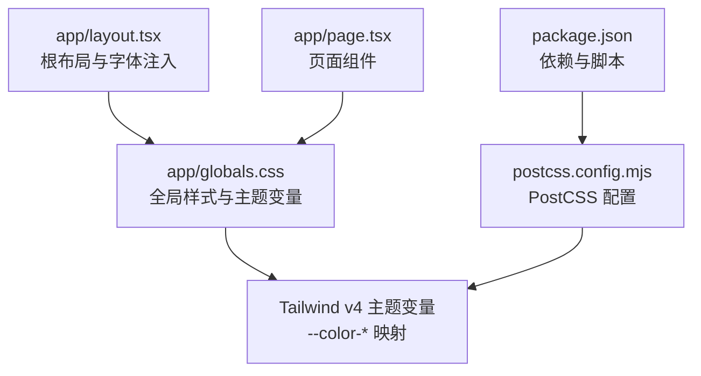
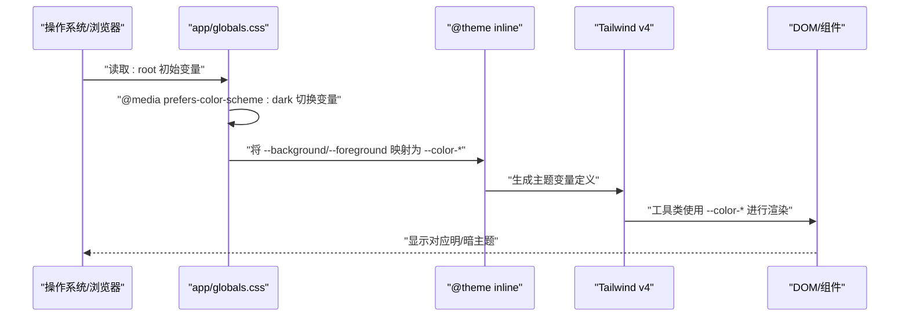
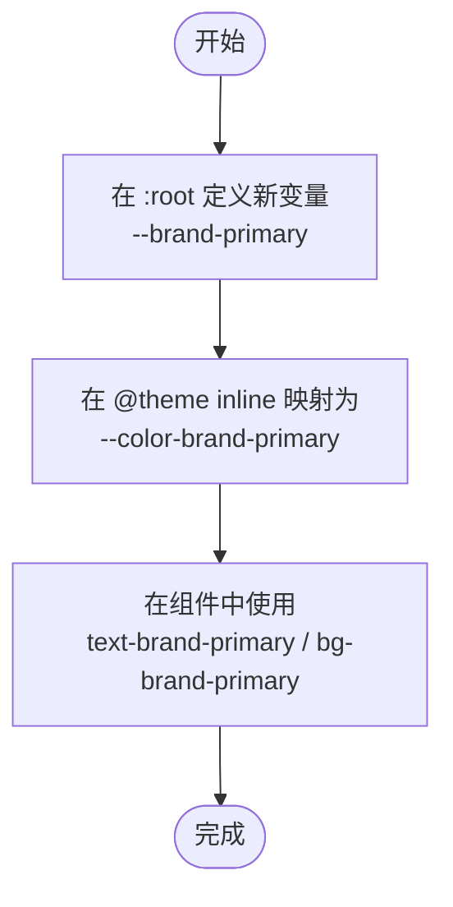
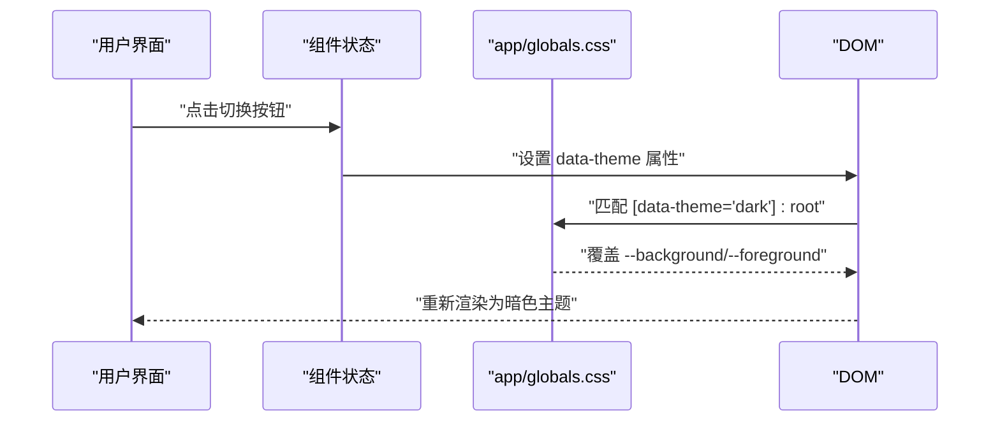
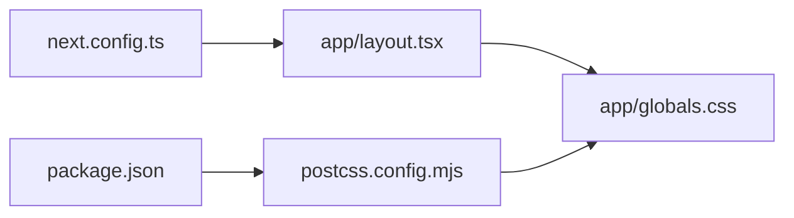

# 暗黑模式实现

<cite>
**本文引用的文件**
- [app/globals.css](file://app/globals.css)
- [app/layout.tsx](file://app/layout.tsx)
- [app/page.tsx](file://app/page.tsx)
- [package.json](file://package.json)
- [next.config.ts](file://next.config.ts)
- [postcss.config.mjs](file://postcss.config.mjs)
</cite>

## 目录
1. [简介](#简介)
2. [项目结构](#项目结构)
3. [核心组件](#核心组件)
4. [架构总览](#架构总览)
5. [详细组件分析](#详细组件分析)
6. [依赖关系分析](#依赖关系分析)
7. [性能考量](#性能考量)
8. [故障排查指南](#故障排查指南)
9. [结论](#结论)
10. [附录](#附录)

## 简介
本文件系统化梳理了本项目的暗黑模式实现机制，围绕基于 CSS 变量的主题系统展开，重点解释：
- 基于 :root 选择器与自定义属性 --background、--foreground 的定义与作用域
- 使用 @media (prefers-color-scheme: dark) 自动检测用户系统偏好并切换主题
- CSS 变量与 Tailwind v4 主题变量的映射关系（--color-background、--color-foreground）
- 在组件中如何使用主题变量进行渲染
- 如何扩展新的主题变量与实现自定义主题切换逻辑
- 渐进增强策略与兼容性注意事项

## 项目结构
该项目采用 Next.js App Router 结构，样式通过全局 CSS 文件集中管理，并结合 Tailwind v4 的 @theme 机制与 PostCSS 插件进行构建。

图表来源
- [app/layout.tsx:1-34](file://app/layout.tsx#L1-L34)
- [app/globals.css:1-27](file://app/globals.css#L1-L27)
- [postcss.config.mjs:1-8](file://postcss.config.mjs#L1-L8)
- [package.json:1-31](file://package.json#L1-L31)

章节来源
- [app/layout.tsx:1-34](file://app/layout.tsx#L1-L34)
- [app/globals.css:1-27](file://app/globals.css#L1-L27)
- [postcss.config.mjs:1-8](file://postcss.config.mjs#L1-L8)
- [package.json:1-31](file://package.json#L1-L31)

## 核心组件
- 全局样式与主题变量：在全局 CSS 中定义 :root 的基础变量，并通过 @media 自动切换暗色方案；同时使用 @theme 将 CSS 变量映射到 Tailwind v4 的主题变量，使 Tailwind 工具类可直接消费这些变量。
- 字体与变量注入：在根布局中将 Google Fonts 注入为 CSS 变量，供 @theme 引用。
- 构建链路：通过 PostCSS 插件将 @theme 转换为实际的 CSS 变量定义，再由 Tailwind 在运行时解析。

章节来源
- [app/globals.css:1-27](file://app/globals.css#L1-L27)
- [app/layout.tsx:1-34](file://app/layout.tsx#L1-L34)
- [postcss.config.mjs:1-8](file://postcss.config.mjs#L1-L8)
- [package.json:1-31](file://package.json#L1-L31)

## 架构总览
下图展示了从用户系统偏好到页面渲染的整体流程，以及 CSS 变量与 Tailwind 主题变量之间的映射关系。

图表来源
- [app/globals.css:3-20](file://app/globals.css#L3-L20)
- [app/globals.css:8-13](file://app/globals.css#L8-L13)

## 详细组件分析

### 1) CSS 变量与 :root 定义
- 在 :root 中定义基础变量 --background 与 --foreground，分别用于背景与前景色。
- 在 @media (prefers-color-scheme: dark) 块中覆盖上述变量，实现自动暗色切换。
- body 使用 var(--background) 与 var(--foreground) 控制整体文本与背景。

章节来源
- [app/globals.css:3-6](file://app/globals.css#L3-L6)
- [app/globals.css:15-20](file://app/globals.css#L15-L20)
- [app/globals.css:22-26](file://app/globals.css#L22-L26)

### 2) @theme 与 Tailwind 主题变量映射
- 使用 @theme inline 将 CSS 变量映射为 Tailwind v4 的主题变量，如 --color-background 对应 var(--background)，--color-foreground 对应 var(--foreground)。
- 该映射使得 Tailwind 工具类（例如 text-foreground、bg-background）可直接消费这些变量，从而在明/暗主题下自动切换。

章节来源
- [app/globals.css:8-13](file://app/globals.css#L8-L13)

### 3) 用户偏好检测与媒体查询
- 通过 @media (prefers-color-scheme: dark) 自动检测用户系统偏好。
- 当系统处于深色模式时，:root 中的 --background 与 --foreground 会被覆盖为暗色值；反之则使用默认浅色值。
- 该机制无需任何 JavaScript 即可生效，具备良好的渐进增强特性。

章节来源
- [app/globals.css:15-20](file://app/globals.css#L15-L20)

### 4) 字体变量注入与 @theme 引用
- 在根布局中将 Google Fonts 注入为 CSS 变量（如 --font-geist-sans、--font-geist-mono），并在 @theme 中引用，确保字体族变量也能参与主题系统。
- 该做法保证了字体变量与颜色变量在同一主题体系内统一管理。

章节来源
- [app/layout.tsx:5-13](file://app/layout.tsx#L5-L13)
- [app/globals.css:8-13](file://app/globals.css#L8-L13)

### 5) 组件中的主题变量使用
- 页面组件通过 Tailwind 工具类使用主题变量，例如 text-foreground、bg-background 等，这些类最终解析为 --color-* 变量。
- 由于 @theme 已将 CSS 变量映射为 Tailwind 主题变量，因此组件无需关心底层 CSS 变量名，只需使用语义化的工具类即可。

章节来源
- [app/page.tsx:27-44](file://app/page.tsx#L27-L44)
- [app/page.tsx:48-54](file://app/page.tsx#L48-L54)
- [app/page.tsx:58-67](file://app/page.tsx#L58-L67)

### 6) 构建链路与 PostCSS 配置
- 通过 @tailwindcss/postcss 插件启用 Tailwind v4 的 @theme 与 @layer 等新特性。
- package.json 中声明 tailwindcss 与相关开发依赖，确保构建时正确处理 @theme 语法。

章节来源
- [postcss.config.mjs:1-8](file://postcss.config.mjs#L1-L8)
- [package.json:20-29](file://package.json#L20-L29)

### 7) 添加新的主题变量
- 在 :root 中新增自定义属性，例如 --brand-primary。
- 在 @theme inline 中将其映射为 --color-brand-primary。
- 在组件中使用对应的 Tailwind 工具类（如 text-brand-primary、bg-brand-primary）进行消费。

图表来源
- [app/globals.css:3-6](file://app/globals.css#L3-L6)
- [app/globals.css:8-13](file://app/globals.css#L8-L13)

### 8) 实现自定义主题切换逻辑
- 在组件层引入状态（如 useState）保存当前主题（light/dark/custom）。
- 通过为 html 或根元素设置特定类（如 data-theme="dark"），配合 CSS 选择器（如 [data-theme="dark"] :root）覆盖变量值。
- 为保持与系统偏好的一致性，可在切换后仍保留 @media 规则作为后备。

图表来源
- [app/globals.css:3-6](file://app/globals.css#L3-L6)
- [app/globals.css:15-20](file://app/globals.css#L15-L20)

## 依赖关系分析
- app/layout.tsx 依赖 next/font/google 注入字体变量，供 @theme 引用。
- app/globals.css 依赖 Tailwind v4 的 @theme 与 @layer 语法，需通过 PostCSS 插件处理。
- package.json 声明 tailwindcss 与 @tailwindcss/postcss，确保构建链路可用。
- next.config.ts 作为 Next.js 配置入口，当前未做特殊改动。

图表来源
- [app/layout.tsx:1-34](file://app/layout.tsx#L1-L34)
- [app/globals.css:1-27](file://app/globals.css#L1-L27)
- [postcss.config.mjs:1-8](file://postcss.config.mjs#L1-L8)
- [package.json:1-31](file://package.json#L1-L31)
- [next.config.ts:1-8](file://next.config.ts#L1-L8)

章节来源
- [app/layout.tsx:1-34](file://app/layout.tsx#L1-L34)
- [app/globals.css:1-27](file://app/globals.css#L1-L27)
- [postcss.config.mjs:1-8](file://postcss.config.mjs#L1-L8)
- [package.json:1-31](file://package.json#L1-L31)
- [next.config.ts:1-8](file://next.config.ts#L1-L8)

## 性能考量
- 使用 CSS 变量与 @media 自动切换，避免 JavaScript 干预，减少首屏渲染阻塞。
- Tailwind v4 的 @theme 在构建期转换为静态 CSS 变量，运行时解析成本低。
- 建议仅在必要时引入自定义变量，避免过度拆分主题变量导致体积膨胀。

## 故障排查指南
- 暗色模式不生效
  - 检查是否正确引入 @tailwindcss/postcss 插件与 Tailwind v4 版本。
  - 确认 @theme 语法未被其他 PostCSS 规则破坏。
  - 验证 @media (prefers-color-scheme: dark) 是否被浏览器支持。
- 主题变量未被 Tailwind 工具类识别
  - 确保在 @theme inline 中已将 CSS 变量映射为 --color-*。
  - 检查工具类命名是否与映射一致（如 text-foreground、bg-background）。
- 字体变量未生效
  - 确认根布局中已注入字体变量（如 --font-geist-sans）。
  - 检查 @theme 中是否引用了正确的变量名。

章节来源
- [postcss.config.mjs:1-8](file://postcss.config.mjs#L1-L8)
- [app/globals.css:8-13](file://app/globals.css#L8-L13)
- [app/layout.tsx:5-13](file://app/layout.tsx#L5-L13)

## 结论
本项目以最小的改动实现了完整的暗黑模式：通过 :root 与 @media 的组合实现系统偏好检测，借助 @theme 将 CSS 变量无缝映射至 Tailwind v4 主题变量，使组件层仅需使用语义化工具类即可获得一致的主题体验。该方案具备良好的渐进增强与兼容性，适合在生产环境中稳定使用。若需进一步扩展，建议遵循“先在 :root 定义变量，再在 @theme 映射”的流程，确保主题系统的统一与可维护性。

## 附录
- 术语说明
  - CSS 变量：以 -- 开头的自定义属性，可在整个文档树中使用 var() 引用。
  - @theme：Tailwind v4 的主题变量声明机制，允许将 CSS 变量映射为 --color-* 等主题变量。
  - prefers-color-scheme：媒体查询，用于检测用户系统是否处于深色模式。
- 扩展清单
  - 新增变量：在 :root 定义 --new-color，然后在 @theme inline 中映射为 --color-new-color。
  - 自定义切换：为 html 或根元素添加 data-theme 属性，配合选择器覆盖 :root 变量。
  - 字体变量：在根布局注入字体变量，并在 @theme 中引用。