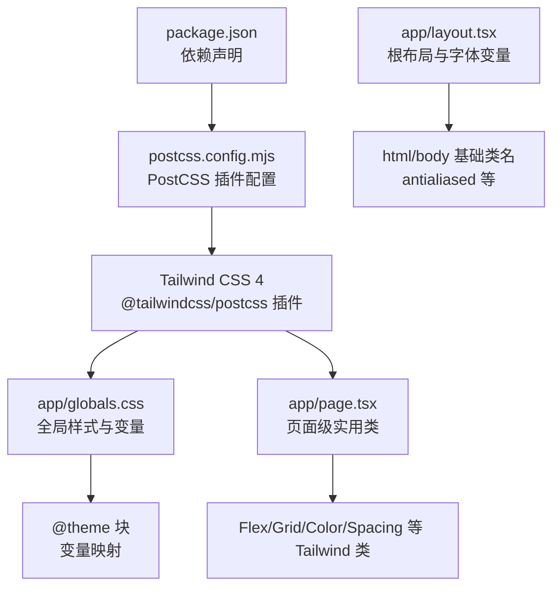
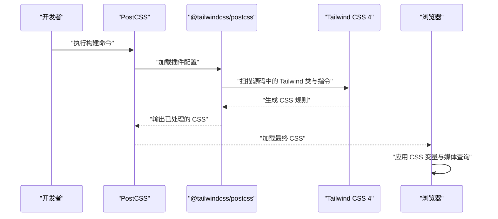
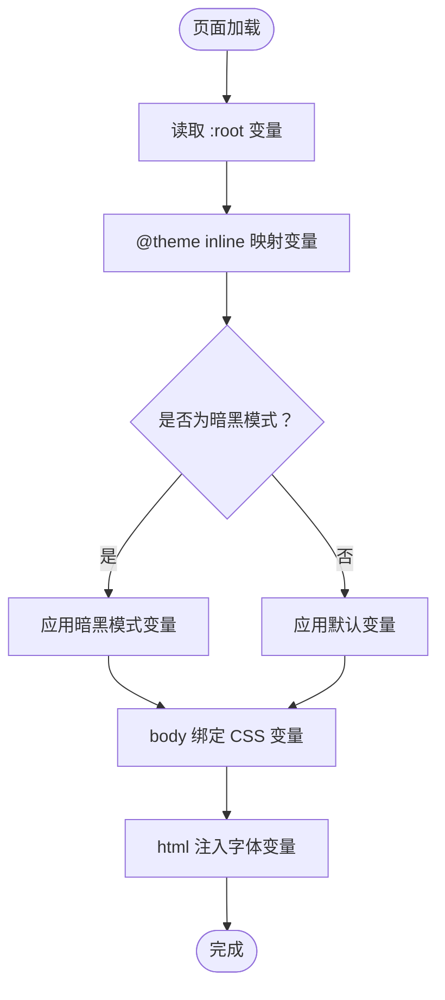
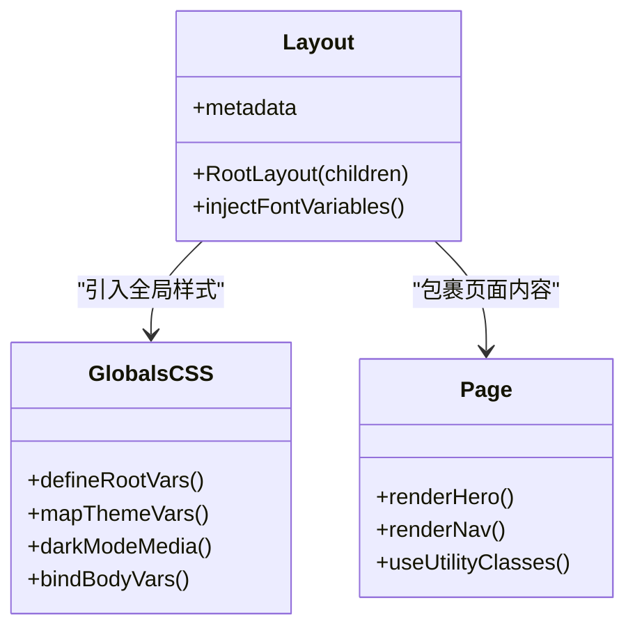
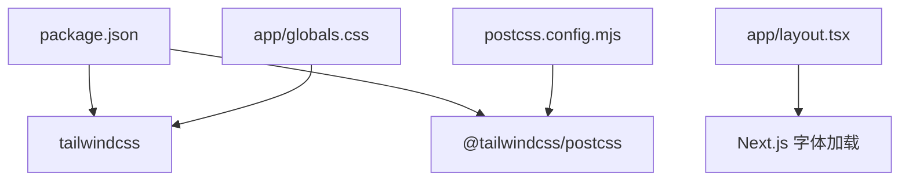

# 样式系统

<cite>
**本文引用的文件**
- [package.json](file://package.json)
- [postcss.config.mjs](file://postcss.config.mjs)
- [app/globals.css](file://app/globals.css)
- [app/layout.tsx](file://app/layout.tsx)
- [app/page.tsx](file://app/page.tsx)
- [next.config.ts](file://next.config.ts)
</cite>

## 目录
1. [简介](#简介)
2. [项目结构](#项目结构)
3. [核心组件](#核心组件)
4. [架构总览](#架构总览)
5. [详细组件分析](#详细组件分析)
6. [依赖分析](#依赖分析)
7. [性能考虑](#性能考虑)
8. [故障排查指南](#故障排查指南)
9. [结论](#结论)
10. [附录](#附录)

## 简介
本项目采用实用优先的 CSS 框架 Tailwind CSS 4，并通过 PostCSS 插件链进行构建时处理。样式系统以 CSS 变量为主题核心，结合媒体查询实现暗黑模式自动切换；同时通过 Next.js 字体加载与 Tailwind 实用类组合，形成简洁、可维护且高性能的前端样式体系。本文档将从架构、组件、数据流、处理逻辑、集成点、错误处理与性能特性等维度，系统性解析该项目的样式系统，并提供最佳实践与优化建议。

## 项目结构
项目采用 Next.js App Router 结构，样式相关的关键文件集中在 app 目录与根目录配置中：
- app/globals.css：全局样式入口，定义 CSS 变量、@theme 块与暗黑模式媒体查询。
- app/layout.tsx：根布局，引入字体变量与全局样式，设置 html/body 基础类名。
- app/page.tsx：页面级样式示例，大量使用 Tailwind 实用类。
- postcss.config.mjs：PostCSS 插件配置，启用 @tailwindcss/postcss。
- package.json：声明 tailwindcss 与 @tailwindcss/postcss 依赖。
- next.config.ts：Next.js 构建配置（当前为空配置）。

图表来源
- [package.json:15-29](file://package.json#L15-L29)
- [postcss.config.mjs:1-8](file://postcss.config.mjs#L1-L8)
- [app/globals.css:1-27](file://app/globals.css#L1-L27)
- [app/layout.tsx:1-34](file://app/layout.tsx#L1-L34)
- [app/page.tsx:1-72](file://app/page.tsx#L1-L72)

章节来源
- [package.json:1-31](file://package.json#L1-L31)
- [postcss.config.mjs:1-8](file://postcss.config.mjs#L1-L8)
- [app/globals.css:1-27](file://app/globals.css#L1-L27)
- [app/layout.tsx:1-34](file://app/layout.tsx#L1-L34)
- [app/page.tsx:1-72](file://app/page.tsx#L1-L72)
- [next.config.ts:1-8](file://next.config.ts#L1-L8)

## 核心组件
- 全局样式与变量层
  - 在 app/globals.css 中通过 :root 定义背景与前景色变量，并在 @theme inline 块中将变量映射到 Tailwind 主题变量，使 Tailwind 能识别并生成对应工具类。
  - 使用 prefers-color-scheme: dark 媒体查询在暗黑模式下自动切换变量值，实现“暗黑模式”的自动适配。
  - 在 body 上直接使用 CSS 变量绑定背景与文字颜色，确保基础视觉一致性。
- 字体与排版层
  - 在 app/layout.tsx 中通过 next/font/google 加载 Geist 与 Geist Mono 字体，并将字体变量注入到 html 元素上，供 @theme 与 Tailwind 使用。
- 页面级样式层
  - 在 app/page.tsx 中广泛使用 Tailwind 实用类，如 flex、bg、text、drop-shadow、backdrop-blur 等，体现实用优先的设计思想。
- 构建与插件层
  - 通过 postcss.config.mjs 启用 @tailwindcss/postcss 插件，使 Tailwind 在构建阶段扫描并生成所需样式。
  - package.json 中声明 tailwindcss 与 @tailwindcss/postcss，确保版本兼容与功能可用。

章节来源
- [app/globals.css:1-27](file://app/globals.css#L1-L27)
- [app/layout.tsx:1-34](file://app/layout.tsx#L1-L34)
- [app/page.tsx:1-72](file://app/page.tsx#L1-L72)
- [postcss.config.mjs:1-8](file://postcss.config.mjs#L1-L8)
- [package.json:15-29](file://package.json#L15-L29)

## 架构总览
Tailwind CSS 4 在本项目中的工作流程如下：
- 开发/构建阶段：PostCSS 读取 postcss.config.mjs，加载 @tailwindcss/postcss 插件。
- 插件处理：插件扫描源码中的 Tailwind 类名与 @apply、@theme 等指令，生成对应的 CSS 规则。
- 运行时：浏览器加载由插件生成的 CSS，应用到页面元素上；CSS 变量与媒体查询驱动主题切换与字体渲染。

图表来源
- [postcss.config.mjs:1-8](file://postcss.config.mjs#L1-L8)
- [package.json:21-27](file://package.json#L21-L27)
- [app/globals.css:1-27](file://app/globals.css#L1-L27)

## 详细组件分析

### 全局样式与变量系统
- 变量定义与映射
  - 在 :root 中定义 --background 与 --foreground，用于控制整体背景与文字颜色。
  - 在 @theme inline 块中将 --color-background、--color-foreground、--font-sans、--font-mono 映射到上述变量，使 Tailwind 能识别这些主题变量并生成对应工具类。
- 暗黑模式机制
  - 使用 @media (prefers-color-scheme: dark) 在暗黑模式下重写 :root 中的颜色变量，从而在不改变类名的情况下自动切换主题。
- 基础样式绑定
  - 在 body 上直接使用 CSS 变量绑定背景与文字颜色，确保基础视觉一致。
- 字体变量注入
  - 在 app/layout.tsx 中将 Geist 与 Geist Mono 的字体变量注入到 html 元素上，供 @theme 与 Tailwind 使用。

图表来源
- [app/globals.css:1-27](file://app/globals.css#L1-L27)
- [app/layout.tsx:5-13](file://app/layout.tsx#L5-L13)

章节来源
- [app/globals.css:1-27](file://app/globals.css#L1-L27)
- [app/layout.tsx:1-34](file://app/layout.tsx#L1-L34)

### 字体与排版系统
- 字体加载
  - 使用 next/font/google 动态加载 Geist 与 Geist Mono 字体，并通过 variable 属性将字体变量注入到 html 元素上。
- 排版与主题变量
  - 将字体变量映射到 @theme 的 --font-sans 与 --font-mono，使 Tailwind 的字体工具类生效。
- 页面排版示例
  - 在 app/page.tsx 中使用 flex、text、drop-shadow 等实用类进行布局与视觉增强。

图表来源
- [app/layout.tsx:1-34](file://app/layout.tsx#L1-L34)
- [app/globals.css:1-27](file://app/globals.css#L1-L27)
- [app/page.tsx:1-72](file://app/page.tsx#L1-L72)

章节来源
- [app/layout.tsx:1-34](file://app/layout.tsx#L1-L34)
- [app/page.tsx:1-72](file://app/page.tsx#L1-L72)

### 响应式设计与移动端优先
- 移动端优先策略
  - 在 app/page.tsx 中，标题与段落文本在移动端使用较小字号，在中等及以上屏幕使用较大字号，体现移动优先的设计理念。
- 实用类响应式前缀
  - 使用 md: 前缀在不同断点下调整文本大小与布局，确保在小屏设备上的可读性与可用性。
- Flex 布局与间距
  - 通过 flex、gap、px/py 等实用类实现灵活的响应式布局，避免编写复杂 CSS。

章节来源
- [app/page.tsx:47-54](file://app/page.tsx#L47-L54)

### 主题切换机制（基于 CSS 变量）
- 自动切换
  - 通过 @media (prefers-color-scheme: dark) 在系统偏好为暗黑模式时自动切换 :root 中的颜色变量，无需手动干预。
- 手动切换（扩展建议）
  - 若需支持用户手动切换，可在 html 或根元素上添加 data-theme 属性，并通过 CSS 选择器或 JS 切换该属性值，再配合 CSS 变量与 @theme 块实现主题切换。

章节来源
- [app/globals.css:15-20](file://app/globals.css#L15-L20)

### PostCSS 集成与 Tailwind 处理流程
- 插件配置
  - postcss.config.mjs 中仅启用 @tailwindcss/postcss 插件，确保在构建阶段扫描并生成 Tailwind 样式。
- 依赖声明
  - package.json 中声明 tailwindcss 与 @tailwindcss/postcss，保证版本兼容与功能可用。
- 构建产物
  - 构建后生成的 CSS 文件包含由插件处理后的 Tailwind 工具类与变量映射规则。

章节来源
- [postcss.config.mjs:1-8](file://postcss.config.mjs#L1-L8)
- [package.json:21-27](file://package.json#L21-L27)

## 依赖分析
- 直接依赖
  - tailwindcss：提供实用优先的 CSS 框架能力。
  - @tailwindcss/postcss：作为 PostCSS 插件，负责在构建阶段扫描与生成样式。
- 间接依赖
  - next：Next.js 提供字体加载与构建环境，与 Tailwind 协同工作。
- 版本关系
  - package.json 明确声明了 tailwindcss 与 @tailwindcss/postcss 的版本范围，确保与 Next.js 16.x 生态兼容。

图表来源
- [package.json:15-29](file://package.json#L15-L29)
- [postcss.config.mjs:1-8](file://postcss.config.mjs#L1-L8)
- [app/layout.tsx:1-34](file://app/layout.tsx#L1-L34)
- [app/globals.css:1-27](file://app/globals.css#L1-L27)

章节来源
- [package.json:15-29](file://package.json#L15-L29)
- [postcss.config.mjs:1-8](file://postcss.config.mjs#L1-L8)
- [app/layout.tsx:1-34](file://app/layout.tsx#L1-L34)
- [app/globals.css:1-27](file://app/globals.css#L1-L27)

## 性能考虑
- 构建体积优化
  - 仅启用 @tailwindcss/postcss 插件，减少不必要的 PostCSS 步骤，降低构建时间与产物体积。
  - 使用 next/font/google 动态加载字体，避免全量字体资源，提升首屏性能。
- 运行时性能
  - CSS 变量与媒体查询的使用避免了运行时 JavaScript 主题切换开销，提升交互流畅度。
  - Tailwind 实用类按需生成，减少冗余样式。
- 建议
  - 对于需要用户手动切换主题的场景，建议通过 data-theme 属性与 CSS 变量组合实现，避免频繁重排与重绘。
  - 在大型页面中，合理拆分样式模块，避免单个 CSS 文件过大。

## 故障排查指南
- 样式未生效
  - 检查 app/layout.tsx 是否正确引入 app/globals.css。
  - 确认 postcss.config.mjs 中 @tailwindcss/postcss 插件已启用。
  - 验证 package.json 中 tailwindcss 与 @tailwindcss/postcss 的版本是否匹配。
- 暗黑模式不生效
  - 确认系统偏好设置为暗黑模式，或检查 @media (prefers-color-scheme: dark) 是否被覆盖。
  - 检查 :root 中的颜色变量是否被其他样式覆盖。
- 字体未加载
  - 确认 next/font/google 的变量注入是否正确，以及 html 元素上是否包含字体变量类名。
- 构建失败
  - 清理 node_modules 并重新安装依赖，确保版本兼容。
  - 检查 PostCSS 插件链是否正确配置。

章节来源
- [app/layout.tsx:1-34](file://app/layout.tsx#L1-L34)
- [app/globals.css:1-27](file://app/globals.css#L1-L27)
- [postcss.config.mjs:1-8](file://postcss.config.mjs#L1-L8)
- [package.json:15-29](file://package.json#L15-L29)

## 结论
本项目以 Tailwind CSS 4 为核心，结合 PostCSS 插件链与 CSS 变量系统，实现了简洁、可维护且高性能的样式架构。通过 @theme 块与变量映射，Tailwind 能够识别并生成主题工具类；通过媒体查询实现暗黑模式自动切换；通过 next/font/google 与实用类实现响应式排版与布局。整体方案遵循实用优先与移动端优先的设计原则，适合快速迭代与规模化开发。

## 附录
- 最佳实践
  - 使用 @theme 块集中管理主题变量，避免分散的 CSS 变量定义。
  - 在 app/layout.tsx 中统一注入字体变量，确保全局一致性。
  - 在页面组件中优先使用 Tailwind 实用类，减少自定义 CSS。
  - 对于需要用户手动切换主题的场景，建议通过 data-theme 属性与 CSS 变量组合实现。
- 性能优化建议
  - 控制 Tailwind 工具类的使用数量，避免生成过多未使用的样式。
  - 使用 next/font/google 动态加载字体，减少首屏阻塞。
  - 在大型项目中拆分样式模块，提升构建与缓存效率。