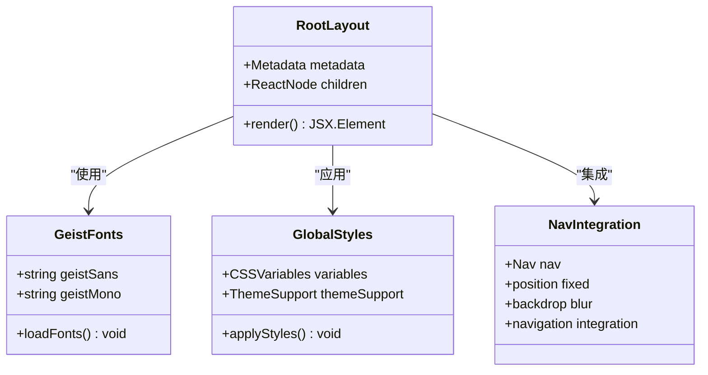
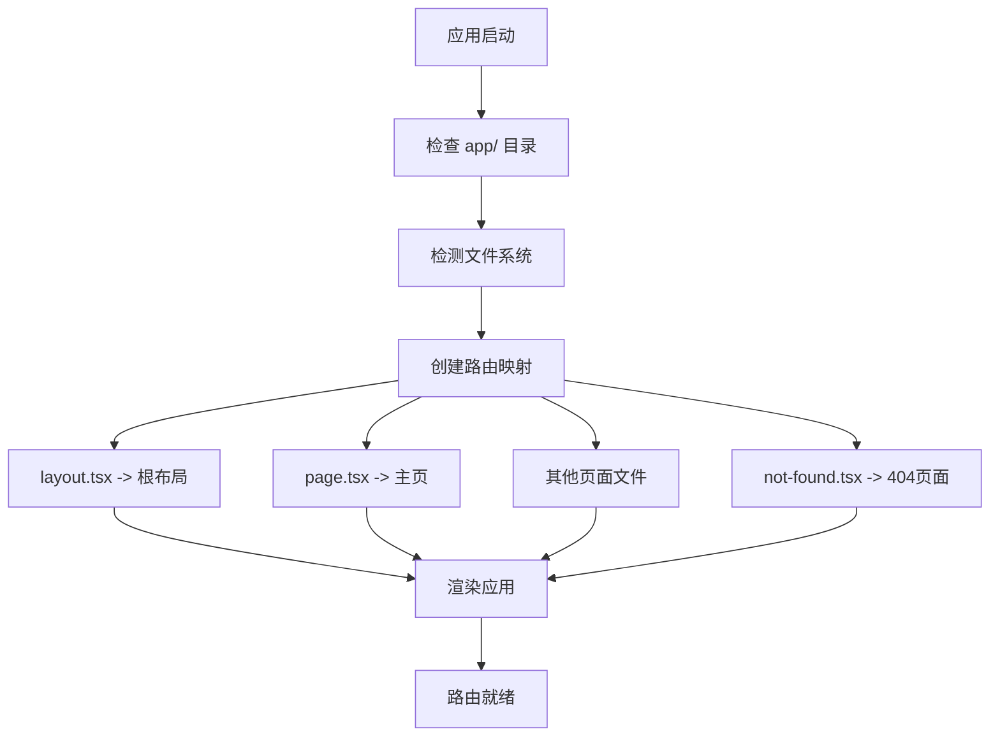
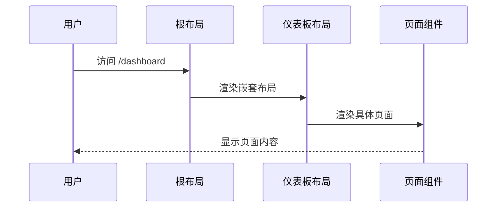

# App Router 使用

<cite>
**本文档引用的文件**
- [app/layout.tsx](file://app/layout.tsx)
- [app/page.tsx](file://app/page.tsx)
- [app/not-found.tsx](file://app/not-found.tsx)
- [app/articles/page.tsx](file://app/articles/page.tsx)
- [app/life/page.tsx](file://app/life/page.tsx)
- [app/misc/page.tsx](file://app/misc/page.tsx)
- [app/photography/page.tsx](file://app/photography/page.tsx)
- [app/social/page.tsx](file://app/social/page.tsx)
- [app/globals.css](file://app/globals.css)
- [component/index.ts](file://component/index.ts)
- [component/Nav/index.tsx](file://component/Nav/index.tsx)
- [component/BackgroundImg/index.tsx](file://component/BackgroundImg/index.tsx)
- [component/PageHeader/index.tsx](file://component/PageHeader/index.tsx)
- [next.config.ts](file://next.config.ts)
- [package.json](file://package.json)
- [tsconfig.json](file://tsconfig.json)
- [README.md](file://README.md)
</cite>

## 目录
1. [简介](#简介)
2. [项目结构](#项目结构)
3. [核心组件](#核心组件)
4. [架构概览](#架构概览)
5. [详细组件分析](#详细组件分析)
6. [路由系统详解](#路由系统详解)
7. [服务端与客户端组件](#服务端与客户端组件)
8. [性能考虑](#性能考虑)
9. [故障排除指南](#故障排除指南)
10. [结论](#结论)

## 简介

本指南面向 blod 项目，详细介绍 Next.js App Router 的使用方法。该项目采用最新的 App Router 架构，使用文件系统路由和约定式路由来构建现代化的博客应用。通过深入分析根布局组件、页面组件以及路由系统，帮助开发者理解和扩展这个基于 Next.js 的个人博客平台。

**更新** 新增导航系统、页面组件库和404页面的详细实现分析

## 项目结构

blod 项目遵循 Next.js App Router 的标准目录结构，主要包含以下关键文件：

```mermaid
graph TB
subgraph "应用根目录"
APP[app/]
COMPONENT[component/]
PUBLIC[public/]
CONFIG[next.config.ts]
PACKAGE[package.json]
TS[tsconfig.json]
README[README.md]
end
subgraph "App Router 核心"
LAYOUT[layout.tsx<br/>根布局组件]
PAGE[page.tsx<br/>主页组件]
NOT_FOUND[not-found.tsx<br/>404页面]
GLOBALS[globals.css<br/>全局样式]
end
subgraph "组件库"
NAV[Nav<br/>导航组件]
BACKGROUND_IMG[BackgroundImg<br/>背景图组件]
PAGE_HEADER[PageHeader<br/>页面头部组件]
COMPONENT_INDEX[component/index.ts<br/>组件导出]
end
subgraph "页面路由"
ARTICLES[articles/page.tsx<br/>文章页面]
LIFE[life/page.tsx<br/>人生页面]
MISC[misc/page.tsx<br/>杂烩页面]
PHOTOGRAPHY[photography/page.tsx<br/>摄影页面]
SOCIAL[social/page.tsx<br/>社交页面]
end
APP --> LAYOUT
APP --> PAGE
APP --> NOT_FOUND
APP --> GLOBALS
COMPONENT --> NAV
COMPONENT --> BACKGROUND_IMG
COMPONENT --> PAGE_HEADER
COMPONENT_INDEX --> NAV
COMPONENT_INDEX --> BACKGROUND_IMG
COMPONENT_INDEX --> PAGE_HEADER
ARTICLES --> PAGE_HEADER
LIFE --> PAGE_HEADER
MISC --> PAGE_HEADER
PHOTOGRAPHY --> PAGE_HEADER
SOCIAL --> PAGE_HEADER
```



**图表来源**
- [app/layout.tsx:1-38](file://app/layout.tsx#L1-L38)
- [app/page.tsx:1-36](file://app/page.tsx#L1-L36)
- [app/not-found.tsx:1-17](file://app/not-found.tsx#L1-L17)
- [component/index.ts:1-6](file://component/index.ts#L1-L6)
- [component/Nav/index.tsx:1-46](file://component/Nav/index.tsx#L1-L46)
- [component/BackgroundImg/index.tsx:1-17](file://component/BackgroundImg/index.tsx#L1-L17)
- [component/PageHeader/index.tsx:1-25](file://component/PageHeader/index.tsx#L1-L25)

**章节来源**
- [README.md:1-37](file://README.md#L1-L37)
- [package.json:1-31](file://package.json#L1-L31)

## 核心组件

### 根布局组件 (RootLayout)

根布局组件是 App Router 的核心，负责定义整个应用的基础结构和共享资源。它实现了以下关键功能：

- **元数据配置**：设置网站标题和描述
- **字体加载**：集成 Geist 字体系列
- **全局样式应用**：管理主题变量和基础样式
- **HTML 结构封装**：提供完整的 HTML 文档框架
- **导航集成**：在根布局中集成全局导航组件



**图表来源**
- [app/layout.tsx:15-38](file://app/layout.tsx#L15-L38)
- [component/Nav/index.tsx:15-46](file://component/Nav/index.tsx#L15-L46)

**章节来源**
- [app/layout.tsx:15-38](file://app/layout.tsx#L15-L38)

### 页面组件 (Home)

主页组件负责渲染博客应用的主界面，包含导航栏、背景图像和交互元素：

- **导航系统**：六个功能导航项
- **视觉层次**：标题、副标题和品牌标识
- **交互元素**：固定定位的操作按钮
- **响应式设计**：适配不同屏幕尺寸
- **背景图像**：使用 BackgroundImg 组件提供全屏背景

**章节来源**
- [app/page.tsx:1-36](file://app/page.tsx#L1-L36)
- [component/BackgroundImg/index.tsx:1-17](file://component/BackgroundImg/index.tsx#L1-L17)

### 导航组件 (Nav)

导航组件是应用的核心导航系统，提供全局导航功能：

- **路由感知**：使用 `usePathname` 实现活动路由高亮
- **响应式设计**：固定定位，支持移动端适配
- **视觉反馈**：悬停效果和过渡动画
- **品牌标识**：左侧显示博客名称
- **导航项**：六个功能模块的链接

**章节来源**
- [component/Nav/index.tsx:1-46](file://component/Nav/index.tsx#L1-L46)

### 页面头部组件 (PageHeader)

PageHeader 组件提供统一的页面头部设计模式：

- **背景图像**：集成 BackgroundImg 组件
- **标题系统**：支持主标题和副标题
- **响应式布局**：适配不同屏幕尺寸
- **视觉层次**：投影效果和层级管理
- **复用设计**：被多个页面组件复用

**章节来源**
- [component/PageHeader/index.tsx:1-25](file://component/PageHeader/index.tsx#L1-L25)

## 架构概览

blod 项目采用分层架构设计，清晰分离了布局、页面和样式层：

```mermaid
graph TD
subgraph "用户界面层"
NAV[导航栏]
HERO[英雄区域]
ACTIONS[操作按钮]
PAGE_HEADER[页面头部]
END
subgraph "布局层"
ROOT_LAYOUT[根布局组件]
HTML_WRAPPER[HTML 包装器]
END
subgraph "组件层"
BACKGROUND_IMG[背景图像组件]
PAGE_HEADER_COMP[PageHeader组件]
NAV_COMP[Nav组件]
END
subgraph "页面层"
HOME_PAGE[主页]
ARTICLES_PAGE[文章页面]
LIFE_PAGE[人生页面]
MISC_PAGE[杂烩页面]
PHOTOGRAPHY_PAGE[摄影页面]
SOCIAL_PAGE[社交页面]
END
subgraph "样式层"
GLOBAL_CSS[全局样式]
TAILWIND_CSS[Tailwind 集成]
FONT_VARIABLES[字体变量]
END
subgraph "配置层"
NEXT_CONFIG[Next.js 配置]
TS_CONFIG[TypeScript 配置]
PACKAGE_JSON[包配置]
END
NAV --> ROOT_LAYOUT
HERO --> HOME_PAGE
ACTIONS --> HOME_PAGE
PAGE_HEADER --> ARTICLES_PAGE
PAGE_HEADER --> LIFE_PAGE
PAGE_HEADER --> MISC_PAGE
PAGE_HEADER --> PHOTOGRAPHY_PAGE
PAGE_HEADER --> SOCIAL_PAGE
ROOT_LAYOUT --> HTML_WRAPPER
BACKGROUND_IMG --> PAGE_HEADER_COMP
BACKGROUND_IMG --> HOME_PAGE
NAV_COMP --> ROOT_LAYOUT
GLOBAL_CSS --> TAILWIND_CSS
TAILWIND_CSS --> FONT_VARIABLES
NEXT_CONFIG --> ROOT_LAYOUT
TS_CONFIG --> ROOT_LAYOUT
PACKAGE_JSON --> NEXT_CONFIG
```

**图表来源**
- [app/layout.tsx:21-38](file://app/layout.tsx#L21-L38)
- [app/page.tsx:4-36](file://app/page.tsx#L4-L36)
- [component/Nav/index.tsx:15-46](file://component/Nav/index.tsx#L15-L46)
- [component/PageHeader/index.tsx:8-25](file://component/PageHeader/index.tsx#L8-L25)
- [component/BackgroundImg/index.tsx:4-17](file://component/BackgroundImg/index.tsx#L4-L17)

## 详细组件分析

### 根布局组件深度解析

根布局组件实现了现代 Web 应用的标准结构模式：

#### 元数据配置
组件通过 `metadata` 导出对象定义了网站的基本信息：
- 网站标题："chagumu's blog"
- 描述："chagumu's personal blog - one Day"

#### 字体系统集成
使用 Next.js 的字体优化功能，集成了 Geist 字体系列：
- `Geist` 用于无衬线字体
- `Geist_Mono` 用于等宽字体
- 通过 CSS 变量实现字体变量注入

#### HTML 结构设计
根布局组件返回完整的 HTML 结构：
- 设置语言属性 (`lang="en"`)
- 应用字体类名
- 包含最小化样式支持

#### 导航集成
在根布局中集成了全局导航组件：
- 固定定位，始终显示在页面顶部
- 使用 backdrop-blur 实现毛玻璃效果
- 支持路由感知的活动状态高亮

**章节来源**
- [app/layout.tsx:15-38](file://app/layout.tsx#L15-L38)

### 主页组件详细分析

主页组件展现了典型的单页应用布局模式：

#### 导航系统设计
导航项数组定义了六个功能模块：
- 首页 (🏠)
- 文章 (📝)
- 杂烩 (🎨)
- 人生路 (🚶)
- 社交 (💬)
- 摄影 (✨)

每个导航项都包含图标和标签，支持悬停效果和过渡动画。

#### 视觉层次结构
- 品牌标识：大号粗体文字显示博客名称
- 副标题：强调性文本描述博客主题
- 背景图像：全屏覆盖的装饰性图片

#### 交互元素布局
右侧固定定位的操作按钮提供了便捷的功能入口，支持悬停状态的颜色变化和过渡效果。

**章节来源**
- [app/page.tsx:1-36](file://app/page.tsx#L1-L36)

### 导航组件深度分析

导航组件实现了现代化的全局导航系统：

#### 路由感知机制
使用 `usePathname` Hook 实现活动路由检测：
- 实时监听路由变化
- 自动高亮当前活动页面
- 提供视觉反馈的导航状态

#### 响应式设计
- 固定定位，确保在滚动时始终可见
- 使用 backdrop-blur 实现半透明效果
- 支持不同屏幕尺寸的适配

#### 导航项管理
导航项数组集中管理所有页面链接：
- 结构化的导航配置
- 易于维护和扩展
- 统一的样式和行为

**章节来源**
- [component/Nav/index.tsx:1-46](file://component/Nav/index.tsx#L1-L46)

### 页面头部组件详细分析

PageHeader 组件提供了统一的页面头部设计模式：

#### 组件接口设计
- `title`: 必填的页面标题
- `subtitle`: 可选的副标题
- 类型安全的 Props 接口

#### 视觉设计模式
- 固定高度的头部区域 (280px)
- 居中对齐的内容布局
- 投影效果增强视觉层次
- 层级管理确保内容在背景之上

#### 复用设计模式
- 被多个页面组件复用
- 统一的设计语言
- 灵活的标题配置
- 背景图像的统一处理

**章节来源**
- [component/PageHeader/index.tsx:1-25](file://component/PageHeader/index.tsx#L1-L25)

### 页面组件库分析

项目实现了完整的页面组件库，每个页面都遵循统一的设计模式：

#### 文章页面 (ArticlesPage)
- 分类标签系统
- 文章列表展示
- 响应式卡片布局
- 丰富的元数据展示

#### 其他页面 (LifePage, MiscPage, PhotographyPage, SocialPage)
- 统一的 PageHeader 使用
- 简洁的内容区域
- 响应式设计支持
- 内容占位符模式

**章节来源**
- [app/articles/page.tsx:1-146](file://app/articles/page.tsx#L1-L146)
- [app/life/page.tsx:1-15](file://app/life/page.tsx#L1-L15)
- [app/misc/page.tsx:1-15](file://app/misc/page.tsx#L1-L15)
- [app/photography/page.tsx:1-15](file://app/photography/page.tsx#L1-L15)
- [app/social/page.tsx:1-15](file://app/social/page.tsx#L1-L15)

## 路由系统详解

### 文件系统路由机制

Next.js App Router 采用约定式路由，根据文件系统结构自动创建路由：



**图表来源**
- [app/layout.tsx:21-38](file://app/layout.tsx#L21-L38)
- [app/page.tsx:4-36](file://app/page.tsx#L4-L36)
- [app/not-found.tsx:2-16](file://app/not-found.tsx#L2-L16)

### 动态路由实现

虽然当前项目使用静态路由，但 Next.js 支持多种动态路由模式：

#### 参数化路由
通过方括号语法创建可变路由段：
- `[id]` - 单个参数
- `[...slug]` - 可选路径参数
- `[[...slug]]` - 可选参数组

#### 嵌套路由结构
支持复杂的嵌套路由层次：
```
app/
├── dashboard/
│   ├── layout.tsx          # 仪表板布局
│   ├── page.tsx           # 仪表板主页
│   ├── users/
│   │   ├── layout.tsx     # 用户子布局
│   │   ├── page.tsx       # 用户列表
│   │   └── [id]/page.tsx  # 单个用户详情
```

### 路由参数传递

在 Next.js 中，路由参数可以通过多种方式访问：

#### 页面级参数
```typescript
// app/users/[id]/page.tsx
export default function UserPage({ params }: { params: { id: string } }) {
  // 使用 params.id 获取用户 ID
}
```

#### 查询参数
```typescript
// 通过 URLSearchParams 访问查询参数
const searchParams = new URLSearchParams(searchParams);
const category = searchParams.get('category');
```

### 嵌套路由实现

嵌套路由通过父子布局组件实现：



**图表来源**
- [app/layout.tsx:21-38](file://app/layout.tsx#L21-L38)

### 404 页面处理

项目实现了专门的 404 页面处理机制：

#### 错误页面设计
- 清晰的错误状态显示 (404)
- 友好的错误信息提示
- 返回首页的导航链接
- 响应式布局适配

#### 用户体验优化
- 大号数字 404 提醒
- 中文错误信息
- 直观的返回导航
- 适当的间距和排版

**章节来源**
- [app/not-found.tsx:1-17](file://app/not-found.tsx#L1-L17)

## 服务端与客户端组件

### 组件类型区分

Next.js App Router 支持两种组件类型：

#### 服务端组件 (Server Components)
- 在服务器端渲染
- 不包含客户端状态
- 更好的 SEO 和性能
- 默认所有组件都是服务端组件

#### 客户端组件 (Client Components)
- 使用 `"use client"` 指令标记
- 在客户端运行
- 支持本地状态和事件处理
- 适用于交互性强的组件

### 使用场景指导

#### 何时使用服务端组件
- 静态内容展示
- 数据获取和预渲染
- SEO 重要的页面
- 不需要客户端交互的组件

#### 何时使用客户端组件
- 表单和输入控件
- 本地状态管理
- 动画和过渡效果
- 浏览器特定功能

### 实现示例

```typescript
// 服务端组件 (默认)
export default function ServerComponent() {
  return <div>服务端渲染内容</div>;
}

// 客户端组件
'use client';
export default function ClientComponent() {
  const [count, setCount] = useState(0);
  return <button onClick={() => setCount(count + 1)}>点击: {count}</button>;
}
```

**章节来源**
- [component/Nav/index.tsx:1](file://component/Nav/index.tsx#L1)
- [app/layout.tsx:21-38](file://app/layout.tsx#L21-L38)
- [app/page.tsx:4-36](file://app/page.tsx#L4-L36)

## 性能考虑

### 字体优化

项目使用 Next.js 内置的字体优化功能：
- 自动内联关键字形
- 预加载字体文件
- 避免 FOIT (Flash of Invisible Text)

### 图像优化

利用 Next.js Image 组件的优势：
- 自动响应式图片
- 格式转换优化
- 懒加载支持
- 性能优先的加载策略

### 样式优化

Tailwind CSS 集成带来的性能提升：
- 按需生成 CSS
- 原子化类名减少重复样式
- 主题变量支持暗色模式

### 组件复用优化

通过组件库实现代码复用：
- 统一的导航组件
- 可复用的页面头部
- 背景图像组件
- 减少重复代码

**章节来源**
- [app/globals.css:1-32](file://app/globals.css#L1-L32)
- [component/BackgroundImg/index.tsx:4-17](file://component/BackgroundImg/index.tsx#L4-L17)
- [component/PageHeader/index.tsx:8-25](file://component/PageHeader/index.tsx#L8-L25)

## 故障排除指南

### 常见问题解决

#### 路由不生效
- 确认文件位于正确的 `app/` 目录下
- 检查文件命名是否符合约定式路由规则
- 验证 `layout.tsx` 和 `page.tsx` 的存在

#### 字体加载问题
- 确保字体导入语句正确
- 检查 CSS 变量是否正确应用
- 验证字体文件的可访问性

#### 样式冲突
- 检查 Tailwind 配置是否正确
- 确认 CSS 优先级设置
- 验证自定义样式的覆盖规则

#### 组件导入问题
- 确认组件路径配置正确
- 检查 `component/index.ts` 导出配置
- 验证相对路径引用

### 开发工具支持

#### TypeScript 类型检查
项目配置了严格的 TypeScript 检查：
- 启用严格模式
- 支持 JSX 编译
- 路径别名配置

#### ESLint 集成
- Next.js 推荐的 ESLint 配置
- TypeScript 支持
- 自动代码格式化

**章节来源**
- [tsconfig.json:1-35](file://tsconfig.json#L1-L35)
- [package.json:20-29](file://package.json#L20-L29)

## 结论

blod 项目展示了 Next.js App Router 的最佳实践，通过清晰的文件系统路由、优化的字体加载和现代化的样式系统，构建了一个高性能的个人博客应用。根布局组件作为应用的基础框架，为整个应用提供了统一的结构和样式基础。

**更新** 新增的组件库架构显著提升了代码的可维护性和复用性。通过 Nav、PageHeader 和 BackgroundImg 组件的模块化设计，项目实现了统一的设计语言和高效的开发流程。

通过深入理解项目中的组件设计模式、路由系统和性能优化策略，开发者可以更好地扩展和维护这个博客平台。无论是添加新页面、实现动态路由，还是优化用户体验，都可以基于现有的架构模式进行开发。

建议在实际开发中：
- 遵循约定式路由的最佳实践
- 合理使用服务端和客户端组件
- 利用 Next.js 的内置优化功能
- 保持代码结构的清晰性和可维护性
- 充分利用组件库实现代码复用
- 注重用户体验的一致性设计