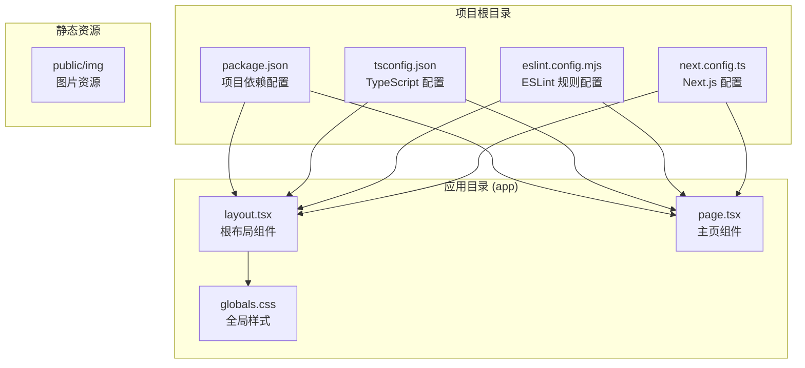
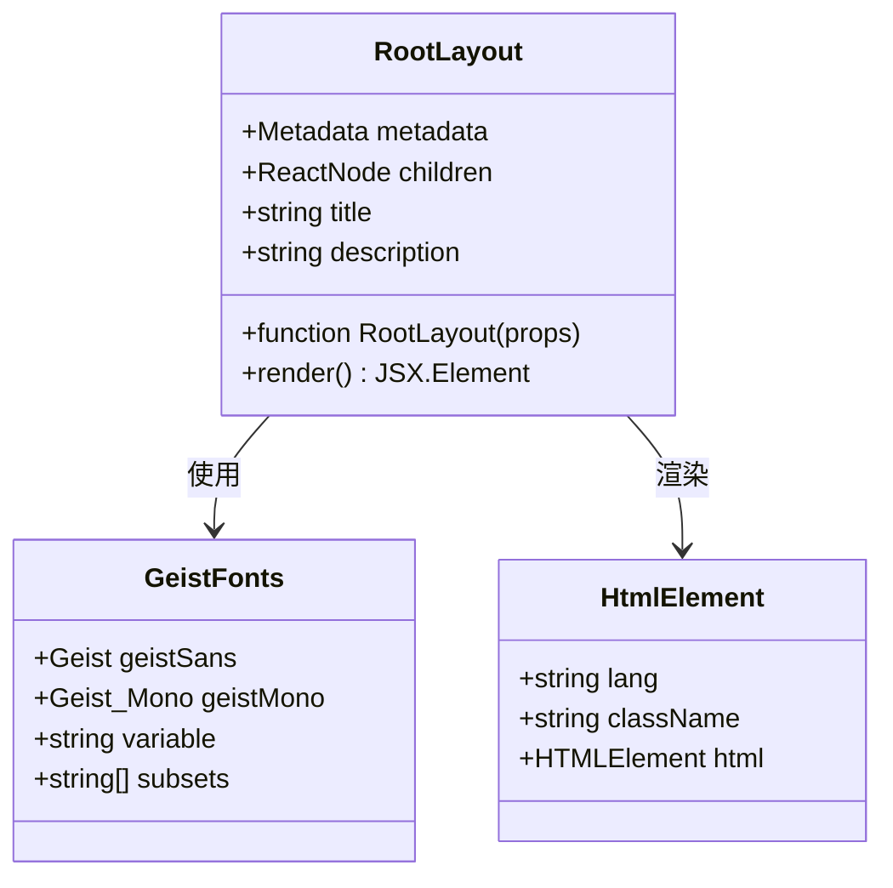
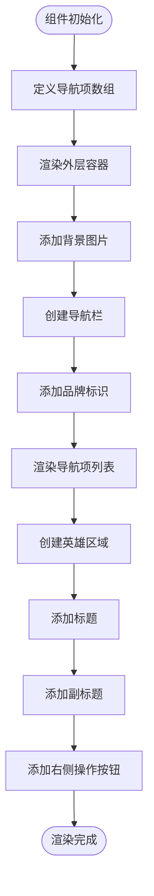
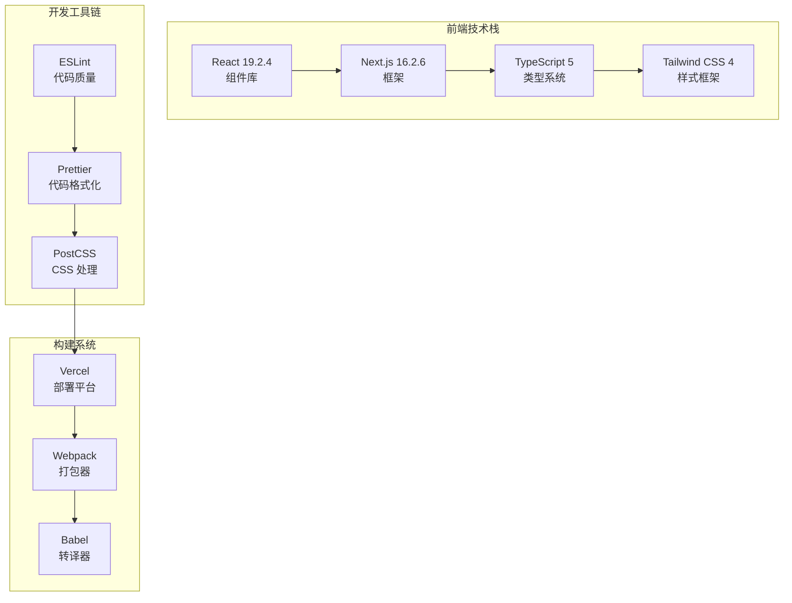
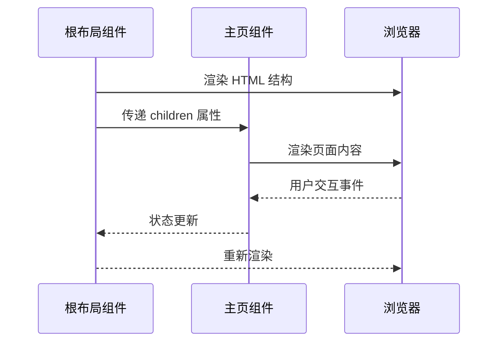
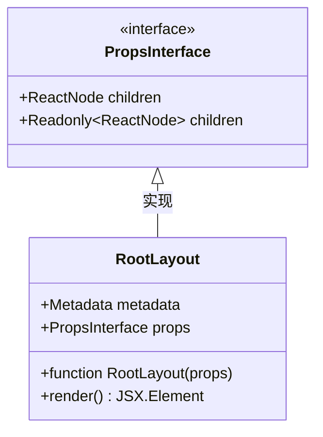
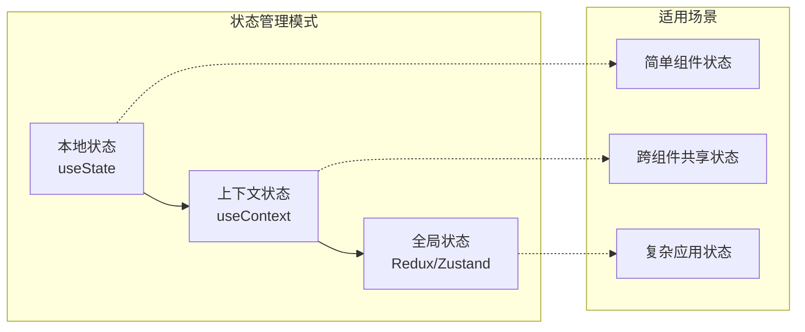
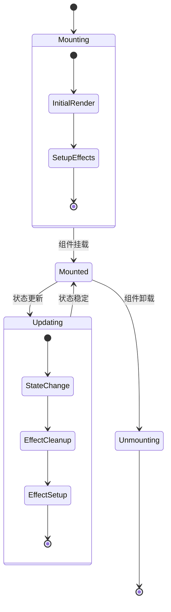
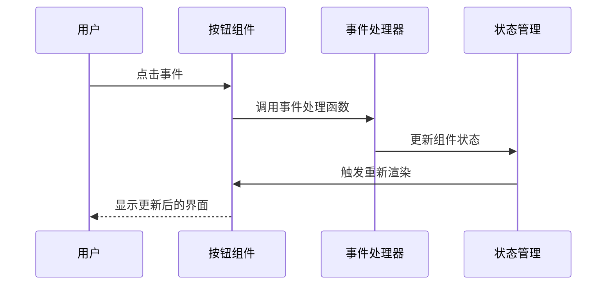
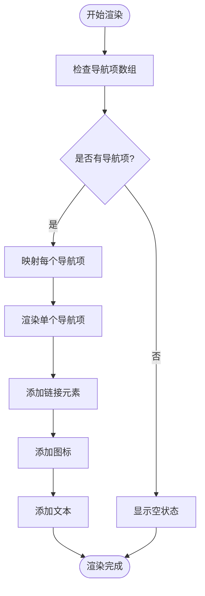

# React 组件基础

<cite>
**本文档引用的文件**
- [README.md](file://README.md)
- [package.json](file://package.json)
- [app/layout.tsx](file://app/layout.tsx)
- [app/page.tsx](file://app/page.tsx)
- [app/globals.css](file://app/globals.css)
- [next.config.ts](file://next.config.ts)
- [tsconfig.json](file://tsconfig.json)
- [eslint.config.mjs](file://eslint.config.mjs)
</cite>

## 目录
1. [简介](#简介)
2. [项目结构](#项目结构)
3. [核心组件](#核心组件)
4. [架构概览](#架构概览)
5. [详细组件分析](#详细组件分析)
6. [依赖关系分析](#依赖关系分析)
7. [性能考虑](#性能考虑)
8. [故障排除指南](#故障排除指南)
9. [结论](#结论)

## 简介

blod 是一个基于 Next.js 16.2.6 构建的个人博客应用，展示了现代 React 组件开发的最佳实践。该项目采用 App Router 架构，使用 TypeScript 进行类型安全编程，并集成了 Tailwind CSS 进行样式管理。通过分析这个项目，我们可以深入理解 React 组件的基础概念、Props 和 State 的使用方法，以及在 Next.js 环境中的实际应用。

## 项目结构

blod 项目遵循 Next.js 的约定式路由结构，主要包含以下关键目录和文件：



**图表来源**
- [package.json:1-31](file://package.json#L1-L31)
- [app/layout.tsx:1-34](file://app/layout.tsx#L1-L34)
- [app/page.tsx:1-72](file://app/page.tsx#L1-L72)

**章节来源**
- [README.md:1-37](file://README.md#L1-L37)
- [package.json:1-31](file://package.json#L1-L31)

## 核心组件

### 根布局组件 (RootLayout)

根布局组件是整个应用的容器，负责定义全局的 HTML 结构和样式上下文：



**图表来源**
- [app/layout.tsx:15-33](file://app/layout.tsx#L15-L33)

该组件展示了以下关键特性：
- **Props 接口定义**：使用 TypeScript 定义 `children` 属性的类型
- **元数据配置**：设置网站标题和描述
- **字体系统集成**：使用 Next.js 字体优化功能
- **CSS 变量支持**：通过 CSS 变量实现主题切换

**章节来源**
- [app/layout.tsx:15-33](file://app/layout.tsx#L15-L33)

### 主页组件 (Home)

主页组件是应用的核心页面，展示了复杂的 UI 布局和交互模式：



**图表来源**
- [app/page.tsx:3-71](file://app/page.tsx#L3-L71)

**章节来源**
- [app/page.tsx:12-71](file://app/page.tsx#L12-L71)

## 架构概览

blod 项目采用现代前端架构，结合了多种最佳实践：



**图表来源**
- [package.json:15-29](file://package.json#L15-L29)
- [tsconfig.json:16-23](file://tsconfig.json#L16-L23)

## 详细组件分析

### 函数组件 vs 类组件

在 blod 项目中，所有组件都采用函数组件的形式，这体现了现代 React 开发的趋势：

#### 函数组件的优势

1. **简洁性**：减少样板代码，提高可读性
2. **Hooks 支持**：可以使用 useState、useEffect 等 Hooks
3. **更好的性能**：避免类组件的性能开销
4. **更易测试**：纯函数更容易进行单元测试

#### 在项目中的应用



**图表来源**
- [app/layout.tsx:20-33](file://app/layout.tsx#L20-L33)
- [app/page.tsx:12-71](file://app/page.tsx#L12-L71)

**章节来源**
- [app/layout.tsx:20-33](file://app/layout.tsx#L20-L33)
- [app/page.tsx:12-71](file://app/page.tsx#L12-L71)

### Props 和 State 的使用

#### Props 的传递和验证

在 blod 项目中，Props 的使用主要体现在根布局组件中：



**图表来源**
- [app/layout.tsx:20-24](file://app/layout.tsx#L20-L24)

#### State 的管理策略

虽然当前项目中没有显式的状态管理，但可以通过以下方式扩展：



### 生命周期方法

在函数组件中，生命周期方法通过 Hooks 来实现：



### 事件处理

blod 项目中的事件处理主要体现在交互元素上：



**图表来源**
- [app/page.tsx:57-68](file://app/page.tsx#L57-L68)

### 条件渲染

条件渲染在导航菜单中得到了很好的体现：



**图表来源**
- [app/page.tsx:32-43](file://app/page.tsx#L32-L43)

**章节来源**
- [app/page.tsx:3-10](file://app/page.tsx#L3-L10)
- [app/page.tsx:32-43](file://app/page.tsx#L32-L43)

## 依赖关系分析

### 核心依赖关系

```mermaid
graph TB
subgraph "运行时依赖"
A[react@19.2.4]
B[react-dom@19.2.4]
C[next@16.2.6]
end
subgraph "开发时依赖"
D[@types/react@19]
E[@types/react-dom@19]
F[typescript@5]
G[tailwindcss@4]
H[eslint-config-next@16.2.6]
end
subgraph "构建工具"
I[webpack]
J[postcss]
K[eslint]
end
A --> B
C --> A
C --> B
F --> A
G --> J
H --> K
I --> C
J --> G
K --> H
```

**图表来源**
- [package.json:15-29](file://package.json#L15-L29)

### TypeScript 配置分析

项目使用了严格的 TypeScript 配置来确保代码质量：

| 配置选项 | 值 | 作用 |
|---------|-----|------|
| target | ES2017 | 编译目标版本 |
| strict | true | 启用严格模式 |
| jsx | react-jsx | JSX 编译选项 |
| moduleResolution | bundler | 模块解析策略 |
| esModuleInterop | true | ES 模块互操作 |

**章节来源**
- [package.json:15-29](file://package.json#L15-L29)
- [tsconfig.json:2-24](file://tsconfig.json#L2-L24)

## 性能考虑

### 代码分割和懒加载


### 样式优化

项目采用了 Tailwind CSS 的原子化样式系统，具有以下优势：

1. **按需生成**：只生成使用的样式类
2. **响应式设计**：内置响应式断点
3. **主题定制**：支持 CSS 变量和暗色模式

**章节来源**
- [app/globals.css:1-27](file://app/globals.css#L1-L27)

## 故障排除指南

### 常见问题及解决方案

#### TypeScript 类型错误

当遇到 TypeScript 类型错误时，可以检查以下配置：

1. **确保正确的模块解析**：检查 `moduleResolution` 设置
2. **验证路径映射**：确认 `@/*` 路径别名配置
3. **检查 JSX 配置**：确保 `jsx` 选项设置为 `react-jsx`

#### ESLint 规则冲突

项目使用了 ESLint 的 Next.js 预设规则，如果出现冲突：

1. **检查配置继承**：确认 `eslint.config.mjs` 正确继承了 Next.js 规则
2. **查看忽略文件**：检查 `.gitignore` 和 ESLint 忽略配置
3. **更新依赖版本**：确保 ESLint 和相关插件版本兼容

**章节来源**
- [eslint.config.mjs:5-16](file://eslint.config.mjs#L5-L16)
- [tsconfig.json:16-23](file://tsconfig.json#L16-L23)

## 结论

blod 项目展示了现代 React 开发的最佳实践，通过一个简单的博客应用演示了：

1. **函数组件的优势**：简洁的语法和更好的性能
2. **TypeScript 的价值**：类型安全和更好的开发体验
3. **Next.js 的强大功能**：自动代码分割、SSR 和静态生成
4. **Tailwind CSS 的便利性**：快速原型开发和一致的样式系统

对于初学者来说，这个项目提供了学习 React 组件基础的理想起点，涵盖了从基本概念到实际应用的各个方面。通过深入分析这个项目，开发者可以掌握 React 组件开发的核心技能，并将其应用到更复杂的项目中。