# UI组件库

<cite>
**本文档引用的文件**
- [README.md](file://README.md)
- [package.json](file://package.json)
- [component/index.ts](file://component/index.ts)
- [app/layout.tsx](file://app/layout.tsx)
- [app/globals.css](file://app/globals.css)
- [component/Nav/index.tsx](file://component/Nav/index.tsx)
- [component/BackButton/index.tsx](file://component/BackButton/index.tsx)
- [component/PageHeader/index.tsx](file://component/PageHeader/index.tsx)
- [component/BackgroundImg/index.tsx](file://component/BackgroundImg/index.tsx)
- [component/PageTransition/index.tsx](file://component/PageTransition/index.tsx)
- [component/MarkdownContent/index.tsx](file://component/MarkdownContent/index.tsx)
</cite>

## 目录
1. [简介](#简介)
2. [项目结构](#项目结构)
3. [核心组件](#核心组件)
4. [架构概览](#架构概览)
5. [详细组件分析](#详细组件分析)
6. [依赖关系分析](#依赖关系分析)
7. [性能考虑](#性能考虑)
8. [故障排除指南](#故障排除指南)
9. [结论](#结论)

## 简介

这是一个基于Next.js构建的个人博客网站的UI组件库。该项目采用现代化的前端技术栈，包括React 19、Next.js 16、TailwindCSS 4和TypeScript。组件库提供了完整的博客功能组件，包括导航系统、页面过渡效果、内容渲染等核心功能。

项目的核心特色是其精心设计的UI组件系统，这些组件在博客的不同页面中协同工作，提供流畅的用户体验和一致的设计语言。

## 项目结构

项目采用模块化的文件组织结构，主要分为以下几个部分：

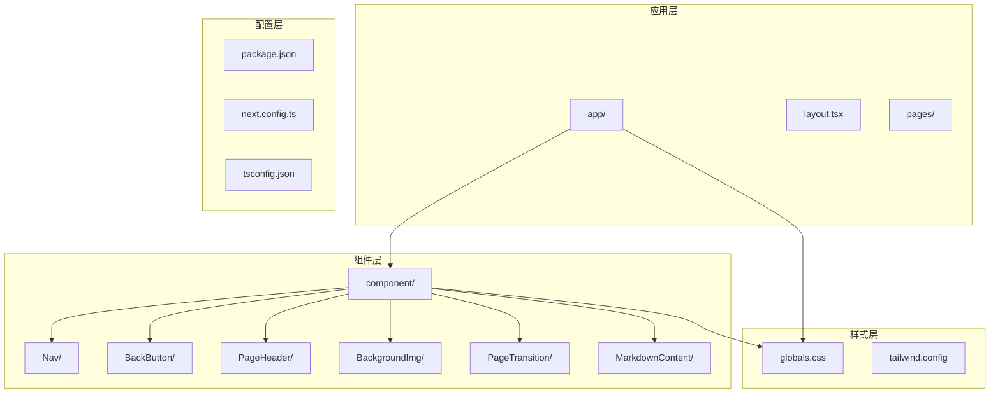

**图表来源**
- [app/layout.tsx:1-38](file://app/layout.tsx#L1-L38)
- [component/index.ts:1-17](file://component/index.ts#L1-L17)

**章节来源**
- [package.json:1-36](file://package.json#L1-L36)
- [app/layout.tsx:1-38](file://app/layout.tsx#L1-L38)

## 核心组件

UI组件库包含以下核心组件，每个组件都经过精心设计以确保一致性和可复用性：

### 组件导出系统

组件库通过统一的导出入口管理所有组件，提供简洁的导入接口：

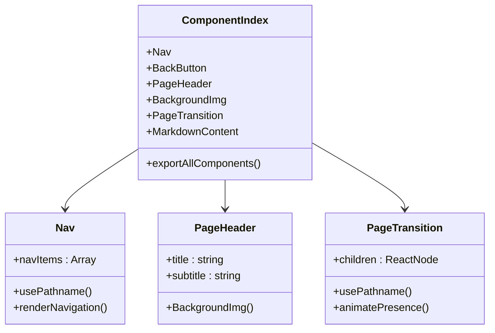

**图表来源**
- [component/index.ts:1-17](file://component/index.ts#L1-L17)
- [component/Nav/index.tsx:1-52](file://component/Nav/index.tsx#L1-L52)
- [component/PageHeader/index.tsx:1-25](file://component/PageHeader/index.tsx#L1-L25)
- [component/PageTransition/index.tsx:1-27](file://component/PageTransition/index.tsx#L1-L27)

### 主要组件特性

1. **响应式设计**: 所有组件都支持移动端和桌面端的自适应布局
2. **动画效果**: 集成Framer Motion提供流畅的页面过渡和交互效果
3. **主题系统**: 支持深色和浅色模式自动切换
4. **无障碍访问**: 符合WCAG标准的可访问性设计

**章节来源**
- [component/index.ts:1-17](file://component/index.ts#L1-L17)

## 架构概览

整个UI组件库采用分层架构设计，确保组件间的松耦合和高内聚：

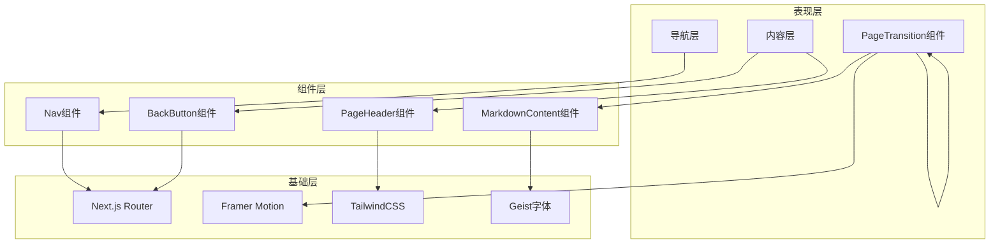

**图表来源**
- [app/layout.tsx:1-38](file://app/layout.tsx#L1-L38)
- [component/Nav/index.tsx:1-52](file://component/Nav/index.tsx#L1-L52)
- [component/PageTransition/index.tsx:1-27](file://component/PageTransition/index.tsx#L1-L27)

### 数据流架构

组件间的数据流向遵循单向数据流原则，确保状态管理的可预测性：

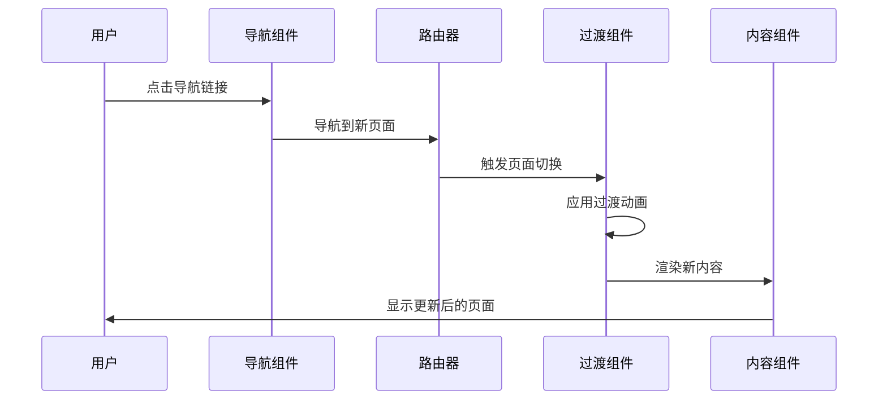

**图表来源**
- [component/Nav/index.tsx:15-52](file://component/Nav/index.tsx#L15-L52)
- [component/PageTransition/index.tsx:7-27](file://component/PageTransition/index.tsx#L7-L27)

## 详细组件分析

### 导航组件 (Nav)

导航组件是用户界面的核心交互元素，提供站点的主要导航功能：

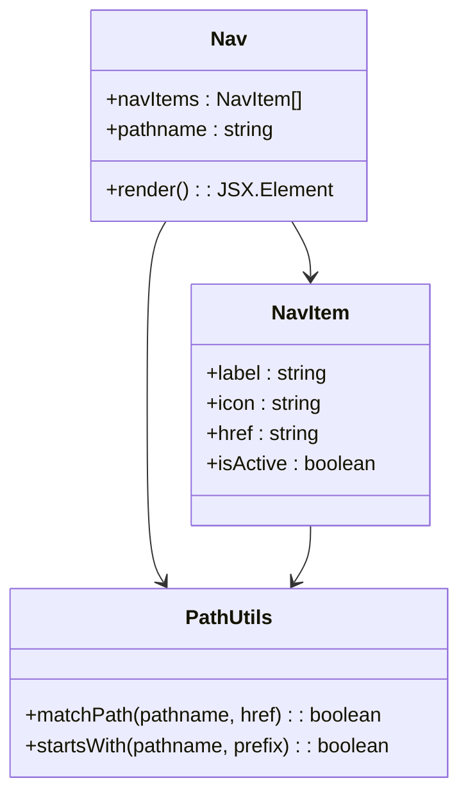

**图表来源**
- [component/Nav/index.tsx:6-13](file://component/Nav/index.tsx#L6-L13)
- [component/Nav/index.tsx:15-52](file://component/Nav/index.tsx#L15-L52)

#### 导航项配置

导航组件包含预定义的导航项数组，支持多级路径匹配：

| 导航项 | 图标 | 路径 | 功能描述 |
|--------|------|------|----------|
| 首页 | 🏠 | `/` | 站点主页面 |
| 文章 | 📝 | `/articles` | 博客文章列表 |
| 杂烩 | 🎨 | `/misc` | 杂项内容页面 |
| 人生路 | 🚶 | `/life` | 生活记录页面 |
| 社交 | 💬 | `/social` | 社交互动页面 |
| 摄影 | ✨ | `/photography` | 摄影作品展示 |

**章节来源**
- [component/Nav/index.tsx:6-13](file://component/Nav/index.tsx#L6-L13)
- [component/Nav/index.tsx:26-48](file://component/Nav/index.tsx#L26-L48)

### 页面头部组件 (PageHeader)

页面头部组件提供统一的页面标题区域，支持背景图片和副标题显示：

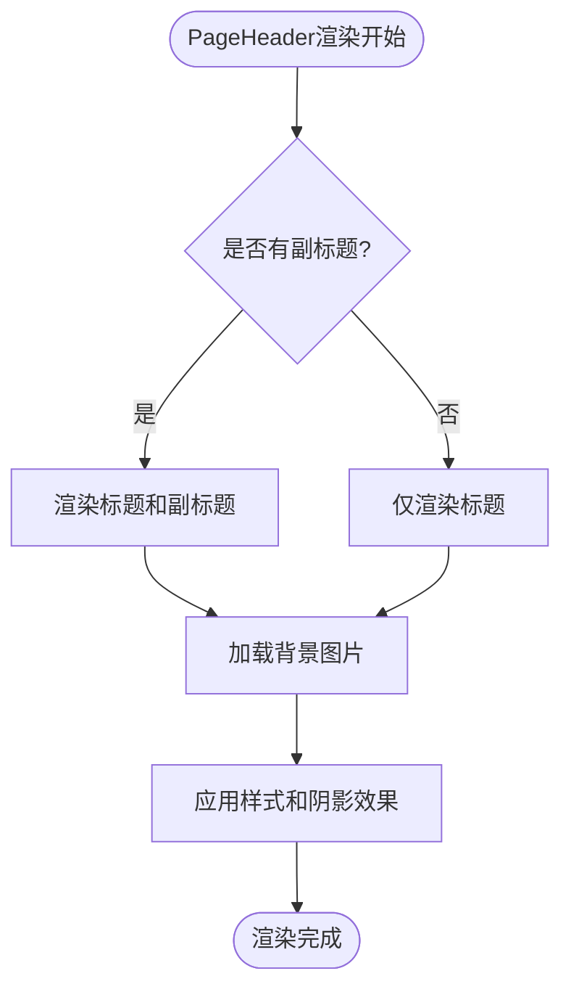

**图表来源**
- [component/PageHeader/index.tsx:8-24](file://component/PageHeader/index.tsx#L8-L24)

#### 设计特性

- **固定定位**: 使用固定定位确保导航栏始终可见
- **模糊背景**: 背景应用模糊效果提升可读性
- **响应式设计**: 支持不同屏幕尺寸的自适应布局
- **阴影效果**: 文字阴影增强视觉层次

**章节来源**
- [component/PageHeader/index.tsx:10-22](file://component/PageHeader/index.tsx#L10-L22)

### 返回按钮组件 (BackButton)

返回按钮提供浏览器历史记录导航功能：

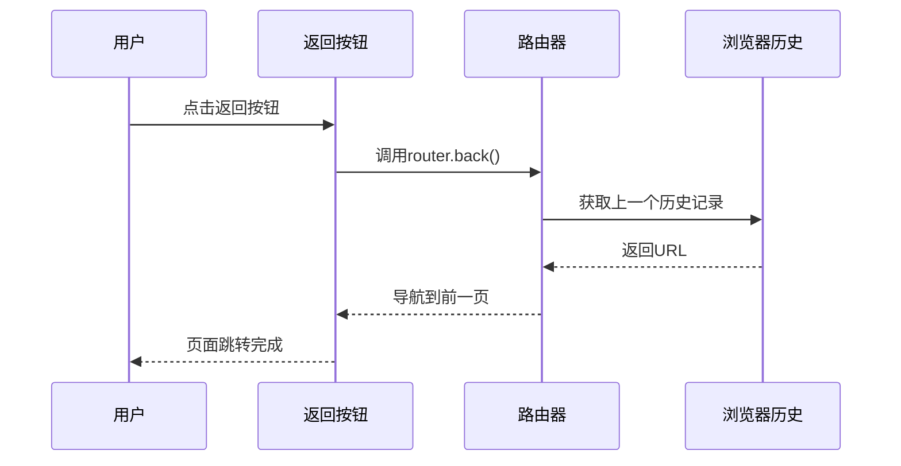

**图表来源**
- [component/BackButton/index.tsx:6-17](file://component/BackButton/index.tsx#L6-L17)

**章节来源**
- [component/BackButton/index.tsx:10-16](file://component/BackButton/index.tsx#L10-L16)

### 页面过渡组件 (PageTransition)

页面过渡组件提供平滑的页面切换动画效果：

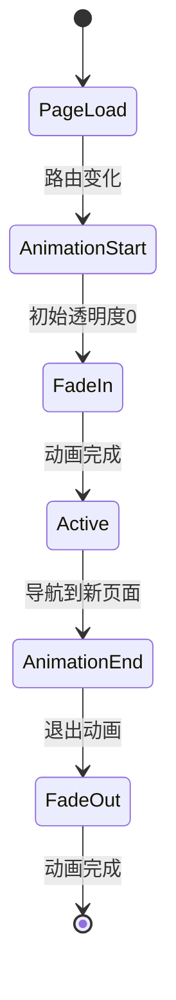

**图表来源**
- [component/PageTransition/index.tsx:7-27](file://component/PageTransition/index.tsx#L7-L27)

#### 动画配置

- **过渡类型**: tween缓动
- **持续时间**: 0.3秒
- **缓动函数**: easeInOut
- **初始状态**: 透明度0
- **结束状态**: 透明度1

**章节来源**
- [component/PageTransition/index.tsx:14-21](file://component/PageTransition/index.tsx#L14-L21)

### 背景图片组件 (BackgroundImg)

背景图片组件提供统一的背景图像显示功能：

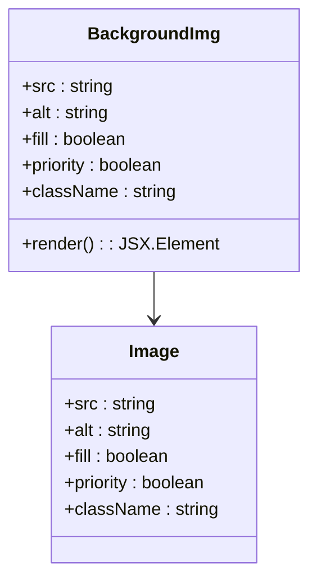

**图表来源**
- [component/BackgroundImg/index.tsx:3-15](file://component/BackgroundImg/index.tsx#L3-L15)

**章节来源**
- [component/BackgroundImg/index.tsx:6-12](file://component/BackgroundImg/index.tsx#L6-L12)

### Markdown内容组件 (MarkdownContent)

Markdown内容组件提供富文本内容渲染功能：

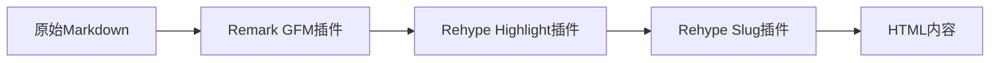

**图表来源**
- [component/MarkdownContent/index.tsx:10-16](file://component/MarkdownContent/index.tsx#L10-L16)

#### 插件功能

- **语法高亮**: 自动为代码块添加语法高亮
- **标题锚点**: 为标题生成可点击的锚点链接
- **GitHub风格**: 支持GitHub特有的Markdown语法

**章节来源**
- [component/MarkdownContent/index.tsx:12-14](file://component/MarkdownContent/index.tsx#L12-L14)

## 依赖关系分析

项目依赖关系清晰明确，各组件间保持低耦合：

```mermaid
graph TB
subgraph "运行时依赖"
REACT[react 19.2.4]
NEXT[next 16.2.6]
FRAMER[framer-motion 12.38.0]
MARKDOWN[@m2d/react-markdown 1.0.0]
end
subgraph "开发依赖"
TYPESCRIPT[typescript ^5]
TAILWIND[tailwindcss ^4]
ESLINT[eslint ^9]
end
subgraph "样式依赖"
HIGHLIGHT[highlight.js]
GEIST_FONT[next/font/google]
end
REACT --> NEXT
NEXT --> FRAMER
REACT --> MARKDOWN
MARKDOWN --> HIGHLIGHT
NEXT --> GEIST_FONT
```

**图表来源**
- [package.json:15-34](file://package.json#L15-L34)

### 组件依赖图

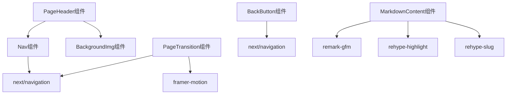

**图表来源**
- [component/Nav/index.tsx:3-4](file://component/Nav/index.tsx#L3-L4)
- [component/PageHeader/index.tsx:1](file://component/PageHeader/index.tsx#L1)
- [component/PageTransition/index.tsx:4](file://component/PageTransition/index.tsx#L4)
- [component/BackButton/index.tsx:4](file://component/BackButton/index.tsx#L4)
- [component/MarkdownContent/index.tsx:1-4](file://component/MarkdownContent/index.tsx#L1-L4)

**章节来源**
- [package.json:15-34](file://package.json#L15-L34)

## 性能考虑

### 渲染优化

1. **懒加载策略**: 使用Next.js的内置懒加载机制
2. **图片优化**: 通过Next/Image组件实现响应式图片加载
3. **动画性能**: Framer Motion提供硬件加速的动画渲染

### 样式优化

1. **原子化CSS**: TailwindCSS减少CSS文件大小
2. **按需加载**: 只加载实际使用的样式类
3. **主题变量**: 使用CSS变量提升主题切换性能

### 代码分割

组件采用按需导入策略，确保首屏加载性能最优。

## 故障排除指南

### 常见问题及解决方案

#### 导航不生效
- **症状**: 点击导航链接无反应
- **原因**: 缺少客户端指令或路由配置错误
- **解决**: 确保Nav组件使用'use client'指令

#### 动画不流畅
- **症状**: 页面切换动画卡顿
- **原因**: 动画配置不当或性能不足
- **解决**: 检查Framer Motion配置和设备性能

#### 样式异常
- **症状**: 组件样式错乱或不显示
- **原因**: TailwindCSS配置问题或样式冲突
- **解决**: 检查CSS变量和样式优先级

**章节来源**
- [component/Nav/index.tsx:1](file://component/Nav/index.tsx#L1)
- [component/PageTransition/index.tsx:1](file://component/PageTransition/index.tsx#L1)

## 结论

这个UI组件库展现了现代React应用的最佳实践，通过精心设计的组件架构和丰富的功能特性，为博客网站提供了完整的技术解决方案。组件库的主要优势包括：

1. **模块化设计**: 清晰的组件边界和职责分离
2. **性能优化**: 采用多种优化策略确保最佳用户体验
3. **可维护性**: 类型安全的TypeScript实现和良好的代码组织
4. **扩展性**: 灵活的架构支持未来功能扩展

该组件库不仅满足了当前博客网站的需求，也为类似项目提供了优秀的参考模板。通过合理的依赖管理和组件设计，实现了高内聚、低耦合的系统架构。