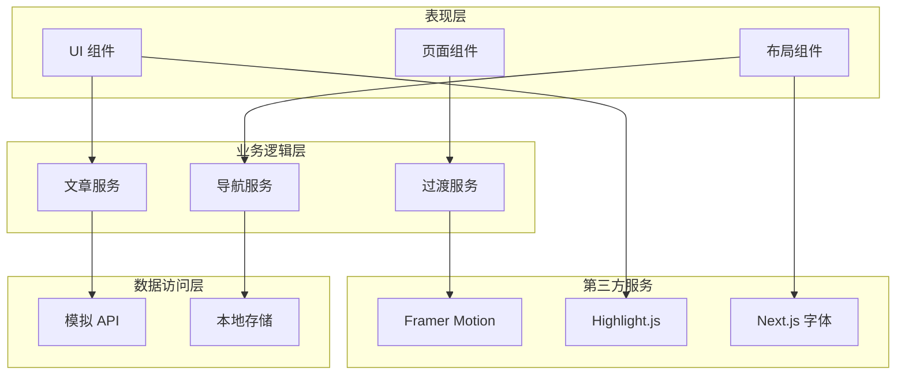
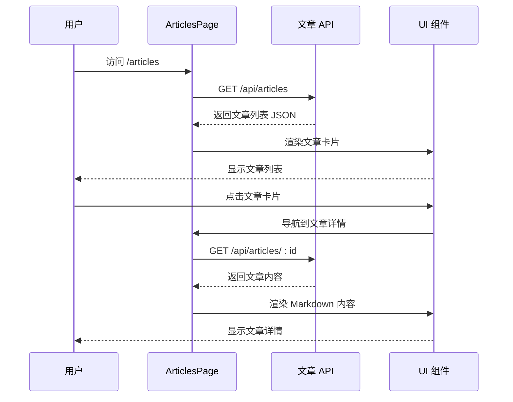
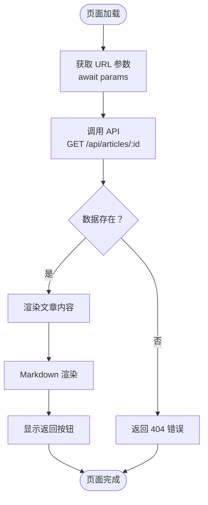
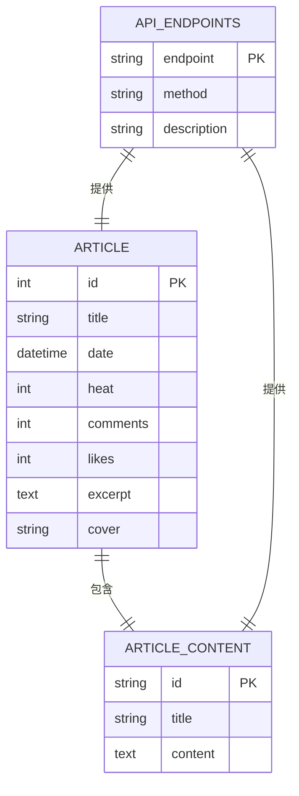
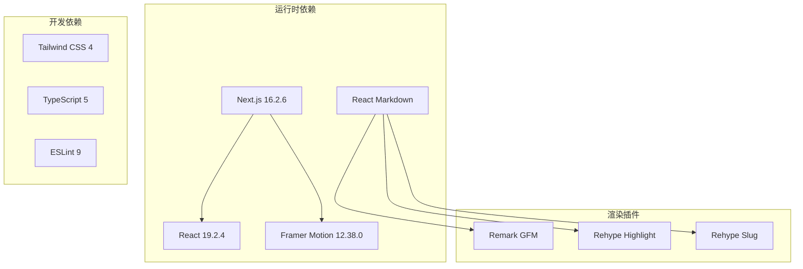
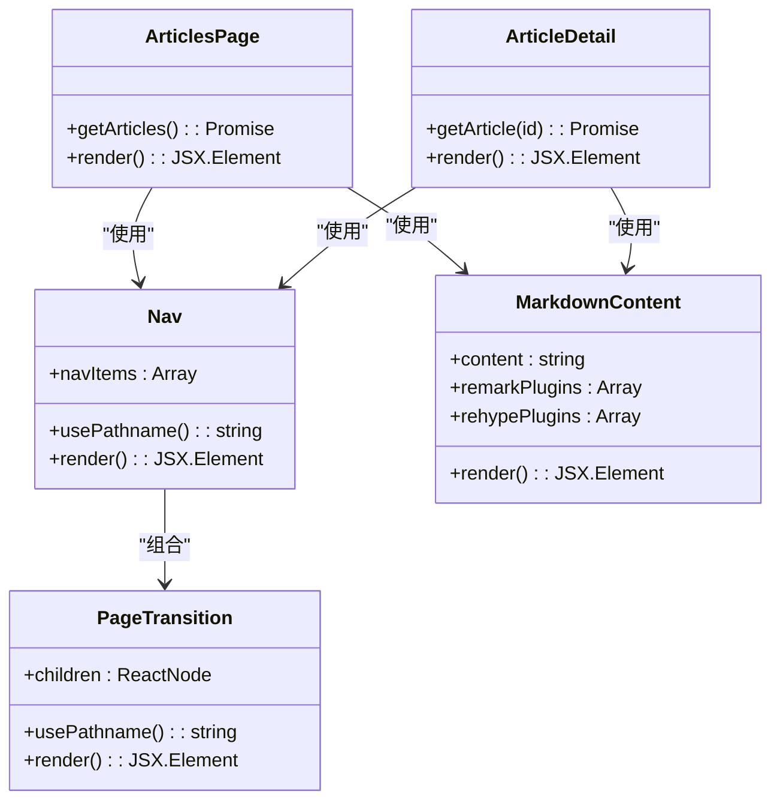

# 文章管理系统

<cite>
**本文档引用的文件**
- [README.md](file://README.md)
- [package.json](file://package.json)
- [next.config.ts](file://next.config.ts)
- [app/layout.tsx](file://app/layout.tsx)
- [app/globals.css](file://app/globals.css)
- [app/(site)/layout.tsx](file://app/(site)/layout.tsx)
- [app/(site)/page.tsx](file://app/(site)/page.tsx)
- [app/(site)/articles/layout.tsx](file://app/(site)/articles/layout.tsx)
- [app/(site)/articles/page.tsx](file://app/(site)/articles/page.tsx)
- [app/(site)/articles/[slug]/page.tsx](file://app/(site)/articles/[slug]/page.tsx)
- [app/api/articles/route.ts](file://app/api/articles/route.ts)
- [app/api/articles/[id]/route.ts](file://app/api/articles/[id]/route.ts)
- [component/Nav/index.tsx](file://component/Nav/index.tsx)
- [component/PageTransition/index.tsx](file://component/PageTransition/index.tsx)
- [component/MarkdownContent/index.tsx](file://component/MarkdownContent/index.tsx)
</cite>

## 目录
1. [简介](#简介)
2. [项目结构](#项目结构)
3. [核心组件](#核心组件)
4. [架构概览](#架构概览)
5. [详细组件分析](#详细组件分析)
6. [依赖关系分析](#依赖关系分析)
7. [性能考虑](#性能考虑)
8. [故障排除指南](#故障排除指南)
9. [结论](#结论)

## 简介

这是一个基于 Next.js 16.2.6 构建的现代化文章管理系统。该系统采用 App Router 架构，结合 React Server Components 和客户端组件，提供了一个完整的博客平台解决方案。系统支持文章列表展示、文章详情阅读、分类浏览等功能，并集成了 Markdown 内容渲染、响应式设计和动画过渡效果。

## 项目结构

该项目采用 Next.js 13+ 的 App Router 结构，主要分为以下几个核心部分：

```mermaid
graph TB
subgraph "应用根目录"
RootLayout[根布局<br/>app/layout.tsx]
GlobalCSS[全局样式<br/>app/globals.css]
end
subgraph "站点应用"
SiteLayout[站点布局<br/>app/(site)/layout.tsx]
HomePage[首页<br/>app/(site)/page.tsx]
subgraph "文章模块"
ArticlesLayout[文章布局<br/>app/(site)/articles/layout.tsx]
ArticlesList[文章列表<br/>app/(site)/articles/page.tsx]
ArticleDetail[文章详情<br/>app/(site)/articles/[slug]/page.tsx]
end
end
subgraph "API 层"
ArticlesAPI[文章 API<br/>app/api/articles/route.ts]
ArticleAPI[单篇文章 API<br/>app/api/articles/[id]/route.ts]
end
subgraph "组件层"
Nav[导航组件<br/>component/Nav/index.tsx]
PageTransition[页面过渡<br/>component/PageTransition/index.tsx]
MarkdownContent[Markdown渲染<br/>component/MarkdownContent/index.tsx]
end
RootLayout --> SiteLayout
SiteLayout --> HomePage
SiteLayout --> ArticlesLayout
ArticlesLayout --> ArticlesList
ArticlesLayout --> ArticleDetail
ArticlesList --> ArticlesAPI
ArticleDetail --> ArticleAPI
SiteLayout --> Nav
RootLayout --> PageTransition
ArticleDetail --> MarkdownContent
```

**图表来源**
- [app/layout.tsx:1-38](file://app/layout.tsx#L1-L38)
- [app/(site)/layout.tsx:1-34](file://app/(site)/layout.tsx#L1-L34)
- [app/(site)/articles/layout.tsx:1-14](file://app/(site)/articles/layout.tsx#L1-L14)

**章节来源**
- [package.json:1-36](file://package.json#L1-L36)
- [next.config.ts:1-11](file://next.config.ts#L1-L11)

## 核心组件

### 导航组件 (Nav)

导航组件实现了响应式导航栏功能，支持以下特性：

- **动态高亮**：根据当前路径自动高亮对应菜单项
- **图标支持**：每个导航项都配有相应的表情符号图标
- **移动端适配**：使用 Flexbox 实现响应式布局
- **视觉效果**：半透明背景和毛玻璃效果

### 页面过渡组件 (PageTransition)

集成 Framer Motion 实现流畅的页面切换动画：

- **淡入淡出效果**：页面进入和退出时的平滑过渡
- **路径感知**：基于当前路径键值实现正确的动画序列
- **配置化**：可调整动画持续时间和缓动函数

### Markdown 内容渲染组件

专门用于渲染 Markdown 内容的组件：

- **语法高亮**：集成 highlight.js 实现代码块高亮
- **GitHub 风格表格**：支持 GFM 表格语法
- **标题锚点**：自动生成标题链接锚点
- **服务器端渲染**：使用 @m2d/react-markdown 提供 SSR 支持

**章节来源**
- [component/Nav/index.tsx:1-52](file://component/Nav/index.tsx#L1-L52)
- [component/PageTransition/index.tsx:1-27](file://component/PageTransition/index.tsx#L1-L27)
- [component/MarkdownContent/index.tsx:1-16](file://component/MarkdownContent/index.tsx#L1-L16)

## 架构概览

系统采用分层架构设计，清晰分离了展示层、业务逻辑层和数据访问层：



**图表来源**
- [app/(site)/articles/page.tsx:16-19](file://app/(site)/articles/page.tsx#L16-L19)
- [app/(site)/articles/[slug]/page.tsx:4-7](file://app/(site)/articles/[slug]/page.tsx#L4-L7)

## 详细组件分析

### 文章列表页面 (ArticlesPage)

文章列表页面实现了完整的文章浏览功能：



**图表来源**
- [app/(site)/articles/page.tsx:16-19](file://app/(site)/articles/page.tsx#L16-L19)
- [app/api/articles/route.ts:52-55](file://app/api/articles/route.ts#L52-L55)

#### 数据流分析

文章列表页面采用以下数据流程：

1. **数据获取**：通过 `fetch` API 从 `/api/articles` 获取文章数据
2. **缓存策略**：使用 `{ cache: 'no-store' }` 确保实时数据
3. **状态管理**：使用 React 的异步状态管理
4. **错误处理**：通过 Next.js 的错误边界处理网络异常

**章节来源**
- [app/(site)/articles/page.tsx:16-102](file://app/(site)/articles/page.tsx#L16-L102)
- [app/(site)/articles/layout.tsx:1-14](file://app/(site)/articles/layout.tsx#L1-L14)

### 文章详情页面 (ArticleDetail)

文章详情页面提供了完整的文章阅读体验：



**图表来源**
- [app/(site)/articles/[slug]/page.tsx:8-24](file://app/(site)/articles/[slug]/page.tsx#L8-L24)
- [app/api/articles/[id]/route.ts:9-22](file://app/api/articles/[id]/route.ts#L9-L22)

#### 功能特性

- **参数处理**：正确处理 Next.js 15+ 的异步参数
- **错误处理**：当文章不存在时返回 404 状态码
- **内容渲染**：使用 MarkdownContent 组件渲染富文本内容
- **导航集成**：与全局导航系统无缝集成

**章节来源**
- [app/(site)/articles/[slug]/page.tsx:1-25](file://app/(site)/articles/[slug]/page.tsx#L1-L25)

### API 层设计

系统采用 RESTful API 设计模式：



**图表来源**
- [app/api/articles/route.ts:5-50](file://app/api/articles/route.ts#L5-L50)
- [app/api/articles/[id]/route.ts:4-7](file://app/api/articles/[id]/route.ts#L4-L7)

**章节来源**
- [app/api/articles/route.ts:1-55](file://app/api/articles/route.ts#L1-L55)
- [app/api/articles/[id]/route.ts:1-22](file://app/api/articles/[id]/route.ts#L1-L22)

## 依赖关系分析

### 核心依赖关系



**图表来源**
- [package.json:15-34](file://package.json#L15-L34)

### 组件依赖图



**图表来源**
- [component/Nav/index.tsx:15-51](file://component/Nav/index.tsx#L15-L51)
- [component/PageTransition/index.tsx:7-26](file://component/PageTransition/index.tsx#L7-L26)
- [component/MarkdownContent/index.tsx:10-15](file://component/MarkdownContent/index.tsx#L10-L15)

**章节来源**
- [package.json:15-34](file://package.json#L15-L34)

## 性能考虑

### 渲染优化

1. **服务器端渲染**：使用 React Server Components 减少客户端负载
2. **懒加载**：图片使用 Next.js Image 组件实现懒加载
3. **代码分割**：按需加载不同页面的组件
4. **缓存策略**：API 请求使用 no-store 确保数据实时性

### 动画性能

- **硬件加速**：Framer Motion 使用 transform 和 opacity 属性
- **动画简化**：仅在必要时触发复杂动画
- **内存管理**：合理清理动画状态和事件监听器

### 网络优化

- **请求合并**：减少不必要的 API 调用
- **错误重试**：实现基本的网络错误处理机制
- **资源压缩**：利用 Next.js 的内置优化功能

## 故障排除指南

### 常见问题及解决方案

#### 1. 文章数据无法加载

**症状**：文章列表显示为空或加载失败

**可能原因**：
- API 服务器未启动
- 网络连接问题
- CORS 配置错误

**解决步骤**：
1. 确认 API 服务正在运行
2. 检查浏览器控制台的网络错误
3. 验证 API 端点可达性

#### 2. Markdown 渲染异常

**症状**：Markdown 内容显示为纯文本而非格式化内容

**可能原因**：
- 缺少必要的插件依赖
- 内容格式不正确
- 样式冲突

**解决步骤**：
1. 检查 remark-gfm 和 rehype 插件是否正确安装
2. 验证 Markdown 内容格式
3. 确认样式文件正确加载

#### 3. 导航高亮问题

**症状**：导航菜单项无法正确高亮

**可能原因**：
- 路径匹配逻辑错误
- usePathname Hook 使用不当
- 路由配置问题

**解决步骤**：
1. 检查路由配置是否正确
2. 验证路径匹配逻辑
3. 确认导航项的 href 属性

**章节来源**
- [app/api/articles/[id]/route.ts:17-19](file://app/api/articles/[id]/route.ts#L17-L19)
- [component/Nav/index.tsx:27-31](file://component/Nav/index.tsx#L27-L31)

## 结论

这个文章管理系统展现了现代 Web 应用的最佳实践，采用了以下关键技术栈和设计理念：

### 技术亮点

1. **现代化框架**：基于 Next.js 16.2.6 的最新特性
2. **组件化设计**：清晰的组件层次结构和职责分离
3. **性能优化**：充分利用 React Server Components 和客户端组件的优势
4. **用户体验**：流畅的动画过渡和响应式设计

### 架构优势

- **可扩展性**：模块化的组件设计便于功能扩展
- **可维护性**：清晰的文件组织和命名规范
- **可测试性**：独立的功能模块便于单元测试
- **可部署性**：标准化的构建配置和部署流程

### 改进建议

1. **数据库集成**：将模拟数据替换为真实的数据库存储
2. **用户认证**：添加用户登录和权限管理功能
3. **SEO 优化**：完善元数据和 SEO 相关配置
4. **国际化**：支持多语言内容管理
5. **搜索功能**：添加全文搜索和标签过滤功能

该系统为个人博客和小型内容管理提供了坚实的技术基础，具备良好的扩展性和维护性，适合进一步开发和定制。