# 组件开发指南

<cite>
**本文档引用的文件**
- [app/layout.tsx](file://app/layout.tsx)
- [app/page.tsx](file://app/page.tsx)
- [app/articles/page.tsx](file://app/articles/page.tsx)
- [app/life/page.tsx](file://app/life/page.tsx)
- [app/misc/page.tsx](file://app/misc/page.tsx)
- [app/social/page.tsx](file://app/social/page.tsx)
- [app/photography/page.tsx](file://app/photography/page.tsx)
- [app/globals.css](file://app/globals.css)
- [component/Nav/index.tsx](file://component/Nav/index.tsx)
- [component/PageHeader/index.tsx](file://component/PageHeader/index.tsx)
- [component/BackgroundImg/index.tsx](file://component/BackgroundImg/index.tsx)
- [component/index.ts](file://component/index.ts)
- [package.json](file://package.json)
- [next.config.ts](file://next.config.ts)
- [tsconfig.json](file://tsconfig.json)
- [README.md](file://README.md)
- [AGENTS.md](file://AGENTS.md)
</cite>

## 更新摘要
**变更内容**
- 新增组件架构模式分析，包括 Nav、PageHeader、BackgroundImg 三个核心组件
- 更新页面组件设计模式，展示组件复用策略
- 添加组件导出索引文件的使用方法
- 扩展组件开发最佳实践指南
- 更新依赖关系分析，包含新增组件的依赖管理

## 目录
1. [简介](#简介)
2. [项目结构](#项目结构)
3. [核心组件](#核心组件)
4. [架构概览](#架构概览)
5. [详细组件分析](#详细组件分析)
6. [组件开发最佳实践](#组件开发最佳实践)
7. [依赖关系分析](#依赖关系分析)
8. [性能考虑](#性能考虑)
9. [故障排除指南](#故障排除指南)
10. [结论](#结论)

## 简介

blod 是一个基于 Next.js App Router 构建的个人博客项目，采用现代化的 React 开发技术栈。该项目展示了如何使用最新的 Next.js 特性来构建高性能的 Web 应用程序，包括服务端渲染、静态生成、自动字体优化等先进功能。

本指南将深入解释 React 组件的编写方法和最佳实践，详细说明 Next.js App Router 的使用和文件系统路由的工作原理，并阐述根布局组件（RootLayout）和页面组件（Home）的实现细节。同时，我们将涵盖组件状态管理、事件处理和生命周期的使用方法，提供具体的代码示例展示如何创建可复用的组件、如何处理用户交互、如何实现组件间通信。

**更新** 新增对 Nav、PageHeader、BackgroundImg 等新组件的深入分析，展示现代 React 组件开发的最佳实践。

## 项目结构

blod 项目采用了 Next.js App Router 的推荐目录结构，主要由以下关键部分组成：

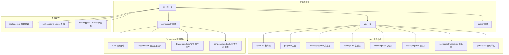

**图表来源**
- [app/layout.tsx:1-38](file://app/layout.tsx#L1-L38)
- [component/index.ts:1-6](file://component/index.ts#L1-L6)

**章节来源**
- [app/layout.tsx:1-38](file://app/layout.tsx#L1-L38)
- [component/index.ts:1-6](file://component/index.ts#L1-L6)

## 核心组件

### 根布局组件（RootLayout）

根布局组件是 Next.js App Router 中的核心概念，它定义了整个应用程序的外壳结构。在 blod 项目中，RootLayout 负责：

- 设置全局元数据（标题、描述）
- 加载自定义字体（Geist Sans 和 Geist Mono）
- 提供全局样式上下文
- 定义应用程序的基础 HTML 结构
- 集成全局导航组件

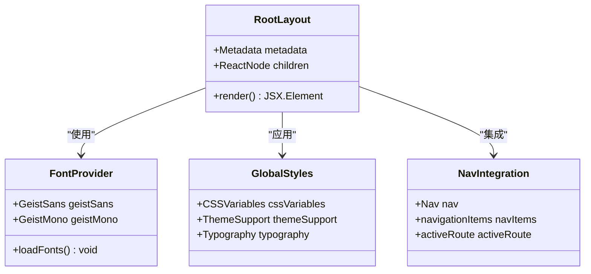

**图表来源**
- [app/layout.tsx:16-37](file://app/layout.tsx#L16-L37)

### 页面组件（Home）

Home 组件是应用程序的主要页面，展示了现代响应式设计的最佳实践：

- 使用 Tailwind CSS 实现灵活的布局系统
- 集成 Next.js Image 组件进行优化的图片处理
- 实现固定导航栏和响应式内容布局
- 提供交互式按钮和动画效果

**章节来源**
- [app/layout.tsx:16-37](file://app/layout.tsx#L16-L37)
- [app/page.tsx:4-35](file://app/page.tsx#L4-L35)

## 架构概览

blod 项目采用分层架构设计，清晰分离了关注点：

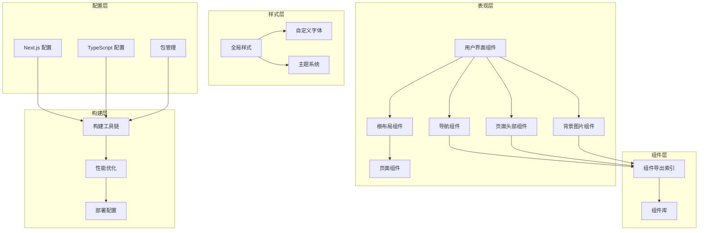

**图表来源**
- [app/layout.tsx:1-38](file://app/layout.tsx#L1-L38)
- [app/page.tsx:1-36](file://app/page.tsx#L1-L36)
- [component/index.ts:1-6](file://component/index.ts#L1-L6)

## 详细组件分析

### 根布局组件深度解析

RootLayout 组件实现了 Next.js 的根布局模式，具有以下关键特性：

#### 字体管理系统
- 使用 next/font 自动优化字体加载
- 支持变量字体以提高性能
- 实现字体回退机制

#### 元数据配置
- 动态设置页面标题和描述
- 支持 SEO 优化
- 提供社交媒体预览信息

#### 布局结构
- 定义基础 HTML 结构
- 设置语言属性
- 应用全局样式类
- 集成全局导航组件

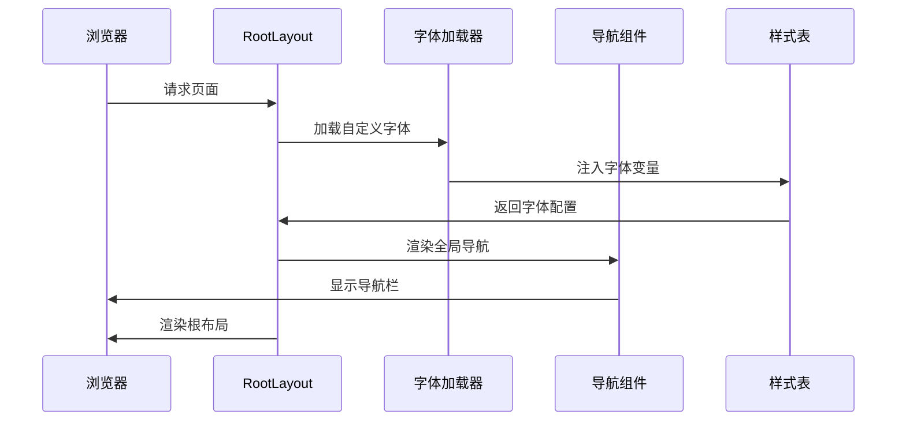

**图表来源**
- [app/layout.tsx:6-19](file://app/layout.tsx#L6-L19)
- [app/layout.tsx:21-37](file://app/layout.tsx#L21-L37)

**章节来源**
- [app/layout.tsx:1-38](file://app/layout.tsx#L1-L38)

### 页面组件深度解析

Home 组件展示了现代 React 开发的最佳实践：

#### 响应式布局设计
- 使用 Flexbox 实现灵活的布局
- 支持移动端和桌面端适配
- 实现固定定位的侧边按钮

#### 图片优化策略
- 使用 Next.js Image 组件
- 实现自动尺寸调整
- 支持优先加载和懒加载

#### 导航系统
- 动态生成导航项
- 实现图标和文本组合
- 支持悬停状态变化

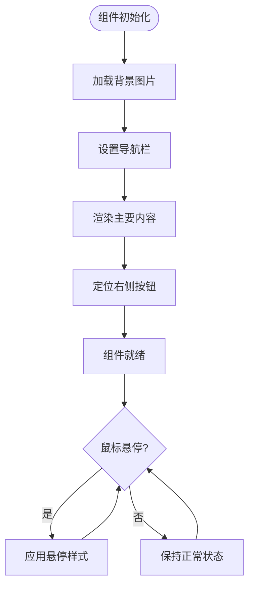

**图表来源**
- [app/page.tsx:4-35](file://app/page.tsx#L4-L35)

**章节来源**
- [app/page.tsx:1-36](file://app/page.tsx#L1-L36)

### 新增组件深度解析

#### 导航组件（Nav）

Nav 组件是全局导航系统的核心，实现了以下功能：

- 固定定位的导航栏设计
- 动态路由激活状态检测
- 响应式布局适配
- 毛玻璃效果和透明背景
- 图标与文字结合的导航项

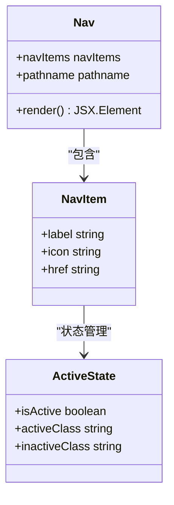

**图表来源**
- [component/Nav/index.tsx:6-13](file://component/Nav/index.tsx#L6-L13)
- [component/Nav/index.tsx:15-45](file://component/Nav/index.tsx#L15-L45)

#### 页面头部组件（PageHeader）

PageHeader 组件提供了统一的页面头部设计模式：

- 统一的标题和副标题显示
- 背景图片组件集成
- 层级管理（背景、内容、前景）
- 响应式字体大小调整
- 阴影和透明度效果

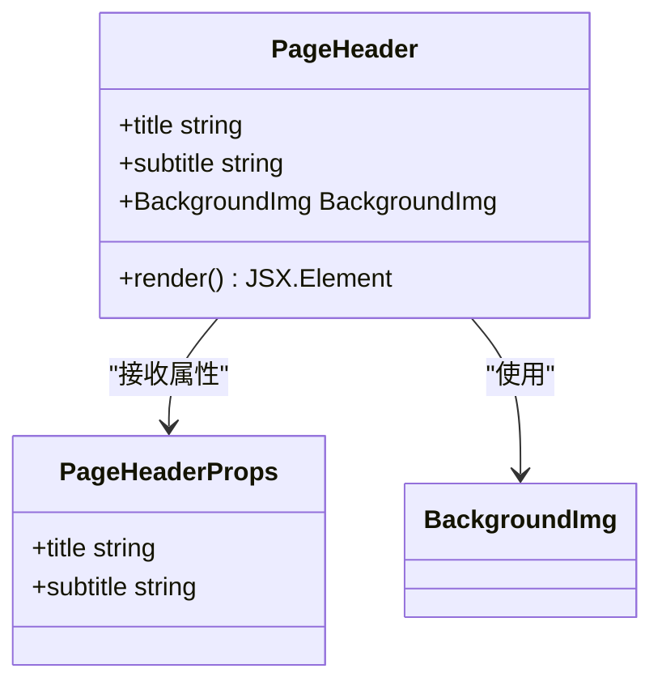

**图表来源**
- [component/PageHeader/index.tsx:3-6](file://component/PageHeader/index.tsx#L3-L6)
- [component/PageHeader/index.tsx:8-24](file://component/PageHeader/index.tsx#L8-L24)

#### 背景图片组件（BackgroundImg）

BackgroundImg 组件专注于背景图片的统一处理：

- Next.js Image 组件的封装
- 全屏覆盖的定位策略
- 优先加载机制
- 对象填充模式
- 简洁的 API 设计

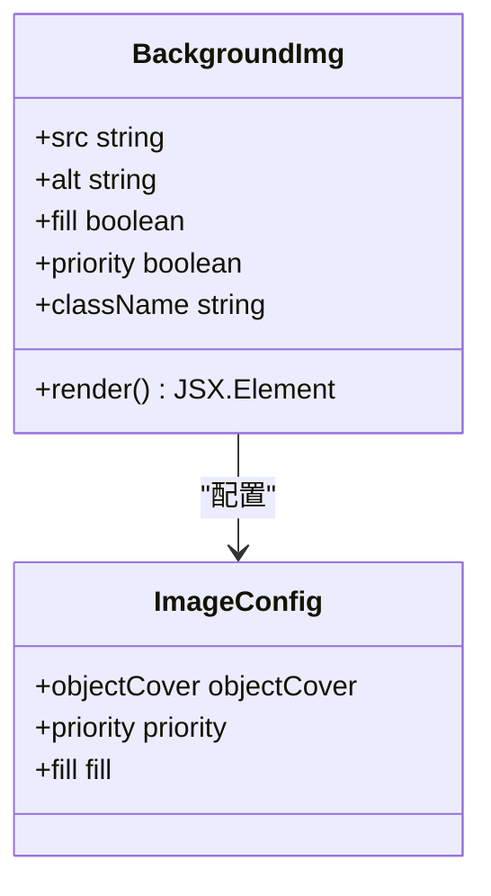

**图表来源**
- [component/BackgroundImg/index.tsx:4-16](file://component/BackgroundImg/index.tsx#L4-L16)

**章节来源**
- [component/Nav/index.tsx:1-46](file://component/Nav/index.tsx#L1-L46)
- [component/PageHeader/index.tsx:1-25](file://component/PageHeader/index.tsx#L1-L25)
- [component/BackgroundImg/index.tsx:1-17](file://component/BackgroundImg/index.tsx#L1-L17)

### 样式系统分析

blod 项目采用了现代化的样式管理方案：

#### 全局样式架构
- 使用 Tailwind CSS 作为主要样式框架
- 实现 CSS 变量支持主题切换
- 集成自定义字体系统

#### 主题系统
- 支持明暗主题自动切换
- 使用 CSS 变量管理颜色
- 实现平滑的主题过渡

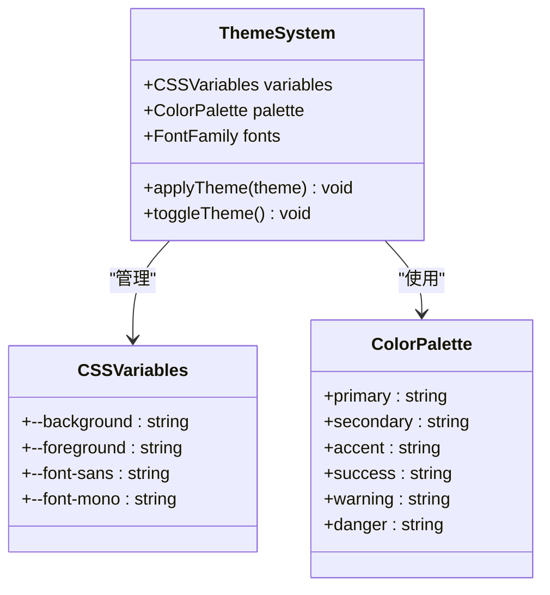

**图表来源**
- [app/globals.css:3-20](file://app/globals.css#L3-L20)

**章节来源**
- [app/globals.css:1-32](file://app/globals.css#L1-L32)

## 组件开发最佳实践

### 组件架构模式

#### 单一职责原则
每个组件应该专注于单一功能，避免过度复杂的逻辑：

- Nav 组件只负责导航逻辑
- PageHeader 组件只负责页面头部展示
- BackgroundImg 组件只负责背景图片处理

#### 组件复用策略
通过 props 接口实现组件的通用化设计：

```typescript
// 通用的页面头部接口
interface PageHeaderProps {
  title: string;
  subtitle?: string;
}

// 通用的导航项接口
interface NavItem {
  label: string;
  icon: string;
  href: string;
}
```

#### 组件组合模式
利用组件的组合能力实现复杂功能：

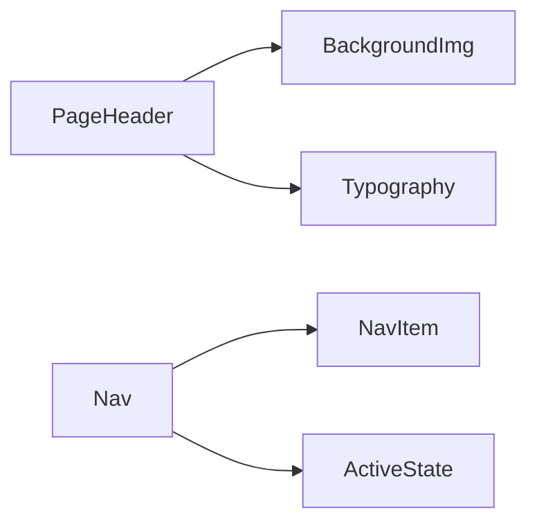

### 组件状态管理

#### 客户端组件状态
Nav 组件使用 `usePathname` Hook 管理路由状态：

```typescript
const pathname = usePathname();
const isActive = pathname === item.href;
```

#### 组件间通信
通过 props 和 children 实现组件间的数据传递：

```typescript
// PageHeader 接收标题和副标题
<PageHeader title="文章列表" subtitle="记录技术成长，分享学习心得" />

// Nav 接收导航项数组
const navItems = [
  { label: "首页", icon: "🏠", href: "/" },
  // ...
];
```

### 组件性能优化

#### 懒加载策略
使用 Next.js 的 Image 组件实现图片懒加载：

```typescript
<Image
  src="/img/love.png"
  alt="background"
  fill
  className="object-cover"
  priority
/>
```

#### 渲染优化
避免不必要的重渲染，使用 React.memo 或 useMemo：

```typescript
const memoizedNavItems = useMemo(() => navItems, []);
```

**章节来源**
- [component/Nav/index.tsx:15-45](file://component/Nav/index.tsx#L15-L45)
- [component/PageHeader/index.tsx:8-24](file://component/PageHeader/index.tsx#L8-L24)
- [component/BackgroundImg/index.tsx:4-16](file://component/BackgroundImg/index.tsx#L4-L16)

## 依赖关系分析

### 技术栈依赖

blod 项目的技术栈体现了现代前端开发的最佳实践：

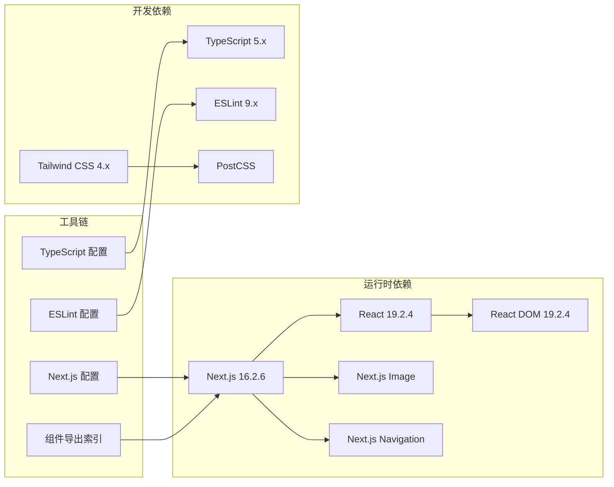

**图表来源**
- [package.json:15-29](file://package.json#L15-L29)

### 构建配置分析

项目的构建配置展现了现代前端工程化的特点：

#### TypeScript 配置要点
- 启用严格模式确保类型安全
- 支持 ES 模块和 Bundler 解析
- 配置路径别名简化导入

#### Next.js 配置扩展
- 支持实验性功能
- 可扩展的插件系统
- 灵活的构建选项

#### 组件导出索引
- 统一的组件导出入口
- 简化组件导入路径
- 支持 Tree Shaking

**章节来源**
- [package.json:1-31](file://package.json#L1-L31)
- [tsconfig.json:1-35](file://tsconfig.json#L1-L35)
- [next.config.ts:1-8](file://next.config.ts#L1-L8)
- [component/index.ts:1-6](file://component/index.ts#L1-L6)

## 性能考虑

### 优化策略

blod 项目实施了多项性能优化措施：

#### 图片优化
- 使用 Next.js Image 组件自动优化
- 支持多种格式转换（WebP 等）
- 实现智能尺寸选择

#### 字体优化
- 自动字体子集化
- 支持字体预加载
- 实现字体回退机制

#### 构建优化
- Tree Shaking 减少包体积
- 代码分割提升加载速度
- 缓存策略优化重复访问

#### 组件优化
- 使用 React.lazy 实现组件懒加载
- 优化组件渲染性能
- 减少不必要的重渲染

### 性能监控

建议实施以下性能监控措施：
- 使用浏览器开发者工具分析性能
- 监控 Lighthouse 分数
- 实施核心 Web 指标（LCP、FID、CLS）

## 故障排除指南

### 常见问题及解决方案

#### 样式不生效
- 检查 Tailwind CSS 配置
- 验证 CSS 变量定义
- 确认类名拼写正确

#### 字体加载问题
- 检查网络连接
- 验证字体文件路径
- 查看浏览器控制台错误

#### 构建失败
- 运行 `npm run lint` 检查代码质量
- 更新依赖到兼容版本
- 清理缓存后重新安装

#### 组件导入问题
- 检查组件导出索引配置
- 验证路径别名设置
- 确认组件文件存在

### 调试技巧

#### 开发环境调试
- 使用 React DevTools 分析组件树
- 利用 Next.js 日志输出
- 实施条件断点调试

#### 生产环境调试
- 启用生产模式日志
- 使用性能分析工具
- 监控用户行为分析

**章节来源**
- [AGENTS.md:1-6](file://AGENTS.md#L1-L6)

## 结论

blod 项目为 React 组件开发提供了优秀的实践范例。通过深入分析其架构设计、组件实现和最佳实践，我们可以总结出以下关键要点：

### 核心设计理念
- **模块化设计**：清晰的组件边界和职责分离
- **性能优先**：从构建到运行的全方位优化
- **用户体验**：响应式设计和交互优化
- **可维护性**：良好的代码组织和文档规范
- **组件复用**：通过统一的组件导出索引实现模块化管理

### 最佳实践建议
1. **组件设计**：遵循单一职责原则，实现高内聚低耦合
2. **状态管理**：合理选择状态管理模式，避免过度复杂化
3. **性能优化**：实施渐进式优化策略，持续监控性能指标
4. **代码质量**：建立完善的测试和代码审查流程
5. **文档规范**：保持代码注释和文档的同步更新
6. **组件架构**：采用统一的组件导出模式，提升代码组织性

### 未来发展方向
随着 React 和 Next.js 生态系统的不断发展，建议关注以下趋势：
- 更加完善的类型系统支持
- 增强的并发特性和 Suspense 机制
- 更好的开发体验和工具链集成
- 持续改进的性能优化策略
- 组件化开发模式的进一步完善

通过遵循这些指导原则和最佳实践，开发者可以构建出高质量、高性能的 React 应用程序，为用户提供卓越的使用体验。

**更新** 新增了对 Nav、PageHeader、BackgroundImg 等新组件的深入分析，展示了现代 React 组件开发的最佳实践，包括组件架构模式、状态管理、性能优化等方面的指导。