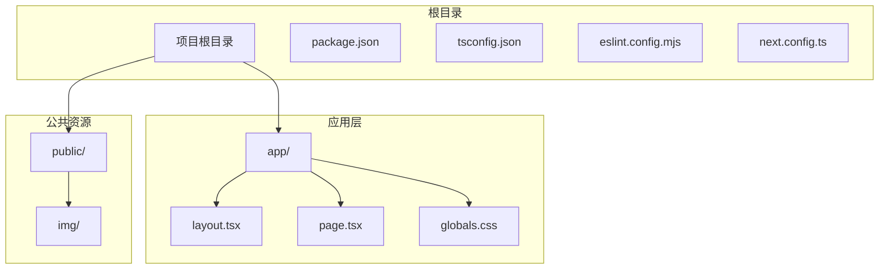
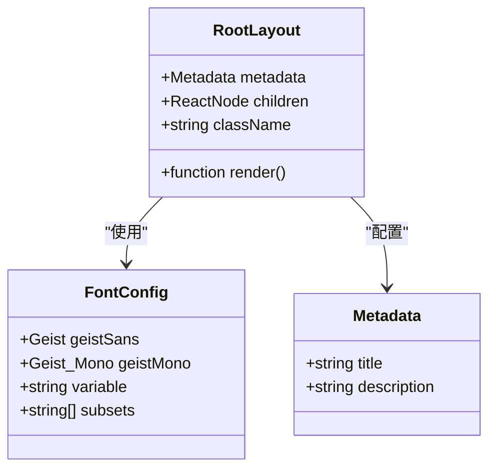
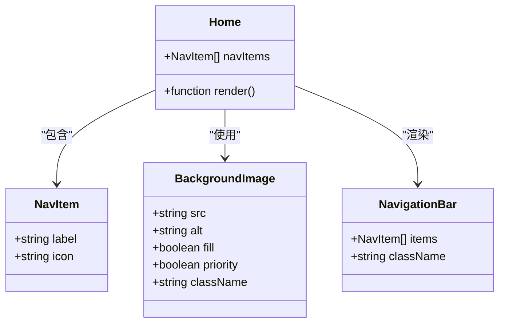
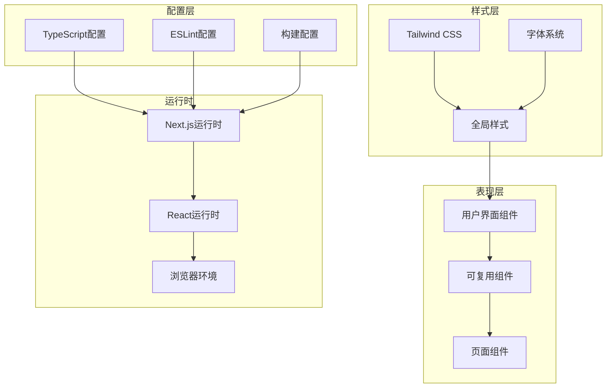
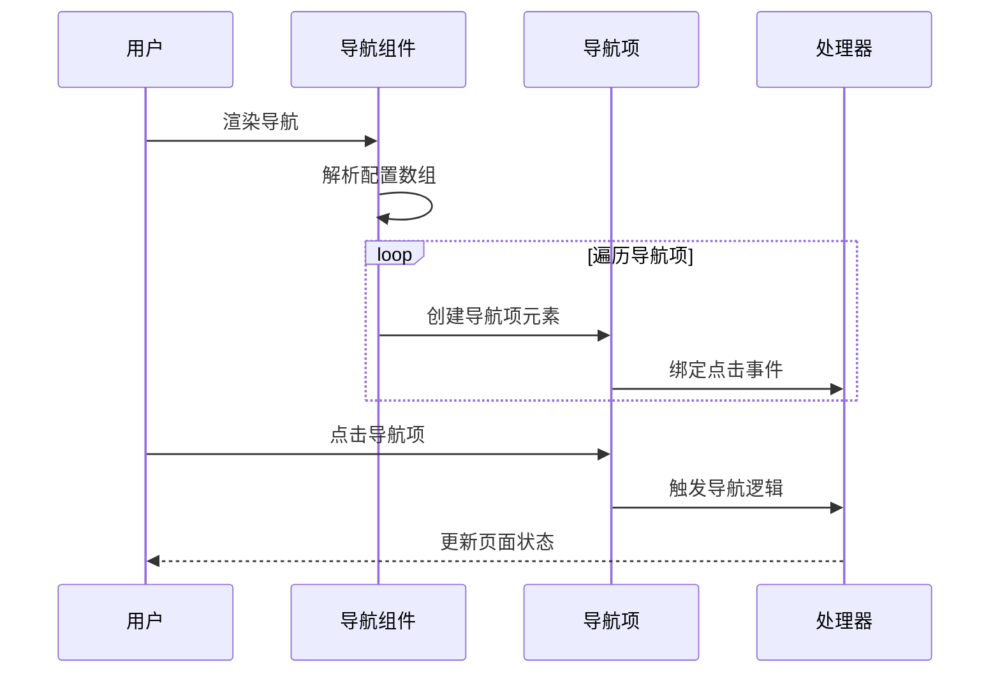
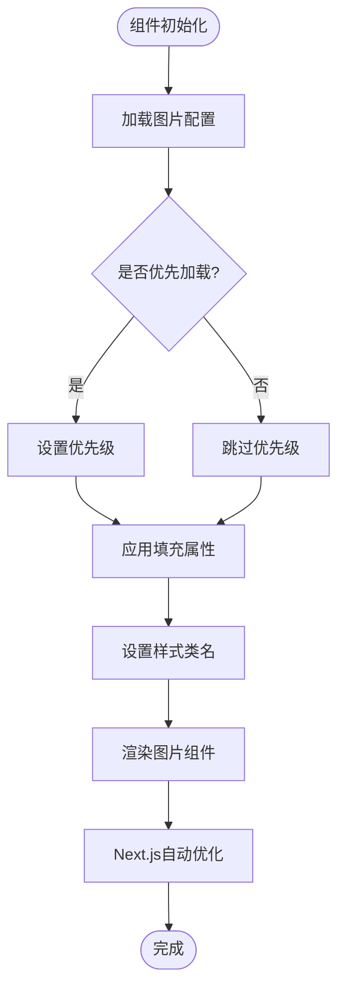
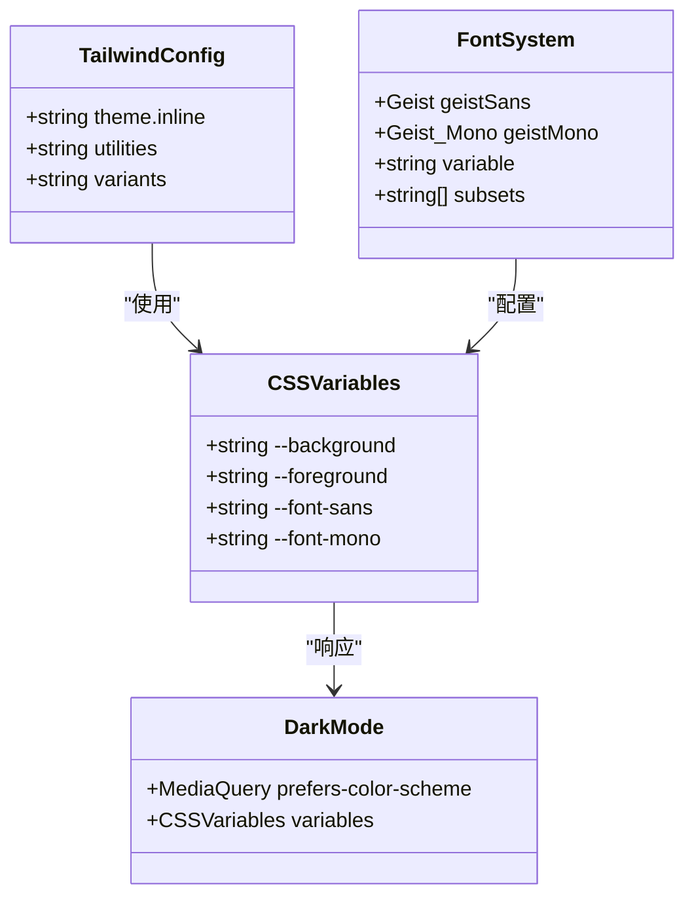
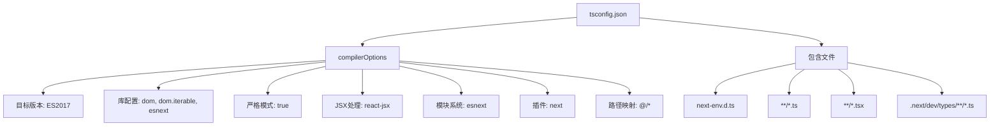

# 组件开发最佳实践

<cite>
**本文档引用的文件**
- [README.md](file://README.md)
- [package.json](file://package.json)
- [tsconfig.json](file://tsconfig.json)
- [app/layout.tsx](file://app/layout.tsx)
- [app/page.tsx](file://app/page.tsx)
- [app/globals.css](file://app/globals.css)
- [eslint.config.mjs](file://eslint.config.mjs)
- [next.config.ts](file://next.config.ts)
- [AGENTS.md](file://AGENTS.md)
</cite>

## 目录
1. [简介](#简介)
2. [项目结构](#项目结构)
3. [核心组件](#核心组件)
4. [架构概览](#架构概览)
5. [详细组件分析](#详细组件分析)
6. [依赖关系分析](#依赖关系分析)
7. [性能考虑](#性能考虑)
8. [故障排除指南](#故障排除指南)
9. [结论](#结论)
10. [附录](#附录)

## 简介

blod 是一个基于 Next.js 16.2.6 构建的现代化博客应用，采用 React 19.2.4 和 TypeScript 开发。该项目展示了现代前端开发的最佳实践，包括组件化设计、TypeScript 类型安全、性能优化和可访问性考虑。

项目的核心特点：
- 基于 App Router 的现代 Next.js 架构
- 完整的 TypeScript 配置和类型安全
- Tailwind CSS 样式系统集成
- 响应式设计和现代 UI 体验
- 性能友好的图片优化和字体加载

## 项目结构

blod 项目采用了 Next.js 13+ 推荐的 App Router 结构，这种结构提供了更好的性能和开发体验。



**图表来源**
- [app/layout.tsx:1-34](file://app/layout.tsx#L1-L34)
- [app/page.tsx:1-72](file://app/page.tsx#L1-L72)
- [app/globals.css:1-27](file://app/globals.css#L1-L27)

**章节来源**
- [package.json:1-31](file://package.json#L1-L31)
- [tsconfig.json:1-35](file://tsconfig.json#L1-L35)

## 核心组件

### 根布局组件 (RootLayout)

根布局组件是整个应用的基础容器，负责全局样式、字体加载和元数据管理。



**图表来源**
- [app/layout.tsx:1-34](file://app/layout.tsx#L1-L34)

### 主页组件 (Home)

主页组件展示了典型的页面级组件结构，包含了导航栏、背景图片和交互元素。



**图表来源**
- [app/page.tsx:1-72](file://app/page.tsx#L1-L72)

**章节来源**
- [app/layout.tsx:15-33](file://app/layout.tsx#L15-L33)
- [app/page.tsx:12-71](file://app/page.tsx#L12-L71)

## 架构概览

blod 项目采用分层架构设计，每个层级都有明确的职责分工。



**图表来源**
- [app/layout.tsx:1-34](file://app/layout.tsx#L1-L34)
- [app/page.tsx:1-72](file://app/page.tsx#L1-L72)
- [tsconfig.json:1-35](file://tsconfig.json#L1-L35)
- [eslint.config.mjs:1-19](file://eslint.config.mjs#L1-L19)

## 详细组件分析

### 导航组件设计模式

导航组件展示了组合模式和配置驱动的设计理念。



**图表来源**
- [app/page.tsx:3-10](file://app/page.tsx#L3-L10)
- [app/page.tsx:32-43](file://app/page.tsx#L32-L43)

### 图片优化组件

背景图片组件展示了 Next.js 图片优化的最佳实践。



**图表来源**
- [app/page.tsx:16-24](file://app/page.tsx#L16-L24)

**章节来源**
- [app/page.tsx:3-10](file://app/page.tsx#L3-L10)
- [app/page.tsx:16-24](file://app/page.tsx#L16-L24)

### 样式系统架构

样式系统采用了 CSS 变量和 Tailwind CSS 的混合架构。



**图表来源**
- [app/globals.css:1-27](file://app/globals.css#L1-L27)
- [app/layout.tsx:5-13](file://app/layout.tsx#L5-L13)

**章节来源**
- [app/globals.css:1-27](file://app/globals.css#L1-L27)
- [app/layout.tsx:5-13](file://app/layout.tsx#L5-L13)

## 依赖关系分析

### 技术栈依赖

blod 项目采用了现代化的技术栈组合，每个依赖都有明确的作用。

```mermaid
graph LR
subgraph "核心框架"
NextJS[Next.js 16.2.6]
React[React 19.2.4]
ReactDOM[React DOM 19.2.4]
end
subgraph "开发工具"
TypeScript[TypeScript 5]
ESLint[ESLint 9]
TailwindCSS[Tailwind CSS 4]
end
subgraph "类型定义"
TypesNode[@types/node]
TypesReact[@types/react]
TypesReactDom[@types/react-dom]
end
subgraph "构建工具"
PostCSS[PostCSS]
Bundler[Bundler]
end
NextJS --> React
React --> ReactDOM
TypeScript --> NextJS
ESLint --> TypeScript
TailwindCSS --> PostCSS
TypesNode --> React
TypesReact --> React
TypesReactDom --> ReactDOM
```

**图表来源**
- [package.json:15-29](file://package.json#L15-L29)

### TypeScript 配置分析

TypeScript 配置展现了严格模式和现代编译选项的最佳实践。



**图表来源**
- [tsconfig.json:2-23](file://tsconfig.json#L2-L23)

**章节来源**
- [package.json:15-29](file://package.json#L15-L29)
- [tsconfig.json:2-23](file://tsconfig.json#L2-L23)

## 性能考虑

### 图片优化策略

项目采用了 Next.js 图片优化的最佳实践：

1. **自动格式转换**: 使用现代图片格式如 WebP
2. **尺寸自适应**: 根据设备像素比选择合适尺寸
3. **懒加载**: 非首屏图片自动懒加载
4. **优先级标记**: 关键图片设置优先级

### 字体优化

字体系统通过以下方式优化性能：

1. **字体预加载**: 使用 next/font 自动优化
2. **变量字体**: 支持 CSS 变量动态切换
3. **子集加载**: 仅加载必要的字符子集
4. **回退机制**: 提供可靠的字体回退方案

### 构建优化

构建配置确保了最佳的打包和优化效果：

1. **Tree Shaking**: 启用模块热替换和摇树优化
2. **代码分割**: 自动进行代码分割
3. **压缩优化**: 生产环境自动压缩
4. **缓存策略**: 智能缓存头设置

## 故障排除指南

### 常见问题及解决方案

#### TypeScript 类型错误

**问题**: 编译时出现类型错误
**解决方案**: 
1. 检查 tsconfig.json 中的严格模式配置
2. 确保所有组件都有正确的类型注解
3. 验证导入路径的正确性

#### 样式不生效

**问题**: Tailwind CSS 样式没有应用
**解决方案**:
1. 检查全局样式文件的导入顺序
2. 确认 CSS 变量的正确定义
3. 验证类名拼写和大小写

#### 图片加载失败

**问题**: 背景图片无法显示
**解决方案**:
1. 检查图片路径是否正确
2. 确认图片文件存在于 public 目录
3. 验证图片格式的兼容性

**章节来源**
- [eslint.config.mjs:1-19](file://eslint.config.mjs#L1-L19)
- [app/globals.css:1-27](file://app/globals.css#L1-L27)
- [app/page.tsx:17-23](file://app/page.tsx#L17-L23)

## 结论

blod 项目展示了现代 React 应用开发的最佳实践。通过合理的组件设计、严格的 TypeScript 配置和性能优化策略，该项目为组件开发提供了完整的参考模板。

关键收获：
- 组件应该关注单一职责，保持简洁和可复用
- TypeScript 提供了强大的类型安全保障
- 性能优化应该从项目初期就纳入考虑
- 样式系统需要平衡灵活性和一致性

## 附录

### 渐进式学习路径

#### 初学者阶段
1. 理解基础组件概念和 JSX 语法
2. 学习 TypeScript 基础类型和接口
3. 掌握 Tailwind CSS 基本用法

#### 进阶阶段
1. 深入理解 React Hooks 和状态管理
2. 学习组件组合和高阶组件模式
3. 掌握性能优化技术和最佳实践

#### 专家阶段
1. 理解架构设计原则和模式
2. 掌握复杂状态管理和数据流
3. 具备系统化的问题解决能力

### 最佳实践清单

- **组件设计**: 单一职责、可复用、可测试
- **类型安全**: 全面的 TypeScript 类型定义
- **性能优化**: 图片优化、代码分割、缓存策略
- **可访问性**: 语义化标签、键盘导航、屏幕阅读器支持
- **代码质量**: ESLint 规则、单元测试、代码审查