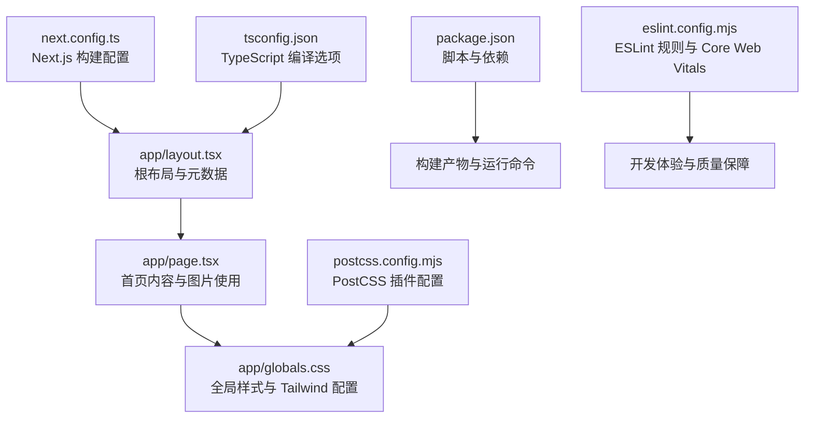
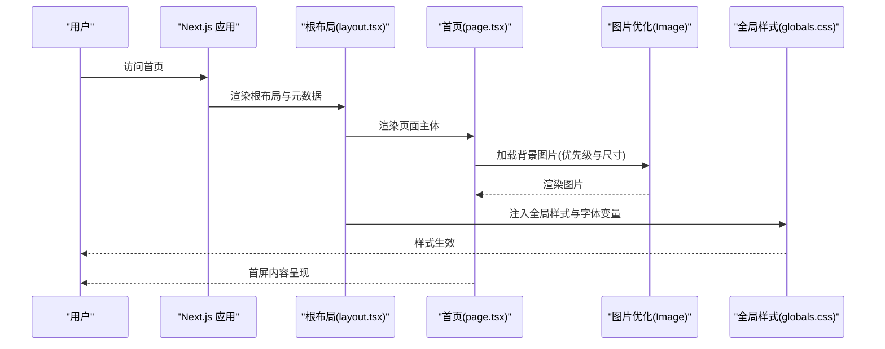
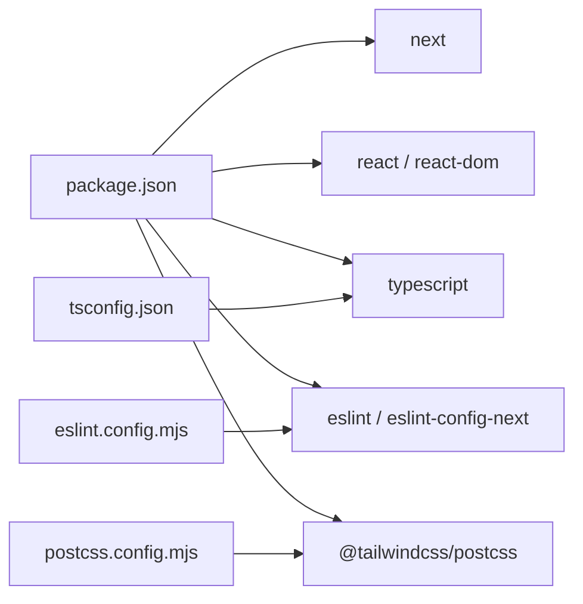

# 性能优化

<cite>
**本文引用的文件**
- [next.config.ts](file://next.config.ts)
- [package.json](file://package.json)
- [app/layout.tsx](file://app/layout.tsx)
- [app/page.tsx](file://app/page.tsx)
- [app/globals.css](file://app/globals.css)
- [postcss.config.mjs](file://postcss.config.mjs)
- [eslint.config.mjs](file://eslint.config.mjs)
- [tsconfig.json](file://tsconfig.json)
- [README.md](file://README.md)
</cite>

## 目录
1. [简介](#简介)
2. [项目结构](#项目结构)
3. [核心组件](#核心组件)
4. [架构总览](#架构总览)
5. [详细组件分析](#详细组件分析)
6. [依赖分析](#依赖分析)
7. [性能考量](#性能考量)
8. [故障排查指南](#故障排查指南)
9. [结论](#结论)
10. [附录](#附录)

## 简介
本指南面向 blod 项目在生产环境下的性能优化实践，结合 Next.js 的内置能力与当前仓库配置，系统讲解以下主题：
- Next.js 内置性能机制：代码分割、懒加载与预取策略
- 图片优化与 CDN 使用建议
- 缓存策略：浏览器缓存、CDN 缓存与服务器缓存
- 关键渲染路径（KCP）优化与首屏加载时间改善
- Lighthouse 与 Web Vitals 监控与优化
- 生产环境性能监控工具推荐与配置思路

本指南既提供可操作的落地建议，也给出基于现有代码结构的可视化图示，帮助开发者快速定位优化点。

## 项目结构
blod 采用 Next.js App Router 结构，核心页面与样式位于 app 目录，构建与样式工具通过独立配置文件管理。整体结构清晰，便于按模块进行性能优化。

图表来源
- [next.config.ts:1-8](file://next.config.ts#L1-L8)
- [app/layout.tsx:1-34](file://app/layout.tsx#L1-L34)
- [app/page.tsx:1-72](file://app/page.tsx#L1-L72)
- [app/globals.css:1-27](file://app/globals.css#L1-L27)
- [postcss.config.mjs:1-8](file://postcss.config.mjs#L1-L8)
- [package.json:1-31](file://package.json#L1-L31)
- [tsconfig.json:1-35](file://tsconfig.json#L1-L35)
- [eslint.config.mjs:1-19](file://eslint.config.mjs#L1-L19)

章节来源
- [next.config.ts:1-8](file://next.config.ts#L1-L8)
- [package.json:1-31](file://package.json#L1-L31)
- [app/layout.tsx:1-34](file://app/layout.tsx#L1-L34)
- [app/page.tsx:1-72](file://app/page.tsx#L1-L72)
- [app/globals.css:1-27](file://app/globals.css#L1-L27)
- [postcss.config.mjs:1-8](file://postcss.config.mjs#L1-L8)
- [tsconfig.json:1-35](file://tsconfig.json#L1-L35)
- [eslint.config.mjs:1-19](file://eslint.config.mjs#L1-L19)

## 核心组件
- 根布局与元数据：定义站点标题、描述与字体加载策略，为后续性能优化提供基础。
- 首页页面：包含背景图片与导航栏，是首屏渲染与图片优化的关键入口。
- 全局样式：集成 Tailwind 并通过 PostCSS 处理，影响打包体积与运行时开销。
- 构建与脚本：提供开发、构建与启动命令，支撑本地与生产部署流程。

章节来源
- [app/layout.tsx:15-18](file://app/layout.tsx#L15-L18)
- [app/page.tsx:12-71](file://app/page.tsx#L12-L71)
- [app/globals.css:1-27](file://app/globals.css#L1-L27)
- [package.json:9-14](file://package.json#L9-L14)

## 架构总览
下图展示从请求到首屏渲染的关键路径，以及与图片优化、字体加载、样式处理相关的组件交互。

图表来源
- [app/layout.tsx:20-33](file://app/layout.tsx#L20-L33)
- [app/page.tsx:12-71](file://app/page.tsx#L12-L71)
- [app/globals.css:1-27](file://app/globals.css#L1-L27)

## 详细组件分析

### 根布局与元数据（layout.tsx）
- 字体加载：通过 next/font 自动内联关键字形并生成变量，减少 FOIT/FOFT 风险。
- 元数据：设置标题与描述，利于 SEO 与分享预览，间接提升用户点击率与停留时间。
- HTML 根节点：设置语言与字体变量类名，确保全局样式与交互一致。

优化要点
- 保持字体子集最小化，仅包含必要字符集。
- 将非关键样式延迟加载，避免阻塞首屏渲染。

章节来源
- [app/layout.tsx:5-13](file://app/layout.tsx#L5-L13)
- [app/layout.tsx:15-18](file://app/layout.tsx#L15-L18)
- [app/layout.tsx:20-33](file://app/layout.tsx#L20-L33)

### 首页页面（page.tsx）
- 背景图片：使用 next/image，配合 fill、priority 等属性实现首屏关键图片的优化加载。
- 导航栏：简洁结构，避免复杂交互导致的主线程阻塞。
- 右侧悬浮按钮：使用固定定位，注意层级与事件绑定，避免影响滚动性能。

优化要点
- 为关键图片设置合适的尺寸与格式，优先使用现代格式（如 AVIF/WebP）。
- 对非关键图片采用懒加载，减少初始传输量。
- 合理拆分组件，利用 React Suspense 或动态导入实现代码分割。

章节来源
- [app/page.tsx:12-71](file://app/page.tsx#L12-L71)

### 全局样式与 Tailwind（globals.css、postcss.config.mjs）
- Tailwind 主题变量：通过 CSS 变量统一颜色与字体，减少重复样式。
- PostCSS 插件：启用 @tailwindcss/postcss 进行按需生成，降低 CSS 体积。
- 深色模式：基于 prefers-color-scheme 的媒体查询，提升可用性。

优化要点
- 在生产环境开启 CSS 压缩与 Tree-Shaking。
- 避免在全局样式中引入大体量第三方库。
- 使用原子化类名减少选择器复杂度，提升渲染效率。

章节来源
- [app/globals.css:1-27](file://app/globals.css#L1-L27)
- [postcss.config.mjs:1-8](file://postcss.config.mjs#L1-L8)

### 构建与脚本（next.config.ts、package.json、tsconfig.json）
- 构建配置：预留扩展点，可用于启用实验性优化或自定义插件。
- 脚本命令：提供开发、构建与启动流程，支撑本地与 CI/CD。
- TypeScript：严格模式与 bundler 解析，有助于早期发现潜在性能问题。

优化要点
- 在 next.config 中启用必要的生产优化（如实验性功能需谨慎评估）。
- 使用增量编译与隔离模块，缩短构建时间。
- 依赖版本保持更新，以获得性能与安全修复。

章节来源
- [next.config.ts:1-8](file://next.config.ts#L1-L8)
- [package.json:9-14](file://package.json#L9-L14)
- [tsconfig.json:1-35](file://tsconfig.json#L1-L35)

### ESLint 与 Core Web Vitals（eslint.config.mjs）
- 规则组合：集成 eslint-config-next 的 Core Web Vitals 规则，帮助在开发阶段识别潜在性能问题。
- 忽略项：覆盖默认忽略目录，确保规则对源码有效。

优化要点
- 将 Lighthouse/ Web Vitals 指标纳入 CI 质量门禁。
- 对告警规则进行分级治理，优先解决阻塞首屏的指标。

章节来源
- [eslint.config.mjs:1-19](file://eslint.config.mjs#L1-L19)

## 依赖分析
- 运行时依赖：next、react、react-dom 提供核心框架能力。
- 开发依赖：Tailwind、TypeScript、ESLint 与 Next.js 官方 ESLint 配置，保障开发体验与质量。
- 工具链：PostCSS 插件负责样式处理；TypeScript 编译器选项影响打包与类型检查。

图表来源
- [package.json:15-29](file://package.json#L15-L29)
- [tsconfig.json:16-23](file://tsconfig.json#L16-L23)
- [postcss.config.mjs:2-4](file://postcss.config.mjs#L2-L4)
- [eslint.config.mjs:2-7](file://eslint.config.mjs#L2-L7)

章节来源
- [package.json:15-29](file://package.json#L15-L29)
- [tsconfig.json:16-23](file://tsconfig.json#L16-L23)
- [postcss.config.mjs:1-8](file://postcss.config.mjs#L1-L8)
- [eslint.config.mjs:1-19](file://eslint.config.mjs#L1-L19)

## 性能考量

### Next.js 内置性能机制与实践
- 代码分割：App Router 默认按路由与组件边界进行分割，结合动态导入进一步拆分非关键路径。
- 懒加载：对非首屏组件与图片采用懒加载，降低初始包体与渲染压力。
- 预取策略：利用 Link 组件的预取能力与静态资源预加载，提升后续导航体验。

优化建议
- 将首屏无关的导航与交互组件标记为动态导入。
- 对图片较多的页面，优先保证关键图片的加载顺序与尺寸。
- 使用预加载与预连接（preload/rel=preconnect）加速关键资源。

章节来源
- [app/page.tsx:12-71](file://app/page.tsx#L12-L71)

### 图片优化与 CDN 使用
- 当前使用 next/image，已具备自动尺寸适配与格式选择能力。
- 建议：在生产环境使用支持现代格式与压缩的 CDN，并配置缓存头；对关键图片设置 priority 与合适的尺寸。

优化建议
- 为不同 DPR 设置多尺寸资源，避免过度放大。
- 使用 AVIF/WebP 作为首选格式，回退至 JPEG/PNG。
- 通过 CDN 的缓存策略与边缘计算进一步压缩与加速。

章节来源
- [app/page.tsx:17-23](file://app/page.tsx#L17-L23)

### 缓存策略
- 浏览器缓存：通过静态资源命名与版本控制，结合 HTTP 缓存头实现长效缓存。
- CDN 缓存：针对不同资源类型设置差异化的缓存策略（HTML、JS/CSS、图片）。
- 服务器缓存：在服务端渲染场景下，合理设置缓存与失效策略，平衡新鲜度与性能。

优化建议
- 对静态资源启用 immutable 缓存与长 TTL。
- 对动态内容设置短 TTL 并支持条件请求。
- 利用 ETag/Last-Modified 实现协商缓存。

章节来源
- [next.config.ts:3-5](file://next.config.ts#L3-L5)

### 关键渲染路径（KCP）优化与首屏加载
- 减少阻塞渲染的资源：内联关键 CSS，延迟非关键样式与脚本。
- 优化字体加载：使用字体显示交换（font-display: swap），避免长时间无字体。
- 控制首屏图片数量与大小，确保关键图片优先加载。

优化建议
- 使用 CSS-in-JS 或内联关键样式，减少额外请求。
- 将非关键图片延迟加载，使用占位或骨架屏提升感知性能。

章节来源
- [app/layout.tsx:5-13](file://app/layout.tsx#L5-L13)
- [app/page.tsx:17-23](file://app/page.tsx#L17-L23)

### Lighthouse 与 Web Vitals 监控与优化
- 开发期：通过 ESLint Core Web Vitals 规则在提交前拦截问题。
- 生产期：结合自动化测试与持续监控，跟踪 LCP、FID、CLS 等指标。

优化建议
- 将 Lighthouse 结果纳入 CI，设定阈值与回归预警。
- 针对 LCP/FID/CLS 的具体问题制定专项优化计划。

章节来源
- [eslint.config.mjs:2-7](file://eslint.config.mjs#L2-L7)

### 生产环境性能监控工具推荐与配置
- APM/性能监控：Sentry Performance、New Relic、DataDog 等，用于追踪前端性能与错误。
- Web Vitals 监测：Google Analytics 4、Firebase Performance Monitoring、自建埋点。
- Lighthouse：CI 集成（GitHub Actions/Azure Pipelines），定期生成报告并对比基线。

配置思路
- 在应用初始化处注入性能监控 SDK，并对关键路由与交互打点。
- 对首屏与交互关键路径建立基准，持续回归对比。

## 故障排查指南
- 构建失败或性能退化
  - 检查 next.config 扩展是否引入不兼容插件。
  - 确认 TypeScript 严格模式未产生过多约束导致编译缓慢。
- 首屏过慢
  - 排查关键图片是否过大或过多，确认是否正确使用 priority 与尺寸。
  - 检查全局样式的体积与加载顺序。
- 字体闪烁或加载慢
  - 确认字体变量已正确注入，且未加载不必要的子集。
- Lighthouse 指标异常
  - 使用 ESLint Core Web Vitals 规则在开发阶段拦截问题。
  - 对 CLS/FID/LCP 分别进行针对性优化与回归验证。

章节来源
- [next.config.ts:3-5](file://next.config.ts#L3-L5)
- [tsconfig.json:7-15](file://tsconfig.json#L7-L15)
- [app/page.tsx:17-23](file://app/page.tsx#L17-L23)
- [app/globals.css:1-27](file://app/globals.css#L1-L27)
- [eslint.config.mjs:2-7](file://eslint.config.mjs#L2-L7)

## 结论
通过对 blod 项目的结构与配置分析，可以基于 Next.js 的内置能力与现有工具链，系统性地推进生产环境性能优化。建议优先从图片优化、关键渲染路径与缓存策略入手，再结合 Lighthouse 与 Web Vitals 的持续监控，形成闭环优化流程。同时，借助 ESLint 的 Core Web Vitals 规则与 CI 集成，将性能治理前置到开发阶段，确保长期稳定。

## 附录
- 部署建议：结合 Vercel 等平台的边缘网络与缓存能力，进一步提升全球访问性能。
- 文档参考：Next.js 官方文档与性能最佳实践，持续关注新版本带来的优化特性。