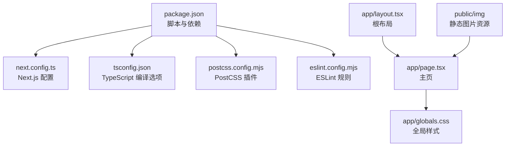
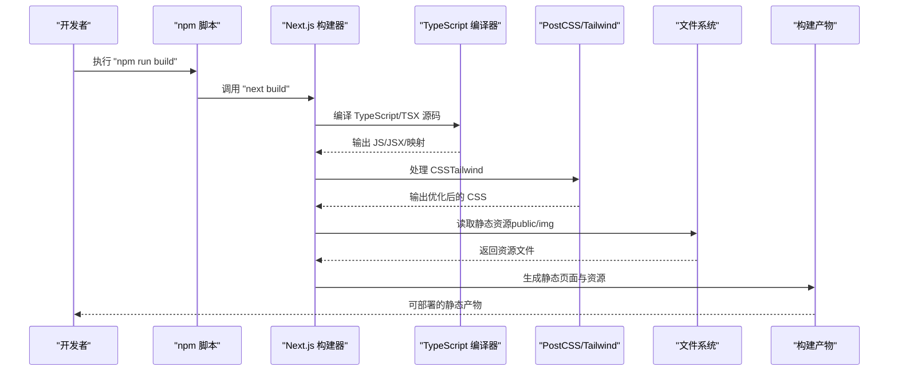
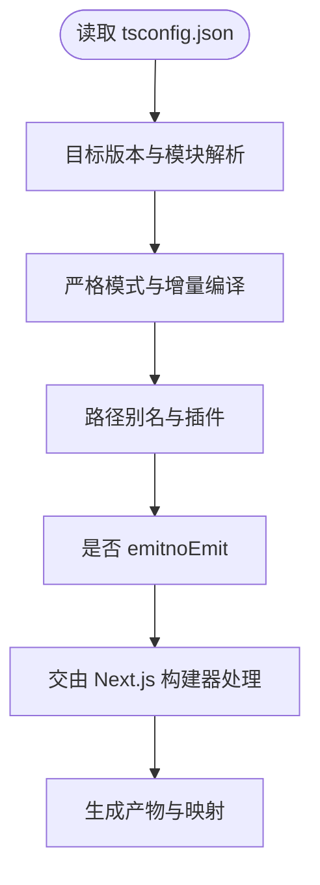
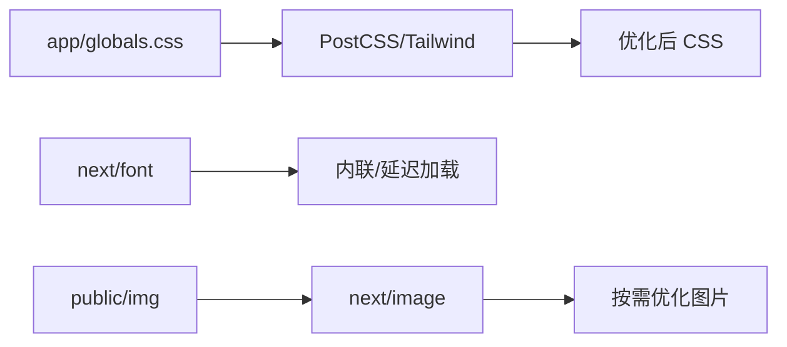
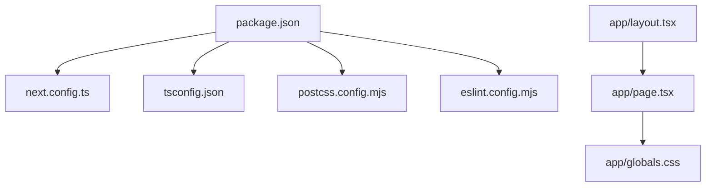

# 构建流程

<cite>
**本文引用的文件**
- [package.json](file://package.json)
- [next.config.ts](file://next.config.ts)
- [tsconfig.json](file://tsconfig.json)
- [postcss.config.mjs](file://postcss.config.mjs)
- [eslint.config.mjs](file://eslint.config.mjs)
- [app/layout.tsx](file://app/layout.tsx)
- [app/page.tsx](file://app/page.tsx)
- [app/globals.css](file://app/globals.css)
- [README.md](file://README.md)
</cite>

## 目录
1. [简介](#简介)
2. [项目结构](#项目结构)
3. [核心组件](#核心组件)
4. [架构总览](#架构总览)
5. [详细组件分析](#详细组件分析)
6. [依赖关系分析](#依赖关系分析)
7. [性能考量](#性能考量)
8. [故障排查指南](#故障排查指南)
9. [结论](#结论)
10. [附录](#附录)

## 简介
本文件面向 blod 项目，系统性梳理 Next.js 构建流程与产物组织，覆盖以下主题：
- npm run build 的执行步骤与输出结果
- TypeScript 编译配置对构建的影响
- 资源优化（字体、CSS、图片）与静态文件生成
- 构建产物结构与组织方式
- 常见问题排查与解决方案
- 构建时间与内存使用优化建议

本项目基于 Next.js 应用程序目录结构，采用 App Router，使用 Tailwind CSS 与 PostCSS 进行样式处理，并通过 TypeScript 提供类型安全。

## 项目结构
blod 项目采用 Next.js App Router 结构，关键目录与文件如下：
- app：应用页面与布局，包含根布局、主页等
- public：静态资源目录（如图片）
- 根目录配置：Next.js 配置、TypeScript 配置、PostCSS 配置、ESLint 配置、包脚本等

图表来源
- [package.json:1-31](file://package.json#L1-L31)
- [next.config.ts:1-8](file://next.config.ts#L1-L8)
- [tsconfig.json:1-35](file://tsconfig.json#L1-L35)
- [postcss.config.mjs:1-8](file://postcss.config.mjs#L1-L8)
- [eslint.config.mjs:1-19](file://eslint.config.mjs#L1-L19)
- [app/layout.tsx:1-34](file://app/layout.tsx#L1-L34)
- [app/page.tsx:1-72](file://app/page.tsx#L1-L72)
- [app/globals.css:1-27](file://app/globals.css#L1-L27)

章节来源
- [package.json:1-31](file://package.json#L1-L31)
- [README.md:1-37](file://README.md#L1-L37)

## 核心组件
- 构建脚本与工具链
  - npm run build：调用 next build 执行生产构建
  - 依赖：Next.js、React、Tailwind CSS、TypeScript、ESLint
- Next.js 配置
  - next.config.ts 当前为空配置，保留扩展点
- TypeScript 配置
  - 目标与模块解析策略、严格模式、增量编译、路径别名等
- PostCSS/Tailwind
  - 使用 Tailwind v4 的 PostCSS 插件进行样式处理
- ESLint
  - 基于 eslint-config-next 的规则，自定义忽略项

章节来源
- [package.json:9-29](file://package.json#L9-L29)
- [next.config.ts:3-7](file://next.config.ts#L3-L7)
- [tsconfig.json:2-24](file://tsconfig.json#L2-L24)
- [postcss.config.mjs:1-8](file://postcss.config.mjs#L1-L8)
- [eslint.config.mjs:1-19](file://eslint.config.mjs#L1-L19)

## 架构总览
下图展示从 npm run build 到最终产物的关键流程与组件交互。

图表来源
- [package.json:11](file://package.json#L11)
- [tsconfig.json:2-24](file://tsconfig.json#L2-L24)
- [postcss.config.mjs:1-8](file://postcss.config.mjs#L1-L8)
- [app/page.tsx:1-72](file://app/page.tsx#L1-L72)
- [app/globals.css:1-27](file://app/globals.css#L1-L27)

## 详细组件分析

### TypeScript 编译配置对构建的影响
- 目标与模块解析
  - 目标版本与模块解析策略影响打包体积与兼容性
- 严格模式与增量编译
  - 严格模式提升类型安全性；增量编译减少重复工作量
- 路径别名与插件
  - 路径别名简化导入；内置插件增强 Next.js 类型体验
- noEmit 与 isolatedModules
  - 构建阶段由 Next.js 内部负责 emit，避免重复编译

图表来源
- [tsconfig.json:2-24](file://tsconfig.json#L2-L24)

章节来源
- [tsconfig.json:2-24](file://tsconfig.json#L2-L24)

### 样式与资源优化
- Tailwind CSS 与 PostCSS
  - 全局样式通过 Tailwind v4 的 PostCSS 插件处理，支持按需裁剪与主题变量
- 字体优化
  - 使用 next/font 自动内联与延迟加载，减少首屏阻塞
- 图片优化
  - 使用 next/image，自动根据设备像素比与尺寸生成优化图像

图表来源
- [app/globals.css:1-27](file://app/globals.css#L1-L27)
- [postcss.config.mjs:1-8](file://postcss.config.mjs#L1-L8)
- [app/layout.tsx:2-3](file://app/layout.tsx#L2-L3)
- [app/page.tsx:17-24](file://app/page.tsx#L17-L24)

章节来源
- [app/globals.css:1-27](file://app/globals.css#L1-L27)
- [postcss.config.mjs:1-8](file://postcss.config.mjs#L1-L8)
- [app/layout.tsx:2-3](file://app/layout.tsx#L2-L3)
- [README.md:21](file://README.md#L21)

### 构建产物结构与组织
- 产物位置
  - Next.js 默认在开发模式下生成 .next 目录；生产构建会生成可部署的静态资源
- 页面与路由
  - App Router 下的页面组件会被转换为静态 HTML/JS，配合客户端水合
- 资源组织
  - 样式、字体、图片等资源被 Next.js 优化并放置到输出目录中
- 静态资源
  - public 目录下的资源直接复制到构建输出根目录

章节来源
- [README.md:35](file://README.md#L35)
- [app/page.tsx:17-24](file://app/page.tsx#L17-L24)

### 构建命令执行步骤与输出
- npm run build
  - 调用 next build，完成类型检查（由 Next.js 内部处理）、编译、优化与静态文件生成
- 输出内容
  - 包含已优化的页面、静态资源、映射文件等，可用于生产环境部署

章节来源
- [package.json:11](file://package.json#L11)

## 依赖关系分析
- 脚本与依赖
  - package.json 定义了开发、构建、启动与 lint 脚本，并声明 Next.js、React、Tailwind、TypeScript、ESLint 等依赖
- 配置耦合
  - tsconfig.json 与 next.config.ts 影响构建行为；postcss.config.mjs 与 app/globals.css 影响样式管线
- 组件耦合
  - app/layout.tsx 作为根布局，app/page.tsx 作为主页，二者共同决定页面结构与样式

图表来源
- [package.json:1-31](file://package.json#L1-L31)
- [next.config.ts:1-8](file://next.config.ts#L1-L8)
- [tsconfig.json:1-35](file://tsconfig.json#L1-L35)
- [postcss.config.mjs:1-8](file://postcss.config.mjs#L1-L8)
- [eslint.config.mjs:1-19](file://eslint.config.mjs#L1-L19)
- [app/layout.tsx:1-34](file://app/layout.tsx#L1-L34)
- [app/page.tsx:1-72](file://app/page.tsx#L1-L72)
- [app/globals.css:1-27](file://app/globals.css#L1-L27)

章节来源
- [package.json:1-31](file://package.json#L1-L31)

## 性能考量
- 构建时间优化
  - 启用增量编译（TypeScript）以减少重复工作
  - 使用严格模式与合理的模块解析策略，避免不必要的扫描
  - 将大型依赖拆分或按需引入，降低打包体积
- 内存使用优化
  - 控制并发任务数量，避免同时运行多个大型构建进程
  - 清理缓存与临时文件，释放磁盘与内存占用
  - 合理配置 PostCSS/Tailwind，避免生成冗余样式
- 资源优化
  - 使用 next/image 自动优化图片；合理设置尺寸与格式
  - 使用 next/font 减少首屏阻塞；避免加载过多字体变体
  - Tailwind 按需生成样式，避免全量引入

章节来源
- [tsconfig.json:13-15](file://tsconfig.json#L13-L15)
- [postcss.config.mjs:1-8](file://postcss.config.mjs#L1-L8)
- [app/page.tsx:17-24](file://app/page.tsx#L17-L24)
- [app/layout.tsx:2-3](file://app/layout.tsx#L2-L3)

## 故障排查指南
- 构建失败或类型错误
  - 检查 tsconfig.json 的严格模式与模块解析设置
  - 确认路径别名与插件配置正确
- 样式未生效或 Tailwind 未生成
  - 确认 postcss.config.mjs 中的插件配置
  - 检查 app/globals.css 是否正确引入 Tailwind
- 图片加载异常
  - 确认 public/img 路径与 next/image 的 src 配置一致
  - 检查图片格式与尺寸是否符合要求
- 部署相关问题
  - 参考 Next.js 部署文档，确认输出目录与服务器配置

章节来源
- [tsconfig.json:2-24](file://tsconfig.json#L2-L24)
- [postcss.config.mjs:1-8](file://postcss.config.mjs#L1-L8)
- [app/globals.css:1-27](file://app/globals.css#L1-L27)
- [app/page.tsx:17-24](file://app/page.tsx#L17-L24)
- [README.md:35](file://README.md#L35)

## 结论
blod 项目基于 Next.js App Router，结合 TypeScript、Tailwind CSS 与 next/image 实现了现代化的构建与优化流程。通过合理的配置与优化策略，可在保证质量的同时显著缩短构建时间并降低内存占用。建议在团队协作中统一 ESLint 规则与构建脚本，确保一致性与可维护性。

## 附录
- 关键文件速览
  - 构建脚本与依赖：[package.json:9-29](file://package.json#L9-L29)
  - Next.js 配置：[next.config.ts:3-7](file://next.config.ts#L3-L7)
  - TypeScript 配置：[tsconfig.json:2-24](file://tsconfig.json#L2-L24)
  - PostCSS 配置：[postcss.config.mjs:1-8](file://postcss.config.mjs#L1-L8)
  - ESLint 配置：[eslint.config.mjs:1-19](file://eslint.config.mjs#L1-L19)
  - 根布局：[app/layout.tsx:1-34](file://app/layout.tsx#L1-L34)
  - 主页：[app/page.tsx:1-72](file://app/page.tsx#L1-L72)
  - 全局样式：[app/globals.css:1-27](file://app/globals.css#L1-L27)