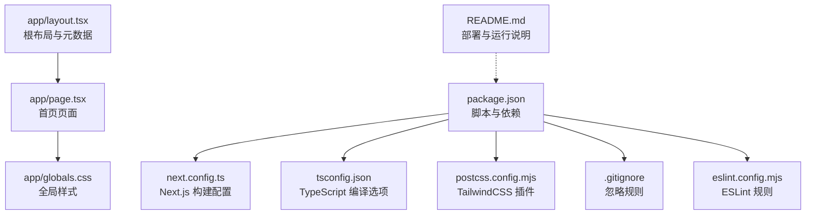
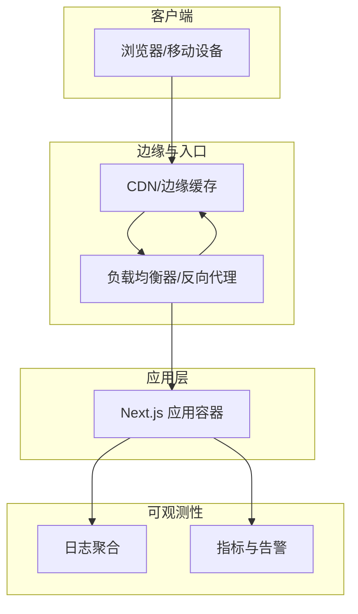
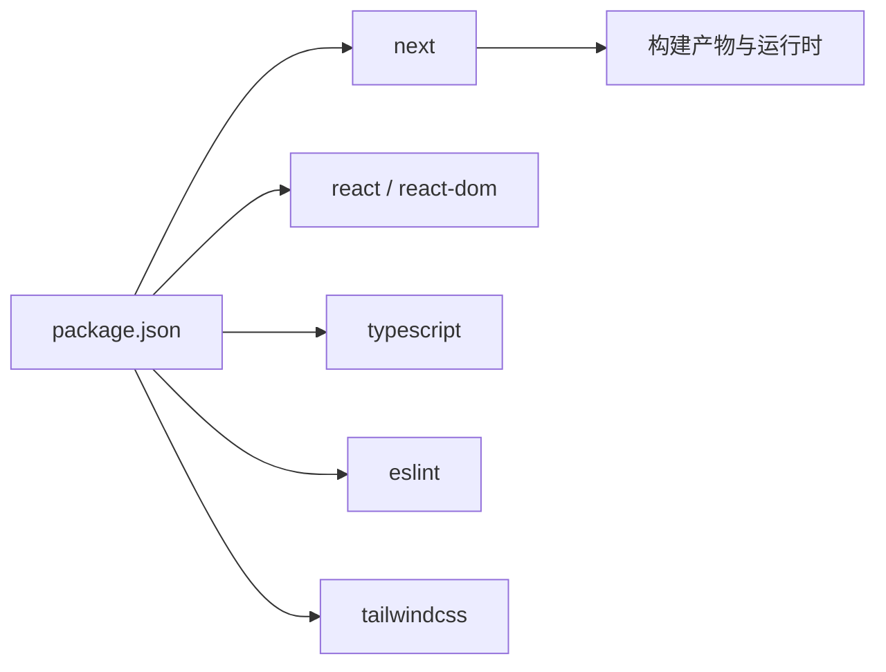

# 生产环境配置

<cite>
**本文引用的文件**
- [package.json](file://package.json)
- [next.config.ts](file://next.config.ts)
- [tsconfig.json](file://tsconfig.json)
- [postcss.config.mjs](file://postcss.config.mjs)
- [.gitignore](file://.gitignore)
- [eslint.config.mjs](file://eslint.config.mjs)
- [README.md](file://README.md)
- [app/layout.tsx](file://app/layout.tsx)
- [app/page.tsx](file://app/page.tsx)
- [app/globals.css](file://app/globals.css)
- [AGENTS.md](file://AGENTS.md)
- [CLAUDE.md](file://CLAUDE.md)
</cite>

## 目录
1. [简介](#简介)
2. [项目结构](#项目结构)
3. [核心组件](#核心组件)
4. [架构总览](#架构总览)
5. [详细组件分析](#详细组件分析)
6. [依赖分析](#依赖分析)
7. [性能考虑](#性能考虑)
8. [故障排查指南](#故障排查指南)
9. [结论](#结论)
10. [附录](#附录)

## 简介
本文件面向 blod 项目的生产环境配置与运维实践，聚焦以下方面：
- 环境变量与敏感信息保护
- 安全配置（CSP、HSTS、XSS 防护等）
- 日志与错误追踪
- 监控与告警
- 负载均衡与高可用
- SSL/TLS 证书与 HTTPS 强制跳转
- 备份与灾难恢复策略

由于当前仓库为最小化 Next.js 应用示例，未包含后端服务或数据库层，本文在不改变现有代码的前提下，给出可直接落地的生产级配置建议与最佳实践。

## 项目结构
该项目采用 Next.js App Router 结构，前端静态资源与构建产物由 Next.js 管理；开发与生产脚本通过 npm scripts 提供；样式使用 TailwindCSS；类型检查与 ESLint 规则已配置。

图表来源
- [package.json:1-31](file://package.json#L1-L31)
- [next.config.ts:1-8](file://next.config.ts#L1-L8)
- [tsconfig.json:1-35](file://tsconfig.json#L1-L35)
- [postcss.config.mjs:1-8](file://postcss.config.mjs#L1-L8)
- [.gitignore:1-41](file://.gitignore#L1-L41)
- [eslint.config.mjs:1-18](file://eslint.config.mjs#L1-L18)
- [app/layout.tsx:1-34](file://app/layout.tsx#L1-L34)
- [app/page.tsx:1-72](file://app/page.tsx#L1-L72)
- [app/globals.css:1-27](file://app/globals.css#L1-L27)
- [README.md:1-37](file://README.md#L1-L37)

章节来源
- [package.json:1-31](file://package.json#L1-L31)
- [next.config.ts:1-8](file://next.config.ts#L1-L8)
- [tsconfig.json:1-35](file://tsconfig.json#L1-L35)
- [postcss.config.mjs:1-8](file://postcss.config.mjs#L1-L8)
- [.gitignore:1-41](file://.gitignore#L1-L41)
- [eslint.config.mjs:1-18](file://eslint.config.mjs#L1-L18)
- [README.md:1-37](file://README.md#L1-L37)

## 核心组件
- 构建与运行脚本：通过 npm scripts 统一管理开发、构建与启动流程。
- Next.js 配置：next.config.ts 作为扩展点，用于生产环境增强（如自定义编译器、插件、性能优化等）。
- 类型与校验：tsconfig.json 严格模式与路径别名；ESLint 规则确保代码质量。
- 样式系统：TailwindCSS 通过 PostCSS 插件启用，支持暗色主题与响应式设计。
- 忽略规则：.gitignore 明确排除 node_modules、构建产物与环境文件，避免敏感信息泄露。

章节来源
- [package.json:9-14](file://package.json#L9-L14)
- [next.config.ts:3-5](file://next.config.ts#L3-L5)
- [tsconfig.json:2-24](file://tsconfig.json#L2-L24)
- [postcss.config.mjs:1-8](file://postcss.config.mjs#L1-L8)
- [.gitignore:3-35](file://.gitignore#L3-L35)

## 架构总览
下图展示生产环境的关键组件与交互关系：应用容器承载 Next.js 前端；反向代理负责 TLS 终止、HTTP/HTTPS 协议转换与静态资源缓存；CDN 提升全球访问性能；日志与监控系统贯穿请求链路。

## 详细组件分析

### 环境变量与敏感信息保护
- 环境变量命名与作用域
  - 建议区分前端与后端环境变量；前端变量需以特定前缀暴露于浏览器（如 NEXT_PUBLIC_），后端变量仅在服务端可见。
  - 在 .gitignore 中默认忽略 .env* 文件，避免误提交至版本库。
- 最小暴露原则
  - 将密钥、令牌与数据库连接字符串置于后端或专用密钥管理服务中，前端仅消费公开 API。
  - 使用只读权限与短期令牌，定期轮换。
- 变更与审计
  - 通过 CI/CD 的受控发布流程更新环境变量，保留变更记录与回滚预案。

章节来源
- [.gitignore:33-35](file://.gitignore#L33-L35)
- [README.md:32-36](file://README.md#L32-L36)

### 安全配置（CSP、HSTS、XSS 防护）
- 内容安全策略（CSP）
  - 在反向代理或 Next.js 中间件中注入 CSP 头，限制脚本执行来源、内联脚本与外链资源。
  - 对字体、图片、媒体与 iframe 资源分别设定白名单，遵循最小授权原则。
- HTTP 严格传输安全（HSTS）
  - 启用 HSTS 并设置合理 max-age，配合预加载清单（如需）提升安全性。
- XSS 与点击劫持防护
  - 设置 X-Content-Type-Options、X-Frame-Options、Referrer-Policy 等头部，降低常见攻击面。
- 输入与输出校验
  - 对用户输入进行严格的白名单过滤与长度限制；对输出内容进行 HTML 转义与上下文适配。

章节来源
- [app/layout.tsx:15-18](file://app/layout.tsx#L15-L18)

### 日志记录与错误追踪
- 日志采集
  - 应用侧输出结构化日志（JSON），包含时间戳、级别、请求 ID、路由与状态码。
  - 反向代理记录访问日志（如 Nginx combined），结合上游应用日志进行关联分析。
- 错误追踪
  - 使用集中式错误追踪平台（如 Sentry、LogRocket）上报前端异常与性能问题。
  - 对后端服务统一接入 APM（如 Jaeger、DataDog）实现分布式追踪。
- 日志保留与合规
  - 制定日志保留周期与脱敏策略，满足数据保护法规要求。

章节来源
- [README.md:32-36](file://README.md#L32-L36)

### 监控与告警
- 指标体系
  - 关键指标：请求量、错误率、P95/P99 延迟、并发连接数、CPU/内存/磁盘使用率。
  - 业务指标：页面首屏时间、功能完成率、转化率等。
- 告警策略
  - 基于阈值与趋势的多级告警；针对不同 SLA 设定不同严重级别。
  - 告警收敛与抑制，避免风暴传播。
- 可视化
  - 使用 Grafana、Kibana 或云厂商控制台构建仪表盘，实时掌握系统健康状况。

章节来源
- [README.md:32-36](file://README.md#L32-L36)

### 负载均衡与高可用
- 节点与副本
  - 至少部署两个以上应用实例，分布在不同可用区，避免单点故障。
- 健康检查
  - 配置 L7 健康检查与就绪探针，确保流量仅转发到健康实例。
- 会话与状态
  - 无状态设计优先；若需会话，使用可伸缩的外部存储（如 Redis）或短生命周期令牌。
- 回滚与蓝绿发布
  - 采用蓝绿或金丝雀发布策略，降低变更风险。

章节来源
- [README.md:32-36](file://README.md#L32-L36)

### SSL/TLS 证书与 HTTPS 强制跳转
- 证书管理
  - 使用自动化证书签发与续期（如 ACME 协议），确保证书有效期内自动更新。
- 强制 HTTPS
  - 反向代理或中间件中将 HTTP 请求重定向至 HTTPS，并设置 HSTS。
- 证书链与加密套件
  - 选择现代加密套件与合适的密钥长度，禁用过时协议与弱算法。

章节来源
- [README.md:32-36](file://README.md#L32-L36)

### 备份与灾难恢复
- 数据备份
  - 对静态资源与配置进行定期快照；对数据库与会话存储制定备份策略与恢复演练计划。
- RTO/RPO
  - 明确恢复时间目标与恢复点目标，优先保障核心业务数据。
- DR 测试
  - 定期进行灾难恢复演练，验证备份完整性与恢复流程有效性。

章节来源
- [README.md:32-36](file://README.md#L32-L36)

## 依赖分析
- 运行时依赖
  - next、react、react-dom：Next.js 应用的核心运行时。
- 开发与构建工具
  - TypeScript、TailwindCSS、ESLint：保证类型安全、样式一致性与代码规范。
- 构建与打包
  - Next.js 默认使用其内置的打包与优化策略；可通过 next.config.ts 扩展。

图表来源
- [package.json:15-29](file://package.json#L15-L29)

章节来源
- [package.json:15-29](file://package.json#L15-L29)

## 性能考虑
- 资源优化
  - 启用图片优化、字体优化与静态资源压缩；合理设置缓存头。
- 渲染性能
  - 使用 React Suspense 与懒加载；减少首屏 JavaScript 体积。
- 网络与边缘
  - 利用 CDN 与边缘缓存缩短访问路径；开启 Gzip/Br 压缩。
- 监控与调优
  - 基于性能指标持续优化，关注关键渲染路径与交互延迟。

章节来源
- [README.md:32-36](file://README.md#L32-L36)

## 故障排查指南
- 常见问题定位
  - 查看应用与反向代理日志，确认请求链路与错误栈。
  - 使用浏览器开发者工具检查网络请求、CSP 报告与安全头。
- 环境变量核验
  - 确认变量是否正确注入、是否存在拼写错误或权限不足。
- 配置回滚
  - 通过版本控制系统快速回退到上一个稳定配置，缩小问题范围。

章节来源
- [.gitignore:33-35](file://.gitignore#L33-L35)
- [README.md:32-36](file://README.md#L32-L36)

## 结论
本文件基于现有仓库结构，提供了面向生产的环境变量、安全、可观测性、高可用与灾备等方面的配置建议。建议在部署前完成安全基线检查、建立完善的监控与告警体系，并通过演练验证灾难恢复能力，确保系统在生产环境中的稳定性与安全性。

## 附录
- 术语表
  - CSP：内容安全策略
  - HSTS：HTTP 严格传输安全
  - CDN：内容分发网络
  - APM：应用性能管理
  - SLA：服务等级协议
- 参考资料
  - Next.js 部署文档与最佳实践

章节来源
- [README.md:32-36](file://README.md#L32-L36)
- [AGENTS.md:1-6](file://AGENTS.md#L1-L6)
- [CLAUDE.md:1-2](file://CLAUDE.md#L1-L2)