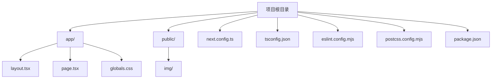
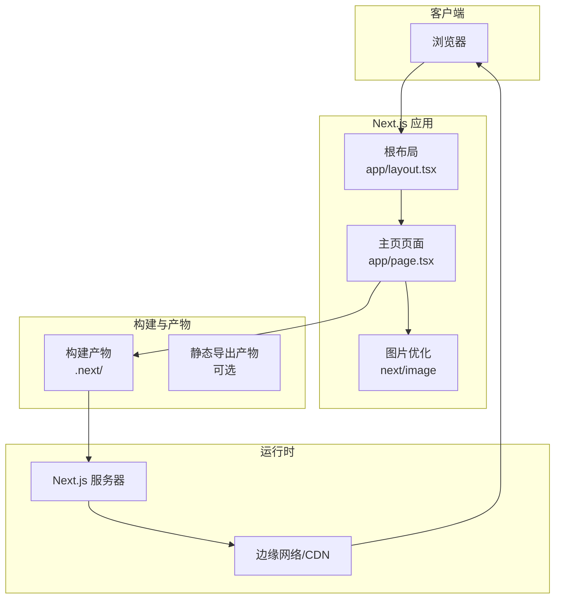
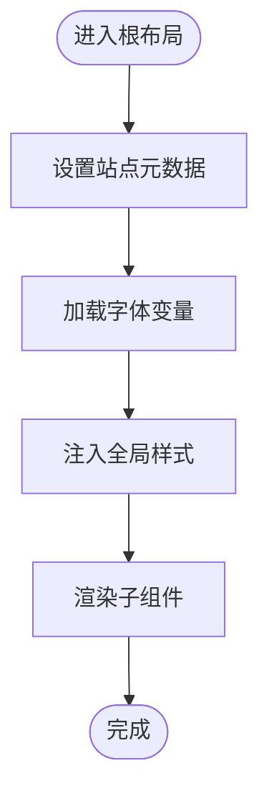
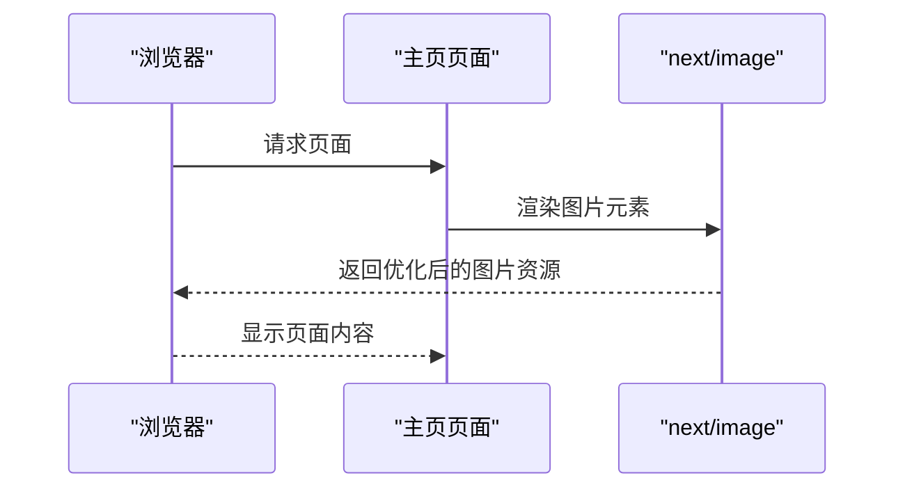
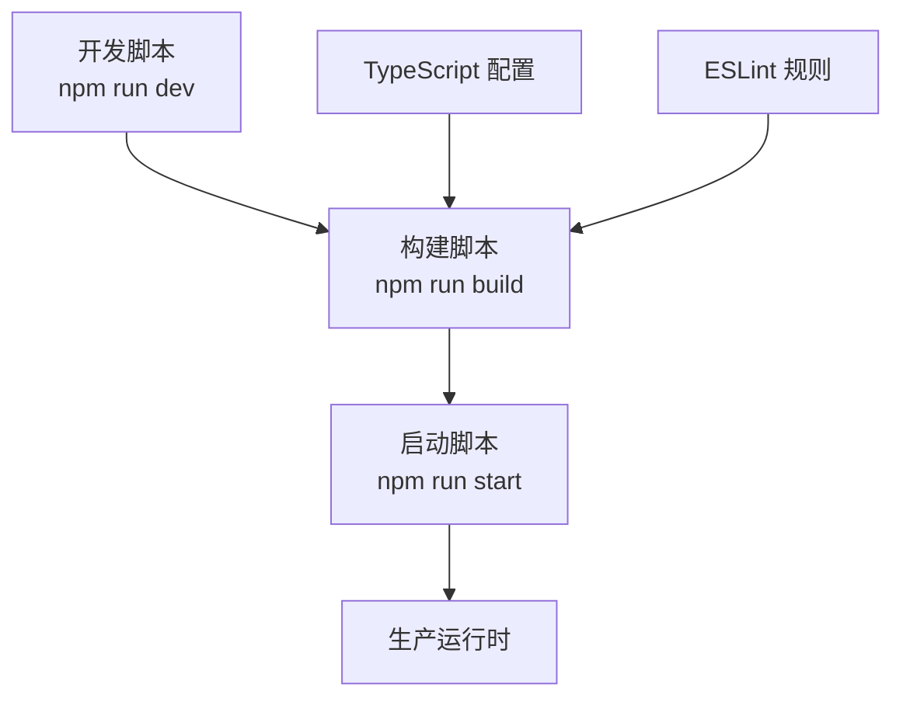
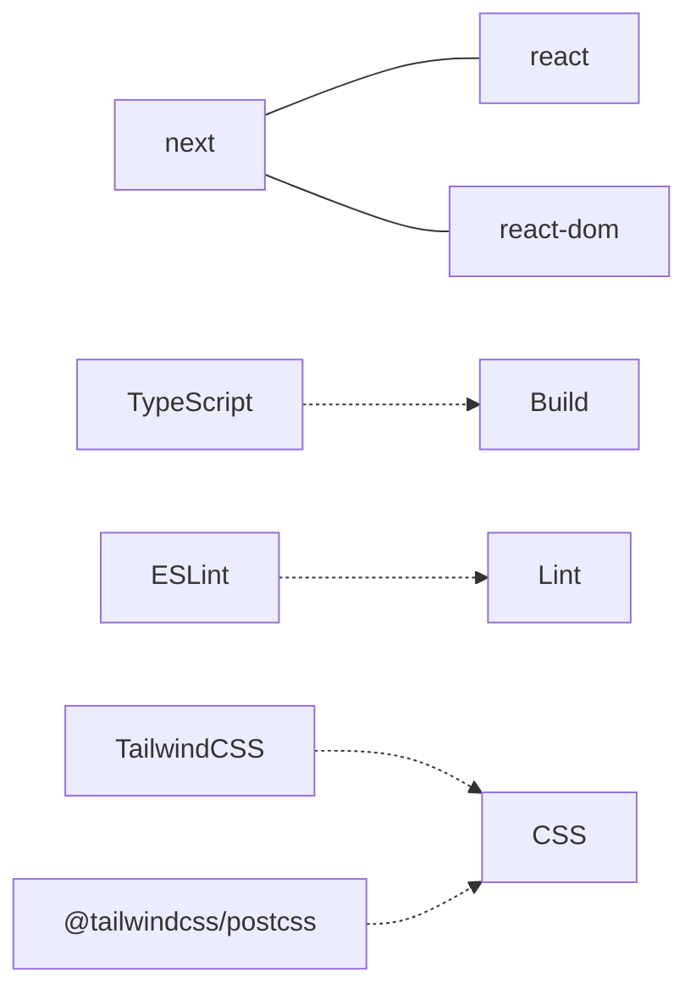

# 部署与生产

<cite>
**本文引用的文件**
- [package.json](file://package.json)
- [next.config.ts](file://next.config.ts)
- [README.md](file://README.md)
- [app/layout.tsx](file://app/layout.tsx)
- [app/page.tsx](file://app/page.tsx)
- [app/globals.css](file://app/globals.css)
- [tsconfig.json](file://tsconfig.json)
- [eslint.config.mjs](file://eslint.config.mjs)
- [postcss.config.mjs](file://postcss.config.mjs)
- [AGENTS.md](file://AGENTS.md)
</cite>

## 目录
1. [简介](#简介)
2. [项目结构](#项目结构)
3. [核心组件](#核心组件)
4. [架构总览](#架构总览)
5. [详细组件分析](#详细组件分析)
6. [依赖分析](#依赖分析)
7. [性能考虑](#性能考虑)
8. [安全与监控](#安全与监控)
9. [部署选项与实践](#部署选项与实践)
10. [生产环境准备](#生产环境准备)
11. [上线流程与维护](#上线流程与维护)
12. [故障排除指南](#故障排除指南)
13. [结论](#结论)
14. [附录](#附录)

## 简介
本指南面向 blod 项目（基于 Next.js App Router）的部署与生产运维，覆盖构建流程、生产环境准备、静态生成与服务器渲染的应用方式、多平台部署策略（Vercel、自托管、云服务）、性能优化（代码分割、图片优化、缓存策略）、安全配置与监控、部署后测试与故障排除、版本管理与回滚策略，以及完整的上线流程与维护建议。

## 项目结构
blod 采用 Next.js App Router 结构，核心目录与文件如下：
- app：页面与布局根目录，包含全局样式、根布局与主页页面
- public/img：公共资源目录，用于存放图片资源
- 根级配置：next.config.ts、tsconfig.json、eslint.config.mjs、postcss.config.mjs
- 包管理与脚本：package.json

图表来源
- [package.json:1-31](file://package.json#L1-L31)
- [next.config.ts:1-8](file://next.config.ts#L1-L8)
- [tsconfig.json:1-35](file://tsconfig.json#L1-L35)
- [eslint.config.mjs:1-19](file://eslint.config.mjs#L1-L19)
- [postcss.config.mjs:1-8](file://postcss.config.mjs#L1-L8)
- [app/layout.tsx:1-34](file://app/layout.tsx#L1-L34)
- [app/page.tsx:1-72](file://app/page.tsx#L1-L72)
- [app/globals.css:1-27](file://app/globals.css#L1-L27)

章节来源
- [package.json:1-31](file://package.json#L1-L31)
- [next.config.ts:1-8](file://next.config.ts#L1-L8)
- [tsconfig.json:1-35](file://tsconfig.json#L1-L35)
- [eslint.config.mjs:1-19](file://eslint.config.mjs#L1-L19)
- [postcss.config.mjs:1-8](file://postcss.config.mjs#L1-L8)
- [app/layout.tsx:1-34](file://app/layout.tsx#L1-L34)
- [app/page.tsx:1-72](file://app/page.tsx#L1-L72)
- [app/globals.css:1-27](file://app/globals.css#L1-L27)

## 核心组件
- 根布局与元数据：定义站点标题、描述、字体加载与全局样式注入
- 主页页面：使用 next/image 进行图片优化，包含导航栏与视觉元素
- 全局样式：Tailwind CSS 与主题变量，支持明暗模式
- 构建与开发脚本：dev/build/start/lint
- TypeScript 严格配置与 ESLint 规则

章节来源
- [app/layout.tsx:1-34](file://app/layout.tsx#L1-L34)
- [app/page.tsx:1-72](file://app/page.tsx#L1-L72)
- [app/globals.css:1-27](file://app/globals.css#L1-L27)
- [package.json:9-14](file://package.json#L9-L14)
- [tsconfig.json:2-24](file://tsconfig.json#L2-L24)
- [eslint.config.mjs:1-19](file://eslint.config.mjs#L1-L19)

## 架构总览
Next.js 在生产环境中可结合静态生成（SSG）与服务器端渲染（SSR）。对于 blod 的简单页面，可优先采用 SSG 以获得更快的首屏与更稳定的边缘分发；若存在动态内容或需要服务端计算，可启用 SSR 或增量静态再生（ISR）。

图表来源
- [app/layout.tsx:15-18](file://app/layout.tsx#L15-L18)
- [app/page.tsx:17-23](file://app/page.tsx#L17-L23)
- [package.json:15-18](file://package.json#L15-L18)

## 详细组件分析

### 根布局与元数据
- 定义站点标题与描述，便于 SEO 与分享预览
- 加载 Geist 字体，通过 CSS 变量注入主题
- 提供全局样式入口，统一页面骨架

图表来源
- [app/layout.tsx:15-18](file://app/layout.tsx#L15-L18)
- [app/layout.tsx:20-33](file://app/layout.tsx#L20-L33)
- [app/globals.css:1-27](file://app/globals.css#L1-L27)

章节来源
- [app/layout.tsx:15-18](file://app/layout.tsx#L15-L18)
- [app/layout.tsx:20-33](file://app/layout.tsx#L20-L33)
- [app/globals.css:1-27](file://app/globals.css#L1-L27)

### 主页页面与图片优化
- 使用 next/image 实现响应式与懒加载
- 通过 priority 标记关键首屏图片
- 布局采用 Tailwind 类名组织，配合全局样式

图表来源
- [app/page.tsx:17-23](file://app/page.tsx#L17-L23)
- [app/page.tsx:47-54](file://app/page.tsx#L47-L54)

章节来源
- [app/page.tsx:1-72](file://app/page.tsx#L1-L72)

### 构建与类型配置
- 使用 next build 生成生产包
- TypeScript 严格模式与路径别名配置
- ESLint 遵循 Next.js 最佳实践

图表来源
- [package.json:9-14](file://package.json#L9-L14)
- [tsconfig.json:2-24](file://tsconfig.json#L2-L24)
- [eslint.config.mjs:1-19](file://eslint.config.mjs#L1-L19)

章节来源
- [package.json:9-14](file://package.json#L9-L14)
- [tsconfig.json:2-24](file://tsconfig.json#L2-L24)
- [eslint.config.mjs:1-19](file://eslint.config.mjs#L1-L19)

## 依赖分析
- 运行时依赖：next、react、react-dom
- 开发依赖：TypeScript、ESLint、TailwindCSS、PostCSS 插件
- 无自定义构建插件或第三方中间件

图表来源
- [package.json:15-29](file://package.json#L15-L29)

章节来源
- [package.json:15-29](file://package.json#L15-L29)

## 性能考虑
- 代码分割：利用 App Router 的路由级自动分割
- 图片优化：使用 next/image，确保响应式尺寸与格式选择
- 缓存策略：合理设置静态资源缓存头与 CDN 缓存
- 构建优化：启用严格类型检查与 ESLint，减少运行时错误
- 样式体积：按需引入 Tailwind 指令，避免未使用类名

章节来源
- [app/page.tsx:17-23](file://app/page.tsx#L17-L23)
- [app/globals.css:1-27](file://app/globals.css#L1-L27)
- [tsconfig.json:2-24](file://tsconfig.json#L2-L24)
- [eslint.config.mjs:1-19](file://eslint.config.mjs#L1-L19)

## 安全与监控
- 安全扫描：在 CI 中集成 ESLint 与依赖漏洞扫描
- 运行时安全：限制静态资源访问范围，校验用户输入（如适用）
- 监控与日志：接入应用性能监控（APM）与错误追踪工具
- 配置加固：生产环境关闭开发相关输出，确保只暴露必要端点

章节来源
- [eslint.config.mjs:1-19](file://eslint.config.mjs#L1-L19)
- [package.json:15-18](file://package.json#L15-L18)

## 部署选项与实践

### Vercel 平台部署
- 推荐方式：直接连接 Git 仓库，平台自动识别 Next.js 项目并执行构建与部署
- 自动优化：边缘网络、图片优化、缓存策略由平台默认启用
- 环境变量：在 Vercel 控制台配置，无需修改本地代码
- 预览与生产分支：通过分支策略实现灰度发布

章节来源
- [README.md:32-36](file://README.md#L32-L36)

### 自托管方案
- 服务器要求：Node.js 版本与操作系统兼容性
- 启动命令：使用 npm run start 启动生产服务器
- 反向代理：Nginx/Apache 转发至 Next.js 服务端口
- 进程管理：PM2/Docker 等进程守护与容器化部署
- SSL/TLS：通过反向代理或 Let’s Encrypt 配置证书

章节来源
- [package.json:11-12](file://package.json#L11-L12)
- [README.md:32-36](file://README.md#L32-L36)

### 云服务部署（以通用云平台为例）
- 静态导出：可选地使用静态导出（如适用场景），将产物部署到对象存储或静态托管
- 容器化：打包为 Docker 镜像，部署于 Kubernetes 或容器引擎
- 负载均衡：配置健康检查与自动扩缩容
- 数据库与缓存：独立服务化，通过环境变量注入

章节来源
- [package.json:15-18](file://package.json#L15-L18)

## 生产环境准备
- 构建产物：执行 npm run build 生成 .next 目录
- 环境变量：区分开发/测试/生产，敏感信息通过密钥管理服务注入
- 域名与 DNS：CNAME/记录指向平台或服务器 IP
- CDN 与缓存：配置边缘缓存与静态资源缓存策略
- 备份与快照：数据库与静态资源定期备份

章节来源
- [package.json:11](file://package.json#L11)
- [next.config.ts:3-5](file://next.config.ts#L3-L5)

## 上线流程与维护
- 版本管理：Git 分支策略（主干保护、特性分支、发布标签）
- 回滚策略：固定镜像版本与回滚到上一稳定版本
- 发布窗口：选择低峰流量时段进行部署
- 变更公告：对重大变更提前通知用户
- 维护窗口：定期更新依赖与安全补丁

章节来源
- [AGENTS.md:1-6](file://AGENTS.md#L1-L6)

## 故障排除指南
- 构建失败：检查依赖安装、TypeScript 错误与 ESLint 报错
- 首屏慢：确认图片是否正确使用 next/image、CDN 是否生效
- 字体加载异常：检查字体变量与 CSS 注入顺序
- 样式不生效：确认 Tailwind 指令与 @theme 使用是否正确
- 生产启动异常：核对 Node.js 版本与运行参数

章节来源
- [app/page.tsx:17-23](file://app/page.tsx#L17-L23)
- [app/globals.css:1-27](file://app/globals.css#L1-L27)
- [tsconfig.json:2-24](file://tsconfig.json#L2-L24)
- [eslint.config.mjs:1-19](file://eslint.config.mjs#L1-L19)

## 结论
blod 项目结构简洁，适合采用 Next.js 的静态生成与边缘分发策略。通过合理的构建与缓存配置、严格的类型与代码规范、完善的监控与回滚机制，可在 Vercel、自托管或云平台上稳定交付。建议优先使用平台托管以降低运维复杂度，并在生产中持续关注性能与安全性指标。

## 附录
- Next.js 版本与注意事项：项目使用较新版本，遵循最新 API 与约定
- 文档与参考：README 中提供了官方文档链接与部署指引

章节来源
- [README.md:1-37](file://README.md#L1-L37)
- [AGENTS.md:1-6](file://AGENTS.md#L1-L6)