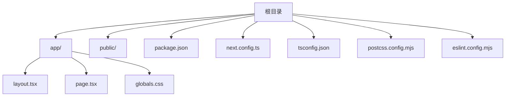
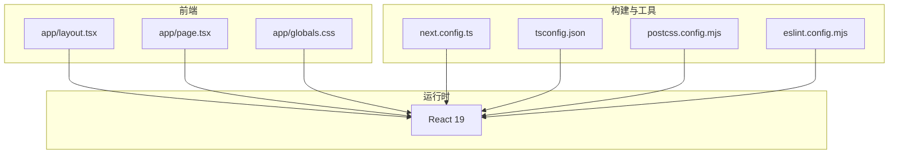
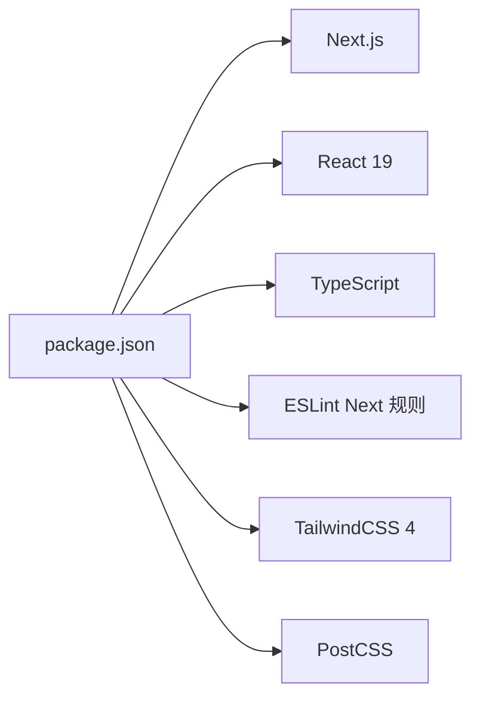

# 部署选项

<cite>
**本文引用的文件**
- [package.json](file://package.json)
- [next.config.ts](file://next.config.ts)
- [README.md](file://README.md)
- [app/layout.tsx](file://app/layout.tsx)
- [app/page.tsx](file://app/page.tsx)
- [app/globals.css](file://app/globals.css)
- [tsconfig.json](file://tsconfig.json)
- [postcss.config.mjs](file://postcss.config.mjs)
- [eslint.config.mjs](file://eslint.config.mjs)
</cite>

## 目录
1. [简介](#简介)
2. [项目结构](#项目结构)
3. [核心组件](#核心组件)
4. [架构总览](#架构总览)
5. [详细组件分析](#详细组件分析)
6. [依赖关系分析](#依赖关系分析)
7. [性能考量](#性能考量)
8. [故障排查指南](#故障排查指南)
9. [结论](#结论)
10. [附录](#附录)

## 简介
本指南面向 blod 项目的部署与上线，覆盖以下主题：
- Vercel 平台部署：项目连接、构建与运行、环境变量配置、域名绑定与 HTTPS、预览分支等
- GitHub Actions 自动化部署：工作流配置、构建缓存、部署策略与最佳实践
- 其他云平台部署：AWS Amplify、Netlify 的部署要点与差异
- 静态站点生成与服务器端渲染：在不同平台上的行为差异与选择建议
- 部署前准备清单与部署后验证步骤
- 多环境与蓝绿部署策略

本项目基于 Next.js App Router，使用 React 19、TypeScript 与 TailwindCSS，适合在多种托管平台进行部署。

## 项目结构
blod 项目采用 Next.js App Router 结构，关键目录与文件如下：
- app：页面与布局、样式入口
- public：公共资源（图片等）
- 根目录：构建与开发脚本、类型配置、样式与校验配置

图表来源
- [package.json](file://package.json)
- [next.config.ts](file://next.config.ts)
- [app/layout.tsx](file://app/layout.tsx)
- [app/page.tsx](file://app/page.tsx)
- [app/globals.css](file://app/globals.css)
- [tsconfig.json](file://tsconfig.json)
- [postcss.config.mjs](file://postcss.config.mjs)
- [eslint.config.mjs](file://eslint.config.mjs)

章节来源
- [package.json](file://package.json)
- [next.config.ts](file://next.config.ts)
- [tsconfig.json](file://tsconfig.json)
- [postcss.config.mjs](file://postcss.config.mjs)
- [eslint.config.mjs](file://eslint.config.mjs)

## 核心组件
- 应用入口与元数据：应用根布局定义全局字体与元信息，页面组件负责首屏内容与导航。
- 构建与运行脚本：通过 npm 脚本启动开发服务器、构建与启动生产服务。
- 样式系统：TailwindCSS 与 PostCSS 配置，支持暗色模式与主题变量。
- 类型与校验：TypeScript 严格模式与 ESLint Next 规则，确保代码质量。

章节来源
- [app/layout.tsx](file://app/layout.tsx)
- [app/page.tsx](file://app/page.tsx)
- [app/globals.css](file://app/globals.css)
- [package.json](file://package.json)
- [tsconfig.json](file://tsconfig.json)
- [eslint.config.mjs](file://eslint.config.mjs)

## 架构总览
Next.js 在本项目中以 App Router 模式运行，页面组件与布局共同构成前端界面；构建阶段由 Next.js 执行，输出静态资源与运行时代码；样式通过 TailwindCSS 与 PostCSS 处理。

图表来源
- [app/layout.tsx](file://app/layout.tsx)
- [app/page.tsx](file://app/page.tsx)
- [app/globals.css](file://app/globals.css)
- [next.config.ts](file://next.config.ts)
- [tsconfig.json](file://tsconfig.json)
- [postcss.config.mjs](file://postcss.config.mjs)
- [eslint.config.mjs](file://eslint.config.mjs)

## 详细组件分析

### Vercel 平台部署
- 项目连接与仓库关联
  - 在 Vercel 控制台导入 Git 仓库，选择 blod 项目所在分支
  - 设置框架检测为 Next.js，构建目录默认即可
- 构建与运行
  - Vercel 将自动执行构建脚本，无需手动指定命令
  - 生产环境变量通过 Vercel 仪表盘配置，避免提交到仓库
- 域名与 HTTPS
  - 在域名设置中添加自定义域名，Vercel 提供免费 HTTPS
  - 可配置根域与子域，启用重定向规则
- 预览部署
  - PR 或分支变更会触发预览部署，便于联调
- 环境变量
  - 在 Vercel 项目设置中添加环境变量，如数据库连接串、第三方密钥等
  - 区分生产与预览环境变量，避免误用
- 缓存与性能
  - 利用 Vercel 的边缘缓存与静态资源优化
  - 对于需要 SSR 的页面，Vercel 会按需渲染

章节来源
- [README.md](file://README.md)
- [package.json](file://package.json)

### GitHub Actions 自动化部署
- 工作流设计
  - 触发条件：推送主分支或发布标签
  - 步骤：安装依赖、运行测试与构建、上传构建产物
  - 部署目标：可选择部署到 Vercel、AWS Amplify、Netlify 等
- 构建缓存
  - 使用缓存策略加速依赖安装与构建过程
- 安全与密钥
  - 将敏感信息存储在仓库机密中，避免硬编码
- 多环境策略
  - 通过分支区分 develop/staging/prod
  - 不同环境对应不同的部署目标与环境变量
- 蓝绿部署
  - 在支持蓝绿的平台（如 Vercel）启用流量切换
  - 通过预览部署与灰度发布降低风险

章节来源
- [package.json](file://package.json)

### AWS Amplify 部署
- 连接仓库与分支
  - 选择仓库与分支，设置构建命令与输出目录
- 构建与运行
  - Amplify 会自动识别 Next.js 项目并执行构建
  - 环境变量通过 Amplify 控制台管理
- 域名与证书
  - 绑定自定义域名，Amplify 自动签发与续期证书
- 优势
  - 与 AWS 生态集成良好，适合已有 AWS 资源的团队

章节来源
- [package.json](file://package.json)

### Netlify 部署
- 连接与配置
  - 导入仓库，设置构建命令与发布目录
- 净化与重定向
  - 使用 netlify.toml 配置重定向与净化规则
- 环境变量
  - 在 Netlify 项目设置中添加环境变量
- 优势
  - 部署速度快，适合中小型站点与快速迭代

章节来源
- [package.json](file://package.json)

### 静态站点生成与服务器端渲染
- Next.js 支持静态生成（SSG）与服务器端渲染（SSR），在不同平台上的表现如下：
  - Vercel：默认按需渲染 SSR，静态页面可被预渲染或增量静态再生（ISR）
  - AWS Amplify：支持 SSR 与静态生成，需在构建配置中明确
  - Netlify：支持静态生成与函数代理（Serverless Functions）实现 SSR
- 选择建议
  - 内容更新频繁且需要实时性：优先 SSR 或 ISR
  - 内容稳定、可预渲染：优先 SSG，提升性能与成本效率

章节来源
- [README.md](file://README.md)
- [next.config.ts](file://next.config.ts)

## 依赖关系分析
- 语言与框架
  - React 19、Next.js 16、TypeScript
- 样式与工具
  - TailwindCSS 4、PostCSS、ESLint Next 规则
- 开发与构建
  - npm 脚本：dev、build、start、lint

图表来源
- [package.json](file://package.json)
- [tsconfig.json](file://tsconfig.json)
- [eslint.config.mjs](file://eslint.config.mjs)
- [postcss.config.mjs](file://postcss.config.mjs)

章节来源
- [package.json](file://package.json)
- [tsconfig.json](file://tsconfig.json)
- [eslint.config.mjs](file://eslint.config.mjs)
- [postcss.config.mjs](file://postcss.config.mjs)

## 性能考量
- 构建优化
  - 启用并行构建与增量编译，减少重复工作
- 样式与资源
  - TailwindCSS 按需引入，避免无用类名
  - 图片使用现代格式与懒加载，结合 CDN 加速
- 运行时优化
  - 合理使用缓存（浏览器缓存、CDN 缓存、边缘缓存）
  - 对关键路径进行代码分割与懒加载

## 故障排查指南
- 构建失败
  - 检查 Node 版本与依赖安装是否成功
  - 查看 ESLint 报错并修复
- 样式异常
  - 确认 TailwindCSS 配置与 PostCSS 插件正确加载
- 环境变量问题
  - 在部署平台确认环境变量已正确注入
- 预览部署失败
  - 检查分支保护规则与权限设置
  - 确认工作流权限与机密配置

章节来源
- [eslint.config.mjs](file://eslint.config.mjs)
- [postcss.config.mjs](file://postcss.config.mjs)
- [tsconfig.json](file://tsconfig.json)

## 结论
blod 项目具备良好的可部署性，适配多种平台。推荐优先使用 Vercel 以获得最佳的 Next.js 集成体验；若团队已有 AWS 或 Netlify 资源，也可选择相应平台。通过合理的多环境与蓝绿部署策略，可显著提升交付效率与稳定性。

## 附录

### 部署前准备清单
- 本地开发完成，确保构建与测试通过
- 准备好自定义域名与 DNS 记录
- 在部署平台创建项目并关联仓库
- 配置必要的环境变量（数据库、第三方 API 等）
- 如使用 GitHub Actions，准备工作流文件与仓库机密

### 部署后验证步骤
- 访问首页，确认样式与交互正常
- 校验自定义域名与 HTTPS 证书状态
- 检查构建日志与错误监控
- 验证预览部署与主分支部署的一致性