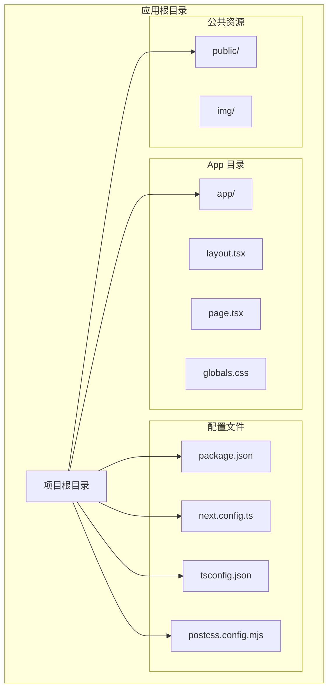
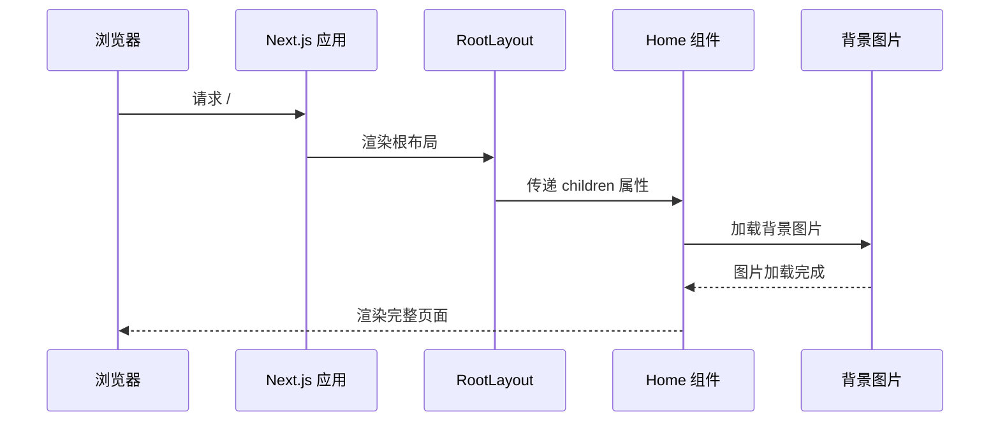
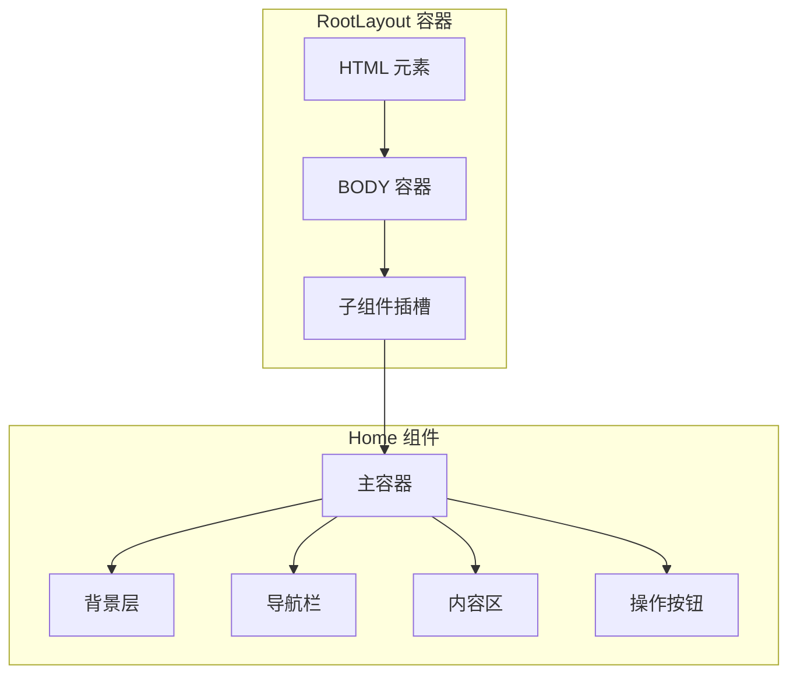
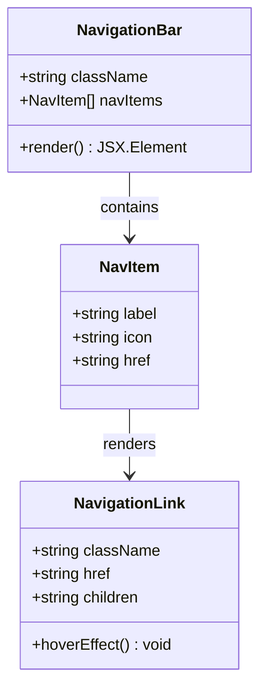
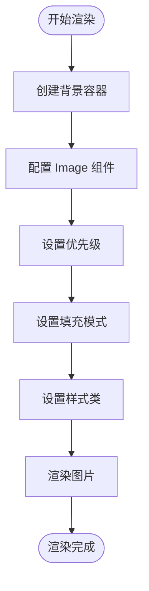
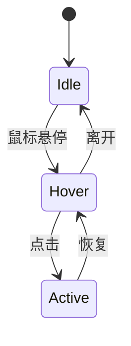
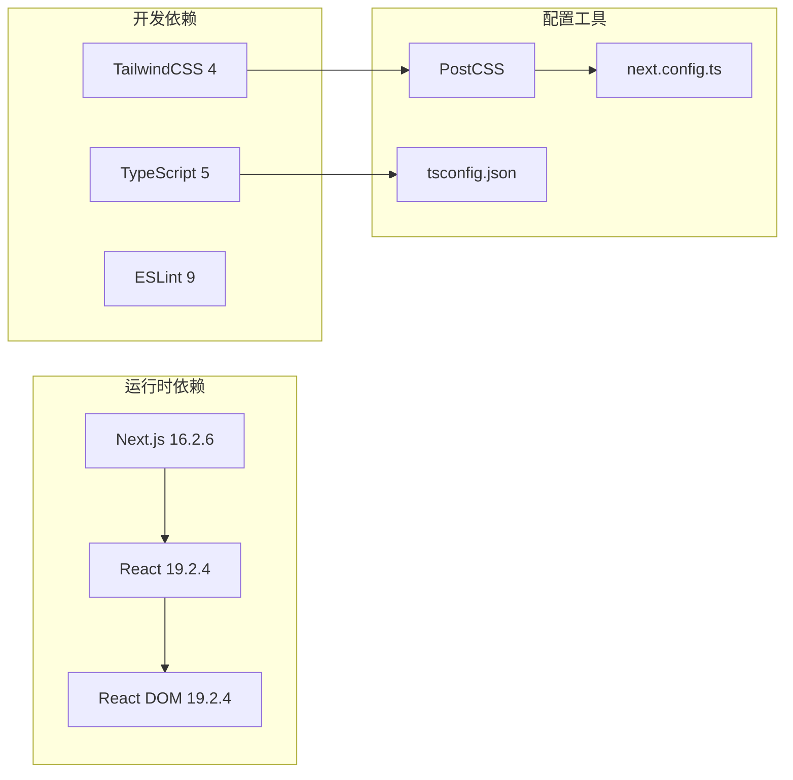
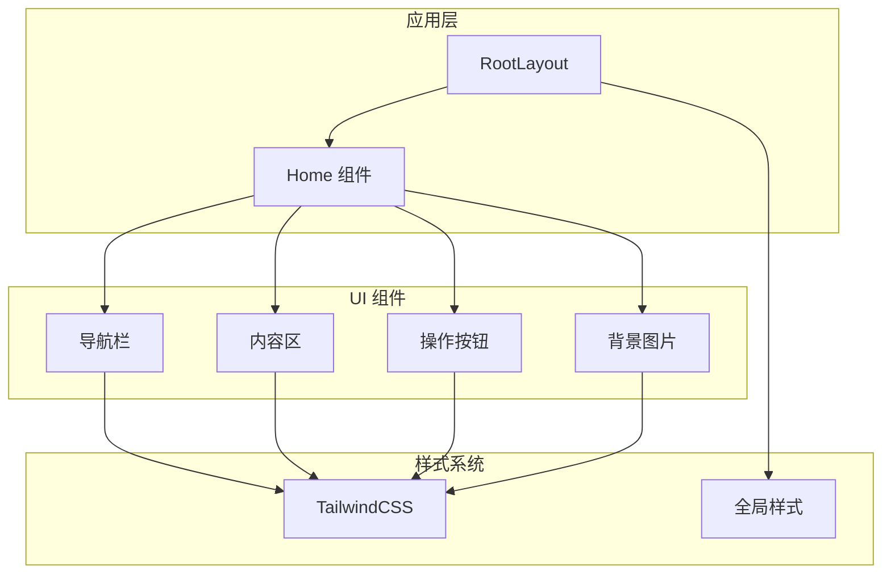

# Home 主页组件

<cite>
**本文档引用的文件**
- [app/page.tsx](file://app/page.tsx)
- [app/layout.tsx](file://app/layout.tsx)
- [app/globals.css](file://app/globals.css)
- [package.json](file://package.json)
- [next.config.ts](file://next.config.ts)
- [tsconfig.json](file://tsconfig.json)
- [postcss.config.mjs](file://postcss.config.mjs)
</cite>

## 目录
1. [简介](#简介)
2. [项目结构](#项目结构)
3. [核心组件](#核心组件)
4. [架构概览](#架构概览)
5. [详细组件分析](#详细组件分析)
6. [依赖关系分析](#依赖关系分析)
7. [性能考虑](#性能考虑)
8. [故障排除指南](#故障排除指南)
9. [结论](#结论)

## 简介

本文档为 Home 主页组件（page.tsx）提供了全面的实现指南。该组件是基于 Next.js 应用程序的核心页面，采用了现代化的前端开发技术栈，包括 React 19、TypeScript、TailwindCSS 4 和 Next.js 16.2.6。组件实现了响应式设计，具有精美的视觉效果和良好的用户体验。

## 项目结构

该项目采用 Next.js App Router 架构，主要文件组织如下：

**图表来源**
- [app/page.tsx:1-72](file://app/page.tsx#L1-L72)
- [app/layout.tsx:1-34](file://app/layout.tsx#L1-L34)
- [package.json:1-31](file://package.json#L1-L31)

**章节来源**
- [app/page.tsx:1-72](file://app/page.tsx#L1-L72)
- [app/layout.tsx:1-34](file://app/layout.tsx#L1-L34)
- [package.json:1-31](file://package.json#L1-L31)

## 核心组件

### 组件结构概述

Home 组件是一个无状态函数组件，采用函数式编程范式，通过 JSX 返回虚拟 DOM 结构。组件整体采用相对定位布局，包含三个主要区域：

1. **背景图像层**：全屏覆盖的背景图片
2. **导航栏层**：半透明模糊效果的顶部导航
3. **内容层**：居中的标题和副标题
4. **操作按钮层**：右侧固定位置的操作按钮组

### 导航项配置

组件使用常量数组定义导航项，包含以下配置：
- 首页、文章、杂烩、人生路、社交、美哒哒
- 每个导航项包含标签文本和图标
- 支持动态渲染和样式绑定

**章节来源**
- [app/page.tsx:3-10](file://app/page.tsx#L3-L10)
- [app/page.tsx:32-42](file://app/page.tsx#L32-L42)

## 架构概览

### 整体架构流程

**图表来源**
- [app/layout.tsx:20-33](file://app/layout.tsx#L20-L33)
- [app/page.tsx:12-71](file://app/page.tsx#L12-L71)

### 组件层次结构

**图表来源**
- [app/layout.tsx:20-33](file://app/layout.tsx#L20-L33)
- [app/page.tsx:14-70](file://app/page.tsx#L14-L70)

## 详细组件分析

### 导航栏组件分析

导航栏组件实现了现代化的响应式设计，具有以下特性：

#### 结构设计
- 使用相对定位确保层级关系
- 半透明背景配合模糊滤镜效果
- 动态阴影增强立体感
- 响应式间距和字体大小

#### 交互设计
- 悬停效果：文字颜色从灰色变为蓝色
- 过渡动画：平滑的颜色变化效果
- 图标与文字组合显示

**图表来源**
- [app/page.tsx:27-44](file://app/page.tsx#L27-L44)
- [app/page.tsx:32-42](file://app/page.tsx#L32-L42)

**章节来源**
- [app/page.tsx:27-44](file://app/page.tsx#L27-L44)

### 背景图片处理

背景图片组件采用了 Next.js Image 组件的最佳实践：

#### 性能优化特性
- 自动优先加载（priority）
- 填充模式（fill）自适应容器尺寸
- 对象覆盖（object-cover）保持比例
- 响应式图片支持

#### 视觉效果
- 全屏覆盖背景
- 固定定位确保层级关系
- 适当的 z-index 管理

**图表来源**
- [app/page.tsx:16-24](file://app/page.tsx#L16-L24)

**章节来源**
- [app/page.tsx:16-24](file://app/page.tsx#L16-L24)

### 主要内容区域

内容区域采用 Flexbox 布局，实现了居中对齐和响应式字体大小：

#### 设计特点
- 居中对齐的标题和副标题
- 大字号标题在桌面端更大
- 文字阴影增强可读性
- 白色文字在深色背景上对比度良好

#### 响应式设计
- 移动端：4xl 字号
- 桌面端：5xl 字号
- 副标题在不同设备上的适配

**章节来源**
- [app/page.tsx:47-54](file://app/page.tsx#L47-L54)

### 侧边操作按钮

右侧固定位置的操作按钮组提供了便捷的功能入口：

#### 按钮设计
- 圆形按钮，10x10 尺寸
- 固定定位，右下角布局
- 按钮间距 3px
- 模糊背景和阴影效果

#### 功能示意
- 第一个按钮：向下箭头（可能用于滚动或功能）
- 第二个按钮：三点菜单（可能用于更多选项）

**图表来源**
- [app/page.tsx:57-68](file://app/page.tsx#L57-L68)

**章节来源**
- [app/page.tsx:57-68](file://app/page.tsx#L57-L68)

## 依赖关系分析

### 技术栈依赖

**图表来源**
- [package.json:15-29](file://package.json#L15-L29)
- [postcss.config.mjs:1-7](file://postcss.config.mjs#L1-L7)

### 组件间依赖关系

**图表来源**
- [app/layout.tsx:20-33](file://app/layout.tsx#L20-L33)
- [app/page.tsx:12-71](file://app/page.tsx#L12-L71)

**章节来源**
- [package.json:15-29](file://package.json#L15-L29)
- [app/layout.tsx:20-33](file://app/layout.tsx#L20-L33)

## 性能考虑

### 图片优化策略

1. **优先加载机制**：背景图片设置了优先加载属性
2. **响应式适配**：自动根据设备像素比选择合适尺寸
3. **格式优化**：支持现代图片格式（WebP 等）
4. **缓存策略**：浏览器自动缓存已加载的图片

### 样式性能优化

1. **原子化 CSS**：TailwindCSS 提供了高效的样式生成
2. **按需加载**：只生成实际使用的样式类
3. **CSS 变量**：支持主题切换和动态样式
4. **硬件加速**：模糊效果和过渡动画利用 GPU 加速

### 组件渲染优化

1. **无状态组件**：避免不必要的状态管理
2. **纯函数渲染**：相同的输入产生相同的输出
3. **最小化重渲染**：减少不必要的 DOM 更新
4. **内存泄漏防护**：及时清理事件监听器

## 故障排除指南

### 常见问题及解决方案

#### 图片加载问题
- **问题**：背景图片无法显示
- **原因**：图片路径错误或文件不存在
- **解决方案**：检查 `/public/img/love.png` 文件是否存在

#### 样式不生效
- **问题**：样式没有按照预期显示
- **原因**：TailwindCSS 配置问题或编译错误
- **解决方案**：检查 PostCSS 配置和构建过程

#### 响应式问题
- **问题**：移动端显示异常
- **原因**：断点设置或媒体查询问题
- **解决方案**：检查 TailwindCSS 断点配置

### 调试技巧

1. **开发者工具**：使用浏览器开发者工具检查元素和样式
2. **网络面板**：监控图片和其他资源的加载情况
3. **性能面板**：分析渲染性能和内存使用
4. **控制台日志**：添加必要的日志输出进行调试

**章节来源**
- [app/page.tsx:17-23](file://app/page.tsx#L17-L23)
- [postcss.config.mjs:1-7](file://postcss.config.mjs#L1-L7)

## 结论

Home 主页组件展现了现代前端开发的最佳实践，通过合理的架构设计和性能优化，实现了优秀的用户体验。组件具有以下优势：

1. **清晰的架构**：模块化的组件设计，职责分离明确
2. **优秀的性能**：充分利用 Next.js 和 TailwindCSS 的优化特性
3. **良好的可维护性**：简洁的代码结构和清晰的注释
4. **响应式设计**：适配多种设备和屏幕尺寸

该组件为后续的功能扩展奠定了坚实的基础，可以轻松地添加新的功能和改进现有特性。