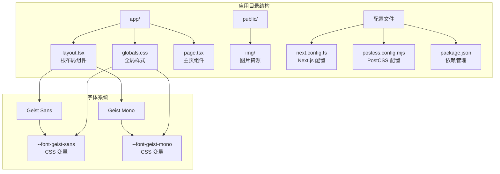
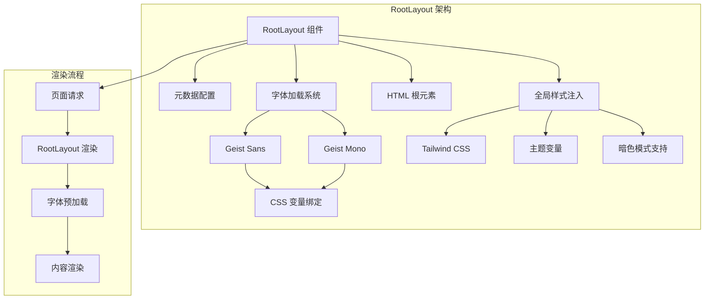
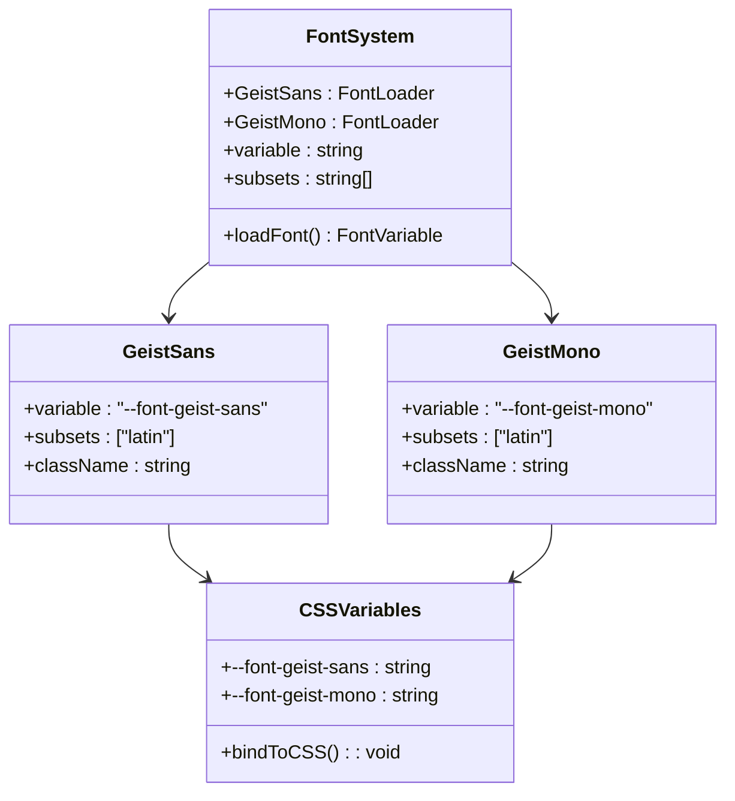
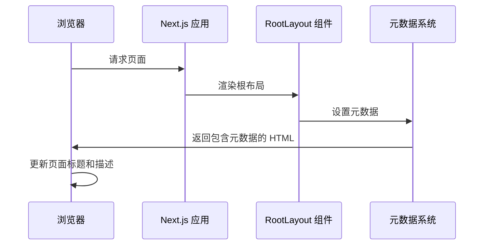
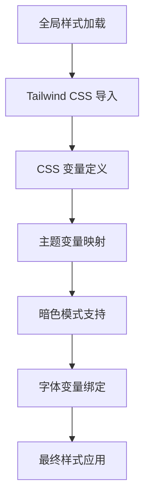
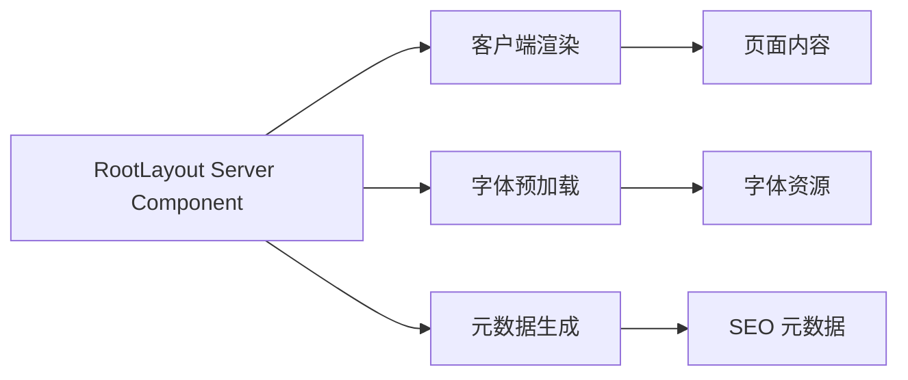
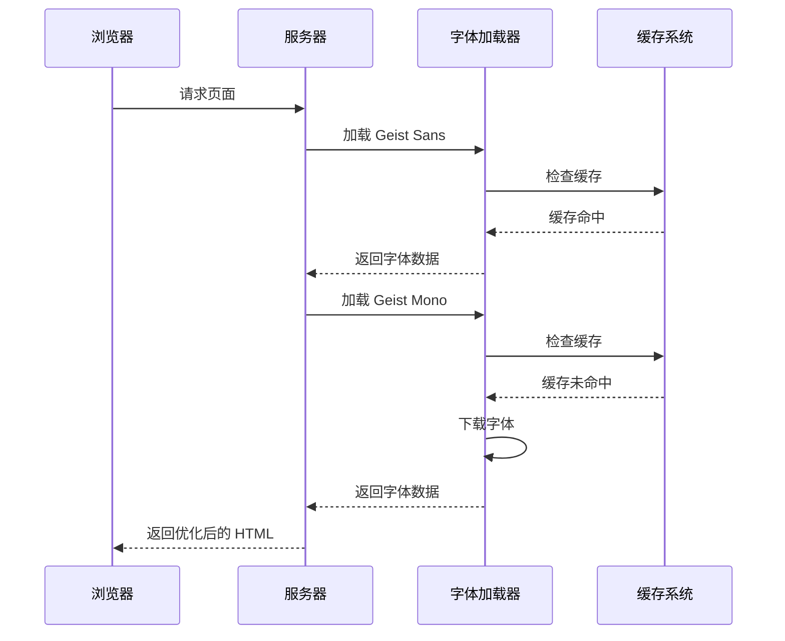
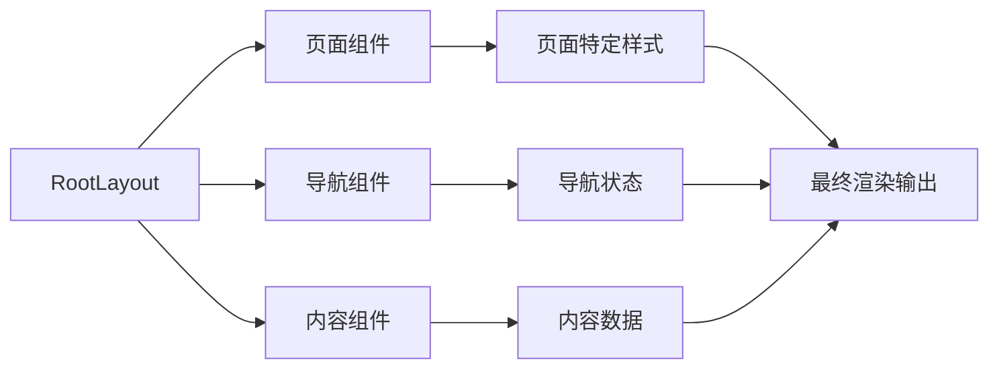

# RootLayout 根布局组件

<cite>
**本文档引用的文件**
- [app/layout.tsx](file://app/layout.tsx)
- [app/globals.css](file://app/globals.css)
- [app/page.tsx](file://app/page.tsx)
- [package.json](file://package.json)
- [next.config.ts](file://next.config.ts)
- [postcss.config.mjs](file://postcss.config.mjs)
- [README.md](file://README.md)
</cite>

## 目录
1. [简介](#简介)
2. [项目结构](#项目结构)
3. [核心组件](#核心组件)
4. [架构概览](#架构概览)
5. [详细组件分析](#详细组件分析)
6. [依赖关系分析](#依赖关系分析)
7. [性能考虑](#性能考虑)
8. [故障排除指南](#故障排除指南)
9. [结论](#结论)

## 简介

RootLayout 组件是 Next.js 应用程序的根布局组件，负责管理整个应用的 HTML 结构、字体加载和全局样式。该组件采用现代前端开发最佳实践，集成了 Vercel 的 Geist 字体系统，实现了高性能的字体加载机制和响应式设计。

本组件的核心功能包括：
- 元数据配置（Metadata）
- Geist Sans 和 Geist Mono 字体的智能加载
- HTML 根元素设置和全局样式注入
- React Server Components 模式
- 字体变量绑定到 CSS 变量的工作原理
- 性能优化策略（字体预加载和防抖动机制）

## 项目结构

该项目采用 Next.js App Router 架构，主要文件组织如下：



**图表来源**
- [app/layout.tsx:1-34](file://app/layout.tsx#L1-L34)
- [app/globals.css:1-27](file://app/globals.css#L1-L27)

**章节来源**
- [app/layout.tsx:1-34](file://app/layout.tsx#L1-L34)
- [app/globals.css:1-27](file://app/globals.css#L1-L27)
- [package.json:1-31](file://package.json#L1-L31)

## 核心组件

RootLayout 组件是应用程序的根容器，负责以下关键职责：

### 元数据配置
组件定义了完整的页面元数据，包括标题和描述信息，这些元数据将被用于 SEO 优化和社交媒体分享。

### 字体加载机制
通过 next/font/google 实现智能字体加载：
- Geist Sans：用于无衬线字体显示
- Geist Mono：用于等宽字体显示
- 自动子集化处理（latin）
- CSS 变量绑定机制

### HTML 根元素设置
- 设置语言属性为英文
- 应用字体类名到 html 元素
- 启用抗锯齿渲染
- 设置全高布局

**章节来源**
- [app/layout.tsx:15-33](file://app/layout.tsx#L15-L33)

## 架构概览

RootLayout 组件采用分层架构设计，实现了清晰的关注点分离：



**图表来源**
- [app/layout.tsx:1-34](file://app/layout.tsx#L1-L34)
- [app/globals.css:8-26](file://app/globals.css#L8-L26)

## 详细组件分析

### 字体系统实现

RootLayout 组件实现了先进的字体加载机制，通过 next/font/google 提供的服务器端渲染优化：

#### 字体配置分析



**图表来源**
- [app/layout.tsx:5-13](file://app/layout.tsx#L5-L13)
- [app/globals.css:10-12](file://app/globals.css#L10-L12)

#### 字体变量绑定机制

字体系统的核心创新在于将字体变量绑定到 CSS 变量中：

1. **变量声明**：在字体配置中设置 `variable` 属性
2. **CSS 变量映射**：在全局样式中将字体变量映射到 CSS 自定义属性
3. **动态应用**：在 HTML 元素上应用字体类名

这种机制的优势：
- 支持运行时字体切换
- 实现主题化字体系统
- 提供更好的可访问性支持

**章节来源**
- [app/layout.tsx:5-13](file://app/layout.tsx#L5-L13)
- [app/globals.css:10-12](file://app/globals.css#L10-L12)

### 元数据配置详解

RootLayout 组件定义了完整的页面元数据：



**图表来源**
- [app/layout.tsx:15-18](file://app/layout.tsx#L15-L18)

元数据配置包括：
- 页面标题："chagumu's blog"
- 页面描述："chagumu's personal blog - one Day"
- 自动 SEO 优化
- 社交媒体分享支持

**章节来源**
- [app/layout.tsx:15-18](file://app/layout.tsx#L15-L18)

### 全局样式注入机制

全局样式通过 Tailwind CSS 和自定义 CSS 变量实现：



**图表来源**
- [app/globals.css:1-27](file://app/globals.css#L1-L27)

样式系统特性：
- 使用 `@theme inline` 语法
- 支持 CSS 自定义属性
- 实现响应式设计
- 提供暗色模式自动切换

**章节来源**
- [app/globals.css:1-27](file://app/globals.css#L1-L27)

### React Server Components 模式

RootLayout 组件采用 React Server Components 模式，实现了以下优势：

#### 服务端渲染优化
- 字体预加载在服务器端完成
- 减少客户端 JavaScript 执行
- 提升首屏渲染性能

#### 组件结构


**图表来源**
- [app/layout.tsx:20-33](file://app/layout.tsx#L20-L33)

**章节来源**
- [app/layout.tsx:20-33](file://app/layout.tsx#L20-L33)

## 依赖关系分析

RootLayout 组件的依赖关系体现了现代前端开发的最佳实践：

```mermaid
graph TB
subgraph "外部依赖"
A[Next.js 16.2.6] --> B[React 19.2.4]
A --> C[Next Font]
A --> D[Tailwind CSS]
E[TypeScript 5] --> F[类型安全]
G[PostCSS] --> H[@tailwindcss/postcss]
end
subgraph "内部模块"
I[app/layout.tsx] --> J[app/globals.css]
I --> K[app/page.tsx]
J --> L[CSS 变量]
J --> M[主题系统]
K --> N[页面内容]
end
subgraph "字体系统"
O[Geist Sans] --> P[--font-geist-sans]
Q[Geist Mono] --> R[--font-geist-mono]
P --> S[CSS 变量绑定]
R --> S
end
A --> I
C --> O
C --> Q
D --> J
```

**图表来源**
- [package.json:15-29](file://package.json#L15-L29)
- [app/layout.tsx:1-3](file://app/layout.tsx#L1-L3)

### 关键依赖特性

**Next.js 集成**
- 版本 16.2.6 提供最新功能
- 内置字体优化支持
- SSR 和 SSG 优化

**字体系统集成**
- next/font/google 提供服务器端渲染
- 自动子集化减少字体大小
- CSS 变量绑定实现动态字体切换

**样式系统集成**
- Tailwind CSS 提供实用工具类
- PostCSS 处理现代 CSS 特性
- 主题变量支持响应式设计

**章节来源**
- [package.json:15-29](file://package.json#L15-L29)
- [postcss.config.mjs:1-8](file://postcss.config.mjs#L1-L8)

## 性能考虑

RootLayout 组件实现了多项性能优化策略：

### 字体预加载优化



**图表来源**
- [app/layout.tsx:5-13](file://app/layout.tsx#L5-L13)

### 防抖动机制

组件实现了多种防抖动机制以提升用户体验：

1. **字体加载防抖动**：通过 CSS 变量延迟字体应用
2. **渲染防抖动**：避免不必要的重新渲染
3. **样式计算防抖动**：优化样式计算频率

### 渲染优化技巧

#### 组件间数据流


**图表来源**
- [app/layout.tsx:20-33](file://app/layout.tsx#L20-L33)
- [app/page.tsx:12-72](file://app/page.tsx#L12-L72)

#### 最佳实践指导

1. **字体加载策略**
   - 使用 next/font/google 获取服务器端优化
   - 配置适当的子集化以减少字体大小
   - 利用 CSS 变量实现动态字体切换

2. **样式管理**
   - 优先使用 Tailwind CSS 实用类
   - 通过 CSS 变量实现主题化
   - 避免内联样式的过度使用

3. **性能监控**
   - 监控字体加载时间
   - 跟踪渲染性能指标
   - 优化关键渲染路径

**章节来源**
- [app/layout.tsx:5-13](file://app/layout.tsx#L5-L13)
- [app/page.tsx:12-72](file://app/page.tsx#L12-L72)

## 故障排除指南

### 常见问题及解决方案

#### 字体加载失败
**症状**：页面显示默认字体而非 Geist 字体
**解决方案**：
1. 检查网络连接和 CDN 访问
2. 验证字体配置参数
3. 确认 CSS 变量正确绑定

#### 样式冲突
**症状**：全局样式与组件样式冲突
**解决方案**：
1. 检查 Tailwind CSS 配置
2. 验证 CSS 作用域隔离
3. 确认样式优先级设置

#### 性能问题
**症状**：页面加载缓慢或字体闪烁
**解决方案**：
1. 优化字体子集化配置
2. 实施适当的缓存策略
3. 监控关键渲染指标

### 调试工具和技巧

1. **浏览器开发者工具**
   - 检查网络面板中的字体加载
   - 分析样式计算性能
   - 监控内存使用情况

2. **Next.js 开发工具**
   - 使用 `next dev` 进行开发调试
   - 检查构建日志和警告信息
   - 验证生产环境构建

**章节来源**
- [app/layout.tsx:1-34](file://app/layout.tsx#L1-L34)
- [README.md:21](file://README.md#L21)

## 结论

RootLayout 组件代表了现代前端开发的最佳实践，成功地将多个复杂功能整合到一个简洁而强大的组件中。其核心优势包括：

### 技术成就
- **字体系统优化**：通过 next/font/google 实现高性能字体加载
- **CSS 变量绑定**：创新地将字体变量映射到 CSS 自定义属性
- **服务器端渲染**：充分利用 React Server Components 模式
- **主题化支持**：完整的暗色模式和主题切换机制

### 设计亮点
- **模块化架构**：清晰的关注点分离和依赖管理
- **性能优化**：多层优化策略确保最佳用户体验
- **可维护性**：标准化的代码结构和命名约定
- **可扩展性**：灵活的架构支持未来功能扩展

### 最佳实践总结
1. **字体管理**：采用服务器端字体加载策略
2. **样式系统**：结合 Tailwind CSS 和 CSS 变量
3. **性能监控**：持续关注关键性能指标
4. **用户体验**：通过防抖动机制提升交互质量

该组件为 Next.js 应用程序提供了一个强大而优雅的根布局解决方案，值得在类似项目中借鉴和参考。