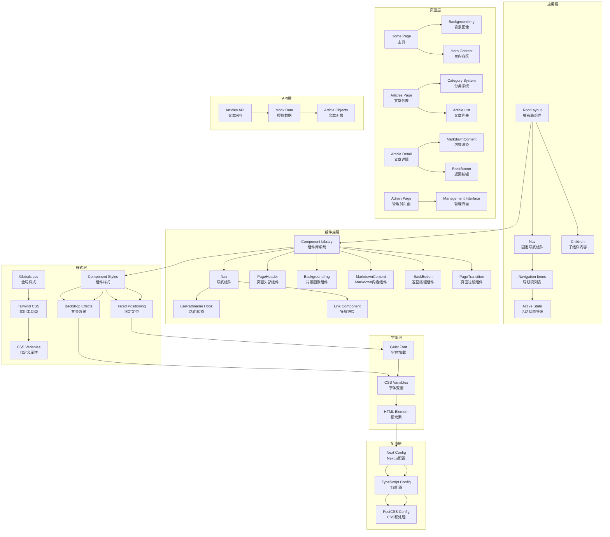
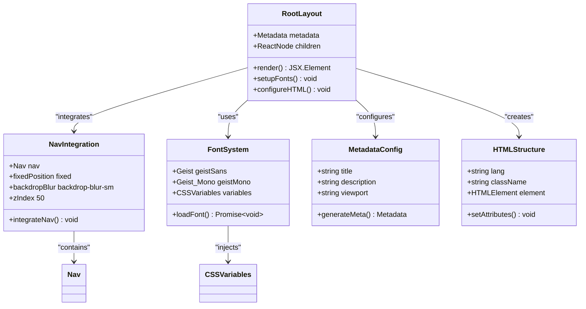
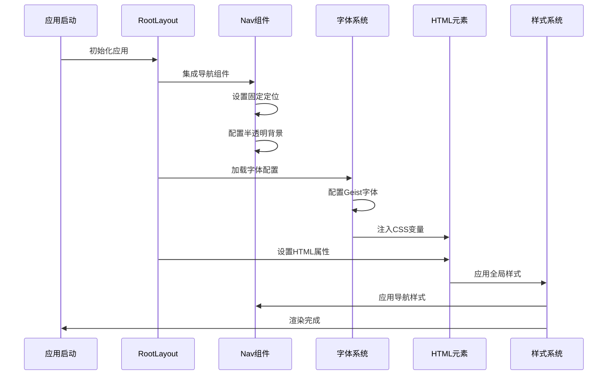
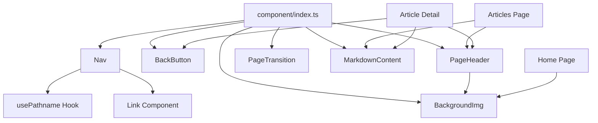
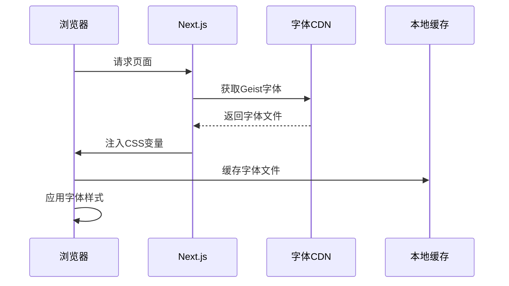

# 核心组件详解

<cite>
**本文档引用的文件**
- [app/layout.tsx](file://app/layout.tsx)
- [app/(site)/page.tsx](file://app/(site)/page.tsx)
- [app/articles/page.tsx](file://app/articles/page.tsx)
- [app/articles/[slug]/page.tsx](file://app/articles/[slug]/page.tsx)
- [app/admin/page.tsx](file://app/admin/page.tsx)
- [app/api/articles/route.ts](file://app/api/articles/route.ts)
- [component/Nav/index.tsx](file://component/Nav/index.tsx)
- [component/PageHeader/index.tsx](file://component/PageHeader/index.tsx)
- [component/BackgroundImg/index.tsx](file://component/BackgroundImg/index.tsx)
- [component/MarkdownContent/index.tsx](file://component/MarkdownContent/index.tsx)
- [component/BackButton/index.tsx](file://component/BackButton/index.tsx)
- [component/PageTransition/index.tsx](file://component/PageTransition/index.tsx)
- [component/index.ts](file://component/index.ts)
- [app/globals.css](file://app/globals.css)
- [package.json](file://package.json)
- [next.config.ts](file://next.config.ts)
- [tsconfig.json](file://tsconfig.json)
- [postcss.config.mjs](file://postcss.config.mjs)
- [README.md](file://README.md)
</cite>

## 更新摘要
**变更内容**
- 新增完整的文章管理系统，包含文章列表、详情页和API接口
- 扩展组件库系统，新增 MarkdownContent、BackButton、PageTransition 组件
- 新增管理员后台页面
- 改进导航系统，支持多级路由和活动状态检测
- 增强页面过渡动画效果
- 优化文章内容渲染和展示

## 目录
1. [简介](#简介)
2. [项目结构](#项目结构)
3. [核心组件](#核心组件)
4. [架构概览](#架构概览)
5. [详细组件分析](#详细组件分析)
6. [组件库系统](#组件库系统)
7. [文章管理系统](#文章管理系统)
8. [依赖关系分析](#依赖关系分析)
9. [性能考虑](#性能考虑)
10. [故障排除指南](#故障排除指南)
11. [结论](#结论)

## 简介

blod 是一个基于 Next.js 16.2.6 构建的现代化个人博客项目，采用 React Server Components 模式和现代前端开发技术栈。项目现已发展为包含完整文章管理系统、组件库系统和后台管理功能的综合平台，重点体现在根布局组件、导航组件、页面头部组件、背景图像组件和 Markdown 内容渲染组件的设计与实现上。

## 项目结构

项目采用 Next.js App Router 结构，现已扩展为包含组件库系统和文章管理功能的完整架构：

```mermaid
graph TB
subgraph "应用根目录"
A[app/] --> B[layout.tsx<br/>根布局组件]
A --> C[(site)/page.tsx<br/>主页组件]
A --> D[globals.css<br/>全局样式]
A --> E[articles/page.tsx<br/>文章列表页面]
A --> F[articles/[slug]/page.tsx<br/>文章详情页面]
A --> G[admin/page.tsx<br/>管理员页面]
H[component/] --> I[Nav/index.tsx<br/>导航组件]
H --> J[PageHeader/index.tsx<br/>页面头部组件]
H --> K[BackgroundImg/index.tsx<br/>背景图像组件]
H --> L[MarkdownContent/index.tsx<br/>Markdown内容组件]
H --> M[BackButton/index.tsx<br/>返回按钮组件]
H --> N[PageTransition/index.tsx<br/>页面过渡组件]
O[app/api/] --> P[articles/route.ts<br/>文章API接口]
Q[配置文件] --> R[package.json<br/>依赖管理]
Q --> S[next.config.ts<br/>Next.js配置]
Q --> T[tsconfig.json<br/>TypeScript配置]
Q --> U[postcss.config.mjs<br/>CSS预处理配置]
end
```

**图表来源**
- [app/layout.tsx:1-38](file://app/layout.tsx#L1-L38)
- [component/index.ts:1-17](file://component/index.ts#L1-L17)
- [package.json:1-36](file://package.json#L1-L36)

**章节来源**
- [app/layout.tsx:1-38](file://app/layout.tsx#L1-L38)
- [component/index.ts:1-17](file://component/index.ts#L1-L17)
- [package.json:1-36](file://package.json#L1-L36)

## 核心组件

### RootLayout 组件分析

RootLayout 作为应用的根布局组件，现已集成了新的导航组件系统和字体加载机制：

#### 元数据配置
- **标题设置**: "chagumu's blog"
- **描述信息**: "chagumu's personal blog - one Day"

#### 字体加载机制
项目使用 Next.js 内置的字体优化功能：
- **Geist Sans 字体**: 通过 `Geist` 变量注入 CSS 自定义属性
- **Geist Mono 字体**: 通过 `Geist_Mono` 变量注入等宽字体
- **子集配置**: Latin 字符集支持
- **变量绑定**: 将字体变量映射到 CSS 自定义属性

#### HTML 根元素设置
- **语言属性**: 设置为英语
- **类名配置**: 合并字体变量类名和样式类
- **全屏高度**: 设置根元素为全高显示
- **抗锯齿**: 启用字体抗锯齿渲染

#### 布局集成
- **Flex 布局**: 使用 `flex flex-col` 实现垂直布局
- **最小高度**: 确保内容区域占满可用空间

**章节来源**
- [app/layout.tsx:17-37](file://app/layout.tsx#L17-L37)

### 新增组件库系统

项目现已建立完整的组件库系统，提供可复用的 UI 组件和功能组件：

#### 组件库架构
- **统一导出**: 通过 `component/index.ts` 统一导出所有组件
- **模块化设计**: 每个组件独立封装，职责单一
- **类型安全**: 完整的 TypeScript 接口定义
- **样式隔离**: 组件内部管理自身样式

#### 组件分类
- **布局组件**: Nav（导航）、PageHeader（页面头部）、PageTransition（页面过渡）
- **展示组件**: BackgroundImg（背景图像）、MarkdownContent（Markdown内容）
- **交互组件**: BackButton（返回按钮）
- **业务组件**: 支持不同页面的特定需求

**章节来源**
- [component/index.ts:1-17](file://component/index.ts#L1-L17)

## 架构概览

项目采用分层架构设计，现已扩展为包含组件库系统和文章管理功能的完整架构：



**图表来源**
- [app/layout.tsx:22-37](file://app/layout.tsx#L22-L37)
- [component/Nav/index.tsx:15-52](file://component/Nav/index.tsx#L15-L52)
- [component/PageHeader/index.tsx:8-25](file://component/PageHeader/index.tsx#L8-L25)
- [component/BackgroundImg/index.tsx:3-16](file://component/BackgroundImg/index.tsx#L3-L16)
- [component/MarkdownContent/index.tsx:10-16](file://component/MarkdownContent/index.tsx#L10-L16)

## 详细组件分析

### RootLayout 组件深度解析

RootLayout 作为应用的根组件，现已集成了完整的导航系统和字体加载机制：

#### 类图展示



**图表来源**
- [app/layout.tsx:22-37](file://app/layout.tsx#L22-L37)
- [component/Nav/index.tsx:15-52](file://component/Nav/index.tsx#L15-L52)

#### 数据流分析



**图表来源**
- [app/layout.tsx:22-37](file://app/layout.tsx#L22-L37)

**章节来源**
- [app/layout.tsx:1-38](file://app/layout.tsx#L1-L38)

### 新组件库系统详细分析

#### Nav 组件分析

Nav 组件是固定定位的导航栏，提供完整的导航功能和活动状态检测：

##### 组件特性
- **固定定位**: 使用 `fixed top-0 left-0 right-0` 固定在页面顶部
- **半透明背景**: `bg-[#53ade5]/30` 提供蓝色半透明背景
- **模糊效果**: `backdrop-blur-sm` 实现毛玻璃效果
- **z-index 管理**: `z-50` 确保导航在最上层显示

##### 导航项系统
- **动态路由**: 使用 `usePathname()` 获取当前路由状态
- **活动状态**: 通过复杂的路径匹配逻辑判断活动导航项
- **图标支持**: 每个导航项配有相应表情符号图标
- **响应式设计**: 使用 `flex flex-wrap items-center gap-6` 实现响应式布局

##### 导航项配置
- **首页**: 🏠 "🏠" - 首页导航
- **文章**: 📝 "📝" - 文章列表
- **杂烩**: 🎨 "🎨" - 杂烩页面
- **人生路**: 🚶 "🚶" - 人生页面
- **社交**: 💬 "💬" - 社交页面
- **摄影**: ✨ "✨" - 摄影页面

##### 活动状态检测
- **精确匹配**: 对于根路径使用精确匹配
- **前缀匹配**: 对于其他路径使用前缀匹配支持嵌套路由
- **动态样式**: 根据活动状态动态切换样式

**章节来源**
- [component/Nav/index.tsx:1-52](file://component/Nav/index.tsx#L1-L52)

#### PageHeader 组件分析

PageHeader 组件提供统一的页面头部设计系统：

##### 组件结构
- **背景容器**: `relative h-[280px]` 设置固定高度
- **内容层**: `relative z-10` 确保内容在背景之上
- **居中布局**: `flex items-center justify-center` 实现垂直居中

##### 设计特性
- **背景图像**: 内部嵌套 BackgroundImg 组件
- **标题设计**: `text-3xl md:text-4xl` 响应式字体大小
- **阴影效果**: `drop-shadow-lg` 和 `drop-shadow-md` 提供立体感
- **透明度控制**: `text-white/85` 控制副标题透明度

##### Props 接口
- **title**: 必填字符串，主标题内容
- **subtitle**: 可选字符串，副标题内容

**章节来源**
- [component/PageHeader/index.tsx:1-25](file://component/PageHeader/index.tsx#L1-L25)

#### BackgroundImg 组件分析

BackgroundImg 组件专门负责背景图像的显示：

##### 组件特性
- **绝对定位**: `absolute inset-0` 确保覆盖整个容器
- **z-index 管理**: `z-0` 确保背景在内容之下
- **全屏覆盖**: `fill` 属性实现全屏图像覆盖

##### 图像配置
- **资源路径**: `/img/love.png` 指向静态图像资源
- **填充策略**: `object-cover` 确保图像完整覆盖但不变形
- **优先加载**: `priority` 属性确保首屏快速加载

##### 性能优化
- **Next.js Image**: 使用优化的 Image 组件
- **自动优化**: 支持现代图片格式和尺寸优化
- **延迟加载**: 非首屏图片采用延迟加载策略

**章节来源**
- [component/BackgroundImg/index.tsx:1-16](file://component/BackgroundImg/index.tsx#L1-L16)

#### MarkdownContent 组件分析

MarkdownContent 组件提供专业的 Markdown 内容渲染功能：

##### 组件特性
- **服务端渲染**: 使用 `@m2d/react-markdown/server` 实现 SSR
- **语法高亮**: 集成 `rehype-highlight` 提供代码高亮
- **表格支持**: 使用 `remark-gfm` 支持 GitHub Flavored Markdown
- **标题锚点**: 使用 `rehype-slug` 自动生成标题锚点

##### 插件配置
- **remarkGfm**: 支持 GitHub Flavored Markdown 语法
- **rehypeHighlight**: 提供代码语法高亮功能
- **rehypeSlug**: 自动生成标题 ID 用于锚点链接

##### 渲染优化
- **服务端处理**: 在服务器端完成 Markdown 到 HTML 的转换
- **客户端降级**: 支持客户端回退渲染
- **性能优化**: 减少客户端 JavaScript 体积

**章节来源**
- [component/MarkdownContent/index.tsx:1-16](file://component/MarkdownContent/index.tsx#L1-L16)

#### BackButton 组件分析

BackButton 组件提供页面返回功能：

##### 组件特性
- **客户端组件**: 使用 `'use client'` 标记为客户端组件
- **路由控制**: 使用 `useRouter()` Hook 获取路由控制能力
- **样式设计**: `inline-flex items-center gap-1` 实现水平布局
- **交互反馈**: 悬停时改变颜色提供视觉反馈

##### 功能实现
- **返回逻辑**: 调用 `router.back()` 返回上一页
- **样式过渡**: `hover:text-blue-600 transition-colors` 提供平滑过渡
- **无障碍支持**: 包含适当的语义化标签

**章节来源**
- [component/BackButton/index.tsx:1-17](file://component/BackButton/index.tsx#L1-L17)

#### PageTransition 组件分析

PageTransition 组件提供页面切换动画效果：

##### 组件特性
- **客户端组件**: 使用 `'use client'` 标记为客户端组件
- **动画库**: 使用 `framer-motion` 提供流畅动画
- **路径监听**: 使用 `usePathname()` 监听路由变化
- **动画模式**: 使用 `AnimatePresence` 实现动画存在检测

##### 动画配置
- **淡入淡出**: `opacity` 属性实现淡入淡出效果
- **持续时间**: `duration: 0.3` 秒的动画持续时间
- **缓动函数**: `easeInOut` 提供自然的动画曲线
- **过渡模式**: `mode="wait"` 确保动画顺序执行

##### 动画流程
- **进入动画**: `initial={{ opacity: 0 }}` → `animate={{ opacity: 1 }}`
- **退出动画**: `exit={{ opacity: 0 }}` 实现页面切换时的淡出效果

**章节来源**
- [component/PageTransition/index.tsx:1-27](file://component/PageTransition/index.tsx#L1-L27)

### 页面组件使用新模式

#### Home 组件更新
Home 组件现已简化为纯背景图像和内容展示：

##### 结构简化
- **背景图像**: 直接使用 BackgroundImg 组件
- **内容居中**: 使用 Flexbox 实现垂直居中对齐
- **标题设计**: 大号字体的博客标题，带有阴影效果
- **副标题**: 描述性文本，提供额外信息

##### 代码简化
- **移除导航**: 导航功能已移至根布局的 Nav 组件
- **移除按钮**: 操作按钮暂时注释，保持页面简洁
- **结构清晰**: 专注于内容展示的核心功能

**章节来源**
- [app/(site)/page.tsx:1-36](file://app/(site)/page.tsx#L1-L36)

#### 文章页面组件
文章页面现已使用 PageHeader 组件和完整的列表展示：

##### PageHeader 集成
- **统一头部**: 使用 PageHeader 组件替代自定义头部
- **标题配置**: "文章列表" 作为主标题
- **副标题配置**: "记录技术成长，分享学习心得" 作为副标题

##### 页面结构
- **Flex 布局**: `flex flex-col min-h-screen` 实现全屏布局
- **内容区域**: `flex-1` 确保主要内容区域占满剩余空间
- **背景设计**: `bg-gray-50` 提供浅灰色背景

##### 分类系统
- **分类展示**: 使用 `flex flex-wrap gap-3` 实现响应式分类布局
- **颜色方案**: 不同分类使用不同的颜色主题
- **交互效果**: `hover:scale-105` 提供悬停缩放效果

##### 文章列表
- **卡片设计**: 每篇文章使用 `rounded-xl shadow-sm` 卡片样式
- **响应式布局**: `md:flex-row` 在桌面端使用横向布局
- **封面图像**: 使用 `relative w-full md:w-[240px]` 控制图像尺寸

**章节来源**
- [app/articles/page.tsx:1-102](file://app/articles/page.tsx#L1-L102)

#### 文章详情页面
文章详情页面现已集成多种组件：

##### 组件集成
- **页面头部**: 使用 PageHeader 组件显示文章标题
- **内容渲染**: 使用 MarkdownContent 组件渲染文章内容
- **返回功能**: 使用 BackButton 组件提供返回导航

##### 数据获取
- **异步获取**: 使用 `await getArticle(slug)` 获取文章数据
- **参数处理**: 正确处理 Next.js 15+ 的异步 params
- **错误处理**: 可扩展的错误处理机制

##### 内容展示
- **标题样式**: `text-3xl font-bold` 提供醒目的标题
- **内容容器**: `prose dark:prose-invert` 提供现代化的内容样式
- **响应式设计**: `max-w-none` 确保内容在大屏幕上完整显示

**章节来源**
- [app/articles/[slug]/page.tsx:1-25](file://app/articles/[slug]/page.tsx#L1-L25)

## 组件库系统

### 组件导出系统

项目采用统一的组件导出系统，通过 `component/index.ts` 文件集中管理所有组件的导出：

#### 导出配置
- **Nav 组件**: 导出路由导航组件
- **BackButton 组件**: 导出返回按钮组件
- **PageHeader 组件**: 导出页面头部组件
- **BackgroundImg 组件**: 导出背景图像组件
- **PageTransition 组件**: 导出页面过渡组件
- **MarkdownContent 组件**: 导出 Markdown 内容组件

#### 使用方式
所有组件都可以通过 `import { ComponentName } from "@/component"` 的方式导入，实现了组件的统一管理和便捷使用。

**章节来源**
- [component/index.ts:1-17](file://component/index.ts#L1-L17)

### 组件间依赖关系

组件库系统中的组件具有清晰的依赖关系：



**图表来源**
- [component/index.ts:1-17](file://component/index.ts#L1-L17)
- [component/Nav/index.tsx:3-4](file://component/Nav/index.tsx#L3-L4)
- [component/PageHeader/index.tsx:1](file://component/PageHeader/index.tsx#L1)

**章节来源**
- [component/index.ts:1-17](file://component/index.ts#L1-L17)

## 文章管理系统

### API 接口设计

项目实现了完整的文章管理 API 接口：

#### 数据结构
- **文章对象**: 包含 id、title、date、heat、comments、likes、excerpt、cover 等字段
- **分类数组**: 预定义的分类列表，包含名称、数量和颜色配置
- **模拟数据**: 使用硬编码的测试数据，便于开发和演示

#### API 功能
- **GET /api/articles**: 返回所有文章列表
- **GET /api/articles/[id]**: 根据 ID 返回特定文章详情
- **缓存策略**: 使用 `cache: 'no-store'` 确保实时数据获取

#### 数据获取
- **异步处理**: 使用 `await fetch()` 获取远程数据
- **错误处理**: 可扩展的错误处理机制
- **类型安全**: TypeScript 类型定义确保数据结构正确

**章节来源**
- [app/api/articles/route.ts:1-55](file://app/api/articles/route.ts#L1-L55)

### 文章页面实现

#### 文章列表页面
文章列表页面实现了完整的文章展示功能：

##### 分类系统
- **分类展示**: 使用 `flex flex-wrap gap-3` 实现响应式分类布局
- **颜色主题**: 不同分类使用不同的颜色主题 (`bg-emerald-400` 或 `bg-gray-800`)
- **交互效果**: `hover:scale-105` 提供悬停缩放效果

##### 文章卡片
- **卡片设计**: 每篇文章使用 `rounded-xl shadow-sm` 卡片样式
- **悬停效果**: `hover:shadow-md` 提供阴影增强效果
- **响应式布局**: `md:flex-row` 在桌面端使用横向布局

##### 内容展示
- **标题链接**: 点击卡片跳转到文章详情页
- **发布时间**: 显示文章的发布日期
- **热度统计**: 显示点赞、评论和热度数据
- **摘要内容**: 显示文章摘要，限制两行显示

**章节来源**
- [app/articles/page.tsx:1-102](file://app/articles/page.tsx#L1-L102)

#### 文章详情页面
文章详情页面实现了专业的文章阅读体验：

##### 组件集成
- **页面头部**: 使用 PageHeader 组件显示文章标题
- **内容渲染**: 使用 MarkdownContent 组件渲染文章内容
- **返回功能**: 使用 BackButton 组件提供返回导航

##### 数据处理
- **参数获取**: 正确处理 Next.js 15+ 的异步 params
- **数据获取**: 使用 `await getArticle(slug)` 获取文章数据
- **错误处理**: 可扩展的错误处理机制

##### 内容样式
- **标题样式**: `text-3xl font-bold` 提供醒目的标题
- **内容容器**: `prose dark:prose-invert` 提供现代化的内容样式
- **响应式设计**: `max-w-none` 确保内容在大屏幕上完整显示

**章节来源**
- [app/articles/[slug]/page.tsx:1-25](file://app/articles/[slug]/page.tsx#L1-L25)

### 管理员后台

#### 管理员页面
管理员页面作为后台管理的入口：

##### 基础结构
- **简单设计**: 当前版本为占位符页面
- **扩展空间**: 为后续的管理功能预留空间
- **路由配置**: 位于 `/admin` 路径下

##### 功能规划
- **内容管理**: 计划添加文章的增删改查功能
- **用户管理**: 计划添加用户权限管理
- **数据分析**: 计划添加访问统计和数据分析
- **设置管理**: 计划添加网站配置管理

**章节来源**
- [app/admin/page.tsx:1-8](file://app/admin/page.tsx#L1-L8)

## 依赖关系分析

项目的技术栈和依赖关系展现了现代化的前端开发实践，现已扩展为包含组件库系统和文章管理功能的完整架构：

```mermaid
graph LR
subgraph "运行时依赖"
A[Next.js 16.2.6<br/>应用框架]
B[React 19.2.4<br/>UI库]
C[React DOM 19.2.4<br/>DOM渲染]
D[Framer Motion 12.38.0<br/>动画库]
E[@m2d/react-markdown 1.0.0<br/>Markdown渲染]
end
subgraph "开发依赖"
F[Tailwind CSS 4<br/>CSS框架]
G[TypeScript 5<br/>类型系统]
H[ESLint 9<br/>代码质量]
I[PostCSS<br/>CSS预处理]
J[remark-gfm 4.0.1<br/>Markdown语法]
K[rehype-highlight 7.0.2<br/>代码高亮]
L[rehype-slug 6.0.0<br/>标题锚点]
end
subgraph "字体系统"
M[Geist Font<br/>Google Fonts]
N[字体优化<br/>自动优化]
end
subgraph "组件库系统"
O[Component Library<br/>组件库]
P[Nav Component<br/>导航组件]
Q[PageHeader Component<br/>页面头部组件]
R[BackgroundImg Component<br/>背景图像组件]
S[MarkdownContent Component<br/>Markdown内容组件]
T[BackButton Component<br/>返回按钮组件]
U[PageTransition Component<br/>页面过渡组件]
end
subgraph "构建工具"
V[Next Config<br/>配置]
W[TS Config<br/>类型配置]
X[PostCSS Config<br/>样式配置]
end
A --> B
B --> C
D --> E
F --> G
G --> H
I --> J
J --> K
K --> L
M --> N
N --> O
O --> P
O --> Q
O --> R
O --> S
O --> T
O --> U
P --> V
Q --> W
R --> X
S --> V
T --> W
U --> X
V --> W
W --> X
```

**图表来源**
- [package.json:15-34](file://package.json#L15-L34)
- [next.config.ts:3-5](file://next.config.ts#L3-L5)
- [tsconfig.json:21-23](file://tsconfig.json#L21-L23)
- [component/index.ts:1-17](file://component/index.ts#L1-L17)

**章节来源**
- [package.json:1-36](file://package.json#L1-L36)
- [tsconfig.json:1-35](file://tsconfig.json#L1-L35)
- [component/index.ts:1-17](file://component/index.ts#L1-L17)

## 性能考虑

### React Server Components 使用模式

项目充分利用了 React Server Components 的性能优势，并结合新的组件库系统：

#### 服务器渲染优势
- **首屏加载**: 服务器端渲染减少客户端计算负担
- **SEO 优化**: 预渲染内容提升搜索引擎可见性
- **网络传输**: 减少初始 HTML 大小，提高加载速度

#### 客户端激活策略
- **交互组件**: 仅在需要时进行客户端激活
- **懒加载**: 使用 React.lazy 和 Suspense 实现按需加载
- **状态管理**: 最小化客户端状态，保持服务器端纯净

### 组件库性能优化

#### Nav 组件优化
- **路由状态**: 使用 `usePathname()` 在客户端管理路由状态
- **条件渲染**: 活动状态判断避免不必要的重新渲染
- **CSS 动画**: 使用 `transition-colors` 和 `transition-opacity` 实现平滑动画

#### PageHeader 组件优化
- **组件复用**: 统一的页面头部设计减少重复代码
- **样式隔离**: 组件内部管理样式，避免全局样式污染
- **条件渲染**: 副标题的条件渲染避免不必要的 DOM 元素

#### BackgroundImg 组件优化
- **Next.js Image**: 利用 Image 组件的自动优化功能
- **优先加载**: `priority` 属性确保首屏图像快速显示
- **响应式适配**: 自动适配不同设备的图像尺寸

#### MarkdownContent 组件优化
- **服务端渲染**: 在服务器端完成 Markdown 到 HTML 的转换
- **语法高亮**: 使用 `rehype-highlight` 提供高效的代码高亮
- **插件优化**: 合理配置插件减少不必要的处理开销

### 字体加载优化



**图表来源**
- [app/layout.tsx:7-15](file://app/layout.tsx#L7-L15)

### 图片优化策略

- **自动优化**: Next.js Image 组件自动优化图片格式和尺寸
- **延迟加载**: 非首屏图片采用延迟加载策略
- **格式转换**: 支持现代图片格式如 WebP
- **响应式适配**: 根据设备像素密度选择合适尺寸

### API 性能优化

#### 文章数据优化
- **缓存策略**: 使用 `cache: 'no-store'` 确保实时数据获取
- **数据结构**: 精简的数据结构减少传输体积
- **分页支持**: 为未来的大数据量场景预留分页支持

#### 组件性能
- **动画优化**: 使用 `framer-motion` 的硬件加速动画
- **条件渲染**: 合理使用条件渲染减少不必要的组件更新
- **样式优化**: 使用 Tailwind CSS 的原子化样式减少 CSS 体积

**章节来源**
- [app/layout.tsx:1-38](file://app/layout.tsx#L1-L38)
- [component/BackgroundImg/index.tsx:6-12](file://component/BackgroundImg/index.tsx#L6-L12)
- [app/articles/page.tsx:16-19](file://app/articles/page.tsx#L16-L19)

## 故障排除指南

### 常见问题及解决方案

#### 组件导入问题
**症状**: 组件无法正确导入或显示
**解决方案**:
1. 检查 `component/index.ts` 导出配置是否正确
2. 验证组件路径是否正确
3. 确认组件文件是否存在且可访问

#### 导航状态问题
**症状**: 导航项活动状态不正确
**解决方案**:
1. 检查 `usePathname()` Hook 是否正确导入
2. 验证路由路径配置是否与导航项匹配
3. 确认 `pathname` 比较逻辑是否正确
4. 检查嵌套路由的前缀匹配逻辑

#### 样式冲突问题
**症状**: 样式显示不符合预期
**解决方案**:
1. 检查 Tailwind CSS 配置是否正确
2. 验证 CSS 变量定义是否生效
3. 确认组件样式优先级设置
4. 检查 z-index 层级关系

#### 图片显示异常
**症状**: 背景图片无法显示或显示不完整
**解决方案**:
1. 验证图片路径 `/img/love.png` 是否正确
2. 检查图片文件是否存在且可访问
3. 确认 Next.js Image 组件配置正确
4. 验证 `fill` 属性和 `object-cover` 样式

#### Markdown 渲染问题
**症状**: Markdown 内容无法正确渲染
**解决方案**:
1. 检查 `@m2d/react-markdown` 版本兼容性
2. 验证插件配置是否正确
3. 确认内容字符串格式正确
4. 检查语法高亮和标题锚点插件的配置

#### API 数据问题
**症状**: 文章数据无法正确获取
**解决方案**:
1. 检查 API 路径 `/api/articles` 是否正确
2. 验证数据格式是否符合预期
3. 确认网络请求是否成功
4. 检查缓存策略配置

### 调试技巧

#### 开发环境调试
- 使用浏览器开发者工具检查元素样式
- 验证 CSS 变量值是否正确应用
- 检查网络面板确认资源加载状态
- 使用 React DevTools 检查组件树结构
- 监控 API 请求和响应数据

#### 生产环境监控
- 监控字体加载性能指标
- 分析图片加载时间和带宽使用
- 跟踪组件渲染性能数据
- 监控导航状态变化
- 检查 Markdown 渲染性能

**章节来源**
- [app/globals.css:1-32](file://app/globals.css#L1-L32)
- [README.md:19-20](file://README.md#L19-L20)

## 结论

blod 项目通过引入完整的组件库系统和文章管理功能，展示了现代 React 应用开发的最佳实践。项目的核心优势包括：

1. **架构清晰**: 采用分层设计，组件职责明确，Nav、PageHeader、BackgroundImg、MarkdownContent 各司其职
2. **组件复用**: 通过组件库系统实现代码复用，提高开发效率
3. **功能完整**: 包含文章管理、内容渲染、导航系统、动画效果等完整功能
4. **性能优化**: 充分利用 React Server Components 和 Next.js 优化特性
5. **用户体验**: 固定定位导航、统一页面头部设计、流畅的页面过渡和交互体验
6. **可扩展性**: 模块化的代码结构和清晰的依赖关系，便于后续功能扩展

通过深入理解这些核心组件的实现原理和最佳实践，开发者可以更好地构建类似的应用程序，并在性能、可维护性和用户体验之间找到平衡点。新的组件库系统和文章管理功能为项目的长期发展奠定了坚实的基础，使得功能扩展和维护变得更加简单高效。

项目现已具备以下核心能力：
- **内容管理**: 完整的文章列表和详情展示系统
- **组件复用**: 统一的组件库系统，支持多页面复用
- **用户体验**: 流畅的页面过渡动画和响应式设计
- **技术先进**: 基于最新的 Next.js 16.2.6 和 React 19.2.4 技术栈
- **开发友好**: 完善的 TypeScript 类型支持和 ESLint 代码规范

这些特性的结合使得 blod 成为了一个功能完整、性能优异、易于维护的现代化博客平台。