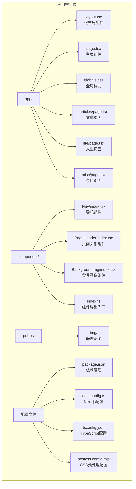
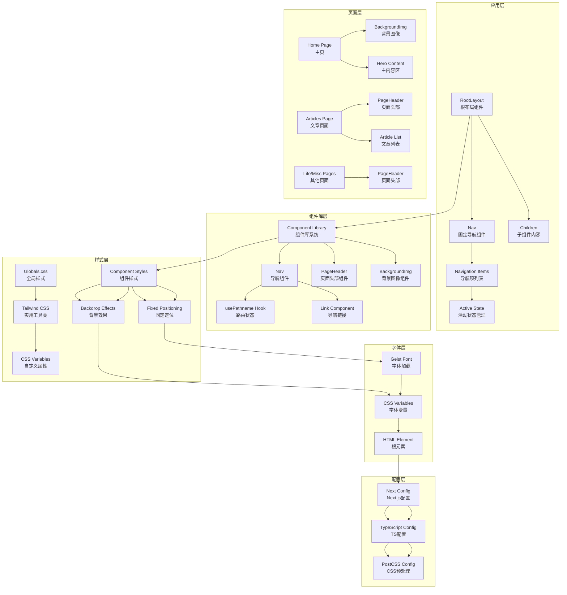
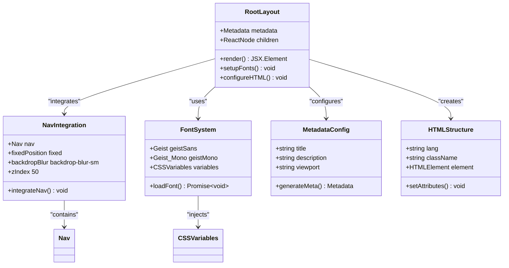
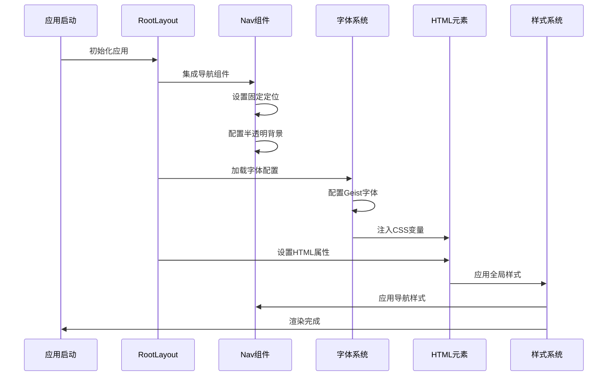
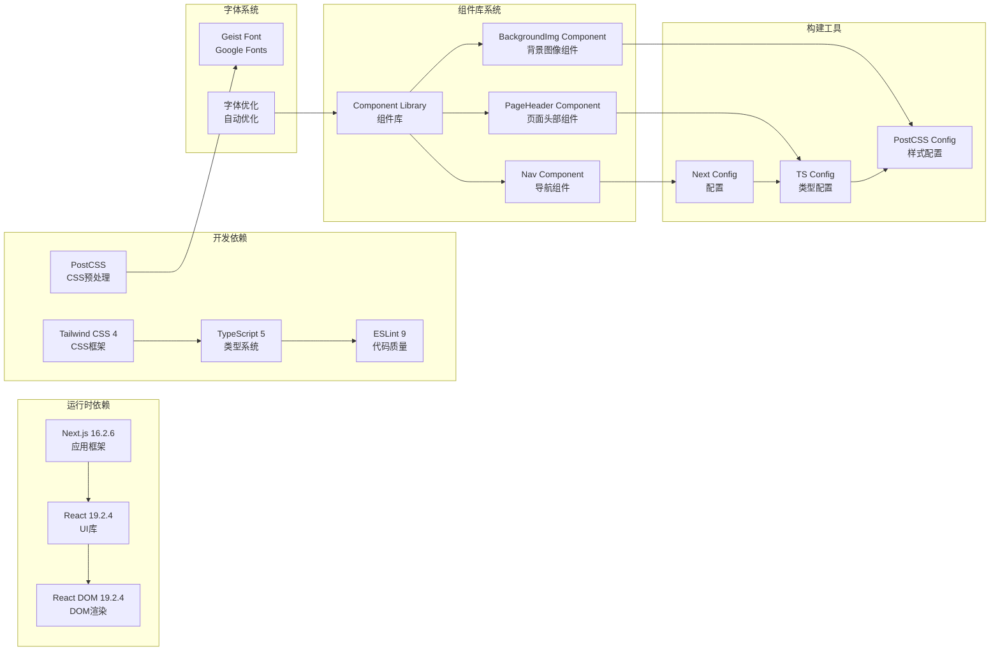
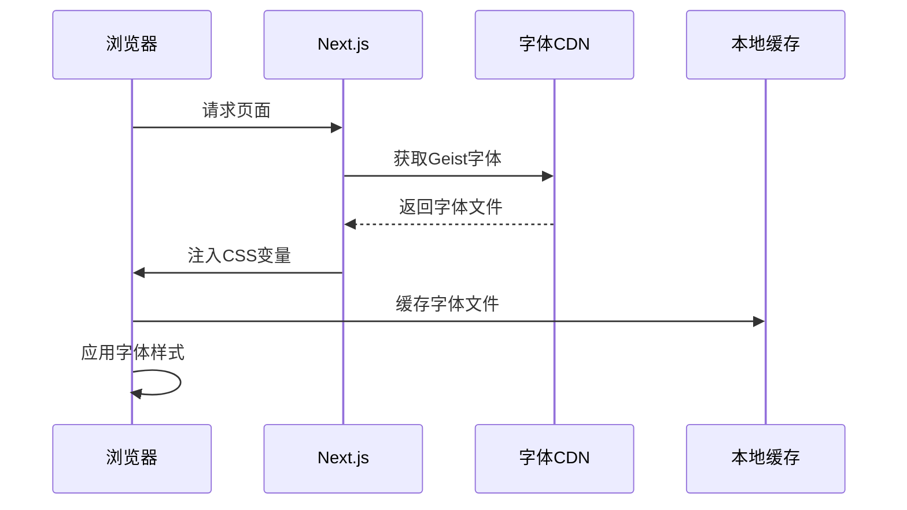

# 核心组件详解

<cite>
**本文档引用的文件**
- [app/layout.tsx](file://app/layout.tsx)
- [app/page.tsx](file://app/page.tsx)
- [app/articles/page.tsx](file://app/articles/page.tsx)
- [app/life/page.tsx](file://app/life/page.tsx)
- [app/misc/page.tsx](file://app/misc/page.tsx)
- [component/Nav/index.tsx](file://component/Nav/index.tsx)
- [component/PageHeader/index.tsx](file://component/PageHeader/index.tsx)
- [component/BackgroundImg/index.tsx](file://component/BackgroundImg/index.tsx)
- [component/index.ts](file://component/index.ts)
- [app/globals.css](file://app/globals.css)
- [package.json](file://package.json)
- [next.config.ts](file://next.config.ts)
- [tsconfig.json](file://tsconfig.json)
- [postcss.config.mjs](file://postcss.config.mjs)
- [README.md](file://README.md)
</cite>

## 更新摘要
**变更内容**
- 新增组件库系统，包含 Nav、PageHeader、BackgroundImg 三个核心组件
- 更新根布局以集成固定定位导航栏
- 扩展页面组件以使用新的组件库
- 重构页面头部设计系统
- 增强组件复用性和可维护性

## 目录
1. [简介](#简介)
2. [项目结构](#项目结构)
3. [核心组件](#核心组件)
4. [架构概览](#架构概览)
5. [详细组件分析](#详细组件分析)
6. [组件库系统](#组件库系统)
7. [依赖关系分析](#依赖关系分析)
8. [性能考虑](#性能考虑)
9. [故障排除指南](#故障排除指南)
10. [结论](#结论)

## 简介

blod 是一个基于 Next.js 16.2.6 构建的个人博客项目，采用 React Server Components 模式和现代前端开发技术栈。该项目展示了如何构建高性能、可访问且美观的单页应用，重点体现在根布局组件、导航组件、页面头部组件和背景图像组件的设计与实现上。

## 项目结构

项目采用 Next.js App Router 结构，现已扩展为包含组件库系统的完整架构：

**图表来源**
- [app/layout.tsx:1-38](file://app/layout.tsx#L1-L38)
- [component/index.ts:1-6](file://component/index.ts#L1-L6)
- [package.json:1-31](file://package.json#L1-L31)

**章节来源**
- [app/layout.tsx:1-38](file://app/layout.tsx#L1-L38)
- [component/index.ts:1-6](file://component/index.ts#L1-L6)
- [package.json:1-31](file://package.json#L1-L31)

## 核心组件

### RootLayout 组件分析

RootLayout 作为应用的根布局组件，现已集成了新的导航组件系统：

#### 元数据配置
- **标题设置**: "chagumu's blog"
- **描述信息**: "chagumu's personal blog - one Day"

#### 字体加载机制
项目使用 Next.js 内置的字体优化功能：
- **Geist Sans 字体**: 通过 `Geist` 变量注入 CSS 自定义属性
- **Geist Mono 字体**: 通过 `Geist_Mono` 变量注入等宽字体
- **子集配置**: Latin 字符集支持
- **变量绑定**: 将字体变量映射到 CSS 自定义属性

#### HTML 根元素设置
- **语言属性**: 设置为英语
- **类名配置**: 合并字体变量类名和样式类
- **全屏高度**: 设置根元素为全高显示
- **抗锯齿**: 启用字体抗锯齿渲染

#### 导航集成
- **固定定位**: 导航栏固定在页面顶部
- **半透明背景**: 使用 `bg-[#53ade5]/30` 实现半透明蓝色背景
- **模糊效果**: 启用 `backdrop-blur-sm` 毛玻璃效果
- **z-index 管理**: 设置为 50 确保导航在最上层显示

**章节来源**
- [app/layout.tsx:16-37](file://app/layout.tsx#L16-L37)

### 新增组件库系统

项目现已建立完整的组件库系统，提供可复用的 UI 组件：

#### 组件库架构
- **统一导出**: 通过 `component/index.ts` 统一导出所有组件
- **模块化设计**: 每个组件独立封装，职责单一
- **类型安全**: 完整的 TypeScript 接口定义
- **样式隔离**: 组件内部管理自身样式

#### 组件分类
- **布局组件**: Nav（导航）、PageHeader（页面头部）
- **展示组件**: BackgroundImg（背景图像）
- **业务组件**: 支持不同页面的特定需求

**章节来源**
- [component/index.ts:1-6](file://component/index.ts#L1-L6)

## 架构概览

项目采用分层架构设计，现已扩展为包含组件库系统的完整架构：

**图表来源**
- [app/layout.tsx:21-37](file://app/layout.tsx#L21-L37)
- [component/Nav/index.tsx:15-45](file://component/Nav/index.tsx#L15-L45)
- [component/PageHeader/index.tsx:8-24](file://component/PageHeader/index.tsx#L8-L24)
- [component/BackgroundImg/index.tsx:4-16](file://component/BackgroundImg/index.tsx#L4-L16)

## 详细组件分析

### RootLayout 组件深度解析

RootLayout 作为应用的根组件，现已集成了完整的导航系统：

#### 类图展示

**图表来源**
- [app/layout.tsx:21-37](file://app/layout.tsx#L21-L37)
- [component/Nav/index.tsx:15-45](file://component/Nav/index.tsx#L15-L45)

#### 数据流分析

**图表来源**
- [app/layout.tsx:21-37](file://app/layout.tsx#L21-L37)

**章节来源**
- [app/layout.tsx:1-38](file://app/layout.tsx#L1-L38)

### 新组件库系统详细分析

#### Nav 组件分析

Nav 组件是固定定位的导航栏，提供完整的导航功能：

##### 组件特性
- **固定定位**: 使用 `fixed top-0 left-0 right-0` 固定在页面顶部
- **半透明背景**: `bg-[#53ade5]/30` 提供蓝色半透明背景
- **模糊效果**: `backdrop-blur-sm` 实现毛玻璃效果
- **z-index 管理**: `z-50` 确保导航在最上层显示

##### 导航项系统
- **动态路由**: 使用 `usePathname()` 获取当前路由状态
- **活动状态**: 通过 `pathname === item.href` 判断活动导航项
- **图标支持**: 每个导航项配有相应表情符号图标
- **响应式设计**: 使用 `flex items-center gap-6` 实现水平间距

##### 导航项配置
- **首页**: 🏠 "🏠" - 首页导航
- **文章**: 📝 "📝" - 文章列表
- **杂烩**: 🎨 "🎨" - 杂烩页面
- **人生路**: 🚶 "🚶" - 人生页面
- **社交**: 💬 "💬" - 社交页面
- **摄影**: ✨ "✨" - 摄影页面

**章节来源**
- [component/Nav/index.tsx:1-46](file://component/Nav/index.tsx#L1-L46)

#### PageHeader 组件分析

PageHeader 组件提供统一的页面头部设计系统：

##### 组件结构
- **背景容器**: `relative h-[280px]` 设置固定高度
- **内容层**: `relative z-10` 确保内容在背景之上
- **居中布局**: `flex items-center justify-center` 实现垂直居中

##### 设计特性
- **背景图像**: 内部嵌套 BackgroundImg 组件
- **标题设计**: `text-3xl md:text-4xl` 响应式字体大小
- **阴影效果**: `drop-shadow-lg` 和 `drop-shadow-md` 提供立体感
- **透明度控制**: `text-white/85` 控制副标题透明度

##### Props 接口
- **title**: 必填字符串，主标题内容
- **subtitle**: 可选字符串，副标题内容

**章节来源**
- [component/PageHeader/index.tsx:1-25](file://component/PageHeader/index.tsx#L1-L25)

#### BackgroundImg 组件分析

BackgroundImg 组件专门负责背景图像的显示：

##### 组件特性
- **绝对定位**: `absolute inset-0` 确保覆盖整个容器
- **z-index 管理**: `z-0` 确保背景在内容之下
- **全屏覆盖**: `fill` 属性实现全屏图像覆盖

##### 图像配置
- **资源路径**: `/img/love.png` 指向静态图像资源
- **填充策略**: `object-cover` 确保图像完整覆盖但不变形
- **优先加载**: `priority` 属性确保首屏快速加载

##### 性能优化
- **Next.js Image**: 使用优化的 Image 组件
- **自动优化**: 支持现代图片格式和尺寸优化
- **延迟加载**: 非首屏图片采用延迟加载策略

**章节来源**
- [component/BackgroundImg/index.tsx:1-17](file://component/BackgroundImg/index.tsx#L1-L17)

### 页面组件使用新模式

#### Home 组件更新
Home 组件现已简化为纯背景图像和内容展示：

##### 结构简化
- **背景图像**: 直接使用 BackgroundImg 组件
- **内容居中**: 使用 Flexbox 实现垂直居中对齐
- **标题设计**: 大号字体的博客标题，带有阴影效果
- **副标题**: 描述性文本，提供额外信息

##### 代码简化
- **移除导航**: 导航功能已移至根布局的 Nav 组件
- **移除按钮**: 操作按钮暂时注释，保持页面简洁
- **结构清晰**: 专注于内容展示的核心功能

**章节来源**
- [app/page.tsx:1-36](file://app/page.tsx#L1-L36)

#### 文章页面组件
文章页面现已使用 PageHeader 组件：

##### PageHeader 集成
- **统一头部**: 使用 PageHeader 组件替代自定义头部
- **标题配置**: "文章列表" 作为主标题
- **副标题配置**: "记录技术成长，分享学习心得" 作为副标题

##### 页面结构
- **Flex 布局**: `flex flex-col min-h-screen` 实现全屏布局
- **内容区域**: `flex-1` 确保主要内容区域占满剩余空间
- **背景设计**: `bg-gray-50` 提供浅灰色背景

**章节来源**
- [app/articles/page.tsx:62-145](file://app/articles/page.tsx#L62-L145)

## 依赖关系分析

项目的技术栈和依赖关系展现了现代化的前端开发实践，现已扩展为包含组件库系统的完整架构：

**图表来源**
- [package.json:15-29](file://package.json#L15-L29)
- [next.config.ts:3-5](file://next.config.ts#L3-L5)
- [tsconfig.json:21-23](file://tsconfig.json#L21-L23)
- [component/index.ts:1-6](file://component/index.ts#L1-L6)

**章节来源**
- [package.json:1-31](file://package.json#L1-L31)
- [tsconfig.json:1-35](file://tsconfig.json#L1-L35)
- [component/index.ts:1-6](file://component/index.ts#L1-L6)

## 性能考虑

### React Server Components 使用模式

项目充分利用了 React Server Components 的性能优势，并结合新的组件库系统：

#### 服务器渲染优势
- **首屏加载**: 服务器端渲染减少客户端计算负担
- **SEO 优化**: 预渲染内容提升搜索引擎可见性
- **网络传输**: 减少初始 HTML 大小，提高加载速度

#### 客户端激活策略
- **交互组件**: 仅在需要时进行客户端激活
- **懒加载**: 使用 React.lazy 和 Suspense 实现按需加载
- **状态管理**: 最小化客户端状态，保持服务器端纯净

### 组件库性能优化

#### Nav 组件优化
- **路由状态**: 使用 `usePathname()` 在客户端管理路由状态
- **条件渲染**: 活动状态判断避免不必要的重新渲染
- **CSS 动画**: 使用 `transition-colors` 和 `transition-opacity` 实现平滑动画

#### PageHeader 组件优化
- **组件复用**: 统一的页面头部设计减少重复代码
- **样式隔离**: 组件内部管理样式，避免全局样式污染
- **条件渲染**: 副标题的条件渲染避免不必要的 DOM 元素

#### BackgroundImg 组件优化
- **Next.js Image**: 利用 Image 组件的自动优化功能
- **优先加载**: `priority` 属性确保首屏图像快速显示
- **响应式适配**: 自动适配不同设备的图像尺寸

### 字体加载优化

**图表来源**
- [app/layout.tsx:6-14](file://app/layout.tsx#L6-L14)

### 图片优化策略

- **自动优化**: Next.js Image 组件自动优化图片格式和尺寸
- **延迟加载**: 非首屏图片采用延迟加载策略
- **格式转换**: 支持现代图片格式如 WebP
- **响应式适配**: 根据设备像素密度选择合适尺寸

**章节来源**
- [app/layout.tsx:1-38](file://app/layout.tsx#L1-L38)
- [component/BackgroundImg/index.tsx:7-13](file://component/BackgroundImg/index.tsx#L7-L13)

## 故障排除指南

### 常见问题及解决方案

#### 组件导入问题
**症状**: 组件无法正确导入或显示
**解决方案**:
1. 检查 `component/index.ts` 导出配置是否正确
2. 验证组件路径是否正确
3. 确认组件文件是否存在且可访问

#### 导航状态问题
**症状**: 导航项活动状态不正确
**解决方案**:
1. 检查 `usePathname()` Hook 是否正确导入
2. 验证路由路径配置是否与导航项匹配
3. 确认 `pathname` 比较逻辑是否正确

#### 样式冲突问题
**症状**: 样式显示不符合预期
**解决方案**:
1. 检查 Tailwind CSS 配置是否正确
2. 验证 CSS 变量定义是否生效
3. 确认组件样式优先级设置
4. 检查 z-index 层级关系

#### 图片显示异常
**症状**: 背景图片无法显示或显示不完整
**解决方案**:
1. 验证图片路径 `/img/love.png` 是否正确
2. 检查图片文件是否存在且可访问
3. 确认 Next.js Image 组件配置正确
4. 验证 `fill` 属性和 `object-cover` 样式

### 调试技巧

#### 开发环境调试
- 使用浏览器开发者工具检查元素样式
- 验证 CSS 变量值是否正确应用
- 检查网络面板确认资源加载状态
- 使用 React DevTools 检查组件树结构

#### 生产环境监控
- 监控字体加载性能指标
- 分析图片加载时间和带宽使用
- 跟踪组件渲染性能数据
- 监控导航状态变化

**章节来源**
- [app/globals.css:1-32](file://app/globals.css#L1-L32)
- [README.md:19-20](file://README.md#L19-L20)

## 结论

blod 项目通过引入完整的组件库系统，展示了现代 React 应用开发的最佳实践。项目的核心优势包括：

1. **架构清晰**: 采用分层设计，组件职责明确，Nav、PageHeader、BackgroundImg 各司其职
2. **组件复用**: 通过组件库系统实现代码复用，提高开发效率
3. **性能优化**: 充分利用 React Server Components 和 Next.js 优化特性
4. **用户体验**: 固定定位导航、统一页面头部设计和流畅的交互体验
5. **可维护性**: 模块化的代码结构和清晰的依赖关系，便于后续扩展

通过深入理解这些核心组件的实现原理和最佳实践，开发者可以更好地构建类似的应用程序，并在性能、可维护性和用户体验之间找到平衡点。新的组件库系统为项目的长期发展奠定了坚实的基础，使得功能扩展和维护变得更加简单高效。