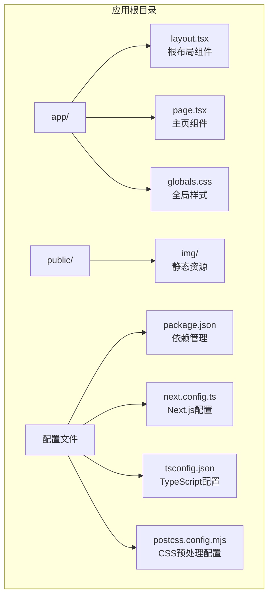
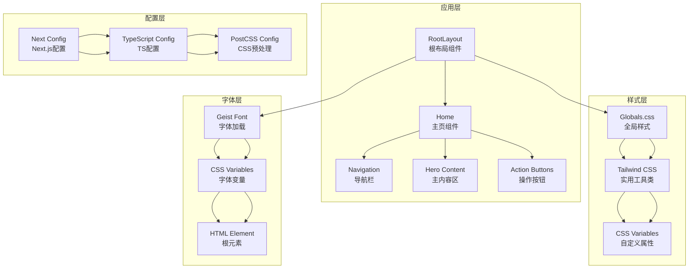
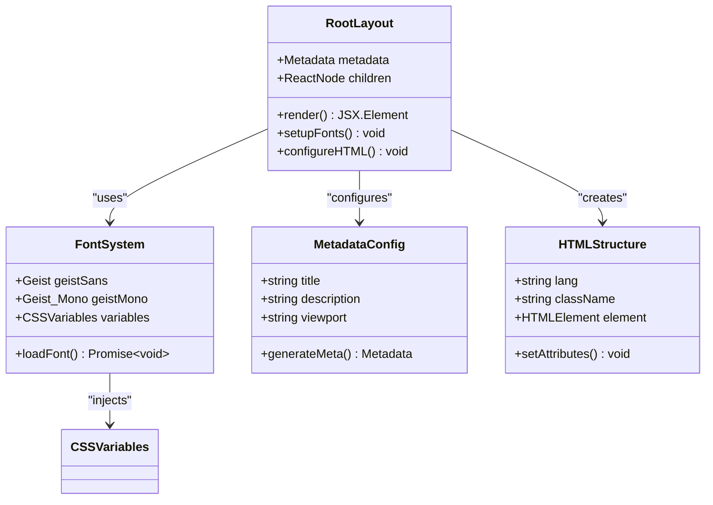
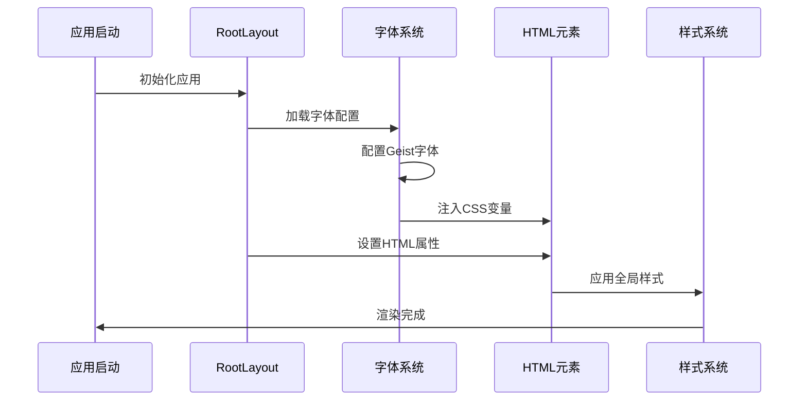
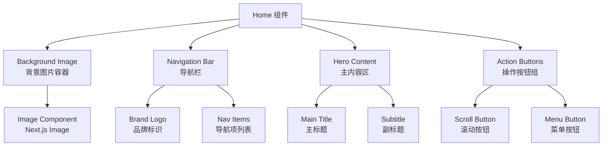
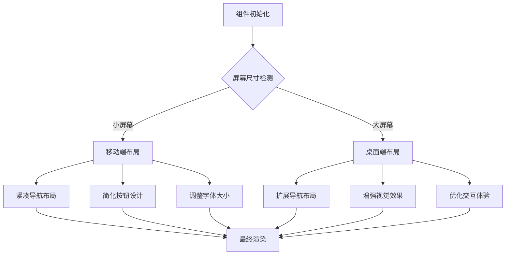
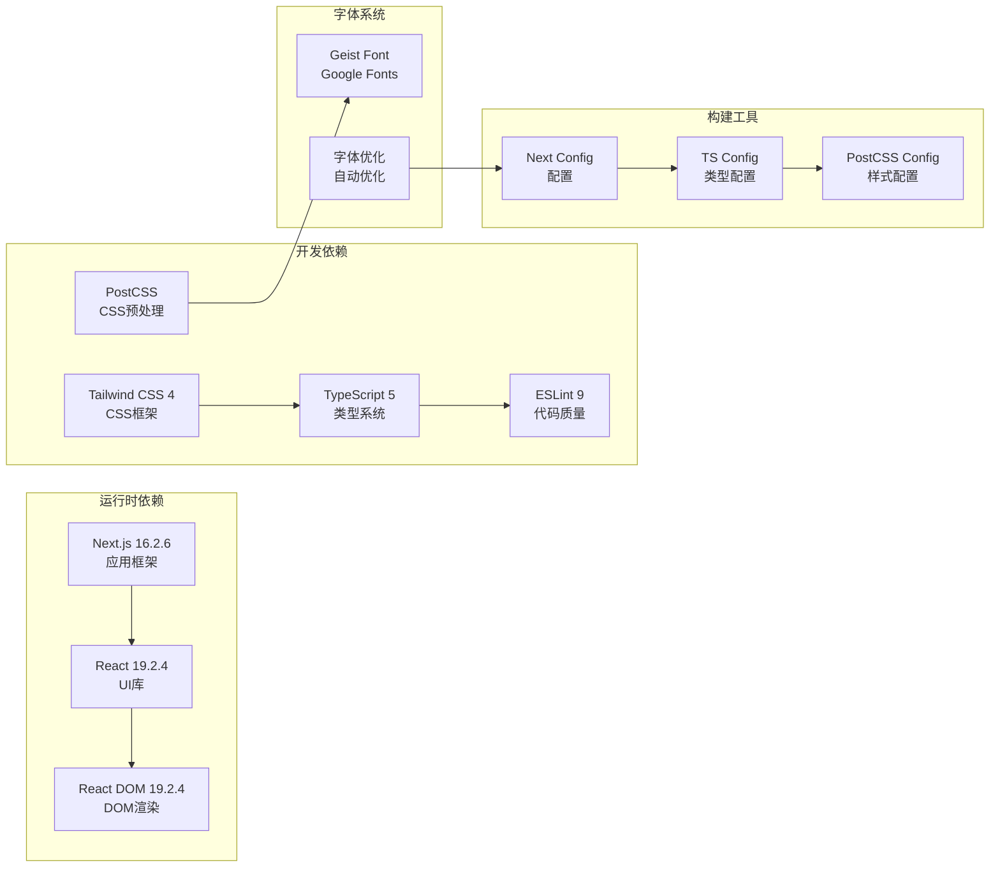
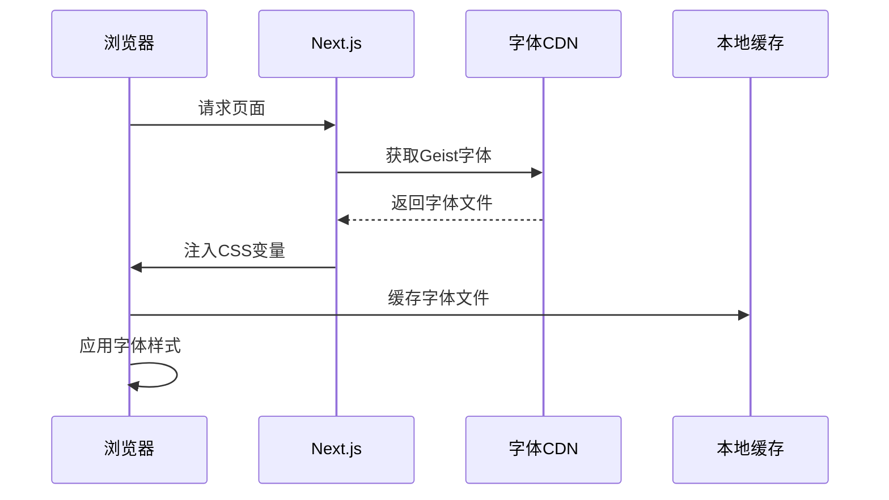

# 核心组件详解

<cite>
**本文档引用的文件**
- [app/layout.tsx](file://app/layout.tsx)
- [app/page.tsx](file://app/page.tsx)
- [app/globals.css](file://app/globals.css)
- [package.json](file://package.json)
- [next.config.ts](file://next.config.ts)
- [tsconfig.json](file://tsconfig.json)
- [postcss.config.mjs](file://postcss.config.mjs)
- [README.md](file://README.md)
</cite>

## 目录
1. [简介](#简介)
2. [项目结构](#项目结构)
3. [核心组件](#核心组件)
4. [架构概览](#架构概览)
5. [详细组件分析](#详细组件分析)
6. [依赖关系分析](#依赖关系分析)
7. [性能考虑](#性能考虑)
8. [故障排除指南](#故障排除指南)
9. [结论](#结论)

## 简介

blod 是一个基于 Next.js 16.2.6 构建的个人博客项目，采用 React Server Components 模式和现代前端开发技术栈。该项目展示了如何构建高性能、可访问且美观的单页应用，重点体现在根布局组件和主页组件的设计与实现上。

## 项目结构

项目采用 Next.js App Router 结构，主要文件组织如下：

**图表来源**
- [app/layout.tsx:1-34](file://app/layout.tsx#L1-L34)
- [app/page.tsx:1-72](file://app/page.tsx#L1-L72)
- [package.json:1-31](file://package.json#L1-L31)

**章节来源**
- [app/layout.tsx:1-34](file://app/layout.tsx#L1-L34)
- [app/page.tsx:1-72](file://app/page.tsx#L1-L72)
- [package.json:1-31](file://package.json#L1-L31)

## 核心组件

### RootLayout 组件分析

RootLayout 是整个应用的根布局组件，负责提供基础的 HTML 结构和全局样式配置。其核心功能包括：

#### 元数据配置
- **标题设置**: "chagumu's blog"
- **描述信息**: "chagumu's personal blog - one Day"
- **语言配置**: 默认英语 (en)

#### 字体加载机制
项目使用 Next.js 内置的字体优化功能：
- **Geist Sans 字体**: 通过 `Geist` 变量注入 CSS 自定义属性
- **Geist Mono 字体**: 通过 `Geist_Mono` 变量注入等宽字体
- **子集配置**: Latin 字符集支持
- **变量绑定**: 将字体变量映射到 CSS 自定义属性

#### HTML 根元素设置
- **语言属性**: 设置为英语
- **类名配置**: 合并字体变量类名和样式类
- **全屏高度**: 设置根元素为全高显示
- **抗锯齿**: 启用字体抗锯齿渲染

**章节来源**
- [app/layout.tsx:15-33](file://app/layout.tsx#L15-L33)

### Home 组件分析

Home 组件是应用的主要页面，采用响应式设计和现代化的视觉效果：

#### 导航栏实现
- **品牌标识**: "曹磊.博客" 文字标识
- **导航项**: 包含首页、文章、杂烩、人生路、社交、美哒哒 等六个导航项
- **图标支持**: 每个导航项配有相应的表情符号图标
- **样式设计**: 半透明背景、模糊效果、阴影增强

#### 背景图片系统
- **图片资源**: 使用 `/img/love.png` 作为背景图像
- **填充策略**: 使用 Next.js Image 组件的 fill 属性实现全屏覆盖
- **优先级加载**: 设置 `priority` 属性确保首屏快速加载
- **样式控制**: `object-cover` 确保图片完整覆盖但不变形

#### 主要内容区域
- **居中布局**: 采用 Flexbox 实现垂直居中对齐
- **标题设计**: 大号字体的博客标题，带有阴影效果
- **副标题**: 描述性文本，提供额外信息
- **层级管理**: 使用 z-index 确保内容在背景之上

#### 操作按钮系统
- **固定定位**: 使用 `fixed` 定位在右下角
- **垂直排列**: 两个功能按钮垂直堆叠
- **交互设计**: 悬停时改变颜色和背景
- **SVG 图标**: 使用简洁的 SVG 图标表示功能

**章节来源**
- [app/page.tsx:12-71](file://app/page.tsx#L12-L71)

## 架构概览

项目采用分层架构设计，展示组件间的依赖关系：

**图表来源**
- [app/layout.tsx:15-33](file://app/layout.tsx#L15-L33)
- [app/page.tsx:12-71](file://app/page.tsx#L12-L71)
- [app/globals.css:1-27](file://app/globals.css#L1-L27)

## 详细组件分析

### RootLayout 组件深度解析

RootLayout 作为应用的根组件，承担着多重职责：

#### 类图展示

**图表来源**
- [app/layout.tsx:15-33](file://app/layout.tsx#L15-L33)

#### 数据流分析

**图表来源**
- [app/layout.tsx:5-28](file://app/layout.tsx#L5-L28)

**章节来源**
- [app/layout.tsx:1-34](file://app/layout.tsx#L1-L34)

### Home 组件详细分析

Home 组件采用模块化设计，每个部分都有明确的职责分工：

#### 组件层次结构

**图表来源**
- [app/page.tsx:12-71](file://app/page.tsx#L12-L71)

#### 响应式设计流程

**图表来源**
- [app/page.tsx:14-71](file://app/page.tsx#L14-L71)

**章节来源**
- [app/page.tsx:1-72](file://app/page.tsx#L1-L72)

## 依赖关系分析

项目的技术栈和依赖关系展现了现代化的前端开发实践：

**图表来源**
- [package.json:15-29](file://package.json#L15-L29)
- [next.config.ts:3-5](file://next.config.ts#L3-L5)
- [tsconfig.json:21-23](file://tsconfig.json#L21-L23)

**章节来源**
- [package.json:1-31](file://package.json#L1-L31)
- [tsconfig.json:1-35](file://tsconfig.json#L1-L35)

## 性能考虑

### React Server Components 使用模式

项目充分利用了 React Server Components 的性能优势：

#### 服务器渲染优势
- **首屏加载**: 服务器端渲染减少客户端计算负担
- **SEO 优化**: 预渲染内容提升搜索引擎可见性
- **网络传输**: 减少初始 HTML 大小，提高加载速度

#### 客户端激活策略
- **交互组件**: 仅在需要时进行客户端激活
- **懒加载**: 使用 React.lazy 和 Suspense 实现按需加载
- **状态管理**: 最小化客户端状态，保持服务器端纯净

### 字体加载优化

**图表来源**
- [app/layout.tsx:5-13](file://app/layout.tsx#L5-L13)

### 图片优化策略

- **自动优化**: Next.js Image 组件自动优化图片格式和尺寸
- **延迟加载**: 非首屏图片采用延迟加载策略
- **格式转换**: 支持现代图片格式如 WebP
- **响应式适配**: 根据设备像素密度选择合适尺寸

**章节来源**
- [app/layout.tsx:1-34](file://app/layout.tsx#L1-L34)
- [app/page.tsx:17-23](file://app/page.tsx#L17-L23)

## 故障排除指南

### 常见问题及解决方案

#### 字体加载问题
**症状**: 页面显示默认字体而非自定义字体
**解决方案**:
1. 检查字体变量是否正确注入到 CSS
2. 验证 Google Fonts 连接是否正常
3. 确认字体文件是否成功下载

#### 图片显示异常
**症状**: 背景图片无法显示或显示不完整
**解决方案**:
1. 验证图片路径 `/img/love.png` 是否正确
2. 检查图片文件是否存在且可访问
3. 确认 Next.js Image 组件配置正确

#### 样式冲突问题
**症状**: 样式显示不符合预期
**解决方案**:
1. 检查 Tailwind CSS 配置是否正确
2. 验证 CSS 变量定义是否生效
3. 确认组件样式优先级设置

### 调试技巧

#### 开发环境调试
- 使用浏览器开发者工具检查元素样式
- 验证 CSS 变量值是否正确应用
- 检查网络面板确认资源加载状态

#### 生产环境监控
- 监控字体加载性能指标
- 分析图片加载时间和带宽使用
- 跟踪组件渲染性能数据

**章节来源**
- [app/globals.css:1-27](file://app/globals.css#L1-L27)
- [README.md:19-20](file://README.md#L19-L20)

## 结论

blod 项目展示了现代 React 应用开发的最佳实践，通过精心设计的根布局组件和主页组件，实现了高性能、可维护且美观的用户界面。项目的核心优势包括：

1. **架构清晰**: 采用分层设计，组件职责明确
2. **性能优化**: 充分利用 React Server Components 和 Next.js 优化特性
3. **用户体验**: 响应式设计和流畅的交互体验
4. **可维护性**: 模块化的代码结构和清晰的依赖关系

通过深入理解这些核心组件的实现原理和最佳实践，开发者可以更好地构建类似的应用程序，并在性能、可维护性和用户体验之间找到平衡点。