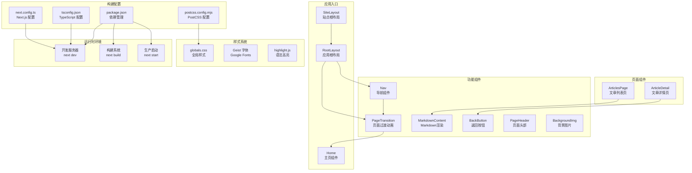
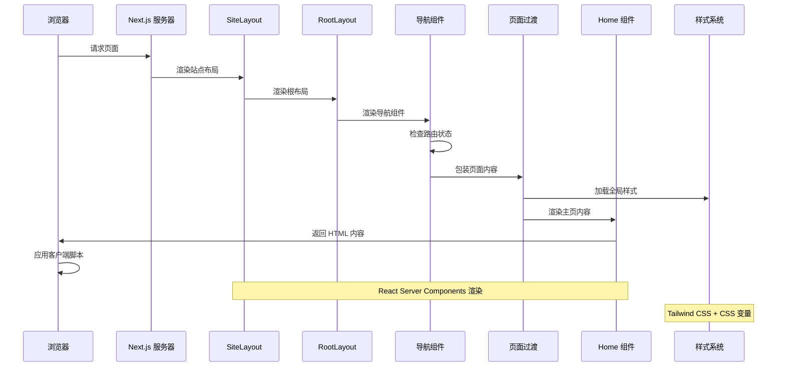
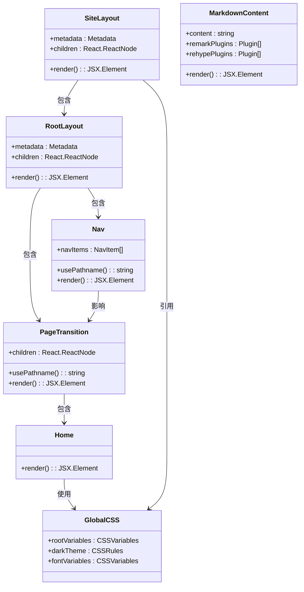
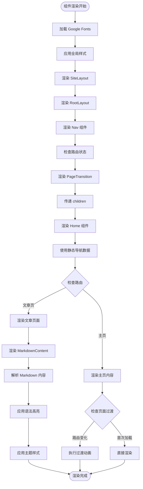
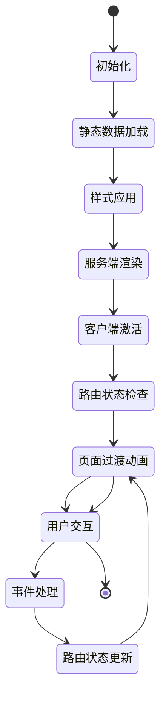

# 组件交互与数据流

<cite>
**本文档引用的文件**
- [app/(site)/layout.tsx](file://app/(site)/layout.tsx)
- [app/(site)/page.tsx](file://app/(site)/page.tsx)
- [app/(site)/articles/[slug]/page.tsx](file://app/(site)/articles/[slug]/page.tsx)
- [app/(site)/articles/page.tsx](file://app/(site)/articles/page.tsx)
- [app/layout.tsx](file://app/layout.tsx)
- [app/globals.css](file://app/globals.css)
- [component/index.ts](file://component/index.ts)
- [component/Nav/index.tsx](file://component/Nav/index.tsx)
- [component/PageTransition/index.tsx](file://component/PageTransition/index.tsx)
- [component/MarkdownContent/index.tsx](file://component/MarkdownContent/index.tsx)
- [component/BackButton/index.tsx](file://component/BackButton/index.tsx)
- [component/PageHeader/index.tsx](file://component/PageHeader/index.tsx)
- [component/BackgroundImg/index.tsx](file://component/BackgroundImg/index.tsx)
- [package.json](file://package.json)
- [next.config.ts](file://next.config.ts)
- [tsconfig.json](file://tsconfig.json)
- [postcss.config.mjs](file://postcss.config.mjs)
- [README.md](file://README.md)
</cite>

## 更新摘要
**所做更改**
- 新增页面过渡动画组件 PageTransition 的详细分析
- 新增 Markdown 渲染功能的完整实现说明
- 改进导航组件的路由状态管理机制
- 扩展组件间数据流和交互模式分析
- 更新架构图以反映新的组件交互模式

## 目录
1. [简介](#简介)
2. [项目结构](#项目结构)
3. [核心组件](#核心组件)
4. [架构概览](#架构概览)
5. [详细组件分析](#详细组件分析)
6. [依赖分析](#依赖分析)
7. [性能考虑](#性能考虑)
8. [故障排除指南](#故障排除指南)
9. [结论](#结论)

## 简介

本项目是一个基于 Next.js 16.2.6 的个人博客应用，采用 React Server Components 架构模式。项目通过根布局组件 RootLayout 和主页组件 Home 实现了清晰的组件层次结构，展示了现代 React 应用的组件交互与数据流模式。

**更新** 新增了页面过渡动画、Markdown 渲染功能和改进的导航路由状态管理，显著提升了用户体验和内容展示能力。

该项目的核心特点包括：
- 使用 Next.js App Router 架构
- React Server Components 渲染模式
- Tailwind CSS 样式系统集成
- 响应式设计和主题切换机制
- 全局字体优化配置
- **新增** 页面过渡动画效果
- **新增** Markdown 内容渲染支持
- **改进** 导航组件路由状态管理

## 项目结构

项目采用标准的 Next.js App Router 结构，主要文件组织如下：



**图表来源**
- [app/(site)/layout.tsx:22-33](file://app/(site)/layout.tsx#L22-L33)
- [app/layout.tsx:22-37](file://app/layout.tsx#L22-L37)
- [component/index.ts:1-17](file://component/index.ts#L1-L17)

**章节来源**
- [package.json:15-34](file://package.json#L15-L34)
- [tsconfig.json:16-23](file://tsconfig.json#L16-L23)
- [postcss.config.mjs:1-8](file://postcss.config.mjs#L1-L8)
- [next.config.ts:1-8](file://next.config.ts#L1-L8)

## 核心组件

### SiteLayout 组件

SiteLayout 是站点级别的根布局组件，负责：
- 集成导航组件 Nav
- 包装页面过渡动画 PageTransition
- 提供统一的站点布局结构

该组件采用 React Server Components 模式，通过函数组件形式实现，接收 children 属性作为子组件容器。

### RootLayout 组件

RootLayout 是应用的根布局组件，负责：
- 定义全局元数据（标题和描述）
- 加载和配置 Google Fonts（Geist Sans 和 Geist Mono）
- 提供全局样式上下文
- 设置 HTML 根元素属性

该组件采用 React Server Components 模式，通过函数组件形式实现，接收 children 属性作为子组件容器。

### Home 组件

Home 组件是应用的主要页面内容，实现了完整的响应式布局：
- 背景图片层（绝对定位，z-index: 0）
- 导航栏层（相对定位，z-index: 1）
- 主要内容区域（相对定位，z-index: 1）
- 右侧操作按钮（固定定位，z-index: 20）

组件使用了多种 Tailwind CSS 类进行样式控制，包括布局、颜色、阴影和过渡效果。

### 新增组件

#### PageTransition 组件

PageTransition 组件提供了页面切换时的平滑过渡动画效果：
- 使用 Framer Motion 实现动画
- 基于路径名（pathname）进行动画控制
- 支持进入、退出和初始状态动画
- 配置了 0.3 秒的缓动过渡效果

#### MarkdownContent 组件

MarkdownContent 组件实现了 Markdown 内容的服务器端渲染：
- 使用 @m2d/react-markdown/server 进行 SSR
- 集成 GFM（GitHub Flavored Markdown）支持
- 配置语法高亮和标题锚点功能
- 支持代码块的语法高亮显示

#### Nav 组件

Nav 组件改进了路由状态管理：
- 使用 next/navigation 的 usePathname Hook
- 动态判断当前激活的导航项
- 支持嵌套路由的精确匹配
- 提供视觉反馈的激活状态

**章节来源**
- [app/(site)/layout.tsx:22-33](file://app/(site)/layout.tsx#L22-L33)
- [app/layout.tsx:22-37](file://app/layout.tsx#L22-L37)
- [app/(site)/page.tsx:4-35](file://app/(site)/page.tsx#L4-L35)
- [component/PageTransition/index.tsx:7-27](file://component/PageTransition/index.tsx#L7-L27)
- [component/MarkdownContent/index.tsx:10-16](file://component/MarkdownContent/index.tsx#L10-L16)
- [component/Nav/index.tsx:15-52](file://component/Nav/index.tsx#L15-L52)

## 架构概览

Next.js 应用的渲染架构遵循 App Router 模式，组件间交互流程如下：



**图表来源**
- [app/(site)/layout.tsx:22-33](file://app/(site)/layout.tsx#L22-L33)
- [app/layout.tsx:22-37](file://app/layout.tsx#L22-L37)
- [component/Nav/index.tsx:15-52](file://component/Nav/index.tsx#L15-L52)
- [component/PageTransition/index.tsx:7-27](file://component/PageTransition/index.tsx#L7-L27)

## 详细组件分析

### 组件依赖关系分析



**图表来源**
- [app/(site)/layout.tsx:22-33](file://app/(site)/layout.tsx#L22-L33)
- [app/layout.tsx:22-37](file://app/layout.tsx#L22-L37)
- [component/Nav/index.tsx:6-13](file://component/Nav/index.tsx#L6-L13)
- [component/PageTransition/index.tsx:7-8](file://component/PageTransition/index.tsx#L7-L8)
- [component/MarkdownContent/index.tsx:6-8](file://component/MarkdownContent/index.tsx#L6-L8)

### 数据流与状态管理

项目中的数据流现在更加复杂，主要体现在以下方面：

1. **静态数据传递**：Home 组件通过 navItems 数组传递导航项数据
2. **动态路由状态**：Nav 组件通过 usePathname Hook 获取当前路由状态
3. **页面过渡状态**：PageTransition 组件基于路径名管理动画状态
4. **Markdown 内容状态**：MarkdownContent 组件处理 Markdown 解析状态
5. **全局样式状态**：通过 CSS 变量实现主题状态管理
6. **字体配置状态**：通过 Google Fonts API 提供字体资源



**图表来源**
- [app/(site)/layout.tsx:22-33](file://app/(site)/layout.tsx#L22-L33)
- [app/layout.tsx:17-20](file://app/layout.tsx#L17-L20)
- [component/Nav/index.tsx:16-31](file://component/Nav/index.tsx#L16-L31)
- [component/PageTransition/index.tsx:8-13](file://component/PageTransition/index.tsx#L8-L13)
- [component/MarkdownContent/index.tsx:10-16](file://component/MarkdownContent/index.tsx#L10-L16)

### 组件生命周期管理

在 Next.js 中，组件生命周期管理具有以下特点：

1. **服务端渲染阶段**：
   - SiteLayout 和 RootLayout 在服务器端渲染
   - 根据请求环境应用相应的主题设置
   - 预加载必要的字体资源
   - MarkdownContent 组件在服务器端完成 Markdown 解析

2. **客户端激活阶段**：
   - 页面内容在客户端完全激活
   - Nav 组件使用 usePathname Hook 管理路由状态
   - PageTransition 组件处理页面切换动画
   - 处理用户交互事件
   - 维护组件状态

3. **样式系统生命周期**：
   - CSS 变量在页面加载时初始化
   - 响应系统主题变化
   - 支持动态主题切换
   - 语法高亮样式按需加载

**章节来源**
- [app/(site)/layout.tsx:22-33](file://app/(site)/layout.tsx#L22-L33)
- [app/layout.tsx:22-37](file://app/layout.tsx#L22-L37)
- [component/Nav/index.tsx:15-52](file://component/Nav/index.tsx#L15-L52)
- [component/PageTransition/index.tsx:7-27](file://component/PageTransition/index.tsx#L7-L27)
- [app/globals.css:3-32](file://app/globals.css#L3-L32)

### 状态提升与事件处理

项目中采用的状态管理模式：

1. **状态提升**：导航项数据从 Home 组件内部提升到组件外部
2. **路由状态管理**：Nav 组件通过 usePathname Hook 管理当前路由状态
3. **页面过渡状态**：PageTransition 组件基于路径名管理动画状态
4. **事件冒泡**：导航链接使用原生 anchor 标签，支持默认的浏览器行为
5. **样式状态**：通过 CSS 变量实现全局状态管理
6. **Markdown 状态**：MarkdownContent 组件处理内容解析和渲染状态



**图表来源**
- [component/Nav/index.tsx:16-31](file://component/Nav/index.tsx#L16-L31)
- [component/PageTransition/index.tsx:8-13](file://component/PageTransition/index.tsx#L8-L13)
- [component/BackButton/index.tsx:7-16](file://component/BackButton/index.tsx#L7-L16)

## 依赖分析

### 外部依赖关系

```mermaid
graph LR
subgraph "核心框架"
NextJS[Next.js 16.2.6]
React[React 19.2.4]
ReactDOM[React DOM 19.2.4]
end
subgraph "动画系统"
FramerMotion[Framer Motion 12.38.0]
end
subgraph "Markdown处理"
M2D[@m2d/react-markdown 1.0.0]
RemarkGFM[remark-gfm 4.0.1]
RehypeHighlight[rehype-highlight 7.0.2]
RehypeSlug[rehype-slug 6.0.0]
end
subgraph "样式系统"
Tailwind[Tailwind CSS 4]
PostCSS[PostCSS]
CSSVars[CSS 变量]
HLJS[highlight.js]
end
subgraph "字体系统"
GoogleFonts[Google Fonts]
Geist[Geist Font]
end
subgraph "开发工具"
TypeScript[TypeScript 5]
ESLint[ESLint 9]
NodeTypes[Node Types]
end
NextJS --> React
NextJS --> ReactDOM
NextJS --> FramerMotion
NextJS --> M2D
M2D --> RemarkGFM
M2D --> RehypeHighlight
M2D --> RehypeSlug
Tailwind --> PostCSS
NextJS --> Tailwind
NextJS --> GoogleFonts
GoogleFonts --> Geist
TypeScript --> NextJS
ESLint --> NextJS
HLJS --> RehypeHighlight
```

**图表来源**
- [package.json:15-34](file://package.json#L15-L34)
- [tsconfig.json:16-23](file://tsconfig.json#L16-L23)

### 内部模块依赖

组件间的依赖关系现在更加复杂：

1. **SiteLayout 依赖**：
   - RootLayout 根布局
   - Nav 导航组件
   - PageTransition 页面过渡
   - 全局样式文件
   - Google Fonts 配置

2. **Nav 组件依赖**：
   - next/navigation 的 usePathname Hook
   - 路由状态管理
   - 激活状态判断逻辑

3. **PageTransition 组件依赖**：
   - Framer Motion 动画库
   - next/navigation 的 usePathname Hook
   - 路径名状态管理

4. **MarkdownContent 组件依赖**：
   - @m2d/react-markdown/server
   - remark-gfm 插件
   - rehype-highlight 插件
   - rehype-slug 插件
   - highlight.js 样式

**章节来源**
- [package.json:15-34](file://package.json#L15-L34)
- [component/Nav/index.tsx:1-52](file://component/Nav/index.tsx#L1-L52)
- [component/PageTransition/index.tsx:1-27](file://component/PageTransition/index.tsx#L1-L27)
- [component/MarkdownContent/index.tsx:1-16](file://component/MarkdownContent/index.tsx#L1-L16)

## 性能考虑

### 渲染性能优化

1. **字体优化**：
   - 使用 next/font 自动优化字体加载
   - 通过 CSS 变量减少重复计算
   - 预加载关键字体资源

2. **样式性能**：
   - Tailwind CSS 编译时优化
   - CSS 变量减少样式重排
   - 响应式设计减少不必要的重绘

3. **图片优化**：
   - 使用 Next.js Image 组件自动优化
   - 支持响应式图片和格式转换
   - 优先级加载确保首屏性能

4. **动画性能**：
   - Framer Motion 使用 GPU 加速
   - 动画状态基于路径名优化
   - 过渡动画时长控制在合理范围

5. **Markdown 渲染性能**：
   - 服务器端渲染减少客户端负担
   - 语法高亮按需加载
   - 内容解析结果缓存

### 内存管理

- 组件卸载时自动清理事件监听器
- 样式表在页面切换时正确管理
- 字体资源通过浏览器缓存复用
- 动画状态在路由切换时正确清理

## 故障排除指南

### 常见问题诊断

1. **字体加载问题**：
   - 检查网络连接和 CDN 访问
   - 验证 Google Fonts API 可用性
   - 确认 CSS 变量正确注入

2. **样式不生效**：
   - 检查 Tailwind CSS 配置
   - 验证 CSS 变量定义
   - 确认类名拼写正确

3. **组件渲染异常**：
   - 检查 React 版本兼容性
   - 验证 TypeScript 配置
   - 确认 Next.js App Router 配置

4. **页面过渡动画问题**：
   - 检查 Framer Motion 依赖安装
   - 验证 usePathname Hook 使用
   - 确认动画配置参数正确

5. **Markdown 渲染问题**：
   - 检查 @m2d/react-markdown 依赖
   - 验证插件配置正确性
   - 确认内容格式符合要求

### 调试技巧

1. **开发环境调试**：
   - 使用浏览器开发者工具检查渲染树
   - 监控网络面板验证资源加载
   - 查看控制台错误信息

2. **性能分析**：
   - 使用 React Profiler 分析组件渲染
   - 监控内存使用情况
   - 分析样式重排和重绘

3. **构建问题排查**：
   - 检查 TypeScript 编译错误
   - 验证 PostCSS 配置
   - 确认依赖版本兼容性

4. **动画调试**：
   - 使用浏览器开发者工具检查动画状态
   - 监控动画帧率和性能
   - 验证路由状态变化

5. **Markdown 调试**：
   - 检查 Markdown 内容格式
   - 验证插件配置和版本
   - 确认语法高亮样式加载

**章节来源**
- [README.md:1-37](file://README.md#L1-L37)
- [package.json:9-14](file://package.json#L9-L14)

## 结论

本项目展示了现代 Next.js 应用的组件交互与数据流最佳实践。通过 RootLayout 和 Home 组件的清晰分离，实现了良好的关注点分离和可维护性。

**更新** 新增的页面过渡动画、Markdown 渲染功能和改进的导航路由状态管理，显著提升了用户体验和内容展示能力。

关键优势包括：
- **简洁的组件层次**：根布局和页面组件职责明确
- **高效的样式系统**：CSS 变量和 Tailwind CSS 的结合
- **优秀的性能表现**：字体优化和图片优化策略
- **流畅的用户体验**：页面过渡动画和路由状态管理
- **强大的内容展示**：Markdown 渲染和语法高亮支持
- **良好的可扩展性**：模块化设计便于功能扩展

建议的改进方向：
- 添加错误边界组件以提高应用稳定性
- 实现更复杂的状态管理模式
- 集成客户端组件以支持交互功能
- 添加国际化支持和多语言切换
- 优化 Markdown 渲染性能和缓存策略
- 增强页面过渡动画的自定义选项