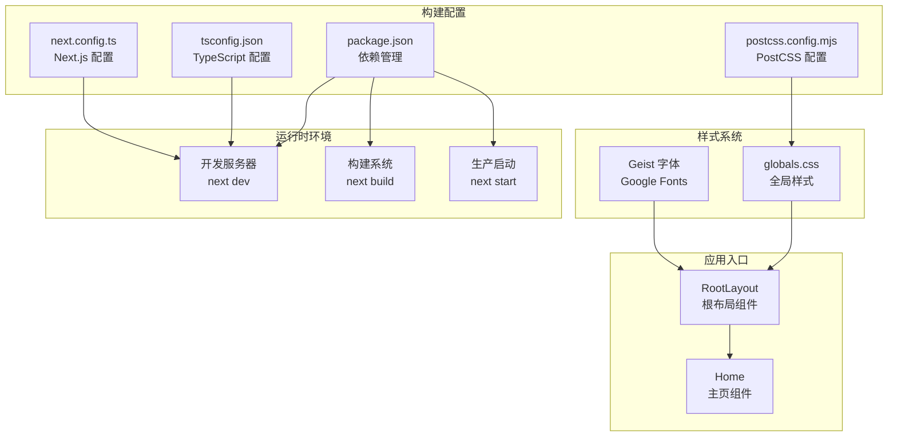
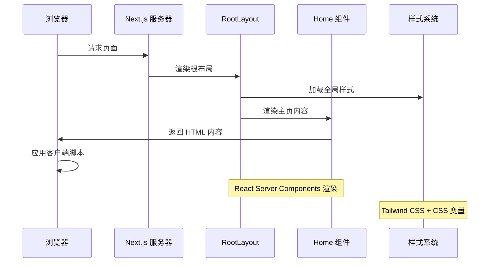
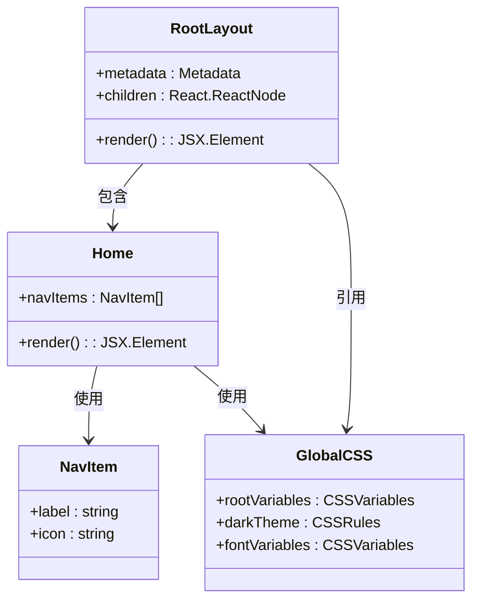
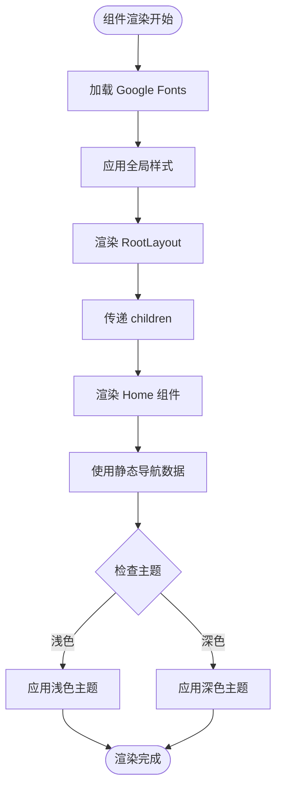
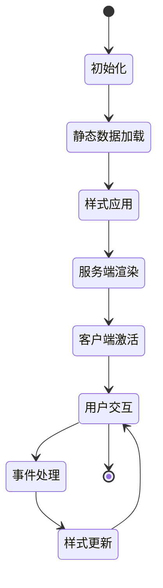
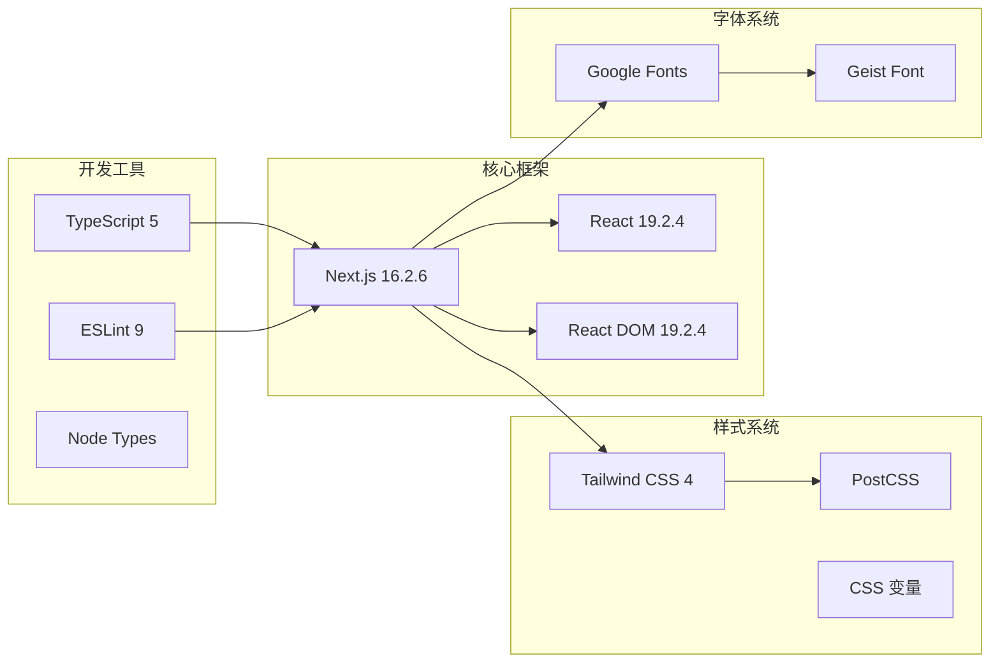

# 组件交互与数据流

<cite>
**本文档引用的文件**
- [app/layout.tsx](file://app/layout.tsx)
- [app/page.tsx](file://app/page.tsx)
- [app/globals.css](file://app/globals.css)
- [package.json](file://package.json)
- [next.config.ts](file://next.config.ts)
- [tsconfig.json](file://tsconfig.json)
- [postcss.config.mjs](file://postcss.config.mjs)
- [README.md](file://README.md)
</cite>

## 目录
1. [简介](#简介)
2. [项目结构](#项目结构)
3. [核心组件](#核心组件)
4. [架构概览](#架构概览)
5. [详细组件分析](#详细组件分析)
6. [依赖分析](#依赖分析)
7. [性能考虑](#性能考虑)
8. [故障排除指南](#故障排除指南)
9. [结论](#结论)

## 简介

本项目是一个基于 Next.js 16.2.6 的个人博客应用，采用 React Server Components 架构模式。项目通过根布局组件 RootLayout 和主页组件 Home 实现了清晰的组件层次结构，展示了现代 React 应用的组件交互与数据流模式。

该项目的核心特点包括：
- 使用 Next.js App Router 架构
- React Server Components 渲染模式
- Tailwind CSS 样式系统集成
- 响应式设计和主题切换机制
- 全局字体优化配置

## 项目结构

项目采用标准的 Next.js App Router 结构，主要文件组织如下：

**图表来源**
- [app/layout.tsx:1-34](file://app/layout.tsx#L1-L34)
- [app/page.tsx:1-72](file://app/page.tsx#L1-L72)
- [app/globals.css:1-27](file://app/globals.css#L1-L27)

**章节来源**
- [package.json:1-31](file://package.json#L1-L31)
- [tsconfig.json:1-35](file://tsconfig.json#L1-L35)
- [postcss.config.mjs:1-8](file://postcss.config.mjs#L1-L8)
- [next.config.ts:1-8](file://next.config.ts#L1-L8)

## 核心组件

### RootLayout 组件

RootLayout 是整个应用的根布局组件，负责：
- 定义全局元数据（标题和描述）
- 加载和配置 Google Fonts（Geist Sans 和 Geist Mono）
- 提供全局样式上下文
- 设置 HTML 根元素属性

该组件采用 React Server Components 模式，通过函数组件形式实现，接收 children 属性作为子组件容器。

### Home 组件

Home 组件是应用的主要页面内容，实现了完整的响应式布局：
- 背景图片层（绝对定位，z-index: 0）
- 导航栏层（相对定位，z-index: 1）
- 主要内容区域（相对定位，z-index: 1）
- 右侧操作按钮（固定定位，z-index: 20）

组件使用了多种 Tailwind CSS 类进行样式控制，包括布局、颜色、阴影和过渡效果。

**章节来源**
- [app/layout.tsx:15-34](file://app/layout.tsx#L15-L34)
- [app/page.tsx:12-72](file://app/page.tsx#L12-L72)

## 架构概览

Next.js 应用的渲染架构遵循 App Router 模式，组件间交互流程如下：

**图表来源**
- [app/layout.tsx:20-33](file://app/layout.tsx#L20-L33)
- [app/page.tsx:12-72](file://app/page.tsx#L12-L72)
- [app/globals.css:1-27](file://app/globals.css#L1-L27)

## 详细组件分析

### 组件依赖关系分析

**图表来源**
- [app/layout.tsx:15-34](file://app/layout.tsx#L15-L34)
- [app/page.tsx:3-10](file://app/page.tsx#L3-L10)
- [app/globals.css:3-26](file://app/globals.css#L3-L26)

### 数据流与状态管理

项目中的数据流相对简单，主要体现在以下方面：

1. **静态数据传递**：Home 组件通过 navItems 数组传递导航项数据
2. **全局样式状态**：通过 CSS 变量实现主题状态管理
3. **字体配置状态**：通过 Google Fonts API 提供字体资源

**图表来源**
- [app/layout.tsx:5-13](file://app/layout.tsx#L5-L13)
- [app/page.tsx:3-10](file://app/page.tsx#L3-L10)
- [app/globals.css:15-20](file://app/globals.css#L15-L20)

### 组件生命周期管理

在 Next.js 中，组件生命周期管理具有以下特点：

1. **服务端渲染阶段**：
   - RootLayout 在服务器端渲染
   - 根据请求环境应用相应的主题设置
   - 预加载必要的字体资源

2. **客户端激活阶段**：
   - 页面内容在客户端完全激活
   - 处理用户交互事件
   - 维护组件状态

3. **样式系统生命周期**：
   - CSS 变量在页面加载时初始化
   - 响应系统主题变化
   - 支持动态主题切换

**章节来源**
- [app/layout.tsx:20-33](file://app/layout.tsx#L20-L33)
- [app/globals.css:3-26](file://app/globals.css#L3-L26)

### 状态提升与事件处理

项目中采用的状态管理模式：

1. **状态提升**：导航项数据从 Home 组件内部提升到组件外部
2. **事件冒泡**：导航链接使用原生 anchor 标签，支持默认的浏览器行为
3. **样式状态**：通过 CSS 变量实现全局状态管理

**图表来源**
- [app/page.tsx:3-10](file://app/page.tsx#L3-L10)
- [app/globals.css:3-26](file://app/globals.css#L3-L26)

## 依赖分析

### 外部依赖关系

**图表来源**
- [package.json:15-29](file://package.json#L15-L29)
- [tsconfig.json:16-23](file://tsconfig.json#L16-L23)

### 内部模块依赖

组件间的依赖关系相对简单，主要体现为：

1. **RootLayout 依赖**：
   - 全局样式文件
   - Google Fonts 配置
   - 元数据定义

2. **Home 组件依赖**：
   - 导航项静态数据
   - Tailwind CSS 类名
   - 图片资源

**章节来源**
- [package.json:15-29](file://package.json#L15-L29)
- [tsconfig.json:16-23](file://tsconfig.json#L16-L23)

## 性能考虑

### 渲染性能优化

1. **字体优化**：
   - 使用 next/font 自动优化字体加载
   - 通过 CSS 变量减少重复计算
   - 预加载关键字体资源

2. **样式性能**：
   - Tailwind CSS 编译时优化
   - CSS 变量减少样式重排
   - 响应式设计减少不必要的重绘

3. **图片优化**：
   - 使用 Next.js Image 组件自动优化
   - 支持响应式图片和格式转换
   - 优先级加载确保首屏性能

### 内存管理

- 组件卸载时自动清理事件监听器
- 样式表在页面切换时正确管理
- 字体资源通过浏览器缓存复用

## 故障排除指南

### 常见问题诊断

1. **字体加载问题**：
   - 检查网络连接和 CDN 访问
   - 验证 Google Fonts API 可用性
   - 确认 CSS 变量正确注入

2. **样式不生效**：
   - 检查 Tailwind CSS 配置
   - 验证 CSS 变量定义
   - 确认类名拼写正确

3. **组件渲染异常**：
   - 检查 React 版本兼容性
   - 验证 TypeScript 配置
   - 确认 Next.js App Router 配置

### 调试技巧

1. **开发环境调试**：
   - 使用浏览器开发者工具检查渲染树
   - 监控网络面板验证资源加载
   - 查看控制台错误信息

2. **性能分析**：
   - 使用 React Profiler 分析组件渲染
   - 监控内存使用情况
   - 分析样式重排和重绘

3. **构建问题排查**：
   - 检查 TypeScript 编译错误
   - 验证 PostCSS 配置
   - 确认依赖版本兼容性

**章节来源**
- [README.md:1-37](file://README.md#L1-L37)
- [package.json:9-14](file://package.json#L9-L14)

## 结论

本项目展示了现代 Next.js 应用的组件交互与数据流最佳实践。通过 RootLayout 和 Home 组件的清晰分离，实现了良好的关注点分离和可维护性。

关键优势包括：
- **简洁的组件层次**：根布局和页面组件职责明确
- **高效的样式系统**：CSS 变量和 Tailwind CSS 的结合
- **优秀的性能表现**：字体优化和图片优化策略
- **良好的可扩展性**：模块化设计便于功能扩展

建议的改进方向：
- 添加错误边界组件以提高应用稳定性
- 实现更复杂的状态管理模式
- 集成客户端组件以支持交互功能
- 添加国际化支持和多语言切换