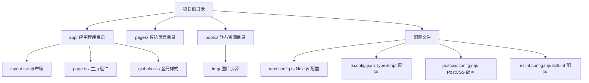
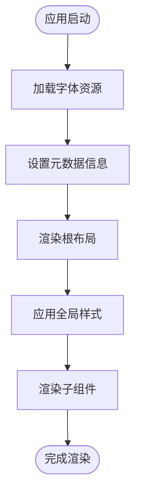
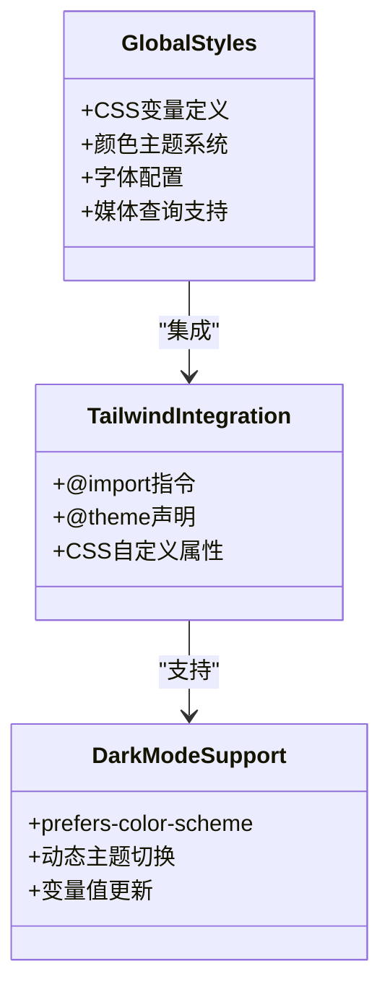
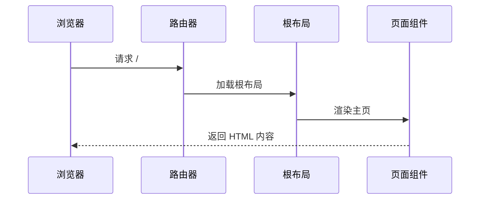
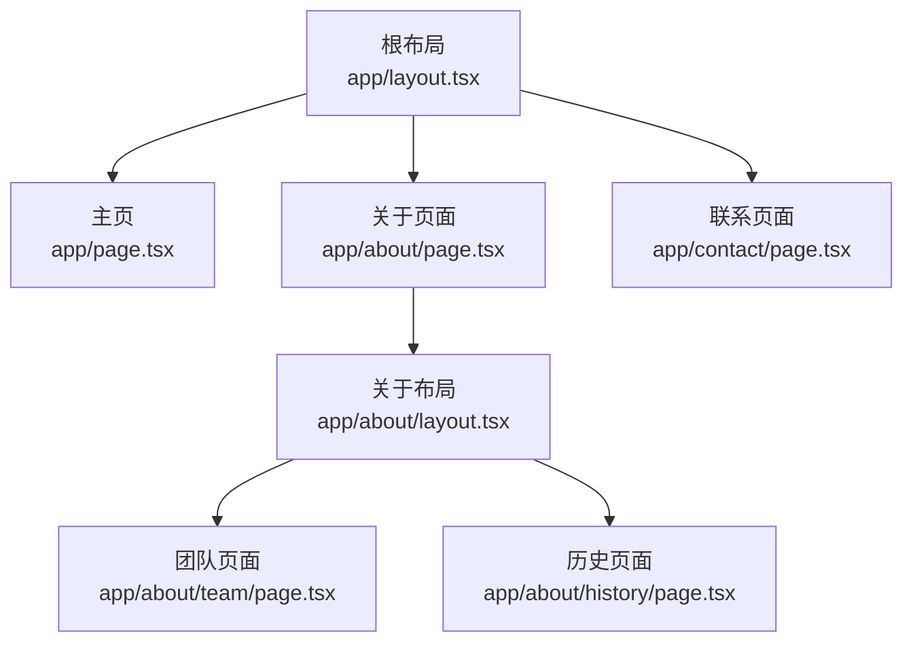
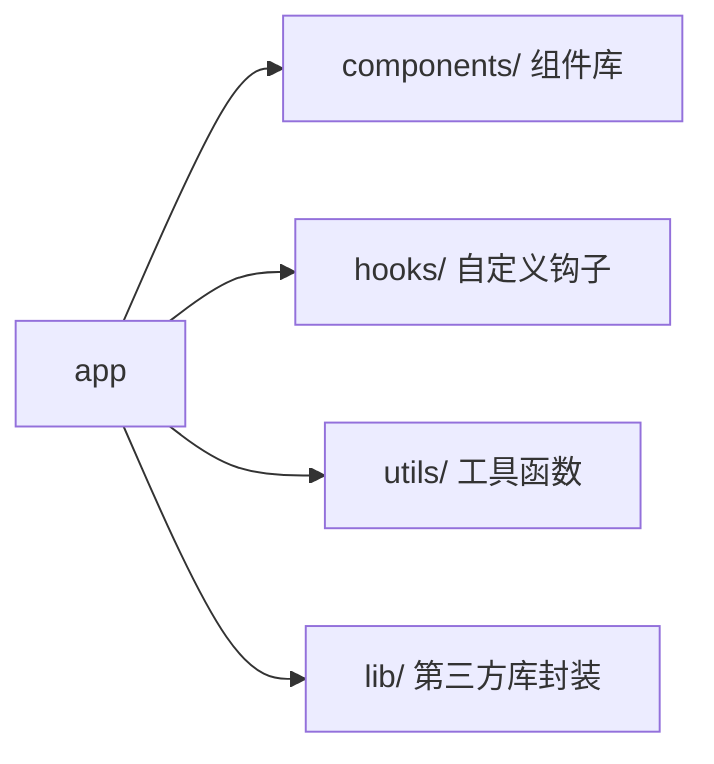
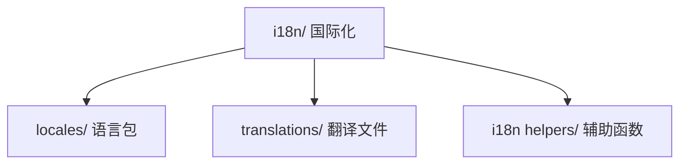
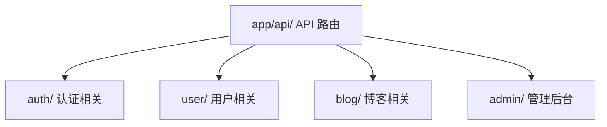

# 目录结构说明

<cite>
**本文档引用的文件**
- [app/layout.tsx](file://app/layout.tsx)
- [app/page.tsx](file://app/page.tsx)
- [app/globals.css](file://app/globals.css)
- [next.config.ts](file://next.config.ts)
- [package.json](file://package.json)
- [tsconfig.json](file://tsconfig.json)
- [postcss.config.mjs](file://postcss.config.mjs)
- [eslint.config.mjs](file://eslint.config.mjs)
- [README.md](file://README.md)
</cite>

## 目录结构概览

blod 项目采用 Next.js App Router 的现代文件系统架构，主要目录结构如下：

**图表来源**
- [app/layout.tsx:1-34](file://app/layout.tsx#L1-L34)
- [app/page.tsx:1-72](file://app/page.tsx#L1-L72)
- [app/globals.css:1-27](file://app/globals.css#L1-L27)

## App Router 文件系统架构

### app/ 目录的核心作用

Next.js App Router 将 app/ 目录作为应用程序的主要入口点，采用约定式路由机制。该目录遵循以下组织原则：

- **根布局管理**: 通过 layout.tsx 定义全局布局结构
- **页面组件**: 通过 page.tsx 定义主页内容
- **全局样式**: 通过 globals.css 管理应用级样式
- **嵌套路由**: 支持子目录创建嵌套路由结构

### 根布局组件 (layout.tsx)

根布局组件是整个应用程序的基础框架，承担以下关键职责：

**图表来源**
- [app/layout.tsx:15-33](file://app/layout.tsx#L15-L33)

**章节来源**
- [app/layout.tsx:1-34](file://app/layout.tsx#L1-L34)

### 主页组件 (page.tsx)

主页组件负责实现具体的页面内容，采用现代化的设计模式：

- **导航栏实现**: 使用语义化导航结构
- **响应式设计**: 支持不同屏幕尺寸的适配
- **图片优化**: 利用 Next.js Image 组件进行性能优化
- **交互元素**: 包含功能按钮和用户交互组件

**章节来源**
- [app/page.tsx:1-72](file://app/page.tsx#L1-L72)

### 全局样式管理 (globals.css)

全局样式文件采用 Tailwind CSS 和 CSS 变量相结合的方式：

**图表来源**
- [app/globals.css:1-27](file://app/globals.css#L1-L27)

**章节来源**
- [app/globals.css:1-27](file://app/globals.css#L1-L27)

## Public 目录的静态资源管理

public/ 目录专门用于存放不需要构建处理的静态资源：

### 资源组织原则

- **直接访问**: 所有文件可通过根路径直接访问
- **无需构建**: 不会被 Webpack 处理或优化
- **缓存友好**: 适合长期缓存的静态资源
- **零配置**: 无需额外的导入或配置

### 图片资源管理

项目中的图片资源位于 public/img/ 目录，通过相对路径 `/img/love.png` 进行访问。这种设计确保了：

- **性能优化**: 直接的 URL 访问避免了构建时的复杂处理
- **灵活性**: 支持各种格式的图片资源
- **可维护性**: 清晰的资源分类便于管理

**章节来源**
- [app/page.tsx:17-24](file://app/page.tsx#L17-L24)

## 配置文件目录组织

### Next.js 配置 (next.config.ts)

配置文件采用最小化配置策略，保持默认行为的同时提供扩展能力：

- **扩展空间**: 为未来功能预留配置选项
- **默认优化**: 依赖 Next.js 的智能默认配置
- **开发友好**: 简化的配置减少学习成本

**章节来源**
- [next.config.ts:1-8](file://next.config.ts#L1-L8)

### TypeScript 配置 (tsconfig.json)

TypeScript 配置采用现代化的编译选项：

- **模块解析**: 使用 bundler 模块解析器
- **路径映射**: 配置 @/* 路径别名
- **严格类型检查**: 启用严格模式确保代码质量
- **增量编译**: 支持快速的开发体验

**章节来源**
- [tsconfig.json:1-35](file://tsconfig.json#L1-L35)

### 构建工具配置

#### PostCSS 配置 (postcss.config.mjs)

PostCSS 配置专注于 Tailwind CSS 的集成：

- **插件系统**: 仅启用必要的 PostCSS 插件
- **构建优化**: 减少不必要的构建步骤
- **性能考虑**: 最小化的配置提升构建速度

**章节来源**
- [postcss.config.mjs:1-8](file://postcss.config.mjs#L1-L8)

#### ESLint 配置 (eslint.config.mjs)

ESLint 配置基于官方推荐规则：

- **Next.js 特定规则**: 集成 Next.js 官方 ESLint 配置
- **核心 Web Vitals**: 包含性能相关的最佳实践
- **TypeScript 支持**: 完整的 TypeScript 代码检查
- **自定义忽略**: 覆盖默认的忽略规则以适应项目需求

**章节来源**
- [eslint.config.mjs:1-19](file://eslint.config.mjs#L1-L19)

## 约定式路由工作原理

### 文件系统路由映射

Next.js App Router 基于文件系统的约定式路由机制：

**图表来源**
- [app/layout.tsx:20-33](file://app/layout.tsx#L20-L33)
- [app/page.tsx:12-72](file://app/page.tsx#L12-L72)

### 文件命名规范

- **根布局**: 必须使用 layout.tsx 或 layout.jsx
- **主页**: 必须使用 page.tsx 或 page.jsx
- **全局样式**: 必须使用 globals.css
- **子路由**: 通过目录结构实现嵌套路由

### 路由层次结构

## 目录结构最佳实践

### 项目组织建议

1. **明确职责分离**
   - app/ 仅包含应用程序逻辑
   - public/ 仅包含静态资源
   - 配置文件集中管理

2. **命名一致性**
   - 使用小写字母和连字符
   - 语义化文件名
   - 一致的目录结构

3. **性能优化**
   - 合理使用静态资源
   - 优化图片和媒体文件
   - 利用 Next.js 的内置优化

### 扩展建议

#### 功能模块化

#### 国际化支持

#### API 路由扩展

## 性能考虑与优化

### 构建优化策略

1. **代码分割**: 利用 Next.js 的自动代码分割
2. **懒加载**: 实现组件和页面的懒加载
3. **缓存策略**: 合理利用浏览器缓存
4. **资源压缩**: 启用 Gzip 或 Brotli 压缩

### 开发体验优化

1. **热重载**: 利用 Next.js 的快速热重载
2. **类型安全**: 完整的 TypeScript 支持
3. **代码检查**: 集成 ESLint 和 Prettier
4. **调试工具**: 使用 React DevTools 进行调试

## 故障排除指南

### 常见问题解决

1. **字体加载问题**
   - 检查 Google Fonts 链接
   - 验证字体变量配置
   - 确认网络连接状态

2. **样式冲突**
   - 检查 CSS 优先级
   - 验证 Tailwind 配置
   - 确认全局样式加载顺序

3. **构建错误**
   - 检查 TypeScript 类型
   - 验证配置文件语法
   - 确认依赖版本兼容性

### 调试技巧

1. **开发模式**: 使用 `npm run dev` 进行开发调试
2. **生产预览**: 使用 `npm run build && npm run start` 预览生产环境
3. **性能分析**: 利用 Next.js 的性能监控工具
4. **错误追踪**: 查看浏览器控制台和服务器日志

## 结论

blod 项目展现了 Next.js App Router 的最佳实践，通过清晰的目录结构和约定式路由实现了高效的开发体验。该架构具有以下优势：

- **简洁明了**: 目录结构简单易懂，便于新开发者上手
- **性能优秀**: 利用 Next.js 的内置优化特性
- **扩展性强**: 支持灵活的功能模块化和路由扩展
- **维护友好**: 标准化的配置和约定降低了维护成本

通过遵循这些最佳实践和扩展建议，可以进一步提升项目的质量和可维护性，为未来的功能扩展奠定坚实基础。