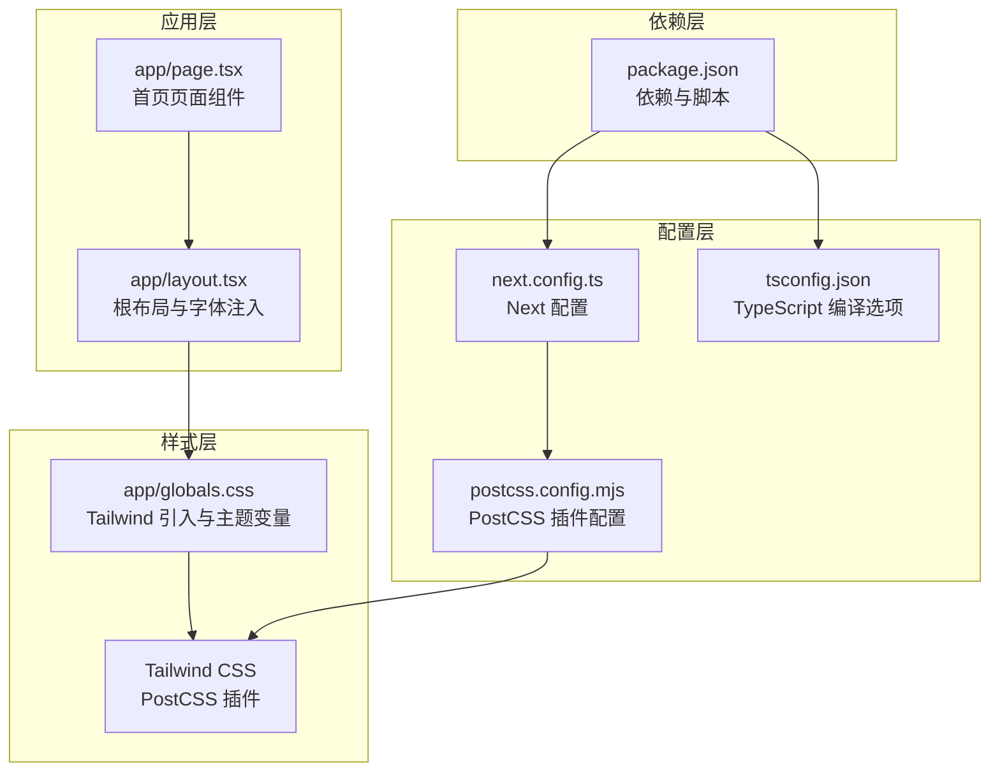
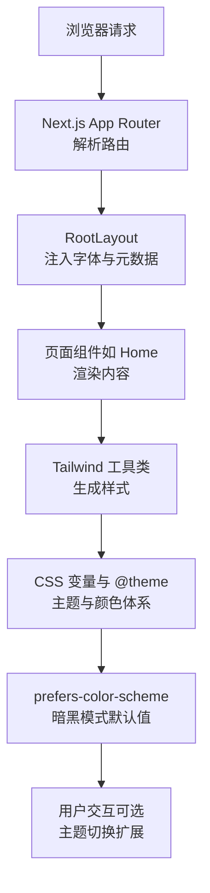
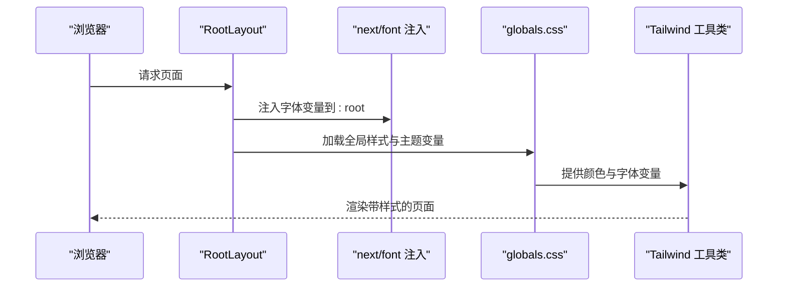
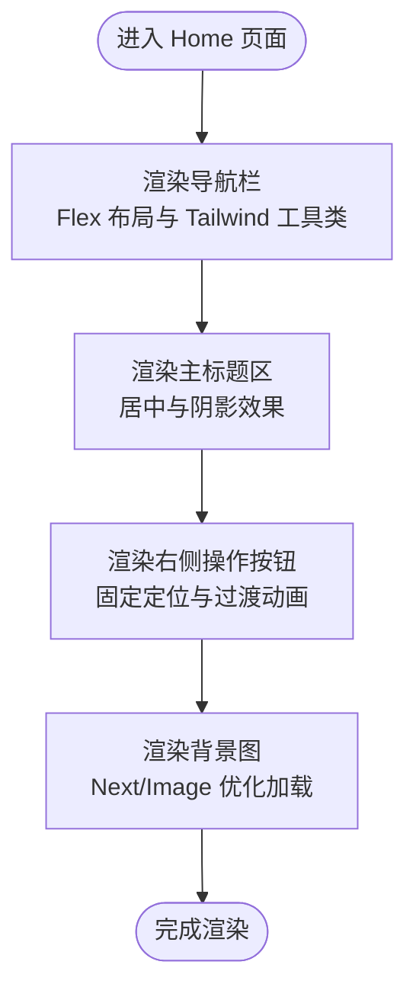
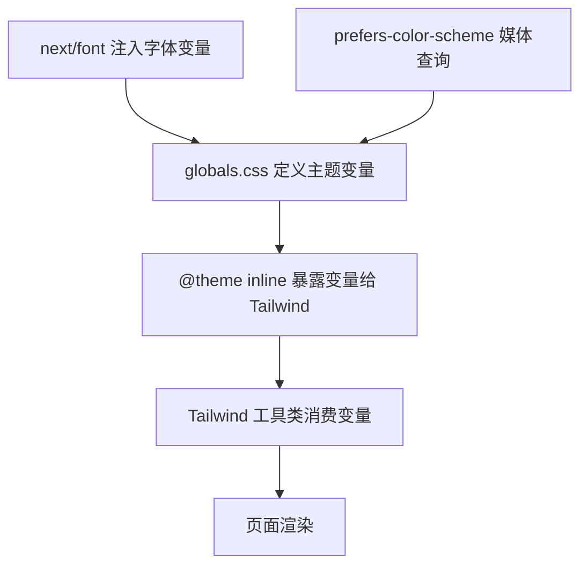
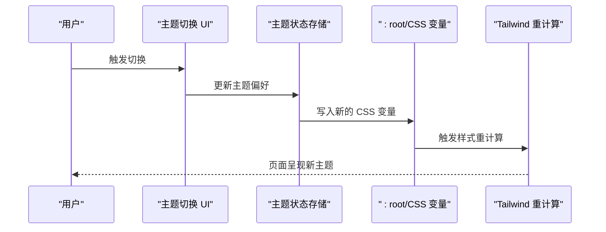
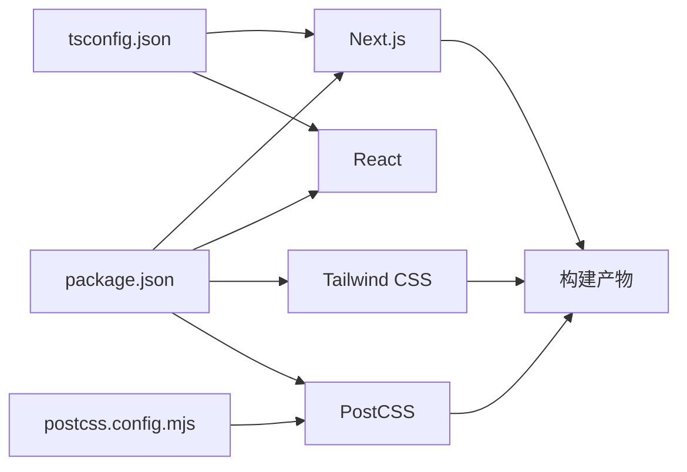

# 设计模式与架构原则

<cite>
**本文引用的文件**
- [README.md](file://README.md)
- [package.json](file://package.json)
- [next.config.ts](file://next.config.ts)
- [postcss.config.mjs](file://postcss.config.mjs)
- [tsconfig.json](file://tsconfig.json)
- [app/layout.tsx](file://app/layout.tsx)
- [app/page.tsx](file://app/page.tsx)
- [app/globals.css](file://app/globals.css)
- [AGENTS.md](file://AGENTS.md)
</cite>

## 目录
1. [引言](#引言)
2. [项目结构](#项目结构)
3. [核心组件](#核心组件)
4. [架构总览](#架构总览)
5. [详细组件分析](#详细组件分析)
6. [依赖关系分析](#依赖关系分析)
7. [性能考量](#性能考量)
8. [故障排查指南](#故障排查指南)
9. [结论](#结论)
10. [附录](#附录)

## 引言
本项目基于 Next.js 应用程序目录（App Router）构建，采用约定式路由与组件化架构，结合 Tailwind CSS 与 CSS 变量实现的样式系统，支持暗黑模式与响应式设计。本文档从设计模式与架构原则角度，系统阐述：
- 组件化架构与约定式路由
- CSS-in-JS 与 Tailwind CSS 的混合使用策略
- 暗黑模式与主题切换机制
- 响应式设计与移动端优先原则
- 技术决策、性能优化与可维护性设计
- 架构演进与扩展性建议

## 项目结构
项目采用 Next.js App Router 的标准目录结构，关键入口与样式文件如下：
- 应用根布局与元数据：app/layout.tsx
- 首页页面组件：app/page.tsx
- 全局样式与主题变量：app/globals.css
- 构建配置：next.config.ts、postcss.config.mjs、tsconfig.json
- 依赖与脚本：package.json
- 开发与部署指引：README.md
- Next.js 版本规则提示：AGENTS.md

图表来源
- [app/layout.tsx:1-34](file://app/layout.tsx#L1-L34)
- [app/page.tsx:1-72](file://app/page.tsx#L1-L72)
- [app/globals.css:1-27](file://app/globals.css#L1-L27)
- [next.config.ts:1-8](file://next.config.ts#L1-L8)
- [postcss.config.mjs:1-8](file://postcss.config.mjs#L1-L8)
- [tsconfig.json:1-35](file://tsconfig.json#L1-L35)
- [package.json:1-31](file://package.json#L1-L31)

章节来源
- [README.md:1-37](file://README.md#L1-L37)
- [package.json:1-31](file://package.json#L1-L31)
- [next.config.ts:1-8](file://next.config.ts#L1-L8)
- [postcss.config.mjs:1-8](file://postcss.config.mjs#L1-L8)
- [tsconfig.json:1-35](file://tsconfig.json#L1-L35)
- [app/layout.tsx:1-34](file://app/layout.tsx#L1-L34)
- [app/page.tsx:1-72](file://app/page.tsx#L1-L72)
- [app/globals.css:1-27](file://app/globals.css#L1-L27)
- [AGENTS.md:1-6](file://AGENTS.md#L1-L6)

## 核心组件
- 根布局组件（RootLayout）
  - 负责注入全局字体变量、设置 html/body 类名、提供页面元数据。
  - 使用 next/font 将字体变量注入到 :root，供 CSS 变量与 Tailwind 使用。
- 首页页面组件（Home）
  - 定义导航项列表与页面内容区域，使用 Tailwind 工具类进行布局与样式。
  - 包含背景图、导航栏、主标题与右侧操作按钮等元素。
- 全局样式（globals.css）
  - 引入 Tailwind，并定义主题变量（背景色、前景色、字体变量）。
  - 通过 prefers-color-scheme 媒体查询实现暗黑模式默认值。
- 构建与编译配置
  - next.config.ts：空配置占位，便于后续扩展。
  - postcss.config.mjs：启用 @tailwindcss/postcss 插件。
  - tsconfig.json：严格类型检查、路径别名、React JSX 环境等。

章节来源
- [app/layout.tsx:1-34](file://app/layout.tsx#L1-L34)
- [app/page.tsx:1-72](file://app/page.tsx#L1-L72)
- [app/globals.css:1-27](file://app/globals.css#L1-L27)
- [next.config.ts:1-8](file://next.config.ts#L1-L8)
- [postcss.config.mjs:1-8](file://postcss.config.mjs#L1-L8)
- [tsconfig.json:1-35](file://tsconfig.json#L1-L35)

## 架构总览
本项目采用“约定式路由 + 组件化布局”的架构模式：
- 约定式路由：Next.js App Router 将 app 目录下的文件作为页面路由，无需额外配置。
- 组件化布局：RootLayout 提供统一的根节点与上下文，子页面共享样式与主题。
- 样式系统：以 Tailwind CSS 为主，配合 CSS 变量与 @theme 指令实现主题化与可定制化。
- 主题与暗黑模式：通过 CSS 变量与媒体查询实现自动切换；可扩展为用户手动切换。

图表来源
- [app/layout.tsx:1-34](file://app/layout.tsx#L1-L34)
- [app/page.tsx:1-72](file://app/page.tsx#L1-L72)
- [app/globals.css:1-27](file://app/globals.css#L1-L27)

## 详细组件分析

### 根布局组件（RootLayout）
- 设计要点
  - 字体注入：通过 next/font 将 Geist 系列字体变量注入到 html 根节点，供 CSS 变量与 Tailwind 使用。
  - 元数据：在 metadata 中设置站点标题与描述，提升 SEO 与分享体验。
  - 结构化容器：在 html 上设置基础类名，body 设置最小高度与弹性布局，确保内容自适应。
- 与样式系统的耦合
  - 字体变量与 CSS 变量在 globals.css 中被消费，形成“字体变量 -> CSS 变量 -> Tailwind”链路。
- 可扩展点
  - 可引入主题 Provider 或 Context，在 RootLayout 内部封装主题状态，实现用户手动切换。

图表来源
- [app/layout.tsx:1-34](file://app/layout.tsx#L1-L34)
- [app/globals.css:1-27](file://app/globals.css#L1-L27)

章节来源
- [app/layout.tsx:1-34](file://app/layout.tsx#L1-L34)

### 首页页面组件（Home）
- 设计要点
  - 导航栏：使用 Flex 布局与 Tailwind 工具类实现响应式导航，背景模糊与阴影增强视觉层次。
  - 主标题区：居中布局与文字阴影，适配不同屏幕尺寸。
  - 右侧操作按钮：固定定位与圆角背景，使用过渡动画提升交互体验。
  - 背景图：使用 Next/Image 实现优化加载与填充覆盖。
- 响应式策略
  - 使用 Tailwind 断点前缀（如 md:）在不同屏幕尺寸下调整字号与间距。
- 可维护性
  - 导航项通过数组映射生成，便于扩展与维护。

图表来源
- [app/page.tsx:1-72](file://app/page.tsx#L1-L72)

章节来源
- [app/page.tsx:1-72](file://app/page.tsx#L1-L72)

### 样式系统与 CSS-in-JS
- Tailwind CSS 与 PostCSS
  - 通过 postcss.config.mjs 启用 @tailwindcss/postcss 插件，实现工具类按需生成与优化。
- CSS 变量与 @theme
  - 在 globals.css 中定义主题变量（背景、前景、字体），并通过 @theme inline 将其暴露给 Tailwind。
  - 字体变量由 next/font 注入到 html 根节点，再被 CSS 变量消费。
- CSS-in-JS 策略
  - 本项目未直接使用 JavaScript 动态注入样式，而是通过 CSS 变量与 Tailwind 工具类实现“类驱动的样式系统”，达到类似 CSS-in-JS 的灵活性与可组合性。
- 暗黑模式
  - 利用 prefers-color-scheme 媒体查询在 :root 中设置默认主题变量，实现自动暗黑模式。
  - 可扩展：引入用户偏好存储与主题切换函数，动态更新 :root 变量或切换类名。

图表来源
- [app/layout.tsx:1-34](file://app/layout.tsx#L1-L34)
- [app/globals.css:1-27](file://app/globals.css#L1-L27)
- [postcss.config.mjs:1-8](file://postcss.config.mjs#L1-L8)

章节来源
- [app/globals.css:1-27](file://app/globals.css#L1-L27)
- [postcss.config.mjs:1-8](file://postcss.config.mjs#L1-L8)

### 暗黑模式与主题切换机制
- 默认行为
  - 通过媒体查询在 :root 中设置暗黑模式的颜色变量，实现系统级默认值。
- 手动切换（扩展建议）
  - 在 RootLayout 或独立 Provider 中引入主题状态管理，保存用户偏好于本地存储。
  - 提供切换函数：更新 :root 变量或切换 html/body 类名，触发 Tailwind 重新计算。
  - 保持与媒体查询的优先级关系，避免冲突。
- 一致性
  - 所有颜色与字体变量均来自 CSS 变量，确保切换时整体风格一致。

图表来源
- [app/globals.css:15-20](file://app/globals.css#L15-L20)

章节来源
- [app/globals.css:1-27](file://app/globals.css#L1-L27)

### 响应式设计与移动端优先
- 移动端优先
  - 默认样式针对小屏设备优化，使用 Tailwind 断点前缀在大屏上叠加增强。
- 布局策略
  - Flex 布局与相对单位（vh/vw）结合，保证在不同设备上的可读性与可触达性。
- 图像与媒体
  - 使用 Next/Image 进行图片优化与自适应，减少首屏加载时间。
- 字体与排版
  - next/font 自动注入字体变量，Tailwind 提供响应式排版工具类，确保在多设备上的一致阅读体验。

章节来源
- [app/page.tsx:1-72](file://app/page.tsx#L1-L72)
- [app/layout.tsx:1-34](file://app/layout.tsx#L1-L34)

## 依赖关系分析
- 依赖与版本
  - Next.js 16.x、React 19.x、Tailwind CSS 4.x、PostCSS 插件等。
- 构建链路
  - TypeScript 编译器选项与路径别名，确保类型安全与模块解析。
  - PostCSS 插件负责将 Tailwind 指令转换为实际 CSS。
- 配置耦合
  - next.config.ts 为空配置，便于后续扩展（如插件、实验特性）。
  - tsconfig.json 严格模式与 React JSX 环境，保障开发体验与类型安全。

图表来源
- [package.json:1-31](file://package.json#L1-L31)
- [tsconfig.json:1-35](file://tsconfig.json#L1-L35)
- [postcss.config.mjs:1-8](file://postcss.config.mjs#L1-L8)

章节来源
- [package.json:1-31](file://package.json#L1-L31)
- [tsconfig.json:1-35](file://tsconfig.json#L1-L35)
- [postcss.config.mjs:1-8](file://postcss.config.mjs#L1-L8)

## 性能考量
- 图片优化
  - 使用 Next/Image 自动处理尺寸、格式与懒加载，减少带宽与内存占用。
- 字体优化
  - next/font 自动注入字体变量，避免 FOIT/FOFT 并减少网络往返。
- 样式体积控制
  - Tailwind 按需生成工具类，结合 CSS 变量减少重复定义。
- 构建与缓存
  - TypeScript 严格模式与增量编译，提升开发效率。
  - Next.js 构建缓存与静态资源优化，缩短生产构建时间。

## 故障排查指南
- 样式不生效
  - 检查 globals.css 是否正确引入 Tailwind 与 @theme 指令。
  - 确认字体变量是否注入到 html 根节点。
- 暗黑模式异常
  - 检查 prefers-color-scheme 媒体查询是否被覆盖。
  - 若引入手动切换，请确认 CSS 变量更新顺序与优先级。
- 构建失败
  - 检查 tsconfig.json 的编译选项与路径别名。
  - 确认 postcss.config.mjs 中的插件配置与版本兼容性。
- Next.js 版本差异
  - AGENTS.md 提示存在破坏性变更，遵循官方文档与弃用提示，避免使用过时 API。

章节来源
- [app/globals.css:1-27](file://app/globals.css#L1-L27)
- [app/layout.tsx:1-34](file://app/layout.tsx#L1-L34)
- [tsconfig.json:1-35](file://tsconfig.json#L1-L35)
- [postcss.config.mjs:1-8](file://postcss.config.mjs#L1-L8)
- [AGENTS.md:1-6](file://AGENTS.md#L1-L6)

## 结论
本项目以约定式路由与组件化布局为核心，结合 Tailwind CSS 与 CSS 变量实现了灵活且可扩展的样式系统，并通过媒体查询实现暗黑模式默认值。通过响应式设计与移动端优先策略，确保在多设备上的一致体验。未来可在 RootLayout 中引入主题 Provider 与用户偏好存储，进一步完善主题切换与持久化能力；同时保持严格的类型检查与构建配置，持续提升可维护性与性能表现。

## 附录
- 开发与部署
  - 参考 README.md 中的开发命令与部署建议，确保本地与线上环境一致。
- Next.js 版本注意事项
  - AGENTS.md 提醒存在破坏性变更，开发过程中需关注官方文档与弃用提示。

章节来源
- [README.md:1-37](file://README.md#L1-L37)
- [AGENTS.md:1-6](file://AGENTS.md#L1-L6)