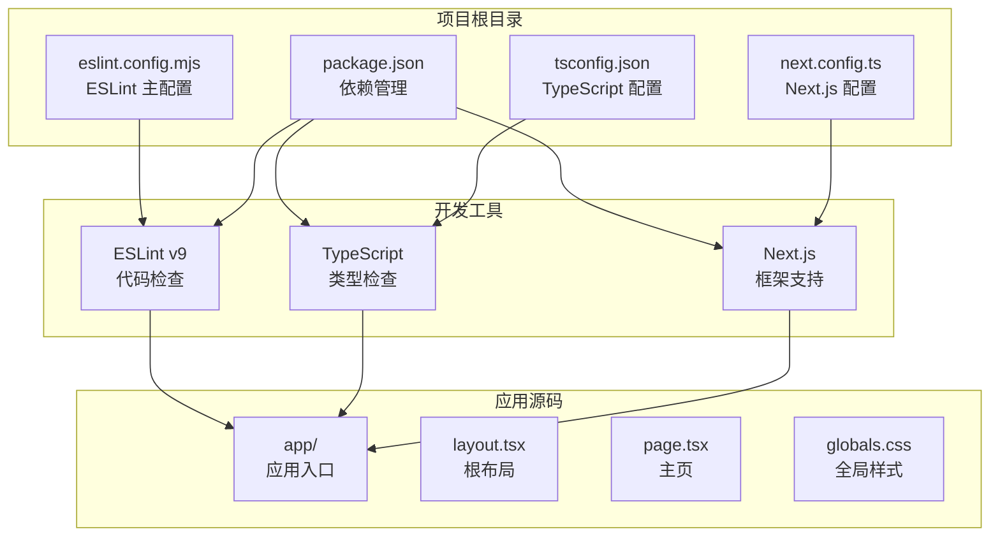
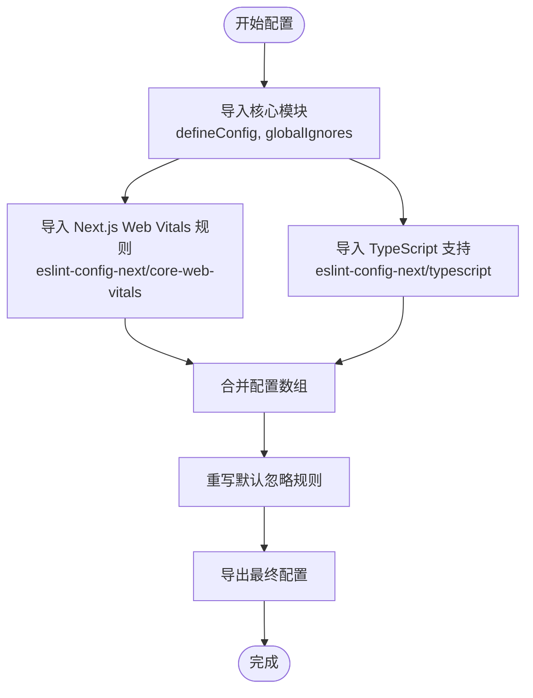
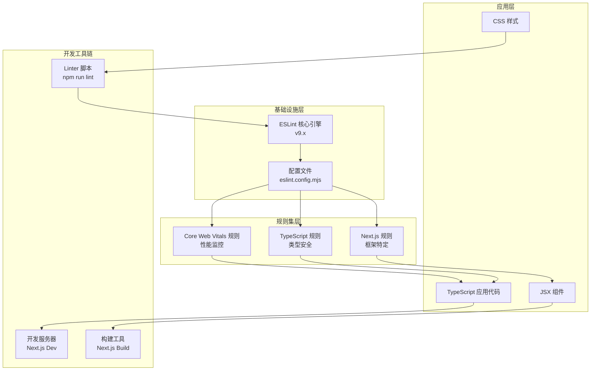
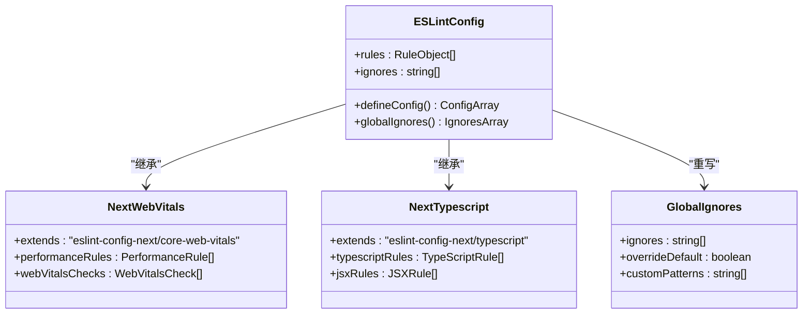
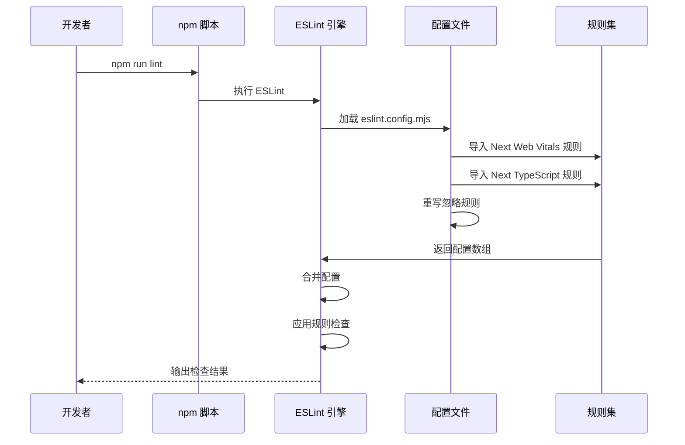
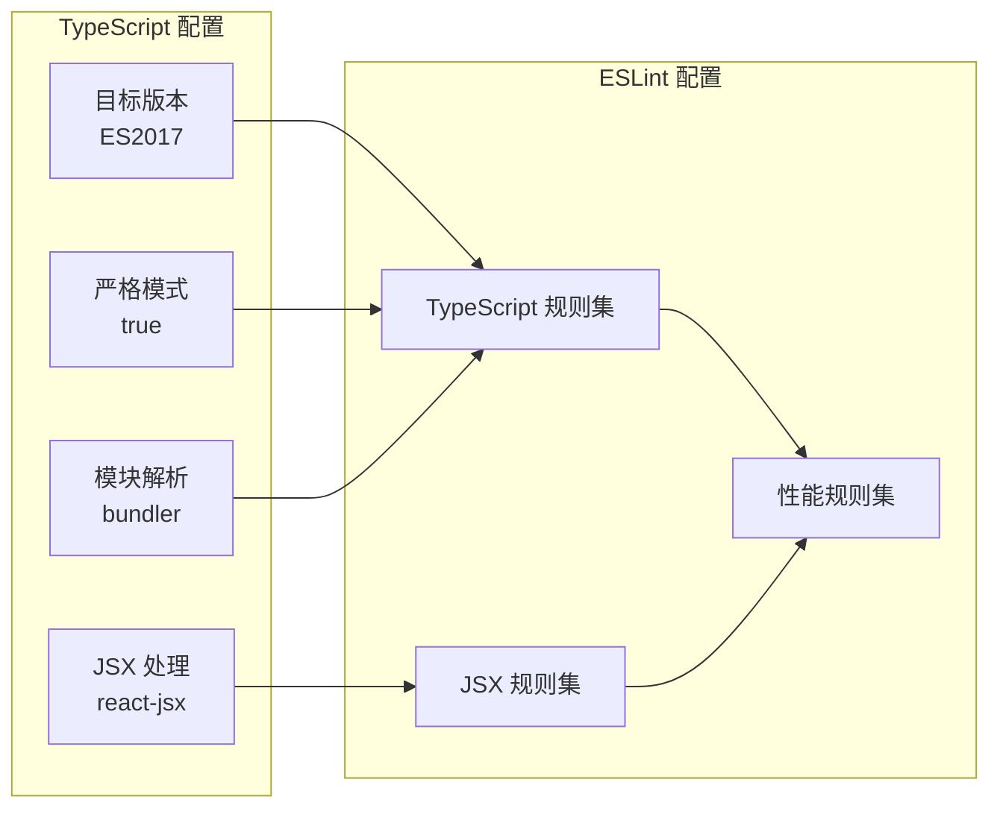
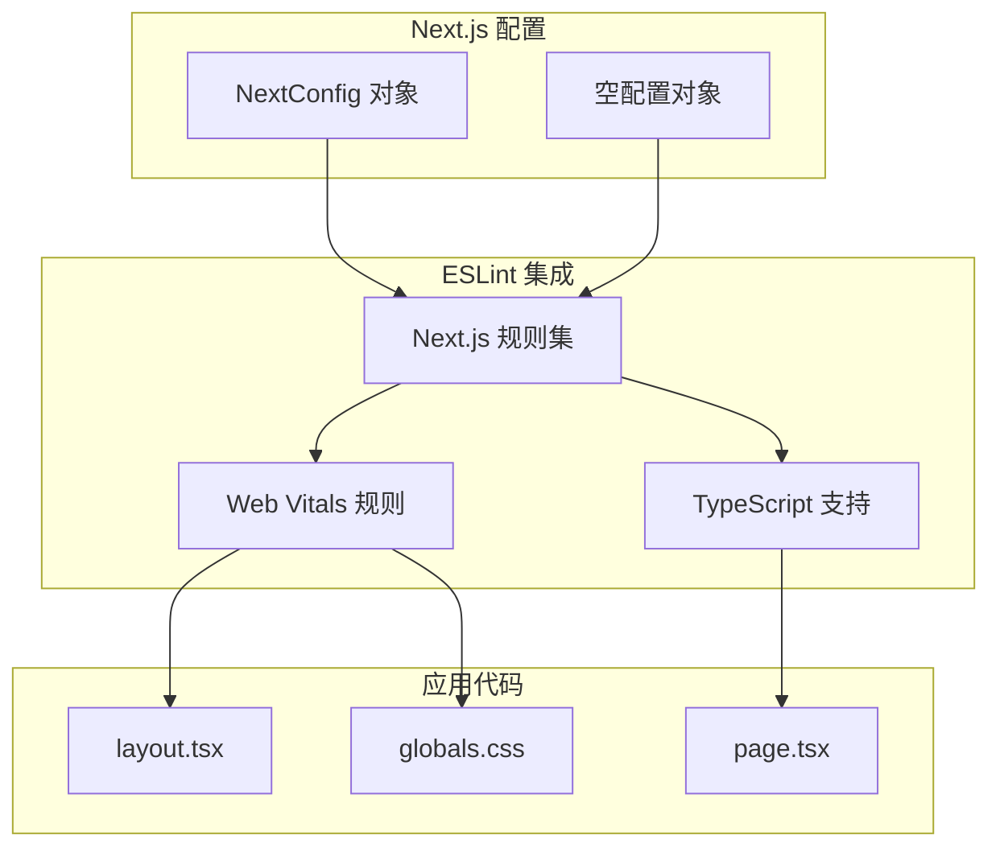
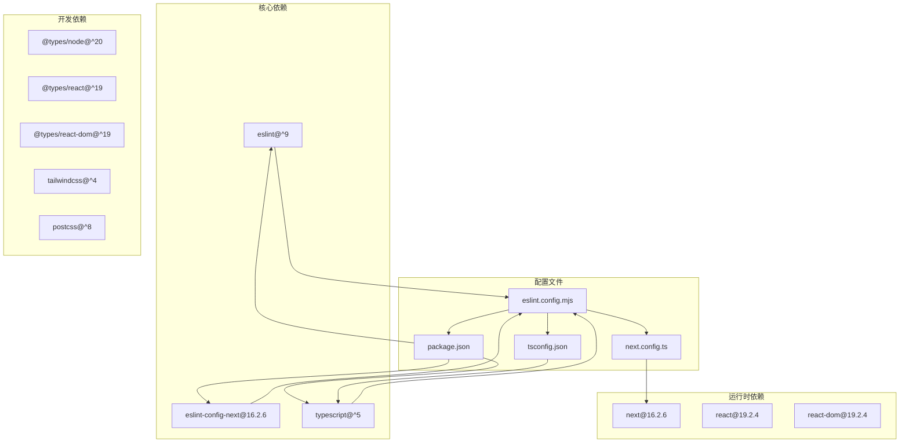

# ESLint 配置详解

<cite>
**本文档中引用的文件**
- [eslint.config.mjs](file://eslint.config.mjs)
- [package.json](file://package.json)
- [next.config.ts](file://next.config.ts)
- [tsconfig.json](file://tsconfig.json)
- [app/layout.tsx](file://app/layout.tsx)
- [app/page.tsx](file://app/page.tsx)
- [app/globals.css](file://app/globals.css)
- [README.md](file://README.md)
- [AGENTS.md](file://AGENTS.md)
- [CLAUDE.md](file://CLAUDE.md)
</cite>

## 目录
1. [简介](#简介)
2. [项目结构概览](#项目结构概览)
3. [核心组件分析](#核心组件分析)
4. [架构总览](#架构总览)
5. [详细组件分析](#详细组件分析)
6. [依赖关系分析](#依赖关系分析)
7. [性能考虑](#性能考虑)
8. [故障排除指南](#故障排除指南)
9. [结论](#结论)

## 简介

本项目采用现代化的 ESLint 配置策略，基于 Next.js 官方推荐的配置方案。通过使用 `eslint.config.mjs` 这一新的配置格式，结合 `eslint-config-next` 提供的核心 Web Vitals 规则和 TypeScript 支持，实现了对 Next.js 应用的全面代码质量保障。

该项目配置体现了以下特点：
- 基于官方推荐的最佳实践
- 完整的 TypeScript 支持
- 核心 Web Vitals 性能指标监控
- 自定义忽略规则覆盖
- 与现代前端开发工具链的无缝集成

## 项目结构概览

项目采用标准的 Next.js 应用结构，ESLint 配置位于根目录的 `eslint.config.mjs` 文件中，与 Next.js 16.2.6 版本完全兼容。

**图表来源**
- [eslint.config.mjs:1-19](file://eslint.config.mjs#L1-L19)
- [package.json:1-31](file://package.json#L1-L31)
- [next.config.ts:1-8](file://next.config.ts#L1-L8)
- [tsconfig.json:1-35](file://tsconfig.json#L1-L35)

**章节来源**
- [eslint.config.mjs:1-19](file://eslint.config.mjs#L1-L19)
- [package.json:1-31](file://package.json#L1-L31)
- [next.config.ts:1-8](file://next.config.ts#L1-L8)
- [tsconfig.json:1-35](file://tsconfig.json#L1-L35)

## 核心组件分析

### ESLint 主配置文件

项目的核心配置位于 `eslint.config.mjs`，这是一个基于 ES Module 格式的现代化配置文件，采用了最新的 ESLint 9.x 配置语法。

#### 配置结构分析

配置文件采用数组形式的配置对象，通过扩展的方式集成多个官方推荐的规则集：

**图表来源**
- [eslint.config.mjs:1-19](file://eslint.config.mjs#L1-L19)

#### 规则继承机制

配置文件通过以下方式实现规则继承：

1. **基础规则继承**：从 `eslint-config-next/core-web-vitals` 继承核心 Web Vitals 性能监控规则
2. **TypeScript 扩展**：从 `eslint-config-next/typescript` 获取完整的 TypeScript 支持
3. **自定义覆盖**：使用 `globalIgnores` 函数重写默认的忽略规则

**章节来源**
- [eslint.config.mjs:1-19](file://eslint.config.mjs#L1-L19)

### 依赖管理配置

项目使用 `package.json` 管理所有开发依赖，包括 ESLint 相关的包：

#### 关键依赖分析

| 依赖包 | 版本 | 用途 |
|--------|------|------|
| `eslint` | ^9 | 核心代码检查引擎 |
| `eslint-config-next` | 16.2.6 | Next.js 官方推荐配置 |
| `typescript` | ^5 | 类型系统支持 |
| `@types/node` | ^20 | Node.js 类型定义 |
| `@types/react` | ^19 | React 类型定义 |
| `@types/react-dom` | ^19 | React DOM 类型定义 |

**章节来源**
- [package.json:15-29](file://package.json#L15-L29)

## 架构总览

项目采用分层架构设计，ESLint 配置作为基础设施层，为上层的 TypeScript 和 Next.js 开发提供统一的代码质量保障。

**图表来源**
- [eslint.config.mjs:1-19](file://eslint.config.mjs#L1-L19)
- [package.json:9-14](file://package.json#L9-L14)

## 详细组件分析

### ESLint 配置组件

#### 配置文件结构

配置文件采用模块化设计，通过导入和扩展的方式组织规则：

**图表来源**
- [eslint.config.mjs:5-16](file://eslint.config.mjs#L5-L16)

#### 规则配置流程

**图表来源**
- [eslint.config.mjs:5-16](file://eslint.config.mjs#L5-L16)
- [package.json:13](file://package.json#L13)

**章节来源**
- [eslint.config.mjs:1-19](file://eslint.config.mjs#L1-L19)

### TypeScript 集成组件

#### TypeScript 配置分析

项目使用 `tsconfig.json` 提供完整的 TypeScript 支持，与 ESLint 配置形成互补：

**图表来源**
- [tsconfig.json:2-24](file://tsconfig.json#L2-L24)
- [eslint.config.mjs:2-3](file://eslint.config.mjs#L2-L3)

**章节来源**
- [tsconfig.json:1-35](file://tsconfig.json#L1-L35)

### Next.js 集成组件

#### Next.js 配置分析

项目使用 `next.config.ts` 提供框架级别的配置，与 ESLint 形成完整的开发体验：

**图表来源**
- [next.config.ts:3-5](file://next.config.ts#L3-L5)
- [eslint.config.mjs:2-3](file://eslint.config.mjs#L2-L3)

**章节来源**
- [next.config.ts:1-8](file://next.config.ts#L1-L8)

## 依赖关系分析

项目中各组件之间的依赖关系清晰明确，形成了一个完整的开发工具链生态系统。

**图表来源**
- [package.json:15-29](file://package.json#L15-L29)
- [eslint.config.mjs:1-3](file://eslint.config.mjs#L1-L3)

**章节来源**
- [package.json:1-31](file://package.json#L1-L31)

## 性能考虑

### 配置性能优化

项目配置在性能方面考虑了以下因素：

1. **增量检查**：TypeScript 配置启用增量编译 (`incremental: true`)
2. **严格模式**：启用严格类型检查以提高代码质量
3. **模块解析**：使用 `bundler` 模式优化模块解析性能
4. **忽略规则**：自定义忽略规则避免不必要的文件检查

### 开发体验优化

- **快速启动**：ESLint 配置简洁明了，启动速度快
- **实时反馈**：与 Next.js 开发服务器集成，提供即时代码检查反馈
- **缓存机制**：利用 TypeScript 的增量编译和 ESLint 的缓存机制

## 故障排除指南

### 常见问题及解决方案

#### 1. ESLint 配置不生效

**问题描述**：ESLint 无法正确识别配置文件

**解决方案**：
- 确认使用正确的配置文件名 `eslint.config.mjs`
- 检查 Node.js 版本是否支持 ES Module
- 验证配置文件的语法正确性

#### 2. TypeScript 类型检查失败

**问题描述**：ESLint 报告 TypeScript 相关错误

**解决方案**：
- 检查 `tsconfig.json` 中的配置项
- 确认 TypeScript 版本与 ESLint 配置兼容
- 验证类型定义文件的存在性

#### 3. Next.js 规则冲突

**问题描述**：ESLint 与 Next.js 规则产生冲突

**解决方案**：
- 检查 `eslint-config-next` 的版本兼容性
- 确认 Next.js 应用结构符合官方要求
- 验证配置文件的导入顺序

#### 4. 性能问题

**问题描述**：ESLint 检查速度过慢

**解决方案**：
- 检查 `.eslintignore` 文件（如果存在）
- 优化 TypeScript 配置中的 `include` 和 `exclude` 设置
- 考虑使用并行处理选项

**章节来源**
- [eslint.config.mjs:1-19](file://eslint.config.mjs#L1-L19)
- [tsconfig.json:16-24](file://tsconfig.json#L16-L24)

## 结论

本项目的 ESLint 配置展现了现代前端开发的最佳实践，通过以下方式实现了高质量的代码管理：

### 主要优势

1. **官方推荐**：采用 ESLint 9.x 的最新配置格式和 Next.js 官方推荐的规则集
2. **完整覆盖**：同时支持 TypeScript 和 JavaScript 开发
3. **性能优化**：通过合理的配置减少不必要的检查开销
4. **易于维护**：简洁的配置结构便于后续维护和扩展

### 最佳实践建议

1. **保持更新**：定期更新 ESLint 和相关插件到最新稳定版本
2. **团队协作**：确保团队成员使用相同的 ESLint 配置
3. **持续改进**：根据项目发展需要调整和优化规则配置
4. **文档维护**：保持配置文档与实际配置同步更新

该配置为 Next.js 应用提供了一个坚实的基础，既保证了代码质量，又不影响开发效率，是一个值得参考的现代化 ESLint 配置示例。