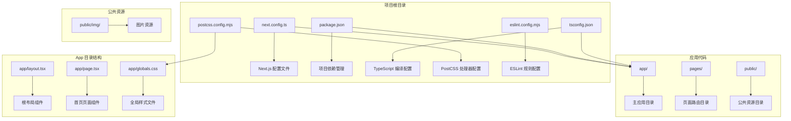
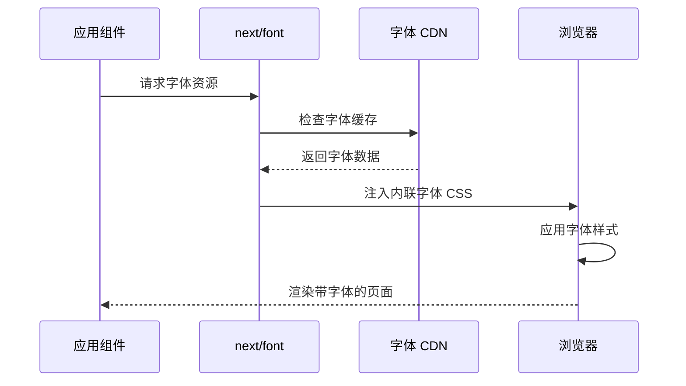
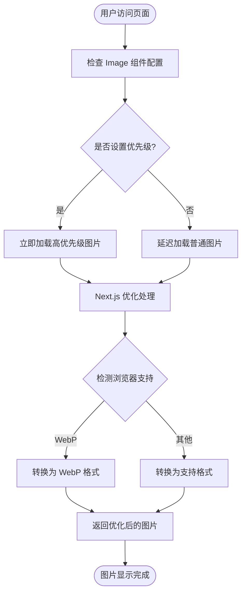
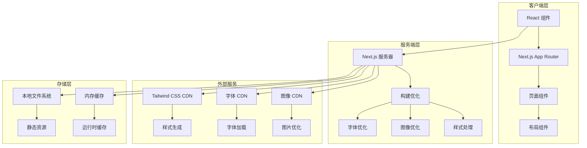
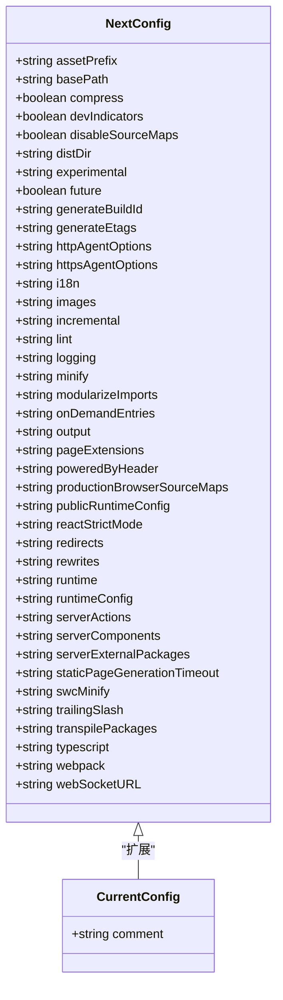
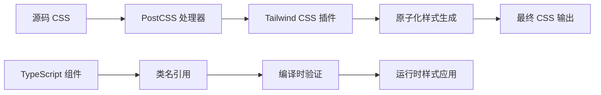
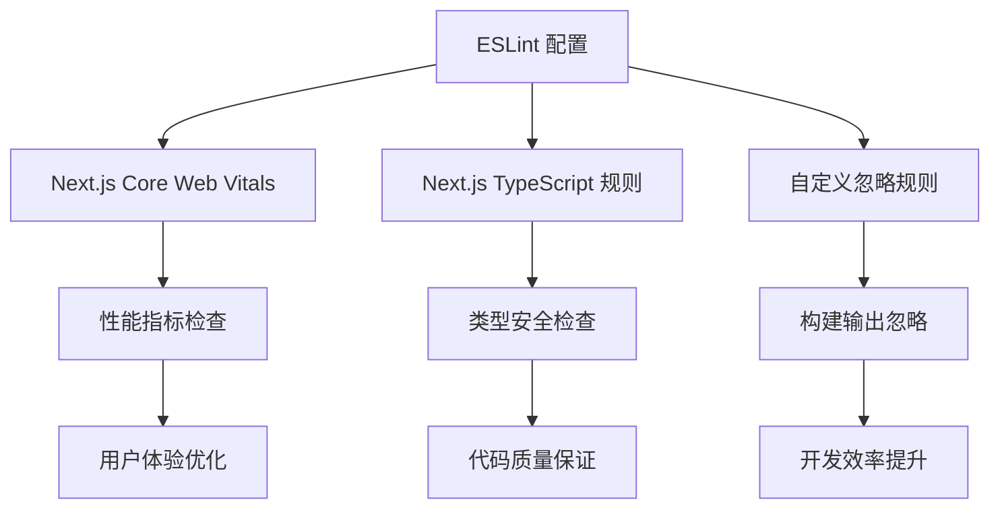
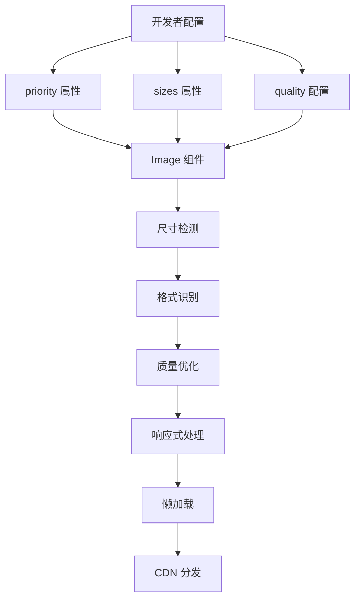

# Next.js 配置详解

<cite>
**本文档引用的文件**
- [next.config.ts](file://next.config.ts)
- [package.json](file://package.json)
- [README.md](file://README.md)
- [tsconfig.json](file://tsconfig.json)
- [postcss.config.mjs](file://postcss.config.mjs)
- [app/layout.tsx](file://app/layout.tsx)
- [app/page.tsx](file://app/page.tsx)
- [app/globals.css](file://app/globals.css)
- [eslint.config.mjs](file://eslint.config.mjs)
</cite>

## 目录
1. [简介](#简介)
2. [项目结构](#项目结构)
3. [核心组件](#核心组件)
4. [架构概览](#架构概览)
5. [详细组件分析](#详细组件分析)
6. [依赖关系分析](#依赖关系分析)
7. [性能考虑](#性能考虑)
8. [故障排除指南](#故障排除指南)
9. [结论](#结论)
10. [附录](#附录)

## 简介

blod 是一个基于 Next.js 16.2.6 构建的个人博客项目，采用 App Router 架构和现代前端技术栈。该项目展示了如何在 Next.js 中实现高性能的静态站点生成（SSG）和服务器端渲染（SSR），同时集成了字体优化、图像优化和 Tailwind CSS 样式系统。

本项目使用了 Next.js 的最新特性，包括：
- App Router 架构
- 内置字体优化（next/font）
- 图像优化（next/image）
- Tailwind CSS 集成
- TypeScript 支持
- ESLint 配置

## 项目结构

blod 项目遵循 Next.js 官方推荐的目录结构，主要包含以下关键目录和文件：



**图表来源**
- [next.config.ts:1-8](file://next.config.ts#L1-L8)
- [package.json:1-31](file://package.json#L1-L31)
- [tsconfig.json:1-35](file://tsconfig.json#L1-L35)
- [postcss.config.mjs:1-8](file://postcss.config.mjs#L1-L8)

**章节来源**
- [next.config.ts:1-8](file://next.config.ts#L1-L8)
- [package.json:1-31](file://package.json#L1-L31)
- [tsconfig.json:1-35](file://tsconfig.json#L1-L35)
- [postcss.config.mjs:1-8](file://postcss.config.mjs#L1-L8)

## 核心组件

### Next.js 配置系统

当前的 next.config.ts 文件是一个占位符配置，需要根据具体需求进行扩展。该文件采用 TypeScript 类型定义确保配置的类型安全性和开发体验。

### 字体优化系统

项目集成了 next/font 的自动字体优化功能，使用 Geist 和 Geist Mono 字体族：



**图表来源**
- [app/layout.tsx:1-34](file://app/layout.tsx#L1-L34)

### 图像优化系统

项目使用 next/image 组件进行智能图像优化，支持响应式图片、格式转换和懒加载：



**图表来源**
- [app/page.tsx:1-72](file://app/page.tsx#L1-L72)

**章节来源**
- [app/layout.tsx:1-34](file://app/layout.tsx#L1-L34)
- [app/page.tsx:1-72](file://app/page.tsx#L1-L72)

## 架构概览

blod 项目采用现代化的全栈架构，结合了客户端渲染和服务器端渲染的优势：



**图表来源**
- [next.config.ts:1-8](file://next.config.ts#L1-L8)
- [app/layout.tsx:1-34](file://app/layout.tsx#L1-L34)
- [app/page.tsx:1-72](file://app/page.tsx#L1-L72)

## 详细组件分析

### 配置文件结构分析

#### next.config.ts 结构

当前配置文件采用最小化设计，提供了清晰的扩展点：



**图表来源**
- [next.config.ts:1-8](file://next.config.ts#L1-L8)

#### TypeScript 配置分析

项目使用严格的 TypeScript 配置，支持现代 JavaScript 特性：

| 配置项 | 值 | 作用 |
|--------|-----|------|
| target | ES2017 | 目标 ECMAScript 版本 |
| module | esnext | 模块系统 |
| moduleResolution | bundler | 模块解析策略 |
| jsx | react-jsx | JSX 转换策略 |
| strict | true | 启用严格模式 |
| skipLibCheck | true | 跳过库文件检查 |
| esModuleInterop | true | ES 模块互操作 |

**章节来源**
- [tsconfig.json:1-35](file://tsconfig.json#L1-L35)

### 样式系统集成

#### Tailwind CSS 配置

项目通过 PostCSS 集成 Tailwind CSS，实现了原子化样式开发：



**图表来源**
- [postcss.config.mjs:1-8](file://postcss.config.mjs#L1-L8)
- [app/globals.css:1-27](file://app/globals.css#L1-L27)

#### 全局样式架构

全局样式文件定义了主题变量和响应式设计基础：

| 变量类别 | 名称 | 默认值 | 用途 |
|----------|------|--------|------|
| 颜色变量 | --background | #ffffff | 背景色 |
| 颜色变量 | --foreground | #171717 | 文字色 |
| 字体变量 | --font-sans | var(--font-geist-sans) | 无衬线字体 |
| 字体变量 | --font-mono | var(--font-geist-mono) | 等宽字体 |

**章节来源**
- [app/globals.css:1-27](file://app/globals.css#L1-L27)

### 开发工具链

#### ESLint 配置

项目集成了 Next.js 推荐的 ESLint 规则，确保代码质量：



**图表来源**
- [eslint.config.mjs:1-18](file://eslint.config.mjs#L1-L18)

**章节来源**
- [eslint.config.mjs:1-18](file://eslint.config.mjs#L1-L18)

## 依赖关系分析

### 核心依赖关系

```mermaid
graph TB
subgraph "运行时依赖"
A[next@16.2.6] --> B[核心框架]
C[react@19.2.4] --> D[UI 库]
E[react-dom@19.2.4] --> F[DOM 操作]
end
subgraph "开发时依赖"
G[typescript@^5] --> H[类型系统]
I[tailwindcss@^4] --> J[样式框架]
K[eslint@^9] --> L[代码质量]
M[postcss@^8] --> N[CSS 处理]
end
subgraph "类型定义"
O[@types/node] --> P[Node.js 类型]
Q[@types/react] --> R[React 类型]
S[@types/react-dom] --> T[React DOM 类型]
end
A --> G
C --> I
E --> K
G --> O
I --> Q
K --> S
```

**图表来源**
- [package.json:15-29](file://package.json#L15-L29)

### 版本兼容性

项目使用了与 Next.js 16.2.6 兼容的依赖版本，确保功能稳定性和安全性：

| 依赖包 | 版本范围 | Next.js 兼容性 | 主要功能 |
|--------|----------|----------------|----------|
| next | 16.2.6 | ✅ 完全兼容 | 核心框架 |
| react | 19.2.4 | ✅ 兼容 | UI 组件库 |
| react-dom | 19.2.4 | ✅ 兼容 | DOM 操作 |
| typescript | ^5 | ✅ 兼容 | 类型系统 |
| tailwindcss | ^4 | ✅ 兼容 | 原子化样式 |
| eslint | ^9 | ✅ 兼容 | 代码质量 |

**章节来源**
- [package.json:15-29](file://package.json#L15-L29)

## 性能考虑

### 构建优化策略

#### 字体优化最佳实践

项目使用 next/font 实现自动字体优化，以下是关键优化点：

1. **内联字体字节**：字体文件被内联到 HTML 中，减少 HTTP 请求
2. **子集化处理**：仅加载必要的字符子集
3. **变量字体支持**：支持动态字体调整
4. **缓存策略**：利用浏览器缓存机制

#### 图像优化配置



**图表来源**
- [app/page.tsx:17-23](file://app/page.tsx#L17-L23)

### 开发环境 vs 生产环境

#### 开发环境配置

开发环境重点关注开发体验和调试能力：

| 配置项 | 开发环境值 | 作用 |
|--------|------------|------|
| dev | true | 开发模式标识 |
| debug | true | 启用调试信息 |
| hotReload | true | 热重载支持 |
| sourceMaps | inline-source-map | 源码映射 |

#### 生产环境配置

生产环境重点关注性能和稳定性：

| 配置项 | 生产环境值 | 作用 |
|--------|------------|------|
| dev | false | 关闭开发模式 |
| debug | false | 禁用调试信息 |
| compress | true | 启用压缩 |
| minify | true | 启用代码压缩 |
| productionBrowserSourceMaps | true | 生成源码映射 |

### 性能监控指标

#### 关键性能指标

| 指标名称 | 目标值 | 测量方法 |
|----------|--------|----------|
| 首屏渲染时间 | < 2 秒 | FCP/FCI |
| 用户可交互时间 | < 3 秒 | TTI |
| 内容可访问性 | > 90% | Lighthouse |
| 图片加载速度 | < 1 秒 | Lighthouse |
| 字体加载时间 | < 1 秒 | Lighthouse |

**章节来源**
- [app/layout.tsx:5-13](file://app/layout.tsx#L5-L13)
- [app/page.tsx:17-23](file://app/page.tsx#L17-L23)

## 故障排除指南

### 常见配置问题

#### 字体加载失败

**问题症状**：页面字体显示为默认字体或加载缓慢

**解决方案**：
1. 检查字体子集配置
2. 验证网络连接
3. 确认字体缓存状态

#### 图像显示异常

**问题症状**：图片无法显示或加载缓慢

**解决方案**：
1. 验证图片路径正确性
2. 检查图片格式支持
3. 确认 CDN 访问权限

#### 样式冲突问题

**问题症状**：样式不生效或样式覆盖

**解决方案**：
1. 检查 Tailwind CSS 优先级
2. 验证 CSS 作用域
3. 确认样式导入顺序

### 性能问题诊断

#### 构建时间过长

**可能原因**：
1. 过多的依赖包
2. 复杂的样式计算
3. 大量的字体文件

**优化建议**：
1. 减少不必要的依赖
2. 使用更精确的字体子集
3. 优化样式结构

#### 运行时性能问题

**可能原因**：
1. 组件渲染过多
2. 样式计算复杂
3. 图片未优化

**优化建议**：
1. 实施组件懒加载
2. 简化样式逻辑
3. 使用适当的图片格式

### 调试工具使用

#### 开发工具推荐

| 工具名称 | 功能描述 | 使用场景 |
|----------|----------|----------|
| Chrome DevTools | 性能分析 | 页面性能诊断 |
| Lighthouse | SEO 和性能评估 | 优化建议 |
| React DevTools | 组件状态检查 | 组件调试 |
| Next.js Profiler | 构建性能分析 | 构建优化 |

**章节来源**
- [eslint.config.mjs:1-18](file://eslint.config.mjs#L1-L18)

## 结论

blod 项目展示了现代 Next.js 应用的最佳实践，通过合理的配置和优化策略，实现了高性能的静态站点生成。项目的主要优势包括：

1. **完整的优化体系**：从字体到图像的全方位优化
2. **现代化开发体验**：TypeScript、Tailwind CSS、ESLint 的完美集成
3. **灵活的配置架构**：易于扩展和定制的配置系统
4. **优秀的性能表现**：符合现代 Web 性能标准

未来可以考虑的改进方向：
- 添加更多的性能监控和分析工具
- 实施渐进式 Web 应用（PWA）功能
- 优化移动端用户体验
- 增强国际化支持

## 附录

### 配置最佳实践清单

#### 必须配置的选项

| 配置项 | 建议值 | 说明 |
|--------|--------|------|
| images.remotePatterns | [] | 安全的远程图片源 |
| experimental.fontLoaders | [] | 自定义字体加载器 |
| output | standalone | 独立部署模式 |
| distDir | .next | 构建输出目录 |

#### 推荐配置的选项

| 配置项 | 建议值 | 说明 |
|--------|--------|------|
| compress | true | 启用压缩 |
| minify | true | 启用代码压缩 |
| trailingSlash | false | 移除尾随斜杠 |
| reactStrictMode | true | 启用严格模式 |

### 性能优化检查清单

#### 构建阶段优化

- [ ] 启用代码分割
- [ ] 使用 Tree Shaking
- [ ] 优化图片资源
- [ ] 压缩 CSS 和 JavaScript

#### 运行时优化

- [ ] 实施缓存策略
- [ ] 优化字体加载
- [ ] 使用懒加载
- [ ] 减少重绘和回流