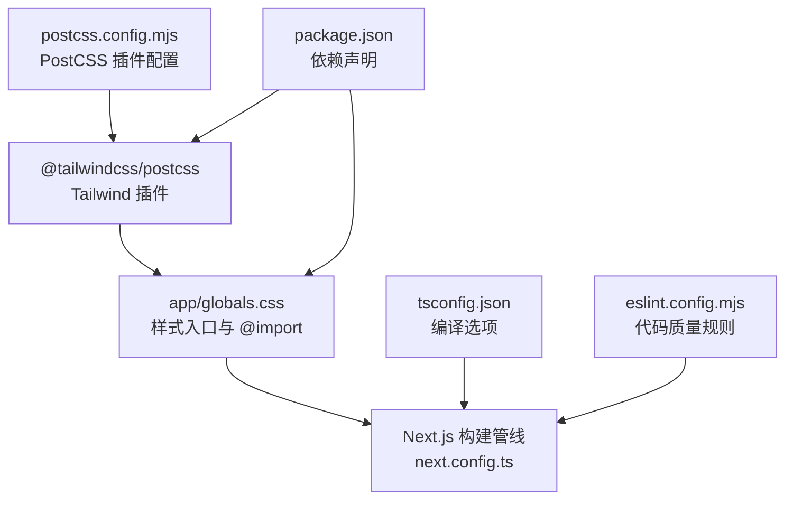
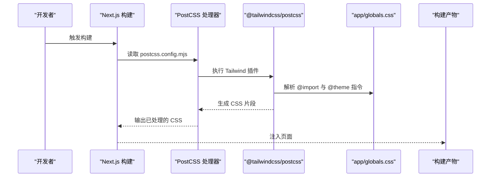
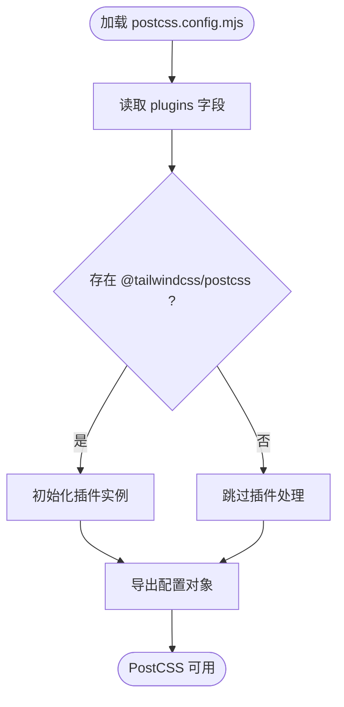
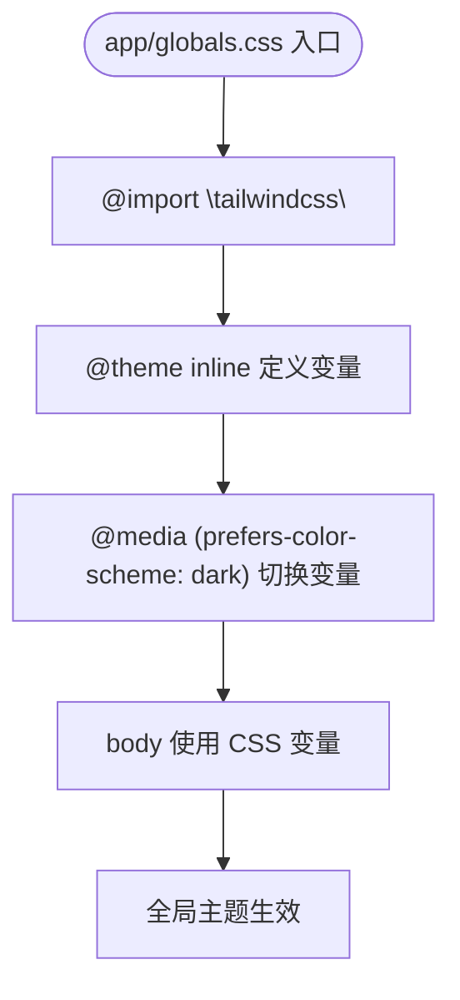
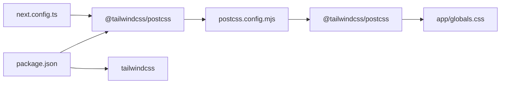

# PostCSS 与 Tailwind CSS 配置

<cite>
**本文引用的文件**
- [postcss.config.mjs](file://postcss.config.mjs)
- [package.json](file://package.json)
- [app/globals.css](file://app/globals.css)
- [next.config.ts](file://next.config.ts)
- [tsconfig.json](file://tsconfig.json)
- [eslint.config.mjs](file://eslint.config.mjs)
</cite>

## 目录
1. [简介](#简介)
2. [项目结构](#项目结构)
3. [核心组件](#核心组件)
4. [架构总览](#架构总览)
5. [详细组件分析](#详细组件分析)
6. [依赖关系分析](#依赖关系分析)
7. [性能考量](#性能考量)
8. [故障排查指南](#故障排查指南)
9. [结论](#结论)
10. [附录](#附录)

## 简介
本文件面向 blod 项目，系统化梳理 PostCSS 与 Tailwind CSS 的配置与集成方式，重点解析：
- PostCSS 处理器配置与插件设置（postcss.config.mjs）
- Tailwind CSS 在项目中的集成路径与处理流程
- PostCSS 对 CSS 预处理、优化与浏览器兼容性的处理机制
- Tailwind CSS 实用类使用指南与可选自定义配置方向
- CSS 优化策略、响应式设计配置与主题定制方法

本项目采用 Next.js 应用模式，通过 PostCSS 插件链路引入 Tailwind CSS，结合应用层样式入口实现主题与响应式能力。

## 项目结构
与 PostCSS/Tailwind 相关的关键文件分布如下：
- PostCSS 配置：postcss.config.mjs
- 样式入口：app/globals.css
- 构建配置：next.config.ts
- 依赖声明：package.json
- TypeScript 编译配置：tsconfig.json
- ESLint 配置：eslint.config.mjs

图表来源
- [postcss.config.mjs:1-8](file://postcss.config.mjs#L1-L8)
- [app/globals.css:1-27](file://app/globals.css#L1-L27)
- [next.config.ts:1-8](file://next.config.ts#L1-L8)
- [package.json:15-29](file://package.json#L15-L29)
- [tsconfig.json:1-35](file://tsconfig.json#L1-L35)
- [eslint.config.mjs:1-19](file://eslint.config.mjs#L1-L19)

章节来源
- [postcss.config.mjs:1-8](file://postcss.config.mjs#L1-L8)
- [app/globals.css:1-27](file://app/globals.css#L1-L27)
- [next.config.ts:1-8](file://next.config.ts#L1-L8)
- [package.json:15-29](file://package.json#L15-L29)
- [tsconfig.json:1-35](file://tsconfig.json#L1-L35)
- [eslint.config.mjs:1-19](file://eslint.config.mjs#L1-L19)

## 核心组件
- PostCSS 插件配置：仅启用 Tailwind CSS 插件，作为构建管线中对 CSS 的预处理与生成入口。
- Tailwind 样式入口：通过 @import 引入 Tailwind 指令，并在 @theme 中内联变量以支持主题与暗色模式。
- Next.js 构建配置：保持默认配置，交由 PostCSS 插件链路完成 CSS 处理。
- 依赖声明：包含 Tailwind CSS 与 PostCSS 插件，确保构建时可用。

章节来源
- [postcss.config.mjs:1-8](file://postcss.config.mjs#L1-L8)
- [app/globals.css:1-27](file://app/globals.css#L1-L27)
- [next.config.ts:1-8](file://next.config.ts#L1-L8)
- [package.json:15-29](file://package.json#L15-L29)

## 架构总览
PostCSS 与 Tailwind 在本项目中的工作流如下：
- 构建阶段，Next.js 调用 PostCSS 处理器
- PostCSS 加载插件配置，执行 Tailwind CSS 插件
- Tailwind 解析样式入口文件，按指令生成基础样式与工具类
- 最终产物注入到页面中，供组件使用

图表来源
- [postcss.config.mjs:1-8](file://postcss.config.mjs#L1-L8)
- [app/globals.css:1-27](file://app/globals.css#L1-L27)

## 详细组件分析

### PostCSS 配置组件（postcss.config.mjs）
- 插件配置：启用 "@tailwindcss/postcss" 插件，用于在构建阶段解析与生成 Tailwind 相关的 CSS。
- 默认导出：配置对象直接导出，供 PostCSS 读取。

图表来源
- [postcss.config.mjs:1-8](file://postcss.config.mjs#L1-L8)

章节来源
- [postcss.config.mjs:1-8](file://postcss.config.mjs#L1-L8)

### Tailwind 样式入口（app/globals.css）
- @import 引入：通过 @import "tailwindcss" 将 Tailwind 基础指令引入当前样式上下文。
- 主题内联：使用 @theme inline 定义颜色、字体等变量，便于在组件中通过 CSS 变量统一管理。
- 暗色模式：基于 prefers-color-scheme 的媒体查询切换背景与前景色变量，实现自动主题适配。
- 全局样式：在 body 上绑定变量，使页面整体具备一致的主题表现。

图表来源
- [app/globals.css:1-27](file://app/globals.css#L1-L27)

章节来源
- [app/globals.css:1-27](file://app/globals.css#L1-L27)

### Next.js 构建配置（next.config.ts）
- 当前配置为空对象，表示使用 Next.js 默认行为。
- PostCSS 插件链路由 postcss.config.mjs 提供，Next.js 无需额外配置即可生效。

章节来源
- [next.config.ts:1-8](file://next.config.ts#L1-L8)

### 依赖声明（package.json）
- 运行时依赖：Next.js、React、React DOM
- 开发时依赖：Tailwind CSS、@tailwindcss/postcss、TypeScript、ESLint 相关包
- 作用：确保 Tailwind CSS 与 PostCSS 插件在开发与构建环境中可用

章节来源
- [package.json:15-29](file://package.json#L15-L29)

### TypeScript 编译配置（tsconfig.json）
- 编译目标与模块系统：ES2017、esnext、bundler
- JSX 支持：react-jsx
- Next 插件：启用 next 插件以配合框架类型检查
- 影响：间接影响样式与组件的类型推断，但不直接影响 PostCSS/Tailwind 的运行时行为

章节来源
- [tsconfig.json:1-35](file://tsconfig.json#L1-L35)

### ESLint 配置（eslint.config.mjs）
- 继承 next 核心 Web Vitals 与 TypeScript 规则
- 自定义忽略：覆盖默认忽略项，便于在构建输出目录外进行检查
- 影响：提升代码质量，但不直接影响 PostCSS/Tailwind 的构建流程

章节来源
- [eslint.config.mjs:1-19](file://eslint.config.mjs#L1-L19)

## 依赖关系分析
- PostCSS 与 Tailwind 的耦合点集中在 postcss.config.mjs 与 app/globals.css。
- Next.js 通过默认配置与 PostCSS 插件链路协作，无需额外 CSS 处理器配置。
- package.json 中的依赖声明决定了插件与工具链的可用性。

图表来源
- [package.json:15-29](file://package.json#L15-L29)
- [postcss.config.mjs:1-8](file://postcss.config.mjs#L1-L8)
- [app/globals.css:1-27](file://app/globals.css#L1-L27)
- [next.config.ts:1-8](file://next.config.ts#L1-L8)

章节来源
- [package.json:15-29](file://package.json#L15-L29)
- [postcss.config.mjs:1-8](file://postcss.config.mjs#L1-L8)
- [app/globals.css:1-27](file://app/globals.css#L1-L27)
- [next.config.ts:1-8](file://next.config.ts#L1-L8)

## 性能考量
- 构建性能：仅启用 Tailwind 插件，减少不必要的后处理步骤，有利于缩短构建时间。
- 样式体积：通过 @theme 内联变量与最小化使用工具类，避免冗余样式。
- 浏览器兼容：Tailwind 默认生成现代 CSS；如需兼容旧版浏览器，可在项目中引入 PostCSS 后处理器（例如 Autoprefixer）并调整插件顺序。
- 开发体验：Next.js 默认缓存与增量构建配合 Tailwind 插件，通常能获得良好的热更新与开发效率。

## 故障排查指南
- 插件未生效
  - 确认 postcss.config.mjs 中已正确声明 "@tailwindcss/postcss" 插件。
  - 确认 app/globals.css 中存在 @import "tailwindcss"。
  - 检查 package.json 中是否安装了 tailwindcss 与 @tailwindcss/postcss。
- 样式未按预期渲染
  - 检查 @theme inline 是否正确定义变量，以及 CSS 变量在 body 中是否被使用。
  - 确认暗色模式媒体查询逻辑是否符合预期。
- 构建失败或报错
  - 查看 Next.js 构建日志，定位 PostCSS 插件错误。
  - 若需兼容旧版浏览器，考虑添加 Autoprefixer 并调整插件顺序。
- 类名无效或冲突
  - 确保组件中使用的类名与 Tailwind 工具类命名规范一致。
  - 避免与自定义 CSS 冲突，优先使用 Tailwind 工具类。

章节来源
- [postcss.config.mjs:1-8](file://postcss.config.mjs#L1-L8)
- [app/globals.css:1-27](file://app/globals.css#L1-L27)
- [package.json:15-29](file://package.json#L15-L29)

## 结论
本项目通过简洁的 PostCSS 配置与 Tailwind 样式入口，实现了现代化的 CSS 处理与主题体系。PostCSS 仅启用 Tailwind 插件，配合 @import 与 @theme 指令，既保证了工具类的高效使用，又提供了灵活的主题定制能力。Next.js 默认配置与 TypeScript/ESLint 协同，进一步提升了开发体验与代码质量。若需扩展功能（如浏览器兼容性增强），可在现有基础上增加合适的 PostCSS 插件并调整顺序。

## 附录

### Tailwind CSS 实用类使用指南（概念性建议）
- 布局与间距：使用 flex、grid、gap、space-between 等工具类快速搭建布局。
- 文本与排版：通过 text-*、leading-*、tracking-* 控制文本样式。
- 颜色与主题：结合 @theme 定义的颜色变量，统一使用语义化命名。
- 响应式设计：利用 sm:/md:/lg: 前缀在不同断点下切换样式。
- 动态与交互：通过 hover:、focus:、active: 等伪类前缀实现交互效果。

### 自定义配置选项（概念性建议）
- 主题定制：在 @theme 中集中定义颜色、字体、圆角、阴影等变量。
- 断点与容器：根据业务需求调整响应式断点与容器宽度。
- 插件扩展：如需浏览器兼容性，可引入 Autoprefixer 并置于 Tailwind 之后。
- 样式剥离：在生产环境启用 Purge/Tree-shaking，移除未使用样式。