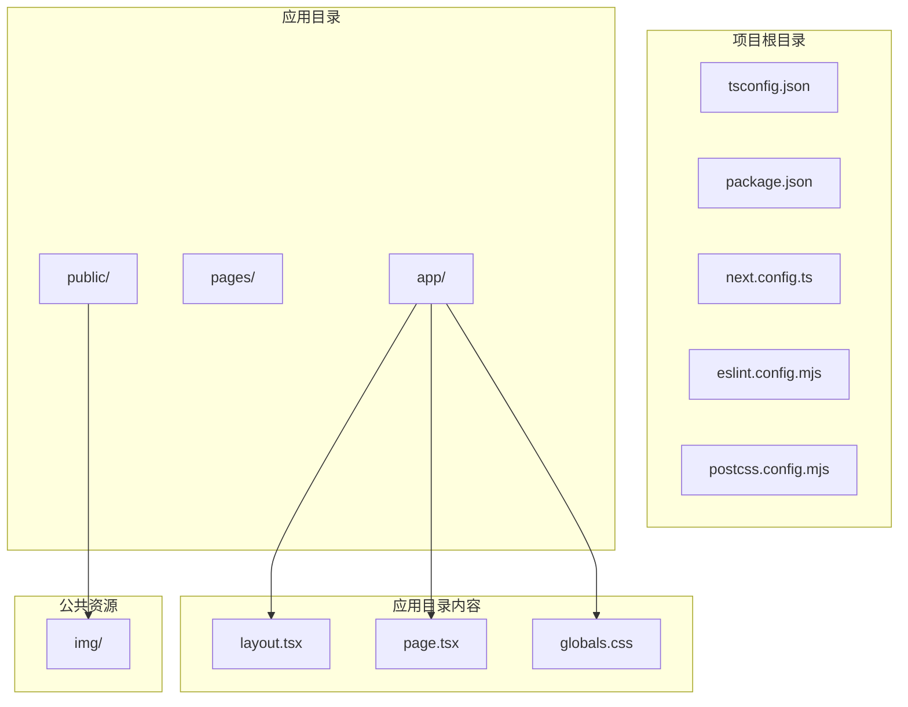
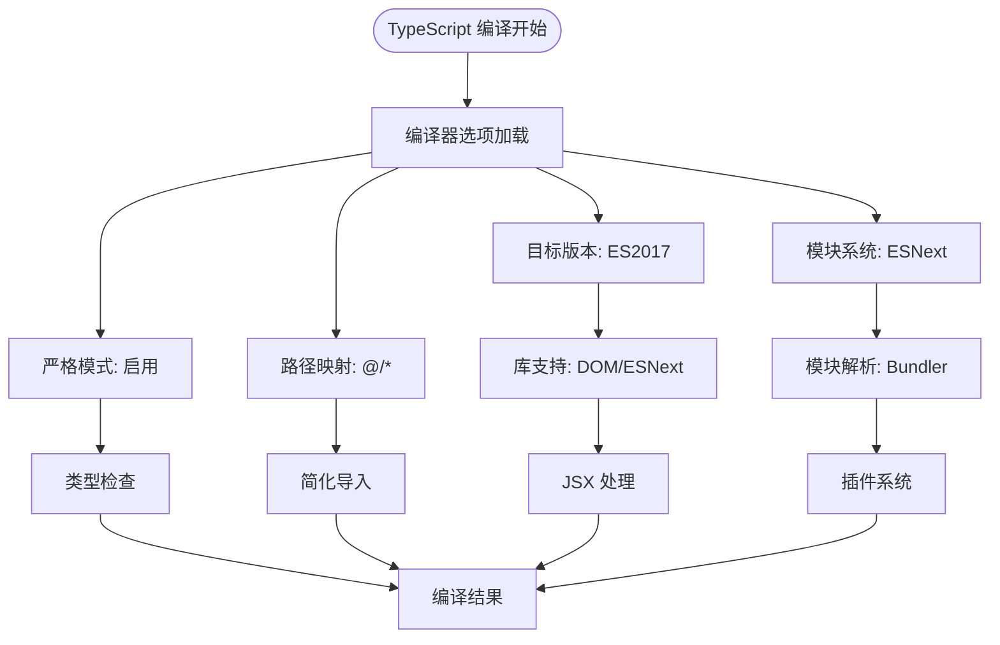
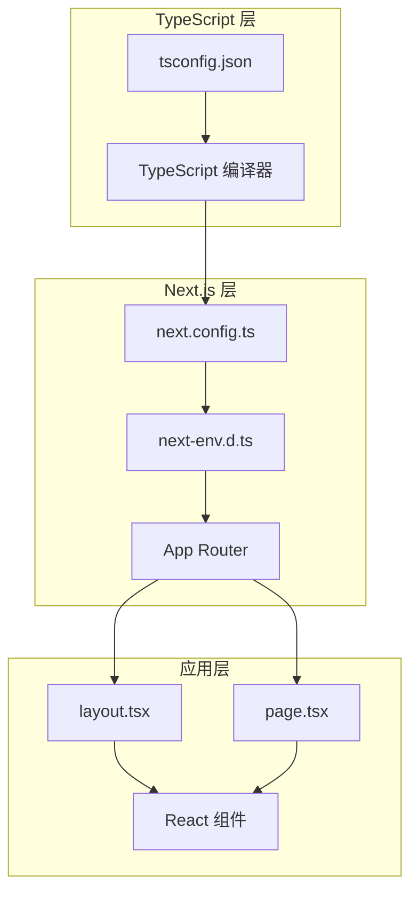
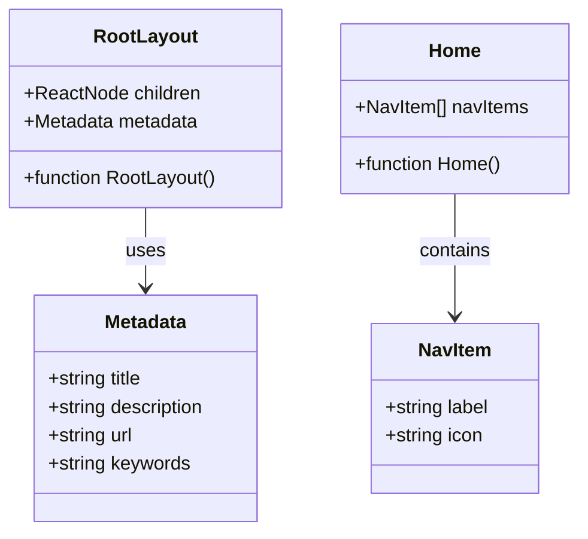

# TypeScript 配置详解

<cite>
**本文档引用的文件**
- [tsconfig.json](file://tsconfig.json)
- [package.json](file://package.json)
- [next.config.ts](file://next.config.ts)
- [next-env.d.ts](file://next-env.d.ts)
- [layout.tsx](file://app/layout.tsx)
- [page.tsx](file://app/page.tsx)
- [eslint.config.mjs](file://eslint.config.mjs)
- [postcss.config.mjs](file://postcss.config.mjs)
</cite>

## 目录
1. [简介](#简介)
2. [项目结构](#项目结构)
3. [核心组件](#核心组件)
4. [架构概览](#架构概览)
5. [详细组件分析](#详细组件分析)
6. [依赖关系分析](#依赖关系分析)
7. [性能考虑](#性能考虑)
8. [故障排除指南](#故障排除指南)
9. [结论](#结论)

## 简介

本文件为 blod 项目提供全面的 TypeScript 配置详解文档。该项目基于 Next.js 16.2.6 构建，采用 App Router 架构，使用 TypeScript 进行类型安全开发。本文档深入解析 tsconfig.json 文件中的编译选项和类型检查规则，详细说明项目中的 TypeScript 设置，包括编译目标、模块系统、路径映射、严格模式等关键配置，并解释配置文件如何支持 Next.js App Router 和 React 组件开发。

## 项目结构

blod 项目采用现代 Next.js 应用程序结构，主要包含以下关键目录和文件：



**图表来源**
- [tsconfig.json:1-35](file://tsconfig.json#L1-L35)
- [package.json:1-31](file://package.json#L1-L31)
- [next.config.ts:1-8](file://next.config.ts#L1-L8)

**章节来源**
- [tsconfig.json:1-35](file://tsconfig.json#L1-L35)
- [package.json:1-31](file://package.json#L1-L31)

## 核心组件

### 编译器选项分析

项目的核心 TypeScript 配置集中在 tsconfig.json 文件中，包含以下关键编译器选项：

#### 基础编译设置
- **目标版本**: ES2017 - 支持现代 JavaScript 特性
- **库支持**: DOM、DOM iterable、ESNext - 提供完整的 Web API 类型定义
- **模块系统**: ESNext - 使用原生 ES 模块
- **模块解析**: Bundler - 与打包工具集成优化

#### 严格类型检查
- **严格模式**: 启用所有严格检查选项
- **跳过库检查**: 跳过第三方库的类型检查以提高性能
- **无输出模式**: 不生成 JavaScript 文件（仅进行类型检查）

#### JSX 处理
- **JSX 支持**: react-jsx - 专门为 React JSX 语法提供类型支持
- **增量编译**: 启用以提高编译性能

#### 路径映射
- **路径别名**: @/* -> ./* - 简化模块导入路径

**章节来源**
- [tsconfig.json:2-24](file://tsconfig.json#L2-L24)

### 包管理配置

项目使用现代 ES 模块格式，包含以下关键依赖：

#### 运行时依赖
- **Next.js**: 16.2.6 - 主框架
- **React**: 19.2.4 - 用户界面库
- **React DOM**: 19.2.4 - DOM 渲染层

#### 开发依赖
- **TypeScript**: 5.x - 类型检查和编译
- **ESLint**: 9.x - 代码质量检查
- **TailwindCSS**: 4.x - CSS 框架

**章节来源**
- [package.json:15-29](file://package.json#L15-L29)

## 架构概览

### TypeScript 配置架构



**图表来源**
- [tsconfig.json:2-24](file://tsconfig.json#L2-L24)

### Next.js 集成架构



**图表来源**
- [tsconfig.json:1-35](file://tsconfig.json#L1-L35)
- [next.config.ts:1-8](file://next.config.ts#L1-L8)
- [next-env.d.ts:1-8](file://next-env.d.ts#L1-L8)

## 详细组件分析

### 编译器选项深度解析

#### 目标兼容性设置
项目选择 ES2017 作为目标版本，确保与现代浏览器和 Node.js 环境的兼容性。这种选择平衡了现代特性支持和广泛的运行时兼容性。

#### 模块系统配置
- **ESNext 模块**: 利用原生 ES 模块的静态分析能力
- **Bundler 解析**: 与现代打包工具（如 Vercel Edge Runtime）无缝集成
- **JSON 模块**: 支持直接导入 JSON 文件

#### 路径别名系统
路径映射配置 `@/*: ["./*"]` 提供了灵活的模块导入机制：
- 简化相对路径导入
- 支持绝对路径引用
- 提高代码可读性和维护性

#### JSX 处理策略
React JSX 处理通过专门的编译器选项实现：
- 严格的 JSX 类型检查
- 与 React 18+ 兼容的 JSX 语法
- 内置的 React 类型定义支持

**章节来源**
- [tsconfig.json:2-24](file://tsconfig.json#L2-L24)

### 类型声明系统

#### Next.js 环境类型
next-env.d.ts 文件提供了 Next.js 特定的类型声明：
- Next.js 内置类型引用
- 图像处理类型定义
- 导航类型支持
- 动态路由类型生成

#### 应用类型定义
在 React 组件中，类型定义遵循最佳实践：



**图表来源**
- [layout.tsx:1-34](file://app/layout.tsx#L1-L34)
- [page.tsx:1-72](file://app/page.tsx#L1-L72)

**章节来源**
- [next-env.d.ts:1-8](file://next-env.d.ts#L1-L8)
- [layout.tsx:1-34](file://app/layout.tsx#L1-L34)
- [page.tsx:1-72](file://app/page.tsx#L1-L72)

### 代码质量保证

#### ESLint 集成
项目使用 ESLint 配置 Next.js 最佳实践：
- Core Web Vitals 性能检查
- TypeScript 专用规则
- 自定义忽略规则覆盖

#### PostCSS 配置
TailwindCSS 集成提供：
- 实时 CSS 类型检查
- 响应式设计支持
- 现代 CSS 特性

**章节来源**
- [eslint.config.mjs:1-19](file://eslint.config.mjs#L1-L19)
- [postcss.config.mjs:1-8](file://postcss.config.mjs#L1-L8)

## 依赖关系分析

### TypeScript 生态系统依赖

```mermaid
graph LR
subgraph "核心依赖"
TYPESCRIPT[TypeScript 5.x]
REACT[React 19.x]
NEXT[Next.js 16.x]
end
subgraph "开发工具"
ESLINT[ESLint 9.x]
TAILWIND[TailwindCSS 4.x]
PRETTIER[Prettier]
end
subgraph "类型定义"
NODE_TYPES[@types/node]
REACT_TYPES[@types/react]
REACT_DOM_TYPES[@types/react-dom]
end
TYPESCRIPT --> REACT
TYPESCRIPT --> NEXT
ESLINT --> TYPESCRIPT
TAILWIND --> REACT
NODE_TYPES --> TYPESCRIPT
REACT_TYPES --> REACT
REACT_DOM_TYPES --> REACT
```

**图表来源**
- [package.json:15-29](file://package.json#L15-L29)

### 模块解析策略

项目采用多层模块解析策略：

1. **路径映射解析**: 优先解析 @/* 别名
2. **相对路径解析**: 处理 ../ 或 ./ 相对导入
3. **节点模块解析**: 解析 node_modules 中的包
4. **类型声明解析**: 查找对应的 .d.ts 文件

**章节来源**
- [tsconfig.json:21-23](file://tsconfig.json#L21-L23)

## 性能考虑

### 编译性能优化

#### 增量编译
- 启用增量编译以减少重复编译时间
- 只重新编译受影响的文件

#### 类型检查优化
- 跳过库类型检查以提高性能
- 仅在需要时进行严格类型检查

#### 模块解析优化
- 使用 bundler 模式提升模块解析速度
- 避免不必要的文件扫描

### 运行时性能

#### 代码分割
- Next.js 自动代码分割
- 按需加载组件和页面

#### 缓存策略
- TypeScript 编译缓存
- 浏览器缓存优化

## 故障排除指南

### 常见配置问题

#### 路径别名无法解析
**问题症状**: 导入 @/* 路径时报错
**解决方案**: 
1. 确认 tsconfig.json 中的路径映射配置正确
2. 检查 IDE 是否识别到 TypeScript 配置
3. 重启 TypeScript 服务

#### JSX 类型错误
**问题症状**: JSX 语法或属性类型报错
**解决方案**:
1. 确认 tsconfig.json 中的 jsx 选项设置为 react-jsx
2. 检查 React 版本兼容性
3. 验证组件参数类型定义

#### 类型声明冲突
**问题症状**: 自定义类型与内置类型冲突
**解决方案**:
1. 检查 next-env.d.ts 的类型引用
2. 确认全局类型声明的优先级
3. 避免重复定义相同类型

### 性能问题诊断

#### 编译速度慢
**可能原因**:
- 类型检查过于严格
- 模块解析复杂度高
- 文件数量过多

**优化建议**:
1. 调整严格模式级别
2. 简化路径映射层级
3. 使用 .gitignore 排除不必要的文件

#### 内存使用过高
**可能原因**:
- TypeScript 服务内存泄漏
- 大型类型定义文件
- 多个编辑器实例同时运行

**解决方法**:
1. 重启 TypeScript 服务
2. 关闭不必要的编辑器实例
3. 优化大型类型定义

**章节来源**
- [tsconfig.json:6-8](file://tsconfig.json#L6-L8)
- [tsconfig.json:11](file://tsconfig.json#L11)

## 结论

blod 项目的 TypeScript 配置展现了现代 Next.js 应用的最佳实践。通过精心设计的编译选项、严格的类型检查和高效的模块解析策略，项目实现了类型安全与开发效率的完美平衡。

### 关键优势

1. **现代化配置**: 采用 ES2017 目标和 ESNext 模块系统
2. **严格类型检查**: 在保持开发体验的同时确保代码质量
3. **灵活的路径映射**: 简化的模块导入和良好的可维护性
4. **完善的 Next.js 集成**: 与 App Router 和 React 组件的无缝协作

### 最佳实践建议

1. **持续优化**: 定期更新 TypeScript 和相关依赖版本
2. **团队规范**: 建立统一的类型定义和命名约定
3. **性能监控**: 监控编译时间和内存使用情况
4. **文档维护**: 保持配置文档与实际使用的同步

这个配置为 Next.js 应用提供了坚实的技术基础，支持高效、可靠的类型安全开发。