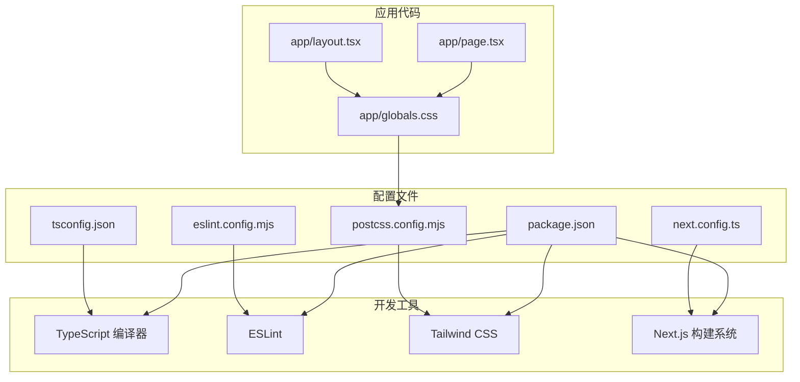
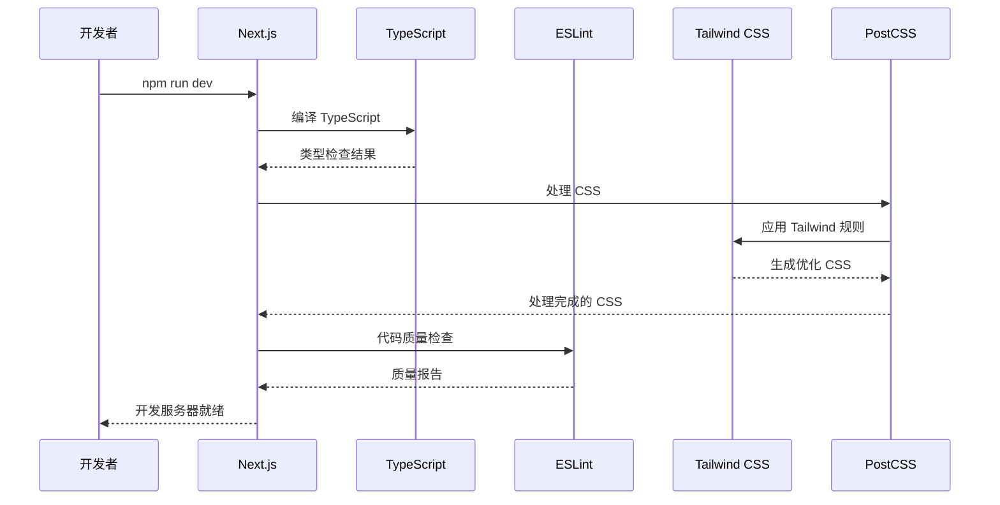
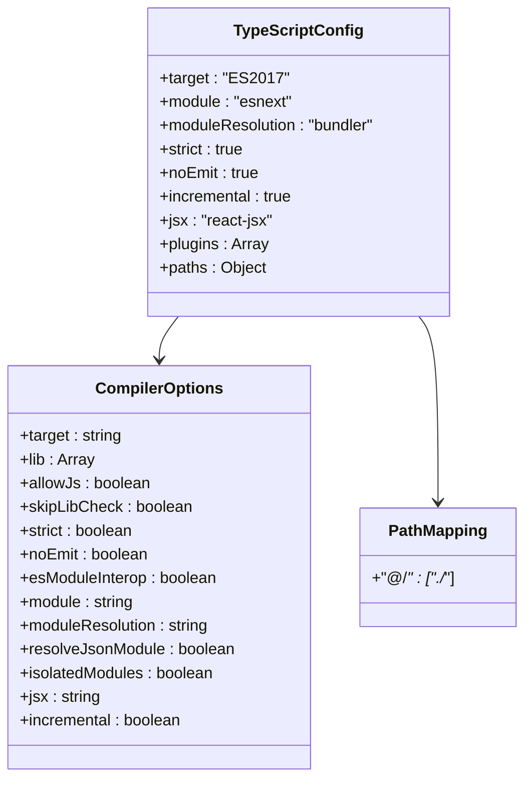
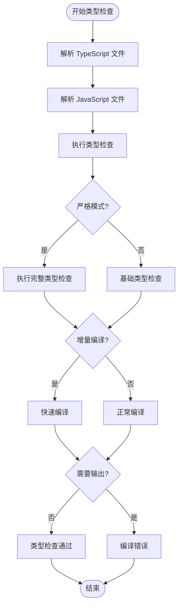
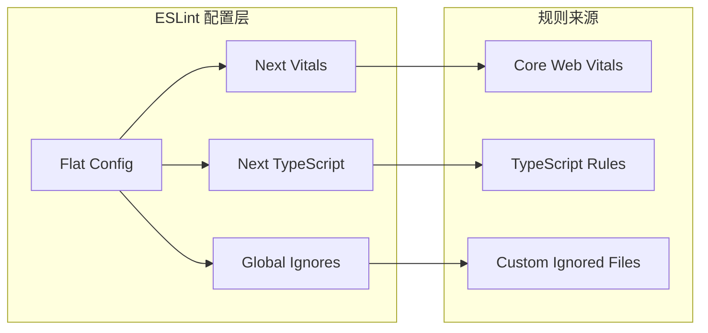
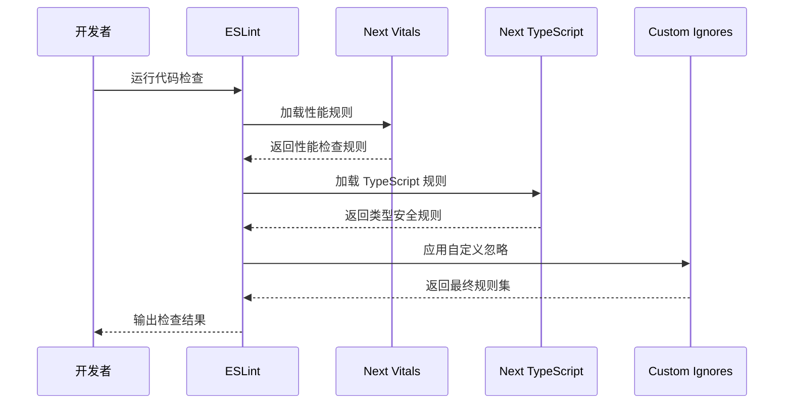
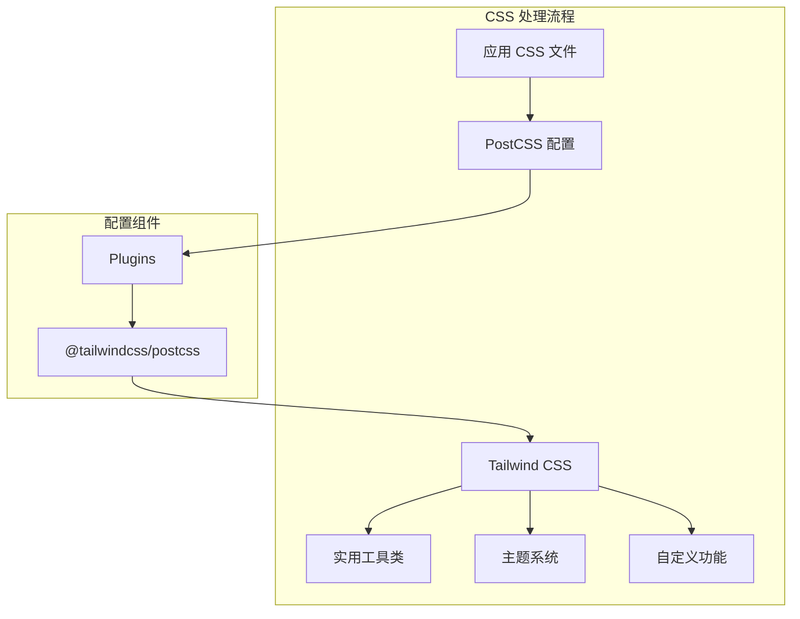
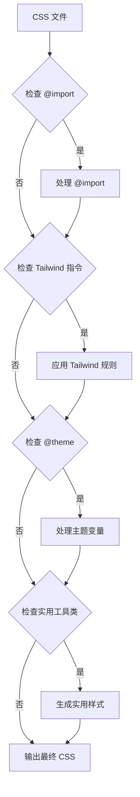
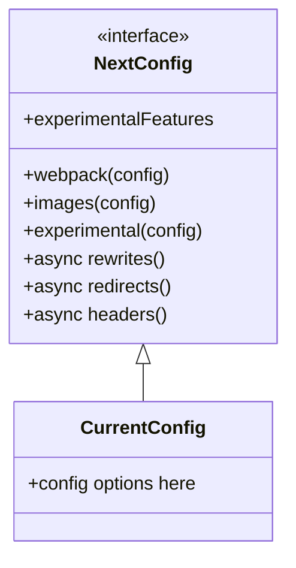

# 配置系统详解

<cite>
**本文档引用的文件**
- [next.config.ts](file://next.config.ts)
- [tsconfig.json](file://tsconfig.json)
- [postcss.config.mjs](file://postcss.config.mjs)
- [eslint.config.mjs](file://eslint.config.mjs)
- [package.json](file://package.json)
- [app/globals.css](file://app/globals.css)
- [app/layout.tsx](file://app/layout.tsx)
- [app/page.tsx](file://app/page.tsx)
- [README.md](file://README.md)
</cite>

## 目录
1. [简介](#简介)
2. [项目结构](#项目结构)
3. [核心配置组件](#核心配置组件)
4. [架构概览](#架构概览)
5. [详细组件分析](#详细组件分析)
6. [依赖关系分析](#依赖关系分析)
7. [性能考虑](#性能考虑)
8. [故障排除指南](#故障排除指南)
9. [结论](#结论)

## 简介

blod 项目是一个基于 Next.js 16.2.6 构建的现代化博客应用，采用 TypeScript、Tailwind CSS 和现代前端开发工具链。本项目配置系统体现了当前 React 生态系统中的最佳实践，包括严格的类型检查、高效的构建优化和现代化的样式处理。

该项目的核心特点包括：
- 使用 Next.js App Router 架构
- TypeScript 类型安全开发
- Tailwind CSS 实用优先的样式系统
- ESLint 代码质量保证
- 现代化的构建配置

## 项目结构

项目的配置文件分布清晰，遵循 Next.js 推荐的配置组织方式：



**图表来源**
- [next.config.ts:1-8](file://next.config.ts#L1-L8)
- [tsconfig.json:1-35](file://tsconfig.json#L1-L35)
- [postcss.config.mjs:1-8](file://postcss.config.mjs#L1-L8)
- [eslint.config.mjs:1-19](file://eslint.config.mjs#L1-L19)
- [package.json:1-31](file://package.json#L1-L31)

**章节来源**
- [package.json:1-31](file://package.json#L1-L31)
- [README.md:1-37](file://README.md#L1-L37)

## 核心配置组件

### Next.js 配置系统

next.config.ts 文件定义了 Next.js 应用的核心配置。虽然当前配置文件中注释占位符较多，但其基础结构已经为未来的扩展做好了准备。

**关键配置特性：**
- 类型安全的配置对象定义
- 模块化配置结构
- 易于扩展的配置模式

### TypeScript 配置系统

tsconfig.json 提供了严格而高效的 TypeScript 编译配置：

**编译选项分析：**
- **目标环境**: ES2017，确保现代浏览器兼容性
- **模块系统**: esnext，与 bundler 集成
- **严格模式**: 启用完整类型检查
- **增量编译**: 提升开发体验
- **路径映射**: @/* -> ./*

**类型检查优势：**
- 无输出编译（noEmit），仅用于类型检查
- 内置 Next.js 插件支持
- 完整的 React JSX 支持

### PostCSS 配置系统

postcss.config.mjs 集成了 Tailwind CSS 处理流程：

**配置特性：**
- 基于插件的处理管道
- Tailwind CSS PostCSS 集成
- 现代 CSS 处理工作流

### ESLint 配置系统

eslint.config.mjs 采用了最新的 Flat Config 格式：

**规则集组合：**
- Next.js Core Web Vitals 性能规则
- TypeScript 专用规则
- 自定义忽略配置覆盖

**章节来源**
- [next.config.ts:1-8](file://next.config.ts#L1-L8)
- [tsconfig.json:1-35](file://tsconfig.json#L1-L35)
- [postcss.config.mjs:1-8](file://postcss.config.mjs#L1-L8)
- [eslint.config.mjs:1-19](file://eslint.config.mjs#L1-L19)

## 架构概览

配置系统整体架构展示了各工具链之间的协作关系：



**图表来源**
- [package.json:9-13](file://package.json#L9-L13)
- [tsconfig.json:16-20](file://tsconfig.json#L16-L20)
- [eslint.config.mjs:5-16](file://eslint.config.mjs#L5-L16)
- [postcss.config.mjs:1-5](file://postcss.config.mjs#L1-L5)

## 详细组件分析

### TypeScript 配置深度分析

#### 编译器选项详解



**图表来源**
- [tsconfig.json:2-24](file://tsconfig.json#L2-L24)

**关键配置点：**
- **模块解析策略**: 使用 bundler 解析器，与现代打包工具兼容
- **增量编译**: 显著提升开发时编译速度
- **路径别名**: 统一的模块导入路径映射
- **严格类型检查**: 全面的类型安全保障

#### 类型检查流程



**图表来源**
- [tsconfig.json:6-15](file://tsconfig.json#L6-L15)

**章节来源**
- [tsconfig.json:1-35](file://tsconfig.json#L1-L35)

### ESLint 配置深度分析

#### 规则集组合机制



**图表来源**
- [eslint.config.mjs:1-19](file://eslint.config.mjs#L1-L19)

**配置特性：**
- **扁平配置格式**: 现代 ESLint 推荐格式
- **规则继承**: 组合多个预设规则集
- **自定义忽略**: 覆盖默认忽略规则

#### 代码质量检查流程



**图表来源**
- [eslint.config.mjs:5-16](file://eslint.config.mjs#L5-L16)

**章节来源**
- [eslint.config.mjs:1-19](file://eslint.config.mjs#L1-L19)

### PostCSS 配置深度分析

#### Tailwind CSS 集成架构



**图表来源**
- [postcss.config.mjs:1-5](file://postcss.config.mjs#L1-L5)
- [app/globals.css:1-27](file://app/globals.css#L1-L27)

**配置特性：**
- **插件化架构**: 基于 PostCSS 插件系统
- **Tailwind 集成**: 官方 PostCSS 插件支持
- **CSS 导入**: 支持 @import 语法

#### 样式处理流程



**图表来源**
- [app/globals.css:1-27](file://app/globals.css#L1-L27)

**章节来源**
- [postcss.config.mjs:1-8](file://postcss.config.mjs#L1-L8)
- [app/globals.css:1-27](file://app/globals.css#L1-L27)

### Next.js 配置深度分析

#### 配置扩展潜力

虽然当前配置相对简洁，但具备良好的扩展性：



**图表来源**
- [next.config.ts:1-8](file://next.config.ts#L1-L8)

**潜在扩展方向：**
- Webpack 自定义配置
- 图像优化设置
- 实验性功能启用
- 自定义重写规则

**章节来源**
- [next.config.ts:1-8](file://next.config.ts#L1-L8)

## 依赖关系分析

### 工具链依赖图

```mermaid
graph TB
subgraph "运行时依赖"
NEXT[Next.js 16.2.6]
REACT[React 19.2.4]
REACTDOM[React DOM 19.2.4]
end
subgraph "开发依赖"
TSC[TypeScript 5]
ESL[ESLint 9]
TWC[Tailwind CSS 4]
TWP[@tailwindcss/postcss ^4]
ESN[eslint-config-next 16.2.6]
TN[@types/node ^20]
TR[@types/react ^19]
TRD[@types/react-dom ^19]
end
subgraph "配置文件"
PJ[package.json]
NC[next.config.ts]
TC[tsconfig.json]
PC[postcss.config.mjs]
EC[eslint.config.mjs]
end
PJ --> NEXT
PJ --> TSC
PJ --> ESL
PJ --> TWC
PJ --> ESN
NEXT --> REACT
NEXT --> REACTDOM
TSC --> TC
ESL --> EC
TWC --> PC
ESN --> EC
NC --> NEXT
TC --> TSC
PC --> TWC
EC --> ESL
```

**图表来源**
- [package.json:15-29](file://package.json#L15-L29)
- [next.config.ts:1-8](file://next.config.ts#L1-L8)
- [tsconfig.json:1-35](file://tsconfig.json#L1-L35)
- [postcss.config.mjs:1-8](file://postcss.config.mjs#L1-L8)
- [eslint.config.mjs:1-19](file://eslint.config.mjs#L1-L19)

### 版本兼容性分析

**版本选择策略：**
- **Next.js**: 最新稳定版本，确保最新功能和性能
- **React**: 对应版本，保持生态一致性
- **TypeScript**: 最新主要版本，支持最新语言特性
- **Tailwind CSS**: v4 新版本，提供更好的 DX 和性能

**章节来源**
- [package.json:15-29](file://package.json#L15-L29)

## 性能考虑

### 编译性能优化

**TypeScript 编译优化：**
- 增量编译启用，显著减少重新编译时间
- 严格模式下的早期错误检测
- 模块解析器优化，减少查找时间

**构建性能优化：**
- Next.js 内置的构建优化
- Tailwind CSS 的按需生成
- ESLint 的增量检查

### 开发体验优化

**热重载优化：**
- TypeScript 编译缓存
- CSS 处理缓存
- ESLint 规则缓存

**内存使用优化：**
- 无输出编译模式
- 按需加载字体资源
- 优化的图像处理

## 故障排除指南

### 常见配置问题

#### TypeScript 相关问题

**问题**: 类型检查失败
**解决方案**: 
1. 检查 tsconfig.json 中的严格模式设置
2. 验证模块解析配置
3. 确认路径映射正确性

**问题**: 编译性能下降
**解决方案**:
1. 检查增量编译配置
2. 验证 include/exclude 模式
3. 清理 TypeScript 缓存

#### ESLint 相关问题

**问题**: 规则冲突
**解决方案**:
1. 检查 eslint.config.mjs 中的规则组合
2. 验证自定义忽略规则
3. 确认插件版本兼容性

**问题**: 检查速度慢
**解决方案**:
1. 检查文件包含模式
2. 验证缓存配置
3. 优化规则集组合

#### Tailwind CSS 相关问题

**问题**: 样式未生效
**解决方案**:
1. 检查 postcss.config.mjs 配置
2. 验证 @import 语句
3. 确认实用工具类使用正确

**问题**: 构建时间过长
**解决方案**:
1. 检查 CSS 文件大小
2. 验证 Tailwind 配置
3. 优化样式使用模式

### 调试技巧

**配置验证方法：**
1. 使用 `npx tsc --noEmit` 验证 TypeScript 配置
2. 运行 `npx eslint .` 检查 ESLint 配置
3. 执行 `npx tailwindcss -i ./app/globals.css -o ./public/out.css` 测试 Tailwind 处理

**性能监控：**
1. 使用 Next.js 分析工具监控构建性能
2. 监控 TypeScript 编译时间
3. 跟踪 ESLint 检查耗时

**章节来源**
- [tsconfig.json:6-15](file://tsconfig.json#L6-L15)
- [eslint.config.mjs:5-16](file://eslint.config.mjs#L5-L16)
- [postcss.config.mjs:1-5](file://postcss.config.mjs#L1-L5)

## 结论

blod 项目的配置系统展现了现代前端开发的最佳实践。通过精心设计的配置文件，实现了以下目标：

**技术优势：**
- **类型安全**: 完整的 TypeScript 配置确保代码质量
- **开发效率**: 优化的编译和检查流程提升开发体验
- **样式管理**: Tailwind CSS 提供灵活且高效的样式解决方案
- **代码质量**: ESLint 集成确保团队代码规范一致

**架构优势：**
- **模块化设计**: 各配置文件职责明确，易于维护
- **可扩展性**: 为未来功能扩展预留空间
- **性能优化**: 多层次的性能优化策略
- **工具链集成**: 各开发工具无缝协作

**建议改进：**
1. 在 next.config.ts 中添加具体的配置选项
2. 考虑添加 Webpack 自定义配置以进一步优化构建
3. 实施更详细的 ESLint 规则以满足特定项目需求
4. 优化 Tailwind CSS 配置以减少最终 CSS 文件大小

这个配置系统为类似的 Next.js 项目提供了优秀的参考模板，体现了现代前端工程化的标准实践。