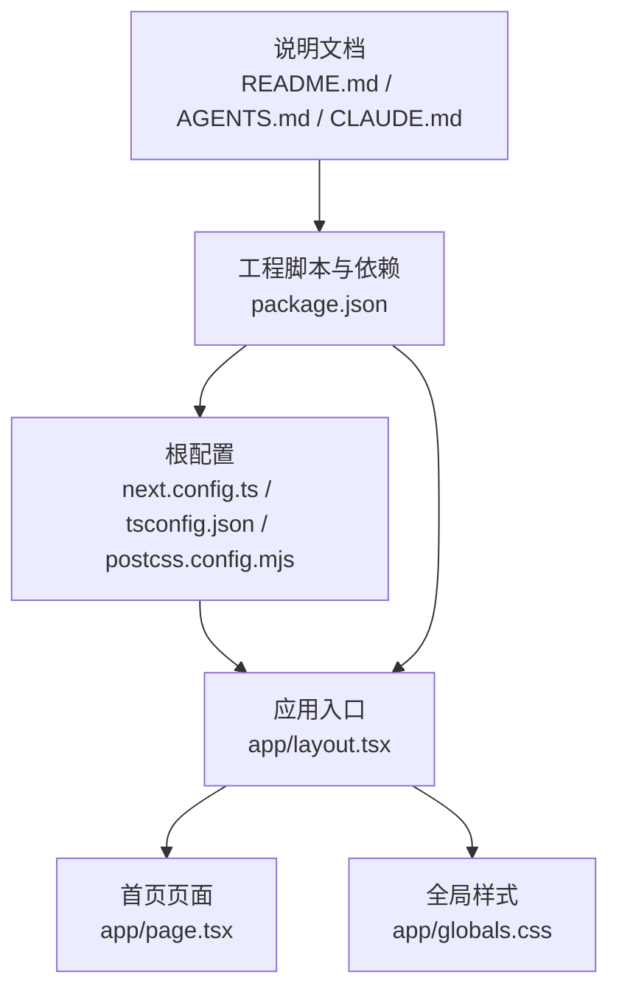
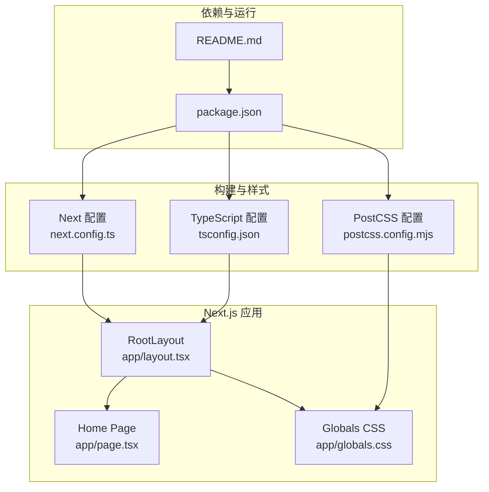
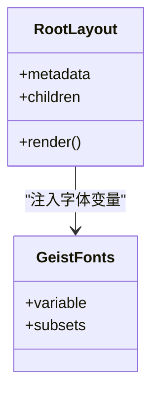
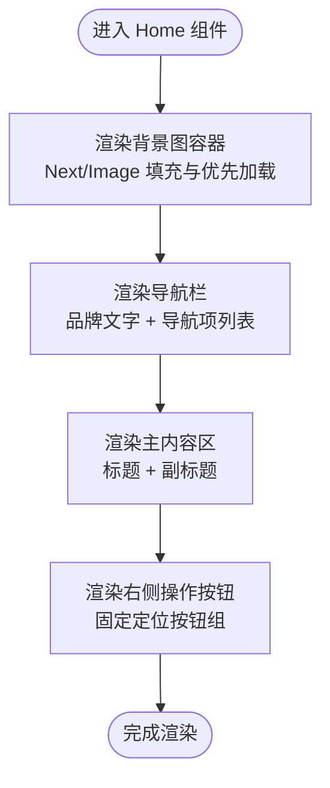
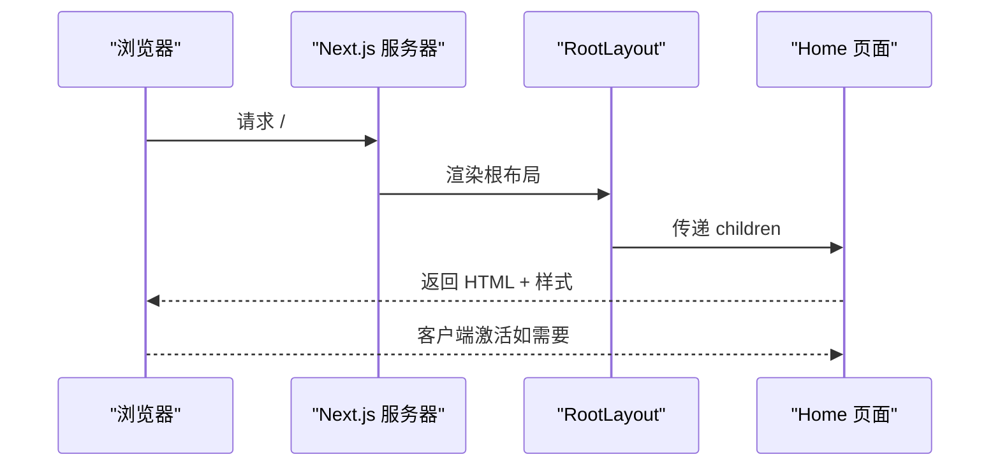
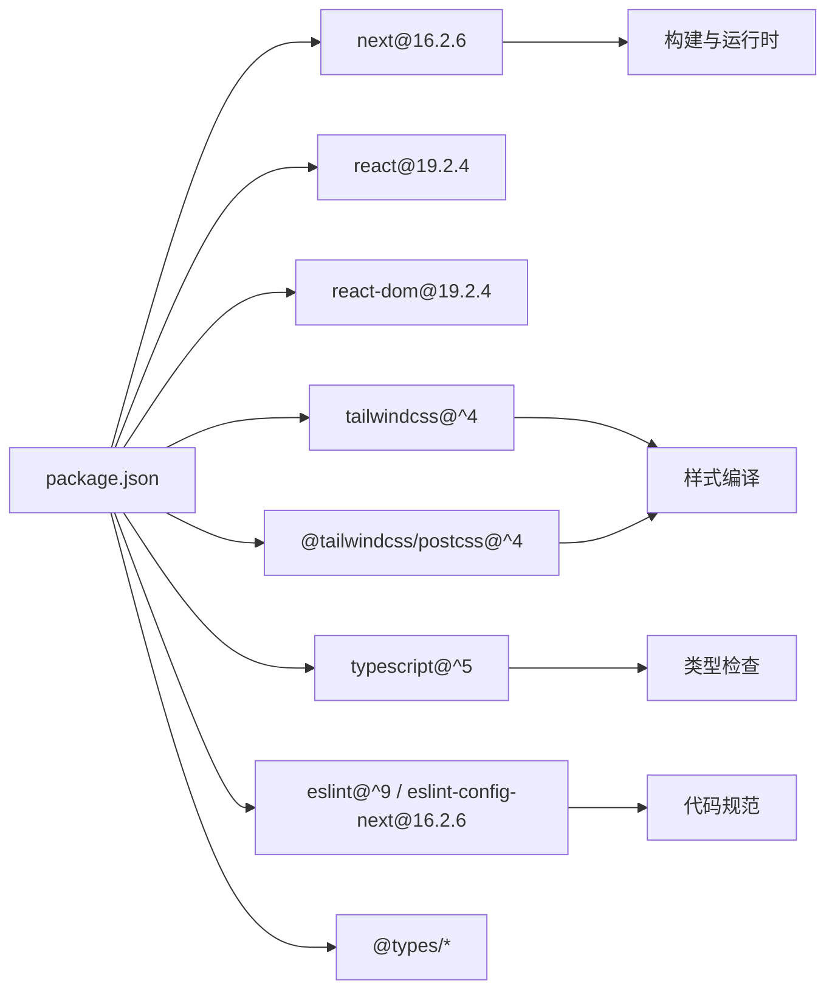

# 项目架构

<cite>
**本文引用的文件**
- [README.md](file://README.md)
- [package.json](file://package.json)
- [next.config.ts](file://next.config.ts)
- [tsconfig.json](file://tsconfig.json)
- [postcss.config.mjs](file://postcss.config.mjs)
- [app/layout.tsx](file://app/layout.tsx)
- [app/page.tsx](file://app/page.tsx)
- [app/globals.css](file://app/globals.css)
- [AGENTS.md](file://AGENTS.md)
- [CLAUDE.md](file://CLAUDE.md)
</cite>

## 目录
1. [简介](#简介)
2. [项目结构](#项目结构)
3. [核心组件](#核心组件)
4. [架构总览](#架构总览)
5. [详细组件分析](#详细组件分析)
6. [依赖分析](#依赖分析)
7. [性能考量](#性能考量)
8. [故障排查指南](#故障排查指南)
9. [结论](#结论)
10. [附录](#附录)

## 简介
本项目是一个基于 Next.js App Router 的前端应用骨架，采用 TypeScript、TailwindCSS v4 与现代构建工具链。项目通过 App Router 的文件系统路由组织页面，使用 React Server Components 模式进行服务端渲染与流式传输，结合 CSS-in-JS（TailwindCSS 主题变量与原子类）实现样式管理。根布局负责全局元数据、字体注入与主题变量注入；首页作为入口页面展示导航栏、背景图与交互按钮。

## 项目结构
项目采用 Next.js App Router 推荐的目录结构，关键文件如下：
- 根配置：next.config.ts、tsconfig.json、postcss.config.mjs
- 应用入口与页面：app/layout.tsx（根布局）、app/page.tsx（首页）、app/globals.css（全局样式）
- 工程元信息：package.json、README.md
- 版本与代理提示：AGENTS.md、CLAUDE.md

图表来源
- [next.config.ts:1-8](file://next.config.ts#L1-L8)
- [tsconfig.json:1-35](file://tsconfig.json#L1-L35)
- [postcss.config.mjs:1-8](file://postcss.config.mjs#L1-L8)
- [app/layout.tsx:1-34](file://app/layout.tsx#L1-L34)
- [app/page.tsx:1-72](file://app/page.tsx#L1-L72)
- [app/globals.css:1-27](file://app/globals.css#L1-L27)
- [package.json:1-31](file://package.json#L1-L31)
- [README.md:1-37](file://README.md#L1-L37)
- [AGENTS.md:1-6](file://AGENTS.md#L1-L6)
- [CLAUDE.md:1-2](file://CLAUDE.md#L1-L2)

章节来源
- [package.json:1-31](file://package.json#L1-L31)
- [next.config.ts:1-8](file://next.config.ts#L1-L8)
- [tsconfig.json:1-35](file://tsconfig.json#L1-L35)
- [postcss.config.mjs:1-8](file://postcss.config.mjs#L1-L8)
- [app/layout.tsx:1-34](file://app/layout.tsx#L1-L34)
- [app/page.tsx:1-72](file://app/page.tsx#L1-L72)
- [app/globals.css:1-27](file://app/globals.css#L1-L27)
- [README.md:1-37](file://README.md#L1-L37)
- [AGENTS.md:1-6](file://AGENTS.md#L1-L6)
- [CLAUDE.md:1-2](file://CLAUDE.md#L1-L2)

## 核心组件
- 根布局（RootLayout）
  - 负责注入全局元数据（title/description）、Google Fonts（Geist 与 Geist Mono）变量到 html 元素，并在 body 上应用基础样式类。
  - 作为所有页面的容器，承载子组件树。
- 首页（Home）
  - 使用 Next.js Image 组件加载背景图，设置优先级与填充策略。
  - 渲染顶部导航栏与标题区，右侧固定操作按钮组。
  - 导航项为静态数组，支持扩展为动态路由或外部链接。
- 全局样式（globals.css）
  - 引入 TailwindCSS v4 并通过 @theme inline 注入颜色与字体变量。
  - 支持暗色模式媒体查询，动态切换背景与前景色。
- 构建与运行时配置
  - next.config.ts 提供 Next.js 运行时配置占位。
  - tsconfig.json 启用严格模式、React JSX 编译、路径别名等。
  - postcss.config.mjs 配置 TailwindCSS v4 插件。

章节来源
- [app/layout.tsx:15-33](file://app/layout.tsx#L15-L33)
- [app/page.tsx:12-71](file://app/page.tsx#L12-L71)
- [app/globals.css:1-27](file://app/globals.css#L1-L27)
- [next.config.ts:3-5](file://next.config.ts#L3-L5)
- [tsconfig.json:2-24](file://tsconfig.json#L2-L24)
- [postcss.config.mjs:1-8](file://postcss.config.mjs#L1-L8)

## 架构总览
Next.js App Router 将文件系统映射为页面路由。根布局负责全局上下文注入，首页作为默认页面渲染内容。样式通过 TailwindCSS v4 与主题变量实现 CSS-in-JS 风格的动态样式控制。

图表来源
- [app/layout.tsx:1-34](file://app/layout.tsx#L1-L34)
- [app/page.tsx:1-72](file://app/page.tsx#L1-L72)
- [app/globals.css:1-27](file://app/globals.css#L1-L27)
- [tsconfig.json:1-35](file://tsconfig.json#L1-L35)
- [postcss.config.mjs:1-8](file://postcss.config.mjs#L1-L8)
- [next.config.ts:1-8](file://next.config.ts#L1-L8)
- [package.json:1-31](file://package.json#L1-L31)
- [README.md:1-37](file://README.md#L1-L37)

## 详细组件分析

### 根布局（RootLayout）依赖关系
- 元数据注入：通过 metadata 对象设置标题与描述，影响浏览器标签页与 SEO。
- 字体注入：使用 next/font/google 加载 Geist Sans 与 Geist Mono，并将 CSS 变量注入到 html 元素。
- 样式容器：在 body 上应用最小高度与 Flex 布局，确保子组件自适应全屏。
- 子组件：接收 children 并渲染，形成页面树的根节点。

图表来源
- [app/layout.tsx:15-33](file://app/layout.tsx#L15-L33)

章节来源
- [app/layout.tsx:15-33](file://app/layout.tsx#L15-L33)

### 首页（Home）组件结构
- 背景层：绝对定位的背景图容器，使用 Next.js Image 组件填充，设置优先加载与覆盖模式。
- 导航栏：相对定位的导航条，包含品牌文字与导航项列表，项为图标与文本组合。
- 主内容区：居中标题与副标题，使用阴影与响应式字号增强视觉层次。
- 右侧操作按钮：固定定位的垂直按钮组，用于快捷操作。

图表来源
- [app/page.tsx:12-71](file://app/page.tsx#L12-L71)

章节来源
- [app/page.tsx:12-71](file://app/page.tsx#L12-L71)

### 文件系统路由与数据流
- 路由约定：App Router 将 app 下的文件与嵌套结构映射为 URL 路由。当前仅存在 app/page.tsx 作为默认首页。
- 数据流向：根布局注入全局上下文（字体、主题），首页作为页面组件渲染具体业务内容。Next.js 在服务端渲染时按需传输 HTML 与样式，客户端按需激活交互。

图表来源
- [app/layout.tsx:20-33](file://app/layout.tsx#L20-L33)
- [app/page.tsx:12-71](file://app/page.tsx#L12-L71)

章节来源
- [app/layout.tsx:20-33](file://app/layout.tsx#L20-L33)
- [app/page.tsx:12-71](file://app/page.tsx#L12-L71)

### React Server Components 与 CSS-in-JS
- React Server Components：根布局与页面组件均以函数组件形式编写，遵循 React Server Components 的渲染模型，可在服务端执行并输出静态/半静态内容。
- CSS-in-JS：通过 TailwindCSS v4 的 @theme inline 与 CSS 变量实现主题与字体的动态注入，配合原子类实现样式声明式组合。

章节来源
- [app/layout.tsx:5-13](file://app/layout.tsx#L5-L13)
- [app/globals.css:8-13](file://app/globals.css#L8-L13)

## 依赖分析
- 运行时依赖
  - next：16.2.6（App Router、Server Components、Image 优化）
  - react / react-dom：19.2.4（与 Next.js 版本对齐）
- 开发依赖
  - tailwindcss：^4（v4 新特性与 PostCSS 集成）
  - @tailwindcss/postcss：^4（PostCSS 插件）
  - typescript：^5、@types/react、@types/node 等（类型安全）
  - eslint 与 eslint-config-next：^9（代码规范与 Next.js 规则）
- 构建与运行
  - next.config.ts：空配置占位，可扩展实验性功能
  - tsconfig.json：启用严格模式、路径别名、React JSX 编译
  - postcss.config.mjs：启用 TailwindCSS v4 插件

图表来源
- [package.json:15-29](file://package.json#L15-L29)
- [tsconfig.json:2-24](file://tsconfig.json#L2-L24)
- [postcss.config.mjs:1-8](file://postcss.config.mjs#L1-L8)

章节来源
- [package.json:15-29](file://package.json#L15-L29)
- [tsconfig.json:2-24](file://tsconfig.json#L2-L24)
- [postcss.config.mjs:1-8](file://postcss.config.mjs#L1-L8)

## 性能考量
- 图片优化：首页背景图使用 Next.js Image 的 fill 与 priority，减少首屏阻塞与布局抖动。
- 字体优化：通过 next/font/google 预注入字体变量，避免 FOIT/FOFT。
- 样式体积：TailwindCSS v4 与 @theme inline 控制变量规模，建议在生产环境启用摇树与压缩。
- SSR/CSR：根布局与页面组件天然支持 SSR，可按需选择客户端激活范围，平衡交互与首屏性能。

## 故障排查指南
- 版本不匹配：Next.js 16 与 React 19 需保持版本兼容，若出现运行时异常，优先核对依赖版本。
- 字体加载问题：确认 google fonts 变量已注入到 html 元素，且字体变量在全局样式中生效。
- 样式未生效：检查 TailwindCSS v4 插件是否正确加载，以及 @theme inline 是否包含所需变量。
- 代理与规则提示：AGENTS.md 提示当前版本存在破坏性变更，开发前请阅读官方文档与弃用提示。

章节来源
- [AGENTS.md:1-6](file://AGENTS.md#L1-L6)
- [CLAUDE.md:1-2](file://CLAUDE.md#L1-L2)

## 结论
本项目以 Next.js App Router 为基础，采用 React Server Components 与 TailwindCSS v4，构建了简洁清晰的单页博客入口。根布局统一注入元数据与字体，首页聚焦视觉与交互体验。通过合理的依赖与配置，项目具备良好的可扩展性与可维护性，适合进一步扩展为多页面站点或集成后端服务。

## 附录
- 基础设施与部署
  - 本地开发：npm/yarn/pnpm/bun dev
  - 构建与启动：npm run build / npm run start
  - 部署建议：使用 Vercel 平台，遵循 Next.js 部署文档
- 技术决策与权衡
  - 选择 App Router：文件系统即路由，开发效率高
  - 选择 TailwindCSS v4：原子类与主题变量结合，样式声明式强
  - 选择 next/font/google：减少网络往返与字体闪烁
- 设计原则
  - 单页入口：首页承担主要信息呈现
  - 最小化耦合：根布局与页面组件职责清晰
  - 可演进性：预留路由扩展与组件拆分空间

章节来源
- [README.md:7-15](file://README.md#L7-L15)
- [README.md:32-37](file://README.md#L32-L37)
- [package.json:9-13](file://package.json#L9-L13)