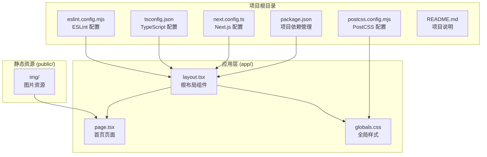
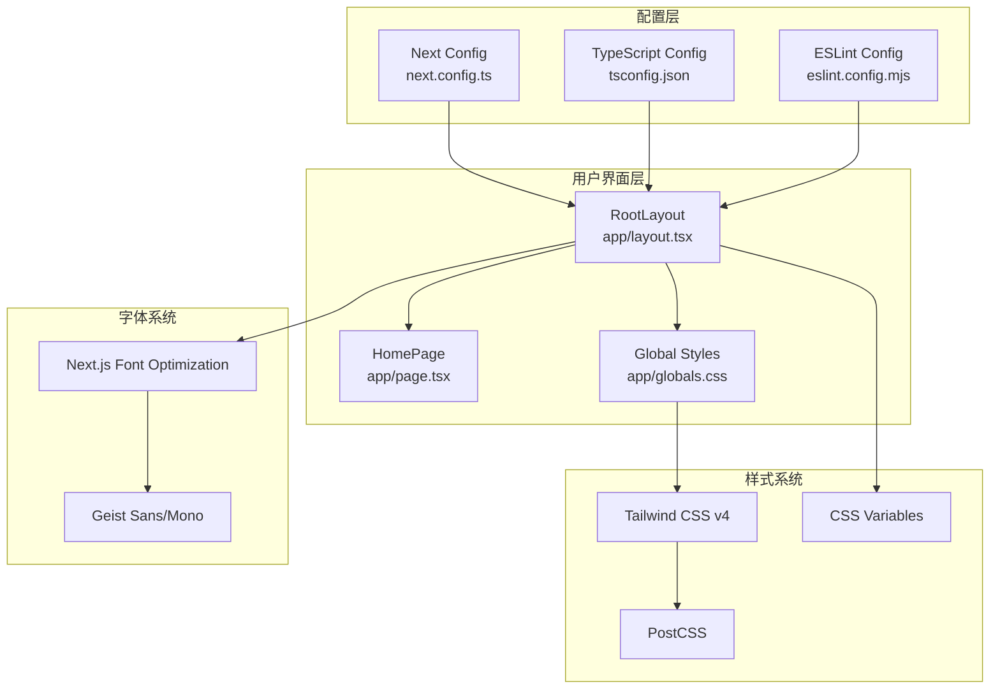
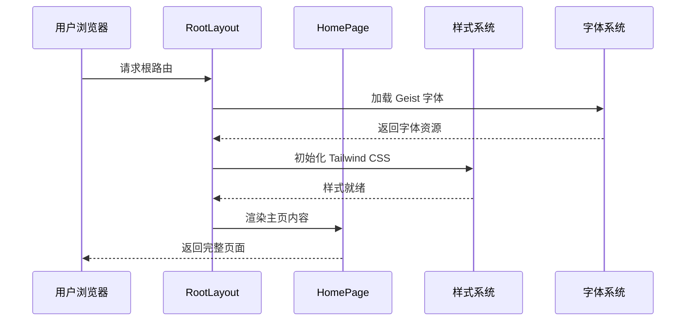
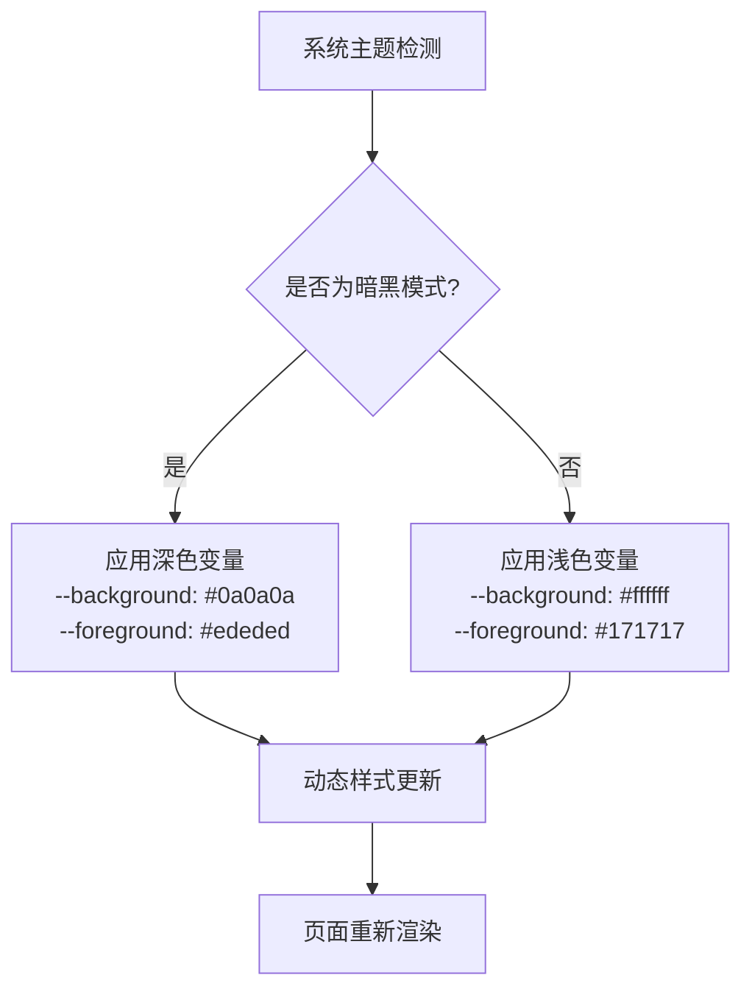
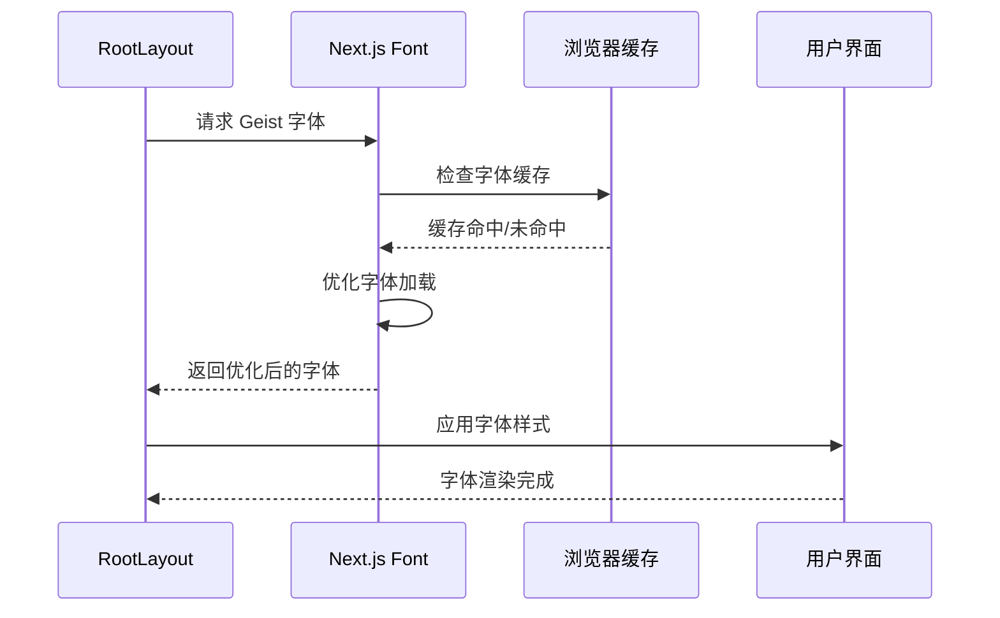
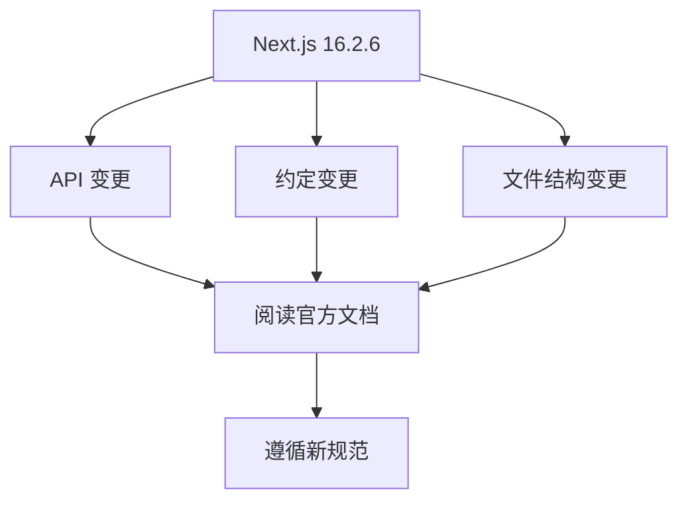

# 项目概述

<cite>
**本文档引用的文件**
- [README.md](file://README.md)
- [package.json](file://package.json)
- [next.config.ts](file://next.config.ts)
- [app/layout.tsx](file://app/layout.tsx)
- [app/page.tsx](file://app/page.tsx)
- [app/globals.css](file://app/globals.css)
- [tsconfig.json](file://tsconfig.json)
- [postcss.config.mjs](file://postcss.config.mjs)
- [eslint.config.mjs](file://eslint.config.mjs)
- [AGENTS.md](file://AGENTS.md)
</cite>

## 目录
1. [简介](#简介)
2. [项目结构](#项目结构)
3. [核心组件](#核心组件)
4. [架构总览](#架构总览)
5. [详细组件分析](#详细组件分析)
6. [依赖关系分析](#依赖关系分析)
7. [性能考虑](#性能考虑)
8. [故障排除指南](#故障排除指南)
9. [结论](#结论)

## 简介

blod 是一个基于 Next.js 16.2.6 构建的现代化个人博客平台，采用 App Router 架构。该项目旨在展示最新的前端开发技术和最佳实践，为个人博客提供一个响应式、高性能且具备现代设计语言的解决方案。

### 项目目标
- 提供一个现代化的个人博客展示平台
- 展示 Next.js App Router 的最佳实践
- 实现响应式设计和暗黑模式支持
- 优化字体加载和性能表现
- 为开发者提供可扩展的博客基础设施

### 核心功能特性
- **App Router 架构**：采用 Next.js 16.2.6 的最新 App Router 模式
- **响应式设计**：完全适配移动设备和桌面端
- **暗黑模式支持**：自动检测系统偏好并切换主题
- **字体优化**：集成 next/font 自动优化 Geist 字体
- **TypeScript 支持**：完整的类型安全开发体验
- **Tailwind CSS**：实用优先的样式框架

## 项目结构

该项目采用了 Next.js 16.2.6 推荐的 App Router 结构，主要目录组织如下：



**图表来源**
- [package.json:1-31](file://package.json#L1-L31)
- [next.config.ts:1-8](file://next.config.ts#L1-L8)
- [app/layout.tsx:1-34](file://app/layout.tsx#L1-L34)
- [app/page.tsx:1-72](file://app/page.tsx#L1-L72)

**章节来源**
- [package.json:1-31](file://package.json#L1-L31)
- [next.config.ts:1-8](file://next.config.ts#L1-L8)
- [tsconfig.json:1-35](file://tsconfig.json#L1-L35)

## 核心组件

### 技术栈概览

该项目采用现代化的全栈技术组合，确保开发效率和运行时性能：

| 组件 | 版本 | 用途 |
|------|------|------|
| Next.js | 16.2.6 | 应用框架和路由系统 |
| React | 19.2.4 | 用户界面构建 |
| TypeScript | ^5 | 类型安全开发 |
| Tailwind CSS | ^4 | 实用优先的样式框架 |
| PostCSS | - | CSS 后处理器 |
| ESLint | ^9 | 代码质量保证 |

### 关键配置文件

#### 依赖管理 (package.json)
项目定义了核心依赖和开发工具，包括 Next.js 应用框架、React 生态系统、TypeScript 类型定义、Tailwind CSS 和 ESLint 工具链。

#### TypeScript 配置 (tsconfig.json)
配置了严格的类型检查、模块解析策略和路径映射，支持现代 JavaScript 特性和增量编译。

#### PostCSS 配置 (postcss.config.mjs)
集成了 Tailwind CSS 插件，提供现代化的 CSS 处理能力。

**章节来源**
- [package.json:15-29](file://package.json#L15-L29)
- [tsconfig.json:2-24](file://tsconfig.json#L2-L24)
- [postcss.config.mjs:1-8](file://postcss.config.mjs#L1-L8)

## 架构总览

### 应用架构图



**图表来源**
- [app/layout.tsx:15-34](file://app/layout.tsx#L15-L34)
- [app/globals.css:1-27](file://app/globals.css#L1-L27)
- [next.config.ts:3-5](file://next.config.ts#L3-L5)
- [tsconfig.json:16-20](file://tsconfig.json#L16-L20)

### 数据流架构



**图表来源**
- [app/layout.tsx:5-18](file://app/layout.tsx#L5-L18)
- [app/page.tsx:12-72](file://app/page.tsx#L12-L72)

## 详细组件分析

### 根布局组件 (RootLayout)

RootLayout 是整个应用的根组件，负责全局布局和元数据管理：

#### 核心功能
- **元数据管理**：设置网站标题和描述
- **字体集成**：加载 Geist Sans 和 Geist Mono 字体
- **全局样式**：应用基础样式和主题变量
- **暗黑模式支持**：通过 CSS 媒体查询实现

#### 设计模式
采用 React 函数组件模式，使用 Next.js 的 Metadata API 进行 SEO 优化。

**章节来源**
- [app/layout.tsx:15-34](file://app/layout.tsx#L15-L34)

### 主页组件 (HomePage)

主页组件实现了完整的博客入口页面，包含导航栏、背景图像和交互元素：

#### 页面结构
- **背景图像**：全屏覆盖的背景图片
- **导航栏**：固定位置的顶部导航
- **英雄内容**：居中的标题和副标题
- **操作按钮**：右侧的浮动操作按钮

#### 导航系统
定义了六个导航项，每个都包含图标和标签，使用语义化的设计语言。

**章节来源**
- [app/page.tsx:3-10](file://app/page.tsx#L3-L10)
- [app/page.tsx:12-72](file://app/page.tsx#L12-L72)

### 全局样式系统

#### CSS 变量主题
项目实现了基于 CSS 变量的主题系统，支持明暗模式自动切换：



**图表来源**
- [app/globals.css:15-20](file://app/globals.css#L15-L20)

#### Tailwind CSS 集成
通过 PostCSS 插件系统集成 Tailwind CSS v4，提供实用优先的样式解决方案。

**章节来源**
- [app/globals.css:1-27](file://app/globals.css#L1-L27)
- [postcss.config.mjs:1-8](file://postcss.config.mjs#L1-L8)

### 字体优化系统

#### Next.js Font 优化
项目集成了 Next.js 的字体优化功能，自动处理字体加载和性能优化：



**图表来源**
- [app/layout.tsx:5-13](file://app/layout.tsx#L5-L13)

**章节来源**
- [app/layout.tsx:21-28](file://app/layout.tsx#L21-L28)

## 依赖关系分析

### 核心依赖关系图

```mermaid
graph TB
subgraph "运行时依赖"
A[react@19.2.4]
B[react-dom@19.2.4]
C[next@16.2.6]
end
subgraph "开发依赖"
D[typescript@^5]
E[@types/react@^19]
F[@types/node@^20]
G[tailwindcss@^4]
H[eslint@^9]
I[eslint-config-next@16.2.6]
end
subgraph "构建工具"
J[PostCSS]
K[TypeScript Compiler]
L[ESLint]
end
A --> C
B --> A
C --> D
D --> J
E --> K
F --> K
G --> J
H --> L
I --> L
```

**图表来源**
- [package.json:15-29](file://package.json#L15-L29)

### 开发工具链

#### ESLint 配置
项目使用了 Next.js 官方的 ESLint 配置，结合 Core Web Vitals 和 TypeScript 规则：

- **eslint-config-next/core-web-vitals**：确保性能指标达标
- **eslint-config-next/typescript**：提供 TypeScript 最佳实践
- **自定义忽略规则**：覆盖默认忽略模式

**章节来源**
- [eslint.config.mjs:1-19](file://eslint.config.mjs#L1-L19)

## 性能考虑

### 字体加载优化
- **自动优化**：Next.js Font 自动处理字体预加载和缓存
- **子集加载**：仅加载必要的字符子集
- **变量字体**：使用 CSS 变量实现字体定制

### 样式性能
- **原子化 CSS**：Tailwind CSS 提供高效的样式生成
- **按需构建**：PostCSS 仅处理必要的样式转换
- **CSS 变量**：减少重复样式定义

### 构建优化
- **增量编译**：TypeScript 配置启用增量编译
- **严格模式**：提高代码质量和编译性能
- **模块解析**：使用 bundler 模块解析策略

## 故障排除指南

### 常见问题解决

#### Next.js 版本兼容性
根据 AGENTS.md 文件提示，当前版本存在破坏性变更，需要特别注意：



**图表来源**
- [AGENTS.md:1-6](file://AGENTS.md#L1-L6)

#### 开发服务器启动
如果遇到开发服务器启动问题，可以参考以下步骤：
1. 确保 Node.js 版本满足要求
2. 清理 node_modules 和重新安装依赖
3. 检查端口占用情况
4. 验证配置文件语法正确性

**章节来源**
- [AGENTS.md:1-6](file://AGENTS.md#L1-L6)
- [README.md:5-15](file://README.md#L5-L15)

## 结论

blod 个人博客项目展示了现代前端开发的最佳实践，通过 Next.js 16.2.6 的 App Router 架构实现了高性能、响应式的个人博客平台。项目的核心优势包括：

### 技术亮点
- **现代化架构**：采用最新的 Next.js App Router 模式
- **性能优化**：集成多种性能优化技术
- **开发体验**：完善的 TypeScript 和 ESLint 配置
- **设计系统**：响应式设计和暗黑模式支持

### 扩展建议
- 添加内容管理系统 (CMS)
- 集成本地化国际化支持
- 实现评论系统和社交分享
- 添加 SEO 优化和元数据管理
- 集成分析和监控工具

该项目为个人博客开发提供了坚实的基础，既适合初学者学习现代前端技术，也为有经验的开发者提供了可扩展的架构模板。